# Patch类及其子类

```Python title="导入模块" linenums="1"
from matplotlib.patches import Patch, 

                               Rectangle, 
                               Polygon, 
                               Wedge, 
                               Shadow,
  
                               FancyBboxPatch, 
                               BoxStyle, 
      
                               FancyArrowPatch, 
                               ArrowStyle, 
                               ConnectionStyle, 
            
                               
from matplotlib.path import Path
```


##  Patch父类

[matplotlib.patches.Patch — Matplotlib 3.10.0 documentation](https://matplotlib.org/stable/api/_as_gen/matplotlib.patches.Patch.html#matplotlib-patches-patch)

[Hatch style reference — Matplotlib 3.10.1 documentation](https://matplotlib.org/stable/gallery/shapes_and_collections/hatch_style_reference.html)


```Python title="Patch父类" linenums="1" hl_lines="4 5 6 10 11 12 14"
Patch(transform=ax.transAxes,   # (1)!
                       
      fill=True,                # (2)!
      facecolor="red",          # (3)!
      linestyle="--",           # (4)!
      linewidth=10,             # (5)!
      antialiased=False,        # (6)!
      capstyle="round",         # (7)!
      joinstyle="bevel",        # (8)!
      hatch="+",                # (9)!
      hatch_linewidth=2,        # (10)!
      edgecolor="blue",         # (11)!
      # color="red",            (12)
      alpha=1,                  # (13)!

      label="Patch",            # (14)!
      gid="1",                  # (15)!
      visible=True,             # (16)!
      zorder=1,                 # (17)!
      rasterized=True,          # (18)!
      in_layout=True            # (19)!
      )
```

1. 参考坐标系
2. 是否填充
3. 填充色(facecolor/fc)
4. 边框线型(linestyle/ls)
5. 边框线宽(linewidth/lw)
6. 边框线抗锯齿渲染(antialiased/aa)
7. 边框线端点样式： 可选'butt'（默认）, 'projecting', 'round'（FancyArrowPatch子类默认）
8. 边框线转折样式： 可选'miter'（默认）, 'round'（FancyArrowPatch子类默认）, 'bevel'
9. 框内线型：可选'/', '\', '|', '-', '+', 'x', 'o', 'O', '.', '*'，可组合重复
10. 框内线宽
11. 边框线及框内线色(edgecolor/ec)
12. 覆盖facecolor和edgecolor
13. 透明度
14. 标签（用于图例）
15. group id
16. 是否可见
17. 绘制优先级：值越低越优先
18. 强制栅格化（bitmap）绘图以进行矢量图形输出
19. 是否包含在layout计算中


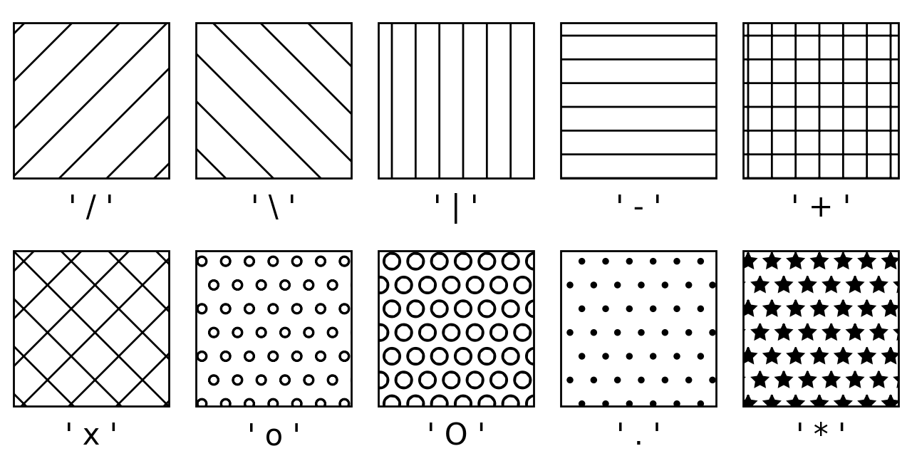{ width="50%" align="center"}

##  Rectangle子类

[matplotlib.patches.Rectangle — Matplotlib 3.10.1 documentation](https://matplotlib.org/stable/api/_as_gen/matplotlib.patches.Rectangle.html#matplotlib.patches.Rectangle)


通过锚点 `#!python xy` 及其`#!python width`和`#!python height`定义的矩形。矩形在 x 方向上从 `#!python xy[0]` 延伸到 `#!python xy[0] + width` ，在 y 方向上从 `#!python xy[1]` 延伸到 `#!python xy[1] + height` 。可以将 xy 视为左下角，但 xy 实际上是哪个角取决于轴的方向和宽度和高度的符号；例如，如果 x 轴被反转或宽度为负，则 xy 将是右下角。

```Python title="Rectangle子类" linenums="1" hl_lines="4-9"
fig = plt.figure(figsize=(8, 8), dpi=100, layout="constrained")
ax = fig.add_subplot(1, 1, 1)

patch = Rectangle(xy=(0.2, 0.2),                # (1)!
                  width=0.2,                    # (2)!
                  height=0.2,                   # (3)!
                  transform=ax.transAxes,       # (4)!
                  rotation_point=(0.3, 0.2),    # (5)!
                  angle=45,                     # (6)!

                  # Patch父类参数
                  facecolor="red",
                  linestyle="--",
                  linewidth=2,
                  hatch="/",
                  hatch_linewidth=2,
                  edgecolor="green", 
                  alpha=0.5
                  )
ax.add_patch(patch)
ax.grid()

plt.show()
```

1. 左下角锚点坐标（具体取决于axis的方向以及width、height参数的正负）
2. 宽度
3. 高度
4. 参考坐标系
5. 旋转中心坐标：可选'xy'(默认), 'center', 坐标(x, y)
6. 绕旋转中心逆时针旋转角度（°）

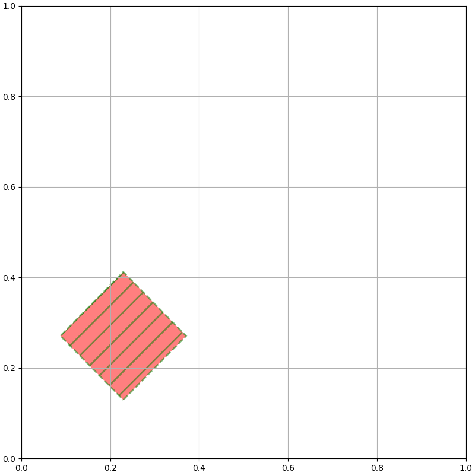{ width="50%"}

## Polygon子类

[matplotlib.patches.Polygon — Matplotlib 3.10.1 documentation](https://matplotlib.org/stable/api/_as_gen/matplotlib.patches.Polygon.html)


```Python title="Polygon子类" linenums="1" hl_lines="4 5"
fig = plt.figure(figsize=(8, 8), dpi=100, layout="constrained")
ax = fig.add_subplot(1, 1, 1)

patch = Polygon(xy=[[0.1, 0.1], [0.1, 0.2], [0.2, 0.2], [0.2, 0.1], [0.6, 0.2]],    # (1)!
                closed=True,                                                        # (2)!

                # Patch父类参数
                facecolor="red",
                linestyle="--",
                linewidth=2,
                hatch="/",
                hatch_linewidth=2,
                edgecolor="green",
                alpha=0.5
                )
ax.add_patch(patch)
ax.grid()

plt.show()
```

1. 多边形节点坐标数组
2. 是否绘制封闭线

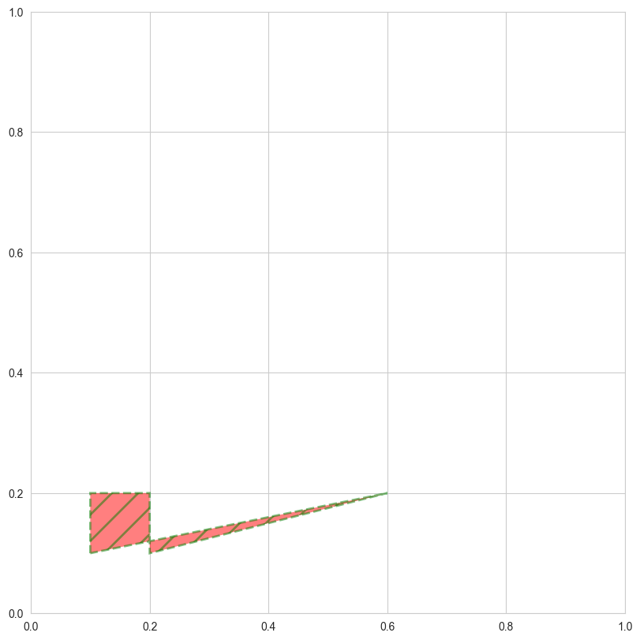{ width="50%"}

##  Wedge子类

[matplotlib.patches.Wedge — Matplotlib 3.10.1 documentation](https://matplotlib.org/stable/api/_as_gen/matplotlib.patches.Wedge.html)


一个以 x, y (`#!python center`)为中心，半径为`#!python r`的扇形，从`#!python theta1`逆时针扫到`#!python theta2`（以°为单位）。如果给出了`#!python width`，则从内径`#!python r-width`到外径`#!python r`绘制部分扇形。

```Python title="Wedge子类" linenums="1" hl_lines="4-8"
fig = plt.figure(figsize=(8, 8), dpi=100, layout="constrained")
ax = fig.add_subplot(1, 1, 1)

patch = Wedge(center=(0.5, 0.5),    # (1)!
              r=0.5,                # (2)!
              theta1=45,            # (3)!
              theta2=135,           # (4)!
              width=0.3,            # (5)!

              # Patch父类参数
              facecolor="red",
              linestyle="--",
              linewidth=2,
              hatch="/",
              hatch_linewidth=2,
              edgecolor="green",
              alpha=0.5
              )
ax.add_patch(patch)
ax.grid()

plt.show()
```

1. 扇形中心
2. 半径
3. 起始角度
4. 终止角度
5. 宽度

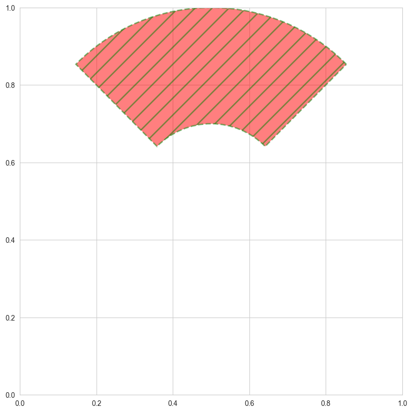{ width="50%"}

## Shadow子类

[matplotlib.patches.Shadow — Matplotlib 3.10.1 documentation](https://matplotlib.org/stable/api/_as_gen/matplotlib.patches.Shadow.html)


创建给定补丁的阴影。默认情况下，阴影将与补丁具有相同的面颜色，但会变暗。可以通过 `#!python shade` 参数控制暗度。

```Python title="Shadow子类" linenums="1" hl_lines="21-24"
fig = plt.figure(figsize=(8, 8), dpi=100, layout="constrained")
ax = fig.add_subplot(1, 1, 1)

patch = Wedge(center=(0.5, 0.5),
              r=0.5,
              theta1=45,
              theta2=135,
              width=0.3,

              # Patch父类参数
              facecolor="red",
              linestyle="--",
              linewidth=2,
              hatch="/",
              hatch_linewidth=2,
              edgecolor="green",
              alpha=0.5
              )
ax.add_patch(patch)

patch = Shadow(patch,        # (1)!
               ox=0.1,       # (2)!
               oy=-0.1,      # (3)!
               shade=0.2,    # (4)!

               # Patch父类参数
               # facecolor="red",
               linestyle="--",
               linewidth=2,
               hatch="/",
               hatch_linewidth=2,
               edgecolor="green",
               alpha=0.5
               )
ax.add_patch(patch)

ax.grid()
plt.show()
```

1. 待创建阴影的补丁
2. 数据坐标中阴影的偏移量，按 dpi/72 的比例缩放
3. 数据坐标中阴影的偏移量，按 dpi/72 的比例缩放
4. 阴影的深浅与原始颜色之间的关系。如果为 1，则阴影为黑色；如果为 0，则阴影与补丁颜色相同

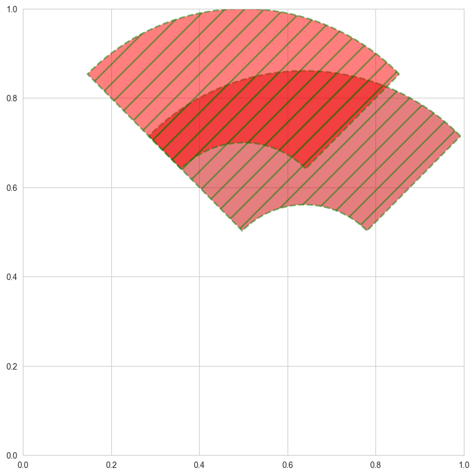{ width="50%"}

## StepPatch子类

[matplotlib.patches.StepPatch — Matplotlib 3.10.1 documentation](https://matplotlib.org/stable/api/_as_gen/matplotlib.patches.StepPatch.html)


## FancyBboxPatch子类

[matplotlib.patches.FancyBboxPatch — Matplotlib 3.10.0 documentation](https://matplotlib.org/stable/api/_as_gen/matplotlib.patches.FancyBboxPatch.html#matplotlib.patches.FancyBboxPatch)

[matplotlib.patches.BoxStyle — Matplotlib 3.10.0 documentation](https://matplotlib.org/stable/api/_as_gen/matplotlib.patches.BoxStyle.html#matplotlib.patches.BoxStyle)

[Drawing fancy boxes — Matplotlib 3.10.1 documentation](https://matplotlib.org/stable/gallery/shapes_and_collections/fancybox_demo.html#sphx-glr-gallery-shapes-and-collections-fancybox-demo-py)

`#!python "square, pad=0.3"` == `#!python BoxStyle.Square(pad=0.3)` == `#!python BoxStyle("square", pad=0.3)` == `#!python BoxStyle("square, pad=0.3")`

<div style="overflow-x:auto;">
<table class="data-table">
  <caption>BoxStyle</caption>
  <thead>
    <tr>
      <th data-sort-method='none'>BoxStyle子类</th>
      <th data-sort-method='none'>名称</th>
      <th data-sort-method='none'>属性</th>
    </tr>
  </thead>
  <tbody>
    <tr>
      <td><code>BoxStyle.Square()</code></td>
      <td><code>"square"</code></td>
      <td rowspan=6>pad=0.3</td>
    </tr>
    <tr>
      <td><code>BoxStyle.Circle()</code></td>
      <td><code>"circle"</code></td>
    </tr>
    <tr>
      <td><code>BoxStyle.Ellipse()</code></td>
      <td><code>"ellipse"</code></td>
    </tr>
    <tr>
      <td><code>BoxStyle.LArrow()</code></td>
      <td><code>"larrow"</code></td>
    </tr>
    <tr>
      <td><code>BoxStyle.RArrow()</code></td>
      <td><code>"rarrow"</code></td>
    </tr>
    <tr>
      <td><code>BoxStyle.DArrow()</code></td>
      <td><code>"darrow"</code></td>
    </tr>
    <tr>
      <td><code>BoxStyle.Round()</code></td>
      <td><code>"round"</code></td>
      <td>pad=0.3, rounding_size=pad</td>
    </tr>
    <tr>
      <td><code>BoxStyle.Round4()</code></td>
      <td><code>"round4"</code></td>
      <td>pad=0.3, rounding_size=pad/2</td>
    </tr>
    <tr>
      <td><code>BoxStyle.Sawtooth()</code></td>
      <td><code>"sawtooth"</code></td>
      <td rowspan=2>pad=0.3, tooth_size=pad/2</td>
    </tr>
    <tr>
      <td><code>BoxStyle.Roundtooth()</code></td>
      <td><code>"roundtooth"</code></td>
    </tr>
  </tbody>
</table>
</div>

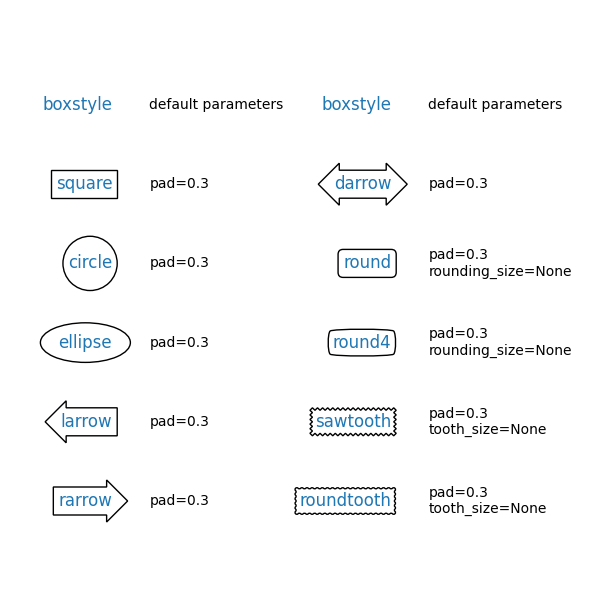{ width="50%"}

```Python title="FancyBboxPatch子类" linenums="1" hl_lines="9-15"
fig = plt.figure(figsize=(8, 8), dpi=100, layout="constrained")
ax = fig.add_subplot(1, 1, 1)

"""
fancy box实际属性值（如pad）：
    水平方向：pad = mutation_scale x pad
    垂直方向：pad = mutation_aspect x mutation_scale x pad
"""
patch = FancyBboxPatch(xy=(0.4, 0.4),                 # (1)!
                       width=0.1,                     # (2)!
                       height=0.1,                    # (3)!
                       transform=ax.transAxes,        # (4)!
                       boxstyle="square, pad=0.1",    # (5)!
                       mutation_scale=0.5,
                       mutation_aspect=2,

                       # Patch父类参数
                       facecolor="red",
                       linestyle="--",
                       linewidth=2,
                       hatch="/",
                       hatch_linewidth=2,
                       edgecolor="green",
                       alpha=0.5
                       )
ax.add_patch(patch)
ax.grid()

plt.show()
```

1. 左下角坐标
2. 宽度
3. 高度
4. 参考坐标系统
5. fancy box类型及属性

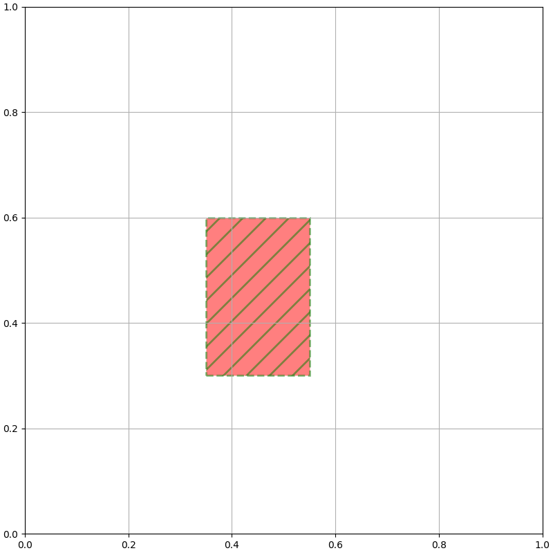{ width="50%"}

## FancyArrowPatch子类

[matplotlib.patches.FancyArrowPatch — Matplotlib 3.10.0 documentation](https://matplotlib.org/stable/api/_as_gen/matplotlib.patches.FancyArrowPatch.html#matplotlib.patches.FancyArrowPatch)

[matplotlib.patches.ArrowStyle — Matplotlib 3.10.0 documentation](https://matplotlib.org/stable/api/_as_gen/matplotlib.patches.ArrowStyle.html#matplotlib.patches.ArrowStyle)

[matplotlib.patches.ConnectionStyle — Matplotlib 3.10.0 documentation](https://matplotlib.org/stable/api/_as_gen/matplotlib.patches.ConnectionStyle.html#matplotlib.patches.ConnectionStyle)

=== "ArrowStyle"
    `#!python "|-|, widthA=20, widthB=20, angleA=45, angleB=45"` == `#!python ArrowStyle("|-|, widthA=20, widthB=20, angleA=45, angleB=45")` == `#!python ArrowStyle("|-|", widthA=20, widthB=20, angleA=45, angleB=45)` == `#!python ArrowStyle.BarAB(widthA=20, widthB=20, angleA=45, angleB=45)`
    
    <div style="overflow-x:auto;">
    <table class="data-table">
      <caption>ArrowStyle</caption>
      <thead>
        <tr>
          <th data-sort-method='none'>ArrowStyle子类</th>
          <th data-sort-method='none'>名称</th>
          <th data-sort-method='none'>属性</th>
        </tr>
      </thead>
      <tbody>
        <tr>
          <td><code>ArrowStyle.Curve()</code></td>
          <td><code>"-"</code></td>
          <td>None</td>
        </tr>
        <tr>
          <td><code>ArrowStyle.CurveA()</code></td>
          <td><code>"<-"</code></td>
          <td rowspan=6>head_length=0.4, head_width=0.2, <br>
                        widthA=1.0, widthB=1.0, <br>
                        lengthA=0.2, lengthB=0.2, <br>
                        angleA=0, angleB=0, <br>
                        scaleA=mutation_size, <br>
                        scaleB=mutation_size</td>
        </tr>
        <tr>
          <td><code>ArrowStyle.CurveB()</code></td>
          <td><code>"->"</code></td>
        </tr>
        <tr>
          <td><code>ArrowStyle.CurveAB()</code></td>
          <td><code>"<->"</code></td>
        </tr>
        <tr>
          <td><code>ArrowStyle.CurveFilledA()</code></td>
          <td><code>"<|-"</code></td>
        </tr>
        <tr>
          <td><code>ArrowStyle.CurveFilledB()</code></td>
          <td><code>"-|>"</code></td>
        </tr>
        <tr>
          <td><code>ArrowStyle.CurveFilledAB()</code></td>
          <td><code>"<|-|>"</code></td>
        </tr>
        <tr>
          <td><code>ArrowStyle.BracketA()</code></td>
          <td><code>"]-"</code></td>
          <td rowspan=3>widthA=1.0, widthB=1.0,<br>
                         lengthA=0.2, lengthB=0.2,<br>
                         angleA=0, angleB=0</td>
        </tr>
        <tr>
          <td><code>ArrowStyle.BracketB()</code></td>
          <td><code>"-["</code></td>
        </tr>
        <tr>
          <td><code>ArrowStyle.BracketAB()</code></td>
          <td><code>"]-["</code></td>
        </tr>
        <tr>
          <td><code>ArrowStyle.BarAB()</code></td>
          <td><code>"|-|"</code></td>
          <td>widthA=1.0, widthB=1.0, <br>
              angleA=0, angleB=0</td>
        <tr>
          <td><code>ArrowStyle.BracketCurve()</code></td>
          <td><code>"]->"</code></td>
          <td>widthA=1.0, <br>
              lengthA=0.2, <br>
              angleA=0</td>
        <tr>
          <td><code>ArrowStyle.CurveBracket()</code></td>
          <td><code>"<-["</code></td>
          <td>widthB=1.0, <br>
              lengthB=0.2, <br>
              angleB=0</td>
        <tr>
          <td><code>ArrowStyle.Simple()</code></td>
          <td><code>"simple"</code><br>(默认)</td>
          <td>head_length=0.5, head_width=0.5, <br>
              tail_width=0.2</td>
        <tr>
          <td><code>ArrowStyle.Fancy()</code></td>
          <td><code>"fancy"</code></td>
          <td>head_length=0.4, head_width=0.4, <br>
              tail_width=0.4</td>
        <tr>
          <td><code>ArrowStyle.Wedge()</code></td>
          <td><code>"wedge"</code></td>
          <td>tail_width=0.3, shrink_factor=0.5</td>
      </tbody>
    </table>
    </div>

    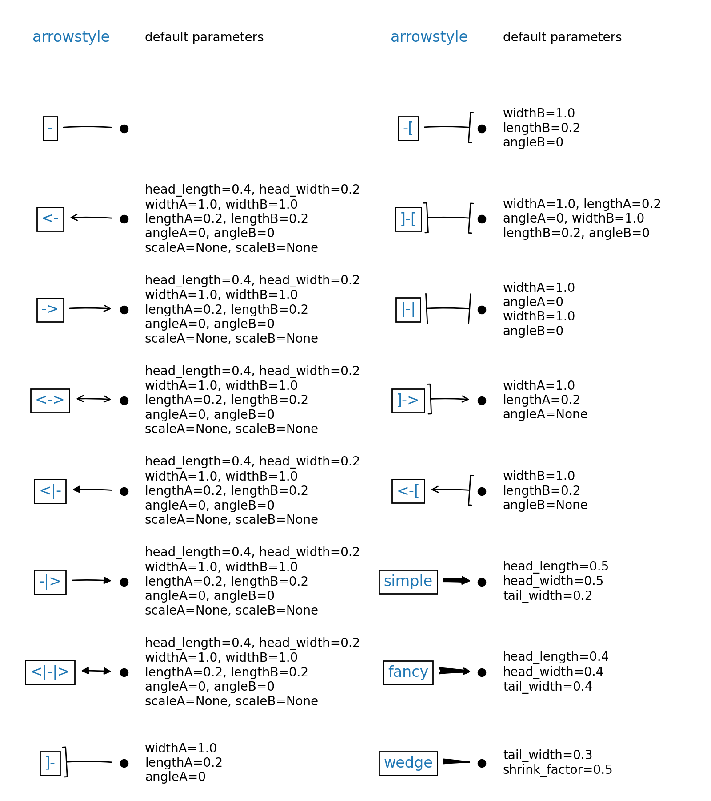{ width="50%"}
    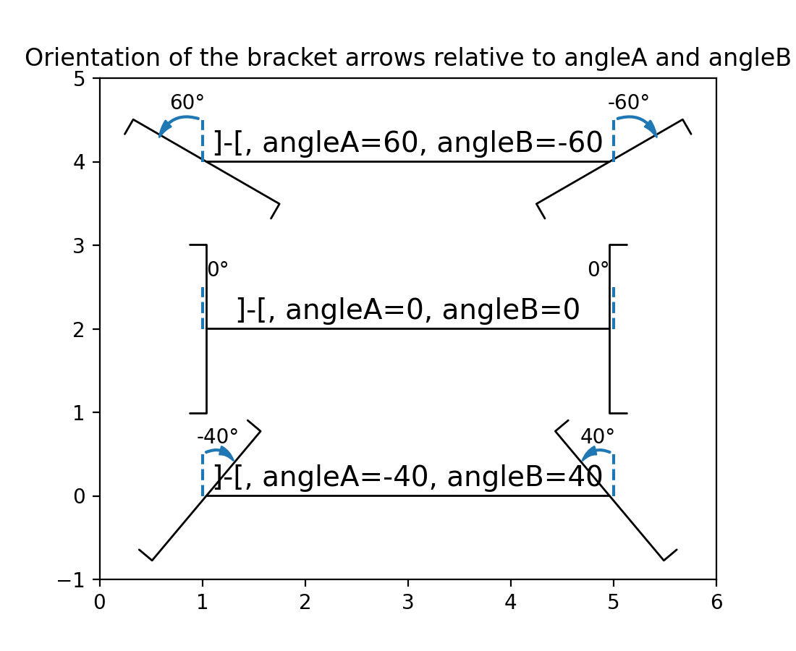{ width="50%"}

=== "ConnectionStyle"
    `#!python "arc3, rad=1"` == `#!python ConnectionStyle("arc3, rad=1")` == `#!python ConnectionStyle("arc3", rad=1)` == `#!python ConnectionStyle.Arc3(rad=1)`
    
    <div style="overflow-x:auto;">
    <table class="data-table">
      <caption>ConnectionStyle</caption>
      <thead>
        <tr>
          <th data-sort-method='none'>ConnectionStyle子类</th>
          <th data-sort-method='none'>名称</th>
          <th data-sort-method='none'>属性</th>
        </tr>
      </thead>
      <tbody>
        <tr>
          <td><code>ConnectionStyle.Arc3()</code></td>
          <td><code>"arc3"</code><br>(默认)</td>
          <td>rad=0.0</td>
        </tr>
        <tr>
          <td><code>ConnectionStyle.Arc()</code></td>
          <td><code>"arc"</code></td>
          <td>angleA=0, angleB=0, <br>
              armA=None, armB=None, <br>
              rad=0.0</td>
        </tr>
        <tr>
          <td><code>ConnectionStyle.Angle3()</code></td>
          <td><code>"angle3"</code></td>
          <td>angleA=90, angleB=0</td>
        </tr>
        <tr>
          <td><code>ConnectionStyle.Angle()</code></td>
          <td><code>"angle"</code></td>
          <td>angleA=90, angleB=0, <br>
              rad=0.0</td>
        </tr>
        <tr>
          <td><code>ConnectionStyle.Bar()</code></td>
          <td><code>"bar"</code></td>
          <td>armA=0.0, armB=0.0, <br>
              fraction=0.3, angle=None</td>
        </tr>
      </tbody>
    </table>
    </div>
    
    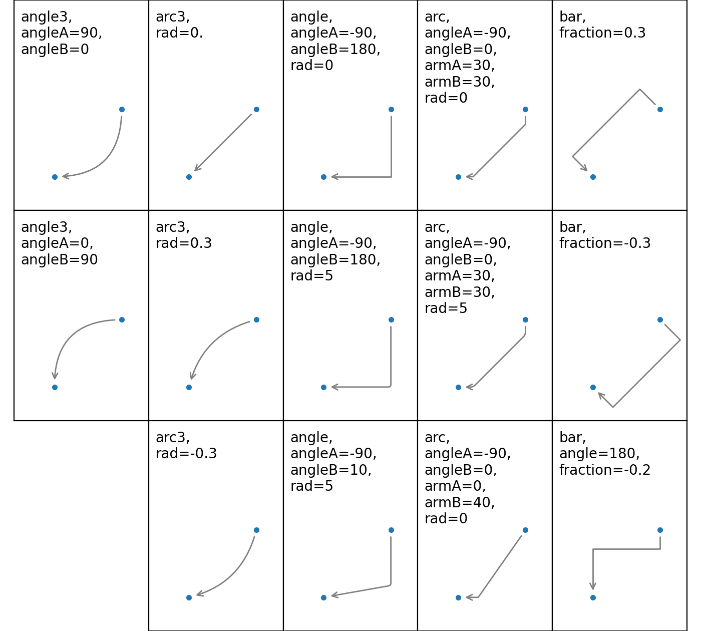{ width="50%"}

---

=== "根据路径创建"

    ```Python title="FancyArrowPatch子类" linenums="1" hl_lines="4-8"
    fig = plt.figure(figsize=(8, 8), dpi=100, layout="constrained")
    ax = fig.add_subplot(1, 1, 1)

    patch = FancyArrowPatch(path=Path([(0.2, 0.2), (0.4, 0), (0.6, 0.4)], (1, 3, 2)),                # (1)!
                            arrowstyle="simple, head_length=20, head_width=20, tail_width=20",       # (2)!
                            connectionstyle="arc3, rad=0",                                           # (3)!
                            # mutation_scale=0.5,
                            # mutation_aspect=2,

                            # Patch父类参数
                            facecolor="red",
                            linestyle="--",
                            linewidth=2,
                            hatch="/",
                            hatch_linewidth=2,
                            edgecolor="green",
                            alpha=0.5
                            )
    ax.add_patch(patch)
    ax.grid()

    plt.show()
    ```

    1. 路径
    2. 箭样式
    3. 连接线样式
    
    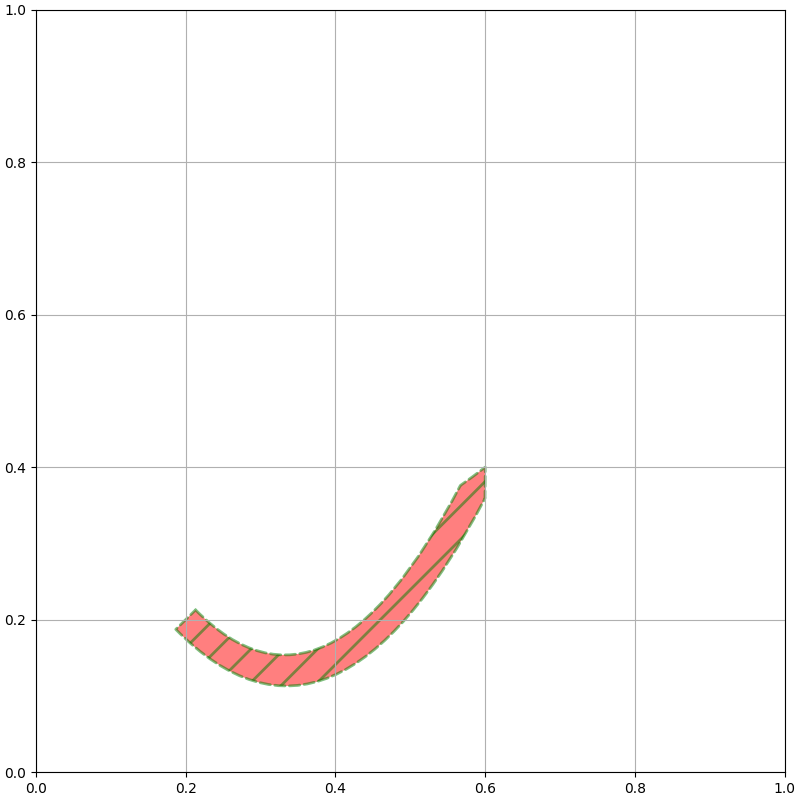{ width="50%"}

=== "根据目标创建"

    ```Python title="FancyArrowPatch子类" linenums="1" hl_lines="4-13"
    fig = plt.figure(figsize=(8, 8), dpi=100, layout="constrained")
    ax = fig.add_subplot(1, 1, 1)

    patch = FancyArrowPatch(posA=(0.2, 0.2),                                                         # (1)!
                            posB=(0.4, 0.4),                                                         # (2)!
                            arrowstyle="simple, head_length=20, head_width=20, tail_width=20",       # (3)!
                            connectionstyle="arc3, rad=1",                                           # (4)!
                            # patchA=None,                                                           (5)
                            # patchB=None,                                                           (6)
                            shrinkA=20,                                                              # (7)!
                            shrinkB=20,                                                              # (8)!
                            # mutation_scale=0.5,
                            # mutation_aspect=2,

                            # Patch父类参数
                            facecolor="red",
                            linestyle="--",
                            linewidth=2,
                            hatch="/",
                            hatch_linewidth=2,
                            edgecolor="green",
                            alpha=0.5
                            )
    ax.add_patch(patch)
    ax.grid()

    plt.show()
    ```

    1. 箭尾坐标
    2. 箭头坐标
    3. 箭样式
    4. 连接线样式
    5. 箭尾Patch
    6. 箭头Patch
    7. 箭尾缩短
    8. 箭头缩短

    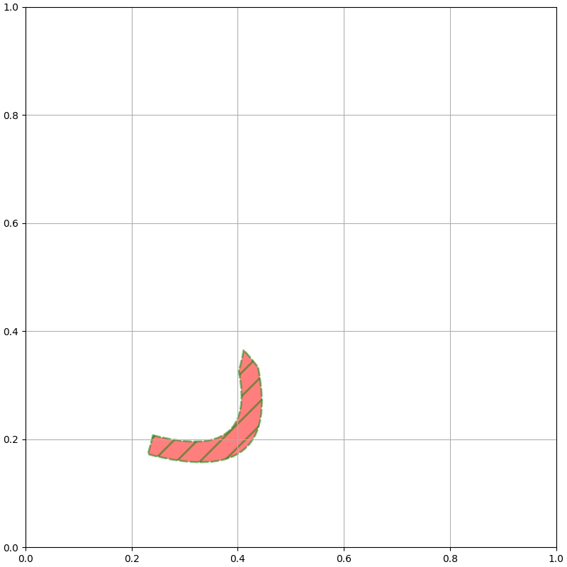{ width="50%"}