# 图例（Legend）

[Legend guide — Matplotlib 3.10.1 documentation](https://matplotlib.org/stable/users/explain/axes/legend_guide.html#legend-guide)

[matplotlib.legend — Matplotlib 3.10.1 documentation](https://matplotlib.org/stable/api/legend_api.html)

[matplotlib.axes.Axes.legend — Matplotlib 3.10.1 documentation](https://matplotlib.org/stable/api/_as_gen/matplotlib.axes.Axes.legend.html)

[matplotlib.pyplot.legend — Matplotlib 3.10.1 documentation](https://matplotlib.org/stable/api/_as_gen/matplotlib.pyplot.legend.html)

[matplotlib.figure.Figure.legend — Matplotlib 3.10.1 documentation](https://matplotlib.org/stable/api/_as_gen/matplotlib.figure.Figure.legend.html)

```Python title="导入模块与数据准备" linenums="1"
import matplotlib as mpl
import matplotlib.pyplot as plt
import seaborn as sns
import numpy as np

x = np.arange(1, 11, 1)
"""
[  1   2   3   4   5   6   7   8   9  10]
"""

y1 = np.sin(x)
"""
[ 0.84147098  0.90929743  0.14112001 -0.7568025  -0.95892427 -0.2794155  0.6569866   0.98935825  0.41211849 -0.54402111]
"""

y2 = x+2
"""
[  3   4   5   6   7   8   9  10  11  12]
"""

y3 = np.log(x)
"""
[0.         0.69314718 1.09861229 1.38629436 1.60943791 1.79175947 1.94591015 2.07944154 2.19722458 2.30258509 2.39789527]
"""
```

## 图例添加

!!! note
    **label** 为 **空字符串('')、'_'（默认）** 或以 **'_'开头** 的handle将被忽略

### 自带标签

=== "Axes"

    ```Python title="Axes" linenums="1" hl_lines="11"
    fig = plt.figure(figsize=(8, 8), dpi=100, layout="constrained")
    ax = fig.add_subplot(1, 1, 1)
   
    l1 = ax.plot(x, y1, label='y=sin(x)', marker='o')
    # l1[0].set_label("y=sin(x)")
    l2 = ax.plot(x, y2, label='y=x+2', marker='o')
    # l2[0].set_label("y=x+2")
    l3 = ax.scatter(x, y3, label='y=ln(x)', marker='o')
    # l3.set_label("y=ln(x)")
   
    ax.legend(handles=[l1[0], l2[0], l3])    # (1)!
   
    plt.show()
    ```

    1. 指定图形绘制图例，默认所有图形

    { width="50%" align="center"}

=== "Figure"

    ```Python  title="Figure" linenums="1" hl_lines="11"
    fig = plt.figure(figsize=(8, 8), dpi=100, layout="constrained")
    ax = fig.add_subplot(1, 1, 1)
   
    l1 = ax.plot(x, y1, label='y=sin(x)', marker='o')
    # l1[0].set_label("y=sin(x)")
    l2 = ax.plot(x, y2, label='y=x+2', marker='o')
    # l2[0].set_label("y=x+2")
    l3 = ax.scatter(x, y3, label='y=ln(x)', marker='o')
    # l3.set_label("y=ln(x)")
   
    fig.legend(handles=[l1[0], l2[0], l3])    # (1)!
   
    plt.show()
    ```

    1. 指定图形绘制图例，默认所有图形

    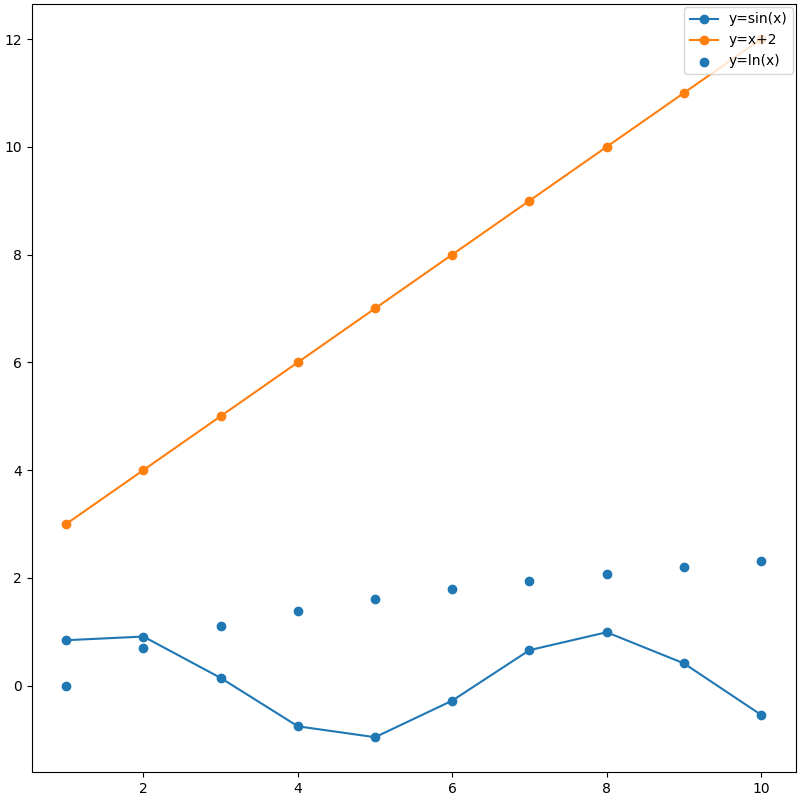{ width="50%" align="center"}

### 设置标签

=== "Axes"

    ```Python title="Axes" linenums="1" hl_lines="8-10"
    fig = plt.figure(figsize=(8, 8), dpi=100, layout="constrained")
    ax = fig.add_subplot(1, 1, 1)
   
    l1 = ax.plot(x, y1, marker='o')
    l2 = ax.plot(x, y2, marker='o')
    l3 = ax.scatter(x, y3, marker='o')

    ax.legend(handles=[l1[0], l2[0], l3],                # (1)!
              labels=['y=sin(x)', 'y=x+2', 'y=ln(x)']    # (2)!
              )
   
    plt.show()
    ```

    1. 指定图形绘制图例，默认所有图形
    2. 为指定的图形设置标签，用于图例绘制，覆盖自带label

    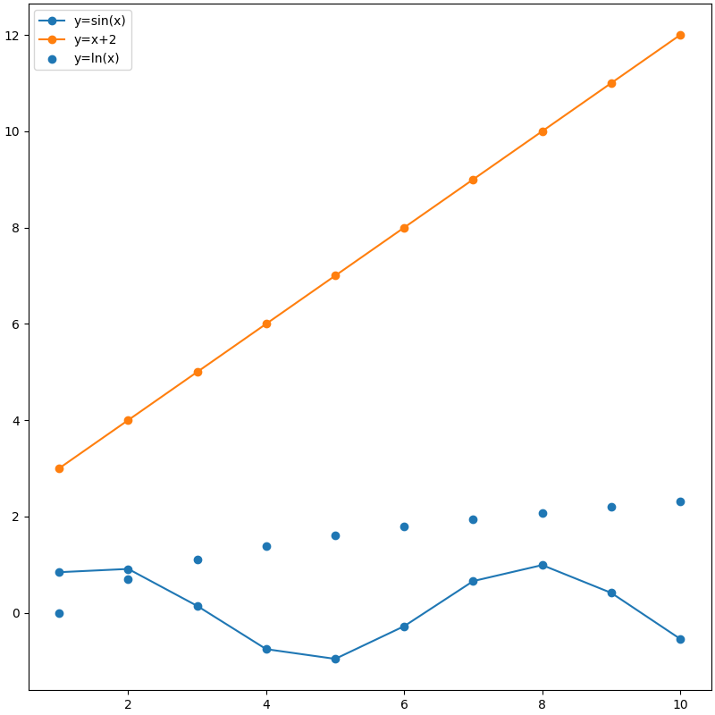{ width="50%" align="center"}

=== "Figure"

    ```Python  title="Figure" linenums="1" hl_lines="8-10"
    fig = plt.figure(figsize=(8, 8), dpi=100, layout="constrained")
    ax = fig.add_subplot(1, 1, 1)

    l1 = ax.plot(x, y1, marker='o')
    l2 = ax.plot(x, y2, marker='o')
    l3 = ax.scatter(x, y3, marker='o')

    fig.legend(handles=[l1[0], l2[0], l3],                # (1)!
               labels=['y=sin(x)', 'y=x+2', 'y=ln(x)']    # (2)!
               )

    plt.show()
    ```

    1. 指定图形绘制图例，默认所有图形
    2. 为指定的图形设置标签，用于图例绘制，覆盖自带label

    { width="50%" align="center"}

## 图例位置

1.  **loc**：默认`#!python rcParams["legend.loc"]='best'`

    a.  **位置字符串或位置代码**：图例在Axes、Figure或bounding box中的位置；图例的某个点位置

        |**字符串**|**代码**|**含义**|**应用**|
        |-|-|-|-|
        |**'best' （默认）**|**0**|以下9种中与图形重叠最少的位置|Axes|
        |**'upper right'**|**1**|右上角|Axes / Figure|
        |**'upper left'**|**2**|左上角|Axes / Figure|
        |**'lower left'**|**3**|左下角|Axes / Figure|
        |**'lower right'**|**4**|右下角|Axes / Figure|
        |**'center left'**|**6**|左侧正中|Axes / Figure|
        |**'right' / 'center right'**|**5 / 7**|右侧正中|Axes / Figure|
        |**'lower center'**|**8**|下方正中|Axes / Figure|
        |**'upper center'**|**9**|上方正中|Axes / Figure|
        |**'center'**|**10**|正中|Axes / Figure|
        |**'outside upper left'**|/|Axes外的上方左侧|Figure(layout='constraind')|
        |**'outside left upper'**|/|Axes外的左侧上方|Figure(layout='constraind')|
        |**'outside upper right'**|/|Axes外的上方右侧|Figure(layout='constraind')|
        |**'outside right upper'**|/|Axes外的右侧上方|Figure(layout='constraind')|
        |**'outside lower left'**|/|Axes外的下方左侧|Figure(layout='constraind')|
        |**'outside left lower'**|/|Axes外的左侧下方|Figure(layout='constraind')|
        |**'outside lower right'**|/|Axes外的下方右侧|Figure(layout='constraind')|
        |**'outside right lower'**|/|Axes外的右侧下方|Figure(layout='constraind')|
        |**'outside upper center'**|/|Axes外的上方正中|Figure(layout='constraind')|
        |**'outside lower center'**|/|Axes外的下方正中|Figure(layout='constraind')|

    b. **(x, y)**：图例左下角在Axes或Figure中的坐标（此时忽略 **bbox_to_anchor参数**）

2.  **bbox_to_anchor：**

    a.  **(x, y)**：图例某个点（由loc参数指定）在Axes或Figure中的坐标

    b.  **(x, y, width, height)**：在Axes或Figure中从(x, y)坐标创建一个宽width, 高height的bounding box用于放置图例

3.  **bbox_transform**：

    bbox_to_anchor参数参考的坐标系。默认情况下，与调用情况有关，`Axes.legend()`则参考Axes坐标系(`Axes.transAxes`)，`Figure.legend()`则采用Figure坐标系(`Figure.transFigure`)。

    !!! note
        **Axes或Figure坐标系** 指从(0, 0)到(1, 1)，即 **左下角为(0, 0)，右上角为(1, 1)**

### loc=''：图例位置

=== "Axes下方正中"

    ```Python  title="Axes下方正中" linenums="1" hl_lines="8"
    fig = plt.figure(figsize=(8, 8), dpi=100, layout="constrained")
    ax = fig.add_subplot(1, 1, 1)
   
    l1 = ax.plot(x, y1, label='y=sin(x)', marker='o')
    l2 = ax.plot(x, y2, label='y=x+2', marker='o')
    l3 = ax.scatter(x, y3, label='y=ln(x)', marker='o')
   
    ax.legend(loc='lower center')
   
    plt.show()
    ```

    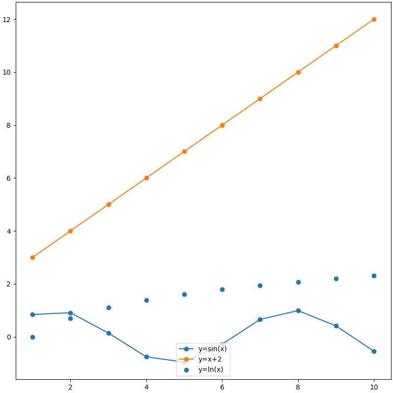{ width="50%" align="center"}

=== "Figure下方正中"

    ```Python  title="Figure下方正中" linenums="1" hl_lines="8"
    fig = plt.figure(figsize=(8, 8), dpi=100, layout="constrained")
    ax = fig.add_subplot(1, 1, 1)
   
    l1 = ax.plot(x, y1, label='y=sin(x)', marker='o')
    l2 = ax.plot(x, y2, label='y=x+2', marker='o')
    l3 = ax.scatter(x, y3, label='y=ln(x)', marker='o')
   
    fig.legend(loc='lower center')
   
    plt.show()
    ```

    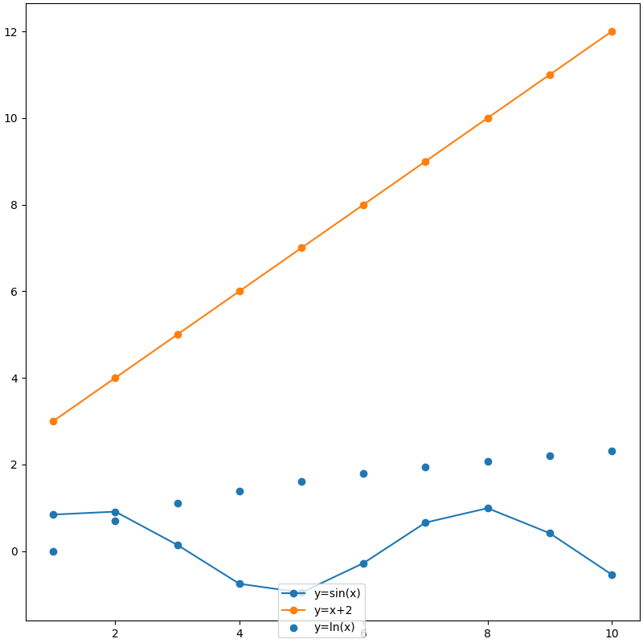{ width="50%" align="center"}

=== "Axes外上方左侧"

    ```Python  title="Axes外上方左侧" linenums="1" hl_lines="8"
    fig = plt.figure(figsize=(8, 8), dpi=100, layout="constrained")
    ax = fig.add_subplot(1, 1, 1)
   
    l1 = ax.plot(x, y1, label='y=sin(x)', marker='o')
    l2 = ax.plot(x, y2, label='y=x+2', marker='o')
    l3 = ax.scatter(x, y3, label='y=ln(x)', marker='o')
   
    fig.legend(loc='outside upper left')
   
    plt.show()
    ```

    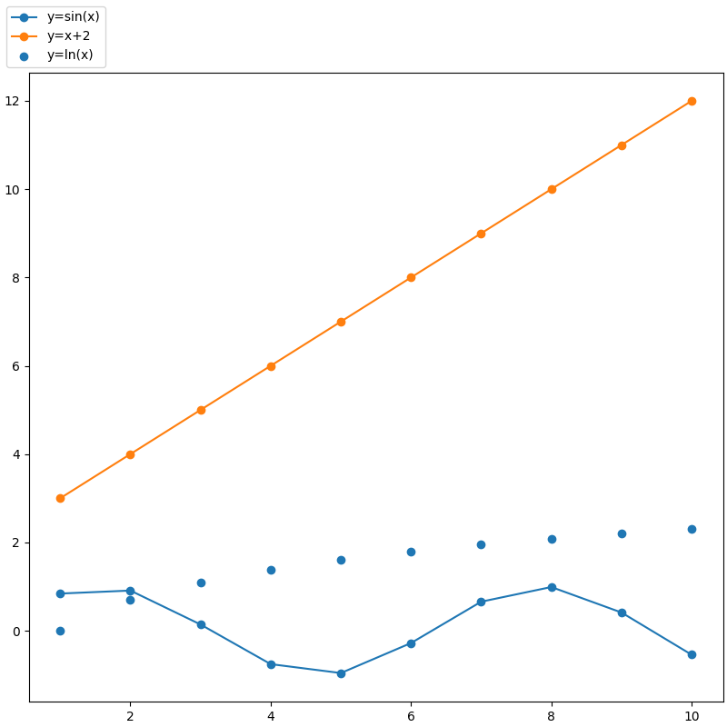{ width="50%" align="center"}

=== "Axes外左侧上方"

    ```Python  title="Axes外左侧上方" linenums="1" hl_lines="8"
    fig = plt.figure(figsize=(8, 8), dpi=100, layout="constrained")
    ax = fig.add_subplot(1, 1, 1) 
   
    l1 = ax.plot(x, y1, label='y=sin(x)', marker='o')
    l2 = ax.plot(x, y2, label='y=x+2', marker='o')
    l3 = ax.scatter(x, y3, label='y=ln(x)', marker='o')
   
    fig.legend(loc='outside left upper')
   
    plt.show()
    ```

    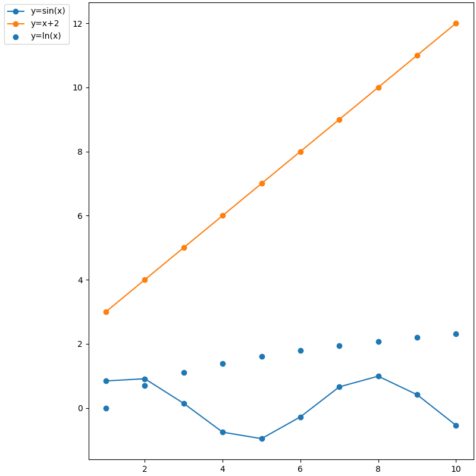{ width="50%" align="center"}

### loc=(x, y)：图例左下角坐标

=== "Axes"

    ```Python  title="Axes" linenums="1" hl_lines="8"
    fig = plt.figure(figsize=(8, 8), dpi=100, layout="constrained")
    ax = fig.add_subplot(1, 1, 1)
   
    l1 = ax.plot(x, y1, label='y=sin(x)', marker='o')
    l2 = ax.plot(x, y2, label='y=x+2', marker='o')
    l3 = ax.scatter(x, y3, label='y=ln(x)', marker='o')

    ax.legend(loc=(0, 0))    # (1)!
   
    plt.show()
    ```

    1. 图例左下角在Axes中的坐标为(0, 0)

    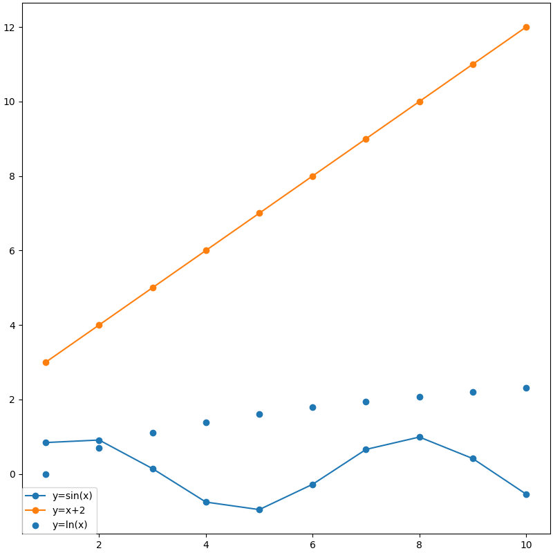{ width="50%" align="center"}

=== "Figure"

    ```Python  title="Figure" linenums="1" hl_lines="8"
    fig = plt.figure(figsize=(8, 8), dpi=100, layout="constrained")
    ax = fig.add_subplot(1, 1, 1)
   
    l1 = ax.plot(x, y1, label='y=sin(x)', marker='o')
    l2 = ax.plot(x, y2, label='y=x+2', marker='o')
    l3 = ax.scatter(x, y3, label='y=ln(x)', marker='o')

    fig.legend(loc=(0, 0))    # (1)!
   
    plt.show()
    ```

    1. 图例左下角在Figure中的坐标为(0, 0)

    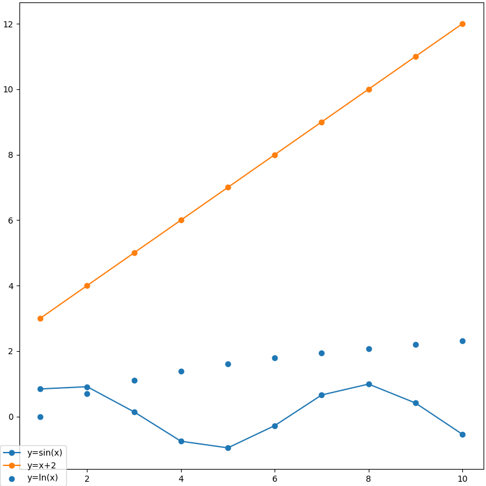{ width="50%" align="center"}

### loc='', bbox_to_anchor=(x, y)：图例定点坐标

=== "Axes"

    ```Python  title="Axes" linenums="1" hl_lines="8-11"
    fig = plt.figure(figsize=(8, 8), dpi=100, layout="constrained")
    ax = fig.add_subplot(1, 1, 1)

    l1 = ax.plot(x, y1, label='y=sin(x)', marker='o')
    l2 = ax.plot(x, y2, label='y=x+2', marker='o')
    l3 = ax.scatter(x, y3, label='y=ln(x)', marker='o')

    # 图例中心在Axes中的坐标为(0, 0.5)
    ax.legend(loc="center",
              bbox_to_anchor=(0, 0.5), 
              bbox_transform=ax.transAxes)

    plt.show()
    ```

    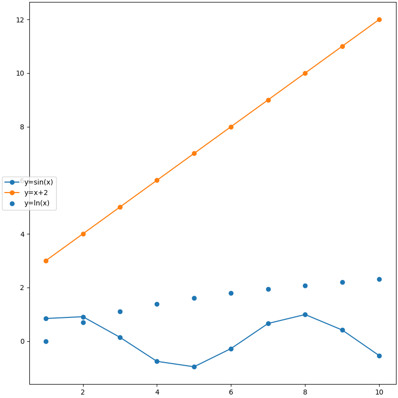{ width="50%" align="center"}

=== "Figure"

    ```Python  title="Figure" linenums="1" hl_lines="8-11"
    fig = plt.figure(figsize=(8, 8), dpi=100, layout="constrained")
    ax = fig.add_subplot(1, 1, 1)

    l1 = ax.plot(x, y1, label='y=sin(x)', marker='o')
    l2 = ax.plot(x, y2, label='y=x+2', marker='o')
    l3 = ax.scatter(x, y3, label='y=ln(x)', marker='o')

    # 图例中心在Figure中的坐标为(0, 0.5)
    fig.legend(loc="center",
               bbox_to_anchor=(0, 0.5),
               bbox_transform=fig.transFigure)

    plt.show()
    ```

    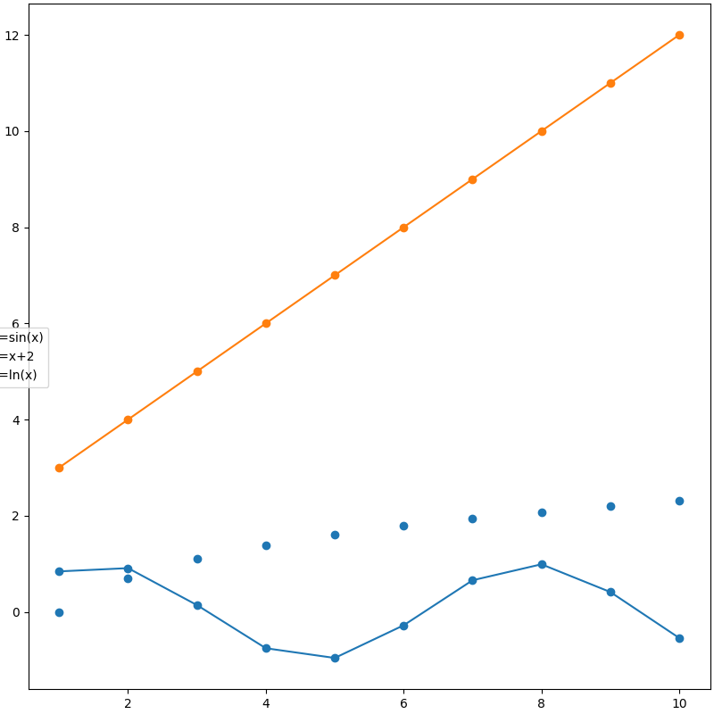{ width="50%" align="center"}

### loc='', bbox_to_anchor=(x, y, width, height)：图例在bounding box中位置

=== "Axes"

    ```Python  title="Axes" linenums="1" hl_lines="8-11"
    fig = plt.figure(figsize=(8, 8), dpi=100, layout="constrained")
    ax = fig.add_subplot(1, 1, 1)

    l1 = ax.plot(x, y1, label='y=sin(x)', marker='o')
    l2 = ax.plot(x, y2, label='y=x+2', marker='o')
    l3 = ax.scatter(x, y3, label='y=ln(x)', marker='o')

    # 在Axes中从(0, 0.5)创建一个宽1高0.5的bounding box，图例位于其正中
    ax.legend(loc="center",
              bbox_to_anchor=(0, 0.5, 1, 0.5), 
              bbox_transform=ax.transAxes)

    plt.show()
    ```
    
    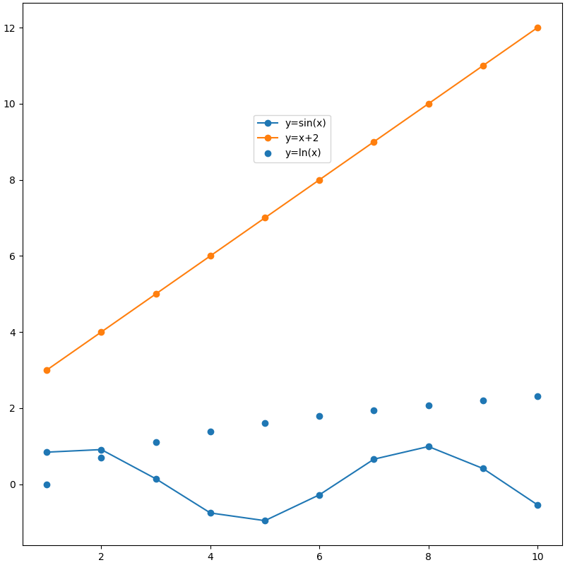{ width="50%" align="center"}

=== "Figure"

    ```Python  title="Figure" linenums="1" hl_lines="8-11"
    fig = plt.figure(figsize=(8, 8), dpi=100, layout="constrained")
    ax = fig.add_subplot(1, 1, 1)

    l1 = ax.plot(x, y1, label='y=sin(x)', marker='o')
    l2 = ax.plot(x, y2, label='y=x+2', marker='o')
    l3 = ax.scatter(x, y3, label='y=ln(x)', marker='o')

    # 在Figure中从(0, 0.5)创建一个宽1高0.5的bounding box，图例位于其正中
    fig.legend(loc="center",
               bbox_to_anchor=(0, 0.5, 1, 0.5),
               bbox_transform=fig.transFigure)

    plt.show()
    ```

    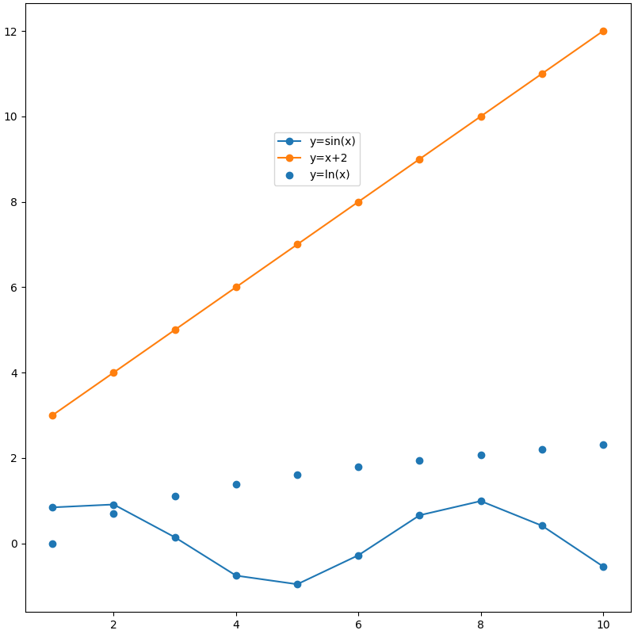{ width="50%" align="center"}

## 其它参数

[Understand layout in matplotlib legend - legendkit 0.3.5 documentation](https://legendkit.readthedocs.io/en/latest/tutorial/matplotlib_legend.html)

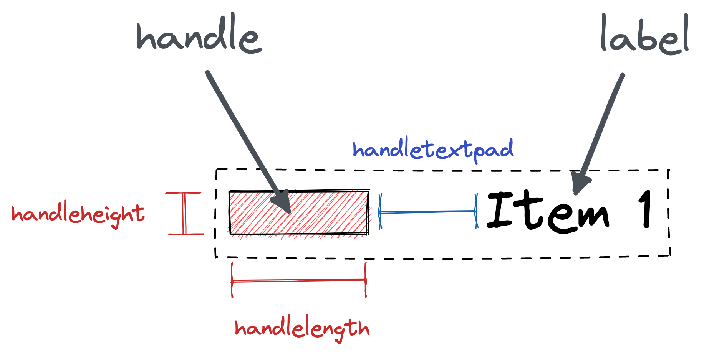{ width="50%" align="center"}

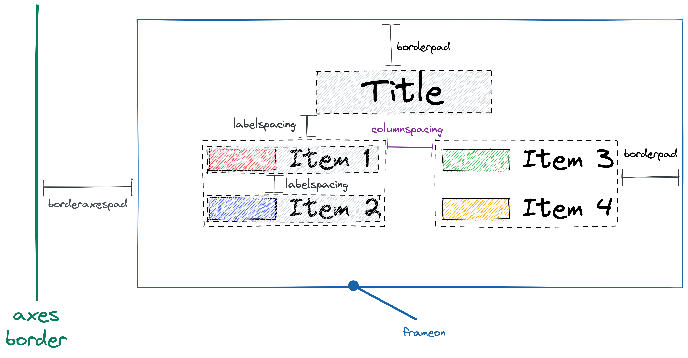{ width="50%" align="center"}

=== "其它参数"

    ```Python  title="其它参数" linenums="1"
    legend(
           ################### 标签文本 ####################
           prop={"family": ["sans-serif"],           # (1)!
                 "style": "italic",                  # (2)!
                 "variant": "normal",                # (3)!
                 "stretch": "normal",                # (4)!
                 "weight": "extra bold",             # (5)!
                 "size": 20.0,                       # (6)!
                 "math_fontfamily": 'dejavusans',    # (7)!
                 "fname": None                       # (8)!
                 },
           # fontsize=20.0,                          (9)
           labelcolor="linecolor",                   # (10)!
      
           ################### 图例标题 #####################
           title="Legend",                           # (11)!
           title_fontproperties={"size": 20.0,
                                 "weight": "extra bold"
                                 },
           # title_fontsize=20.0,                    (12)
           alignment="center",                       # (13)!
    
           ################### 图例项目 ######################
           ncols=2,                                  # (14)!
           columnspacing=1,                          # (15)!
           labelspacing=0.5,                         # (16)!
           numpoints=3,                              # (17)!
           scatterpoints=3,                          # (18)!
           scatteryoffsets=[0, 0.5, 1],              # (19)!
           markerscale=0.5,                          # (20)!
           markerfirst=False,                        # (21)!
           reverse=True,                             # (22)!
           handlelength=2,                           # (23)!
           handleheight=1,                           # (24)!
           handletextpad=0.5,                        # (25)!
    
           ################### 图例背景框 ####################
           frameon=True,                             # (26)!
           framealpha=0.5,                           # (27)!
           facecolor="blue",                         # (28)!
           edgecolor="yellow",                       # (29)!
           fancybox=True,                            # (30)!
           borderpad=0.3,                            # (31)!
           borderaxespad=0.2,                        # (32)!
           
           # Patch参数：rcParams["legend.shadow"]=False
           shadow={"linestyle": "--",                # (33)!
                   "linewidth": 5,                   # (34)!
                   "facecolor": "red",               # (35)!
                   "edgecolor": "green"              # (36)!
                   },
    
           ################### 其它参数 #####################
           mode=None,                                # (37)!
           handler_map=None,                         # (38)!
           draggable=False                           # (39)!
           )
    ```

    1.  按优先级降序排列的字体系列列表rcParams["font.family"], 可选(设备支持的字体):
        a.  'sans-serif'(默认)
        b.  'serif'
        c.  'cursive'
        d.  'fantasy'
        e.  'monospace'等
    2.  字体样式rcParams["font.style"], 可选:
        a.  'normal'(默认，罗马体)
        b.  'italic'(斜体)
        c.  'oblique'(倾斜)
    3.  字体变体rcParams["font.variant"], 可选:
        a.  'normal'(默认)
        b.  'small-caps'
    4.  字体伸展与压缩rcParams["font.stretch"], 可选:
        a.  0~1000
        b.  'ultra-condensed'
        c.  'extra-condensed'
        d.  'condensed'
        e.  'semi-condensed'
        f.  'normal'(默认)
        g.  'semi-expanded'
        h.  'expanded'
        i.  'extra-expanded'
        j.  'ultra-expanded' 
    5.  字体粗细rcParams["font.weight"], 可选:
        a.  0~1000
        b.  'ultralight'
        c.  'light'
        d.  'normal'(默认)
        e.  'regular'
        f.  'book'
        g.  'medium'
        h.  'roman'
        i.  'semibold'
        j.  'demibold'
        k.  'demi'
        l.  'bold'
        m.  'heavy'
        n.  'extra bold'
        o.  'black'
    6.  字体大小rcParams["font.size"], 可选: 
        
        绝对大小(浮点数，默认10.0) 或 相对大小

        a.  'xx-small'
        b.  'x-small'
        c.  'small'
        d.  'medium'
        e.  'large'
        f.  'x-large'
        g.  'xx-large'
    7.  用于呈现数学文本的字体rcParams["mathtext.fontset"], 可选: 
        a.  'dejavusans'(默认)
        b.  'dejavuserif'
        c.  'cm'
        d.  'stix'
        e.  'stixsans'
        f.  'custom'
    8.  字体文件路径
    9.  字体大小： 仅当prop未指定时被使用
    10.  字体颜色rcParams["legend.labelcolor"]，默认None(rcParams["text.color"]="black"), 可选: 

         颜色字符串、颜色字符串列表或者与线条/标记点颜色一致

         a.  'linecolor'
         b.  'markerfacecolor'/'mfc'
         c.  'markeredgecolor'/'mec'
    11.  标题，默认None
    12.  默认rcParams["legend.title_fontsize"]=None, 不能与title_fontproperties同时指定
    13.  图例标题及图例项目的对齐方式, 可选: 
         a.  'center'(默认)
         b.  'left'
         c.  'right'
    14.  图例项目列数，默认为1
    15.  图例项目列间距（相对于字体大小），默认rcParams["legend.columnspacing"]=2
    16.  图例项目间的垂直距离（相对于字体大小），默认rcParams["legend.labelspacing"]=0.5
    17.  线形图图例项目图形中标记点数量，默认rcParams["legend.numpoints"]=1
    18.  散点图图例项目图形中标记点数量，默认rcParams["legend.scatterpoints"]=1
    19.  散点图图例项目图形中每个标记点相对于其标签文本的垂直相对偏移量，默认为[0.375, 0.5, 0.3125]
         a.  0表示文本底部
         b.  1表示文本顶部
    20.  图例项目图形标记点缩放，默认rcParams["legend.markerscale"]=1
    21.  图例项目图形是否在文本标签前面，默认True
    22.  是否逆转图例项目顺序，默认False
    23.  图例项目图形长度（相对于字体大小），默认rcParams["legend.handlelength"]=2
    24.  图例项目图形高度（相对于字体大小），默认rcParams["legend.handleheight"]=0.7
    25.  图例项目图形与标签文本之间的距离（相对于字体大小），默认rcParams["legend.handletextpad"]=0.8
    26.  是否绘制背景框，默认rcParams["legend.frameon"]=True
    27.  背景框透明度，默认rcParams["legend.framealpha"]=0.8
    28.  背景框填充色，默认rcParams["legend.facecolor"]="inherit"(即继承rcParams["axes.facecolor"]="white")
    29.  背景框边缘色，默认rcParams["legend.edgecolor"]=0.8, 

         若为"inherit"则继承rcParams["axes.edgecolor"]="black"
    30.  背景框是否启用圆角，默认rcParams["legend.fancybox"]=True
    31.  边框与内部的距离（相对于字体大小），默认rcParams["legend.borderpad"]=0.4
    32.  边框与Axes的距离（相对于字体大小），默认rcParams["legend.borderaxespad"]=0.5
    33.  阴影线样式
    34.  阴影线宽度
    35.  阴影填充色
    36.  阴影边缘色
    37.  可选"expand"（水平扩展到填充整个轴或bbox）, None
    38.  通过字典映射单独设置每一个图例项目
    39.  图例能否被鼠标拖动，默认False

    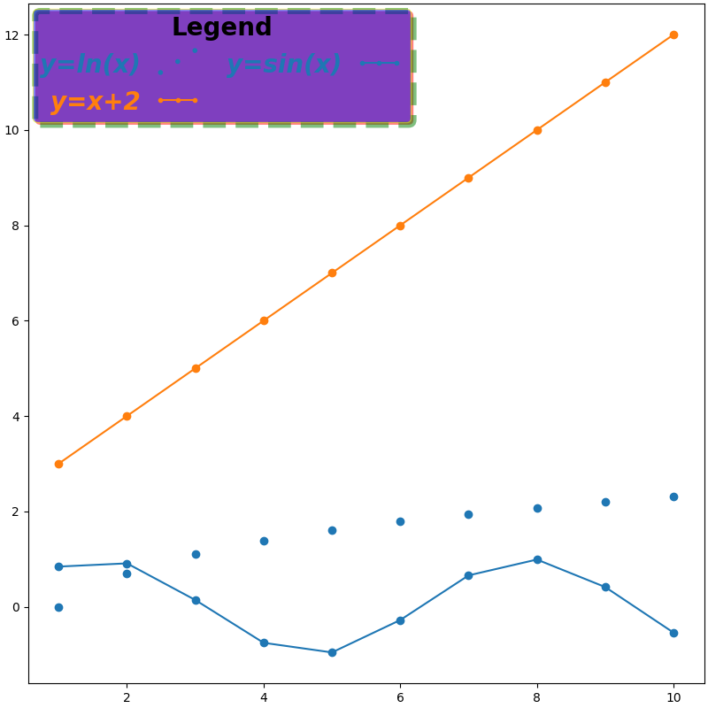{ width="50%" align="center"}

=== "可用字体"

    ```Python  title="可用字体" linenums="1"
    import matplotlib.font_manager
    matplotlib.font_manager.get_font_names()
    """
    ['Monotype Corsiva', 'Goudy Stout', 'Lucida Sans Unicode', 'HoloLens MDL2 Assets', 'Eras Light ITC', 
     'Tempus Sans ITC', 'Sylfaen', 'Lucida Console', 'Verdana', 'cmb10', 
     'STZhongsong', 'Segoe Fluent Icons', 'Lucida Handwriting', 'Microsoft PhagsPa', 
     'Eras Bold ITC', 'DFKai-SB', 'Papyrus', 'DejaVu Sans Mono', 'Harrington', 
     'Times New Roman', 'STLiti', 'Mistral', 'cmsy10', 'Leelawadee', 
     'Niagara Engraved', 'Colonna MT', 'Microsoft New Tai Lue', 'STIXSizeTwoSym', 
     'Edwardian Script ITC', 'FZYaoTi', 'Script MT Bold', 'MingLiU-ExtB', 'Segoe UI Historic', 
     'Microsoft Himalaya', 'Trebuchet MS', 'cmtt10', 'Vladimir Script', 
     'Rage Italic', 'STXinwei', 'Segoe UI Variable', 'Modern No. 20', 'FZShuTi', 
     'French Script MT', 'Copperplate Gothic Light', 'Nirmala UI', 'Gloucester MT Extra Condensed', 'Segoe UI', 
     'Book Antiqua', 'Microsoft YaHei', 'MS Reference Sans Serif', 'Lucida Sans', 'Engravers MT', 
     'DengXian', 'STXingkai', 'Javanese Text', 'High Tower Text', 'SimSun-ExtB', 
     'Chiller', 'HarmonyOS Sans SC', 'Playbill', 'Bookman Old Style', 'MS Gothic', 
     'Castellar', 'SimHei', 'Kunstler Script', 'Yu Gothic', 'FangSong', 
     'Brush Script MT', 'Sans Serif Collection', 'Tahoma', 'Courier New', 'Myanmar Text', 
     'Bradley Hand ITC', 'Bell MT', 'Gill Sans MT Ext Condensed Bold', 'STIXNonUnicode', 'Leelawadee UI', 
     'Franklin Gothic Heavy', 'Calibri', 'STIXSizeThreeSym', 'Microsoft Uighur', 'Maiandra GD', 
     'STIXGeneral', 'Segoe UI Symbol', 'Lucida Fax', 'Dubai', 'Century Gothic', 
     'Tw Cen MT', 'Pristina', 'Viner Hand ITC', 'Rockwell Extra Bold', 'Gill Sans Ultra Bold', 
     'HYZhongHei', 'Stencil', 'Parchment', 'Gadugi', 'DejaVu Sans', 
     'Juice ITC', 'Baskerville Old Face', 'Vivaldi', 'Niagara Solid', 'Garamond', 
     'Calisto MT', 'DejaVu Serif Display', 'Segoe MDL2 Assets', 'STFangsong', 'Candara', 
     'Curlz MT', 'Ink Free', 'STIXSizeOneSym', 'Rockwell', 'Bahnschrift', 
     'Lucida Sans Typewriter', 'Perpetua', 'Gill Sans MT', 'Gabriola', 'Sitka', 
     'STKaiti', 'STHupo', 'Centaur', 'Arial', 'Eras Demi ITC', 
     'Bodoni MT', 'Kristen ITC', 'MS Outlook', 'Lucida Bright', 'Century', 
     'Wide Latin', 'DejaVu Sans Display', 'SimSun-ExtG', 'Consolas', 'Arial Rounded MT Bold', 
     'cmr10', 'Eras Medium ITC', 'Palace Script MT', 'Broadway', 'Jokerman', 
     'DejaVu Serif', 'Agency FB', 'Constantia', 'Symbol', 'cmss10', 
     'Franklin Gothic Medium Cond', 'Informal Roman', 'STIXSizeFiveSym', 'Bauhaus 93', 'Footlight MT Light', 
     'Microsoft Sans Serif', 'Segoe Print', 'Comic Sans MS', 'Blackadder ITC', 'Microsoft Yi Baiti', 
     'Gigi', 'Lucida Calligraphy', 'Corbel', 'Magneto', 'LiSu', 
     'Elephant', 'Tw Cen MT Condensed', 'OCR A Extended', 'Snap ITC', 'Franklin Gothic Demi', 
     'Britannic Bold', 'Berlin Sans FB', 'Bookshelf Symbol 7', 'Wingdings', 'MS Reference Specialty', 
     'Berlin Sans FB Demi', 'Mongolian Baiti', 'STCaiyun', 'Onyx', 'Malgun Gothic', 
     'Harlow Solid Italic', 'Palatino Linotype', 'Goudy Old Style', 'STXihei', 'STSong', 
     'Cooper Black', 'Segoe Script', 'Wingdings 2', 'Georgia', 'MingLiU', 'cmmi10', 'cmex10', 'Webdings', 
     'Algerian', 'Freestyle Script', 'Gill Sans MT Condensed', 'Copperplate Gothic Bold', 'SimSun', 
     'Gill Sans Ultra Bold Condensed', 'Felix Titling', 'MV Boli', 'Old English Text MT', 'Rockwell Condensed', 
     'STIXSizeFourSym', 'Cambria', 'Segoe UI Emoji', 'Microsoft JhengHei', 'KaiTi', 'Ravie', 
     'Ebrima', 'Franklin Gothic Book', 'Haettenschweiler', 'Bernard MT Condensed', 'Impact', 
     'Tw Cen MT Condensed Extra Bold', 'Californian FB', 'Showcard Gothic', 'YouYuan', 'Microsoft Tai Le', 
     'Forte', 'Imprint MT Shadow', 'Wingdings 3', 'Century Schoolbook', 'Perpetua Titling MT', 'Poor Richard', 
     'FZXiaoBiaoSong-B05S', 'Matura MT Script Capitals', 'Franklin Gothic Demi Cond', 'Franklin Gothic Medium']
    """
    ```

## 添加多个Legend

```Python  title="添加多个Legend" linenums="1"
fig = plt.figure(figsize=(8, 8), dpi=100, layout="constrained")
ax = fig.add_subplot(1, 1, 1)

l1 = ax.plot(x, y1, label='y=sin(x)', marker='o')
l2 = ax.plot(x, y2, label='y=x+2', marker='o')
l3 = ax.scatter(x, y3, label='y=ln(x)', marker='o')

# 第一个
legend1 = ax.legend(handles=[l1[0]], loc='lower center')
ax.add_artist(legend1)
# 第二个
legend2 = ax.legend(handles=[l2[0]], loc=(0.5, 0.6))
ax.add_artist(legend2)
# 第三个
legend3 = ax.legend(handles=[l3], loc=(0.8, 0.3))
ax.add_artist(legend3)

plt.show()
```

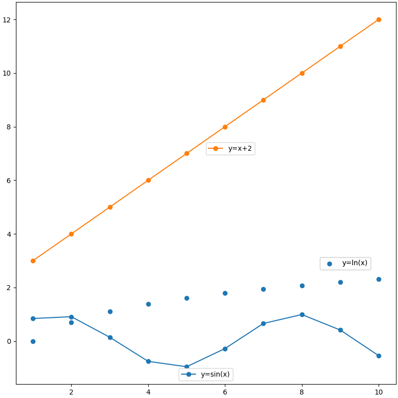{ width="50%" align="center"}

## 添加自定义图例

=== "线型/标记图例"

    ```Python  title="线型/标记图例" linenums="1"
    from matplotlib.lines import Line2D

    fig = plt.figure(figsize=(8, 8), dpi=100, layout="constrained")
    ax = fig.add_subplot(1, 1, 1)

    line = Line2D(xdata=[], ydata=[],
                  linestyle="--",
                  color="red",
                  marker="o",
                  markerfacecolor="red",
                  label="line/marker")
    ax.legend(handles=[line],
              fontsize=20)

    plt.show()
    ```

    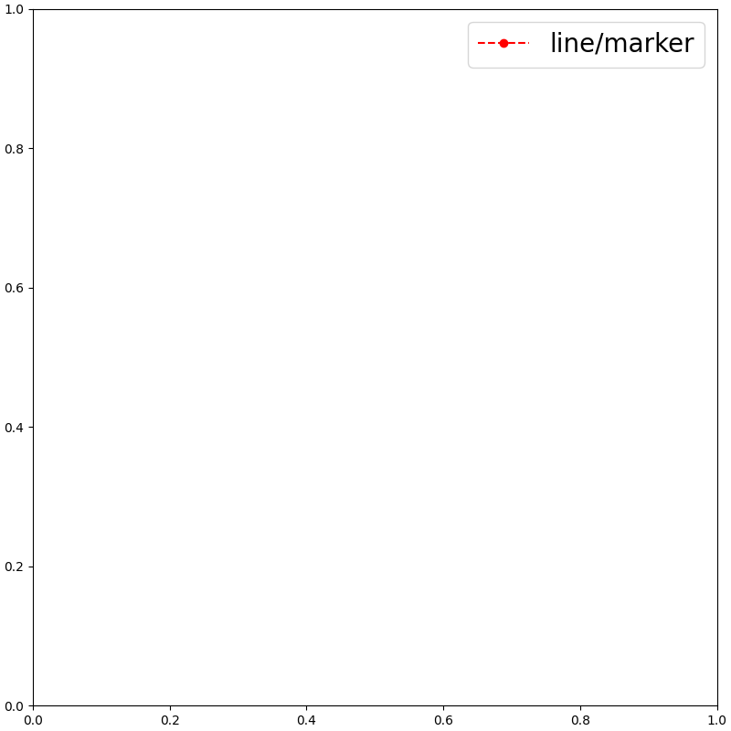{ width="50%" align="center"}

=== "颜色图例"

    ```Python  title="颜色图例" linenums="1"
    from matplotlib.patches import Patch

    fig = plt.figure(figsize=(8, 8), dpi=100, layout="constrained")
    ax = fig.add_subplot(1, 1, 1)

    patch = Patch(facecolor="green",
                  linestyle="--",
                  linewidth=2,
                  edgecolor="yellow",
                  hatch="/",
                  hatch_linewidth=10,
                  label="Patch")
    ax.legend(handles=[patch],
              fontsize=20)

    plt.show()
    ```

    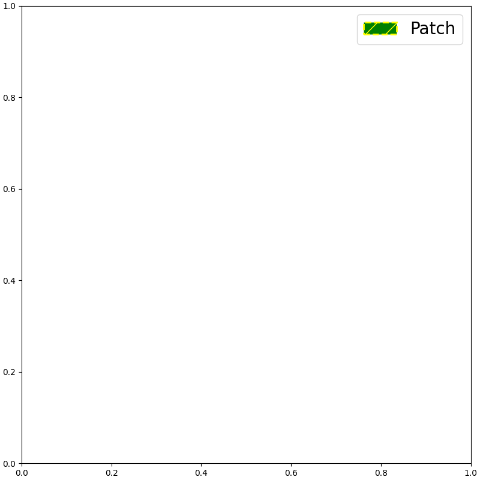{ width="50%" align="center"}

## 获取可用handles与labels

```Python  title="获取可用handles与labels" linenums="1"
handles, labels = ax.get_legend_handles_labels()
"""
handles: [<matplotlib.lines.Line2D object at 0x000001A2F557C140>, <matplotlib.lines.Line2D object at 0x000001A2F557C3E0>, <matplotlib.collections.PathCollection object at 0x000001A2F530F710>]
labels: ['y=sin(x)', 'y=x+2', 'y=ln(x)']
"""
```

## seaborn中的move_legend函数

[seaborn.move_legend — seaborn 0.13.2 documentation](https://seaborn.pydata.org/generated/seaborn.move_legend.html)

重新创建一个图例到新的位置。该名称略有误称。Matplotlib 图例不公开其位置参数的控制。因此，此函数 **创建一个新的图例，复制原始对象中的数据，然后删除该对象**。

`sns.move_legend(obj, loc, **kwargs)`

1.  **obj**：此参数可以是 seaborn 或 matplotlib 对象。

    a.  `seaborn.FacetGrid` 或 `seaborn.PairGrid`

    b.  `matplotlib.axes.Axes` 或 `matplotlib.figure.Figure`

2.  **loc**：位置参数，同 `matplotlib.axes.Axes.legend()`。

`**kwargs` 其他参数传递给 `matplotlib.axes.Axes.legend()` 。

```Python title="move_legend函数" linenums="1"
fig = plt.figure(figsize=(8, 8), dpi=100, layout="constrained")
ax = fig.add_subplot(1, 1, 1)

l1 = ax.plot(x, y1, label='y=sin(x)', marker='o')
l2 = ax.plot(x, y2, label='y=x+2', marker='o')
l3 = ax.scatter(x, y3, label='y=ln(x)', marker='o')

ax.legend()

sns.move_legend(ax, loc="center", bbox_to_anchor=(0, 0.5))

plt.show()
```

{ width="50%" align="center"}