# 图形（Figure）、子图（Axes）、子图组（Subfigure）

```Python title="导入模块与数据准备" linenums="1"
import matplotlib as mpl
import matplotlib.pyplot as plt
import numpy as np

x = np.arange(0, 100, 1)
"""
[ 0  1  2  3  4  5  6  7  8  9 10 11 12 13 14 15 16 17 18 19 20 21 22 23 24 25 26 27 28 29 30 31 32 33 34 35 36 37 38 39 40 41 42 43 44 45 46 47 48 49 50 51 52 53 54 55 56 57 58 59 60 61 62 63 64 65 66 67 68 69 70 71 72 73 74 75 76 77 78 79 80 81 82 83 84 85 86 87 88 89 90 91 92 93 94 95 96 97 98 99]
"""

y = np.sin(x)
"""
[ 0.  0.84147098  0.90929743  0.14112001 -0.7568025  -0.95892427 -0.2794155   0.6569866   0.98935825  0.41211849 -0.54402111 -0.99999021 -0.53657292  0.42016704  0.99060736  0.65028784 -0.28790332 -0.96139749 -0.75098725  0.14987721  0.91294525  0.83665564 -0.00885131 -0.8462204 -0.90557836 -0.13235175  0.76255845  0.95637593  0.27090579 -0.66363388 -0.98803162 -0.40403765  0.55142668  0.99991186  0.52908269 -0.42818267 -0.99177885 -0.64353813  0.29636858  0.96379539  0.74511316 -0.15862267 -0.91652155 -0.83177474  0.01770193  0.85090352  0.90178835  0.12357312 -0.76825466 -0.95375265 -0.26237485  0.67022918  0.98662759  0.39592515 -0.55878905 -0.99975517 -0.521551    0.43616476  0.99287265  0.63673801 -0.30481062 -0.96611777 -0.7391807   0.1673557   0.92002604  0.82682868 -0.02655115 -0.85551998 -0.89792768 -0.11478481  0.77389068  0.95105465  0.25382336 -0.67677196 -0.98514626 -0.38778164  0.56610764  0.99952016  0.51397846 -0.44411267 -0.99388865 -0.62988799  0.31322878  0.96836446  0.73319032 -0.17607562 -0.92345845 -0.82181784  0.0353983   0.86006941  0.89399666  0.10598751 -0.77946607 -0.94828214 -0.24525199  0.68326171  0.98358775  0.37960774 -0.57338187 -0.99920683]
"""
```

## 默认Figure与Axes

```Python title="默认Figure与Axes" linenums="1"
# ax = plt.gca()    # 获取当前激活的Axes
plt.plot(x, y)

plt.show()
```

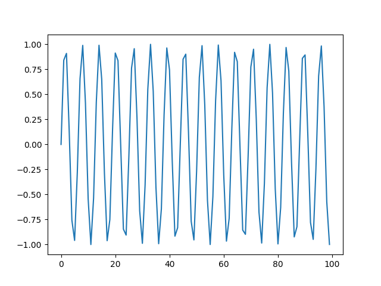{ width="50%" align="center"}

## Figure的设置

[matplotlib.figure.Figure — Matplotlib 3.10.1 documentation](https://matplotlib.org/stable/api/_as_gen/matplotlib.figure.Figure.html#matplotlib.figure.Figure)

[matplotlib.pyplot.figure — Matplotlib 3.10.1 documentation](https://matplotlib.org/stable/api/_as_gen/matplotlib.pyplot.figure.html#matplotlib.pyplot.figure)

[matplotlib.figure — Matplotlib 3.10.1 documentation](https://matplotlib.org/stable/api/figure_api.html#module-matplotlib.figure)

```Python title="Figure的设置" linenums="1"
fig = plt.figure(num=None,               # (1)!
                 label="a",              # (2)!
                 clear=False,            # (3)!

                 figsize=(10, 10),       # (4)!
                 dpi=100.0,              # (5)!
                 frameon=True,           # (6)!
                 facecolor='gray',       # (7)!
                 edgecolor='red',        # (8)!
                 linewidth=2.0,          # (9)!
                 
                 layout="constrained"    # (10)!
                 )
"""
fig.number: 1
fig.get_label(): a
"""

plt.plot(x, y)
plt.show()
```

1.  图形唯一标识（数字或字符串）或已存在的Figure对象、SubFigure对象。

    图形对象已存在，则直接激活并返回；否则先创建再激活并返回

2.  图形唯一标识（字符串）
3.  是否清除已存在的Figure对象，默认False
4.  图形尺寸（英寸）：(宽, 高)，默认`#!python rcParams["figure.figsize"]=(6.4, 4.8)`
5.  分辨率：每英寸像素点数，越大越清晰，默认`#!python rcParams["figure.dpi"]=100.0`
6.  是否绘制背景板，默认`#!python rcParams["figure.frameon"]=True`
7.  背景板色，默认`#!python rcParams["figure.facecolor"]="white"`
8.  背景板边缘色，默认`#!python rcParams["figure.edgecolor"]="white"`
9.  背景板边缘宽度
10.  布局, 可选: 

     a. "constrained"
     b. "compressed"
     c. "tight"
     d. "none"
     e. LayoutEngine实例
     f. None(默认)

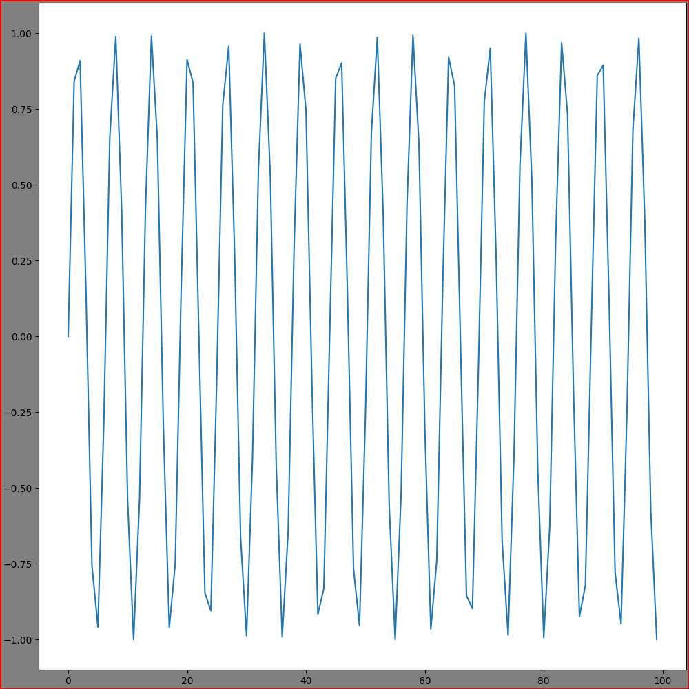{ width="50%" align="center"}

## Axes的添加与设置

[matplotlib.axes.Axes — Matplotlib 3.10.1 documentation](https://matplotlib.org/stable/api/_as_gen/matplotlib.axes.Axes.html#matplotlib.axes.Axes)

```Python title="Axes参数" linenums="1"
projection=None,                       # (1)!

title="y=sin(x)",                      # (2)!
facecolor="yellow",                    # (3)!
frameon=True,                          # (4)!
                  
adjustable='box',                      # (5)!
aspect=40,                             # (6)!
# box_aspect=1,                        (7)

xlabel="x",                            # (8)!
xlim=(40, 100),                        # (9)!
xbound=(40, 100),                      # (10)!
xscale="linear",                       # (11)!
xticks=np.arange(20, 110, 10),         # (12)!
xticklabels=np.arange(20, 110, 10),    # (13)!
sharex=None,                           # (14)!

ylabel="y",                            # (15)!
ylim=(-1, 1),                          # (16)!
ybound=(-1, 1),                        # (17)!
yscale="linear",                       # (18)!
yticks=np.arange(-1, 1.5, 0.5),        # (19)!
yticklabels=np.arange(-1, 1.5, 0.5),   # (20)!
sharey=None,                           # (21)!
```

1.  坐标系类型, 可选: 

    a. None/'rectilinear'（默认）
    b. 'aitoff'
    c. 'hammer'
    d. 'lambert
    e. 'mollweide
    f. 'polar'
    g. '3d'

2.  子图标题
3.  子图背景色
4.  是否绘制子图边框
5.  满足aspect的轴调整方式, 可选: 
    a. "box": 默认，数据范围不变，单位长度的数据比例
    b. "datalim": 物理尺寸不变，数据范围比例

6.  x/y，可选"auto", "equal"（相当于1）, 浮点数
7.  子图高宽比
8.  x轴标题
9.  x轴数据范围
10.  x轴数据范围
11.  x轴缩放：可选'linear', 'log', 'symlog', 'asinh', 'logit', 'function', 'functionlog'
12.  x轴刻度
13.  x轴刻度标签
14.  共享x轴的Axes
15.  y轴标题
16.  y轴数据范围
17.  y轴数据范围
18.  y轴缩放：可选'linear', 'log', 'symlog', 'asinh', 'logit', 'function', 'functionlog'
19.  y轴刻度
20.  y轴刻度标签
21.  共享y轴的Axes

### 逐一添加

=== "fig.add_axes(rect)"

    [matplotlib.figure.Figure.add_axes — Matplotlib 3.10.1 documentation](https://matplotlib.org/stable/api/_as_gen/matplotlib.figure.Figure.add_axes.html#matplotlib.figure.Figure.add_axes)
    
    设置Axes位置和大小，同时设置Axes参数
    
    ```Python title="fig.add_axes(rect)" linenums="1"
    ax = fig.add_axes((0.2, 0.2, 0.6, 0.6),    # (1)!
                      
                      # Axes参数
                      title="y=sin(x)",
                      xlabel="x",
                      ylabel="y",
                      facecolor="yellow")
    
    ax.plot(x, y)
    plt.show()
    ```

    1. 子图相对位置（Figure宽、高比例）：(左边距， 底边距， 宽， 高)
    
    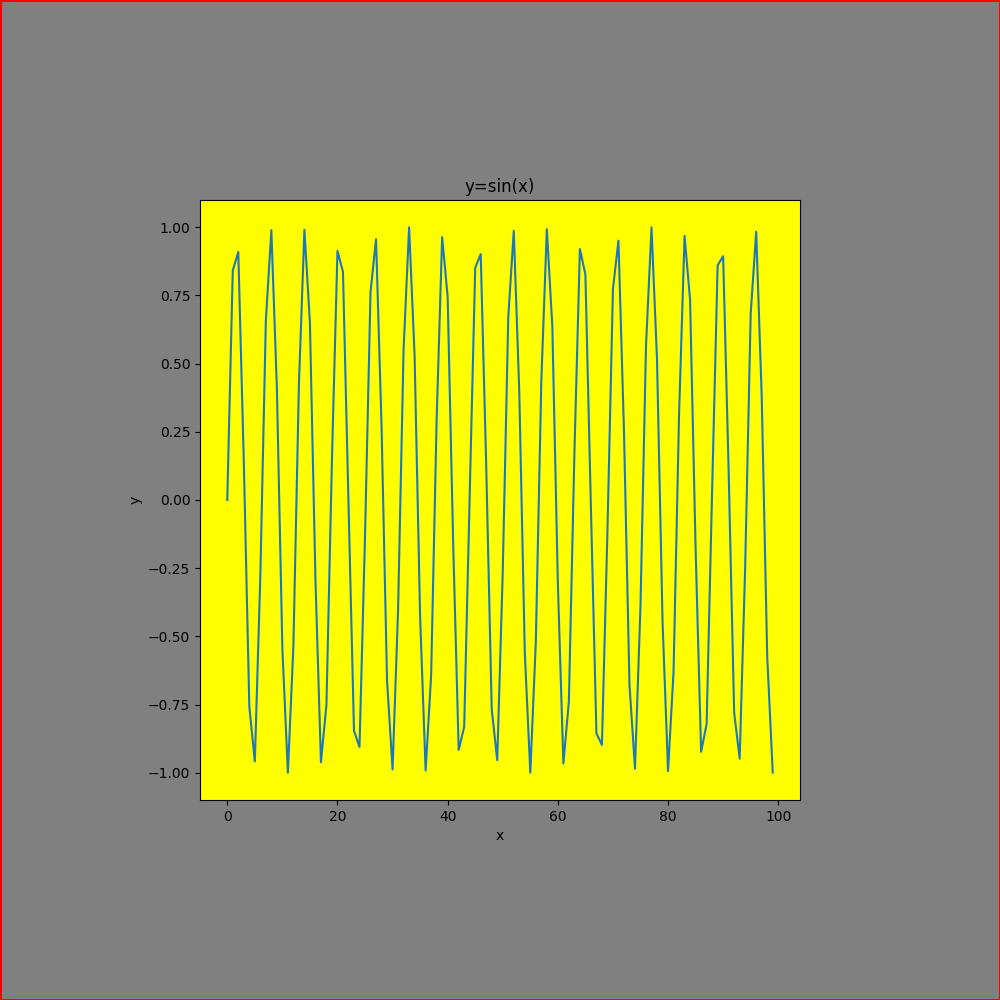{ width="50%" align="center"}

=== "plt.axes(rect)"

    [matplotlib.pyplot.axes — Matplotlib 3.10.1 documentation](https://matplotlib.org/stable/api/_as_gen/matplotlib.pyplot.axes.html#matplotlib.pyplot.axes)
    
    同上
    
    ```Python title="plt.axes(rect)" linenums="1"
    ax = plt.axes((0.2, 0.2, 0.6, 0.6),    # (1)!
                  
                  # Axes参数
                  title="y=sin(x)",
                  xlabel="x",
                  ylabel="y",
                  facecolor="yellow")
    
    ax.plot(x, y)
    plt.show()
    ```

    1. 子图相对位置（Figure宽、高比例）：(左边距， 底边距， 宽， 高)
    
    { width="50%" align="center"}

=== "fig.add_subplot(nrows, ncols, index)"

    [matplotlib.figure.Figure.add_subplot — Matplotlib 3.10.1 documentation](https://matplotlib.org/stable/api/_as_gen/matplotlib.figure.Figure.add_subplot.html#matplotlib.figure.Figure.add_subplot)
    
    指定位置（网格布局）添加Axes，同时设置Axes参数
    
    ```Python title="fig.add_subplot(nrows, ncols, index)" linenums="1"
    ax = fig.add_subplot(2, 2, (1, 2),        # (1)!
    
                         # Axes参数
                         title="y=sin(x)",
                         xlabel="x",
                         ylabel="y",
                         facecolor="yellow")
    # ax = fig.add_subplot(221)               # (2)!
    
    ax.plot(x, y)
    plt.show()
    ```

    1. (nrows, ncols, index) 或 (nrows, ncols, (first, last))
    2. 等价于(nrows, ncols, index)
    
    { width="50%" align="center"}

=== "plt.subplot(nrows, ncols, index)"

    [matplotlib.pyplot.subplot — Matplotlib 3.10.1 documentation](https://matplotlib.org/stable/api/_as_gen/matplotlib.pyplot.subplot.html#matplotlib.pyplot.subplot)
    
    同上
    
    ```Python title="plt.subplot(nrows, ncols, index)" linenums="1"
    ax = plt.subplot(2, 2, (1, 2),        # (1)!
    
                     # Axes参数
                     title="y=sin(x)",
                     xlabel="x",
                     ylabel="y",
                     facecolor="yellow")
    # ax = plt.subplot(221)               # (2)!
    
    ax.plot(x, y)
    plt.show()
    ```

    1. (nrows, ncols, index) 或 (nrows, ncols, (first, last))
    2. 等价于(nrows, ncols, index)

    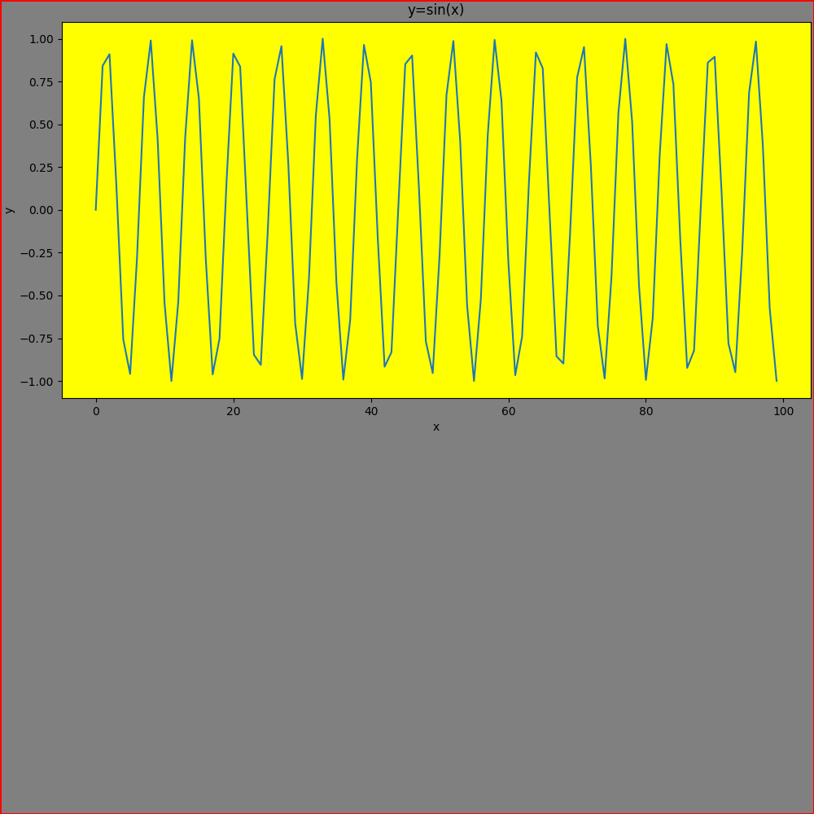{ width="50%" align="center"}

### GridSpec布局

[matplotlib.gridspec.GridSpec — Matplotlib 3.10.1 documentation](https://matplotlib.org/stable/api/_as_gen/matplotlib.gridspec.GridSpec.html#matplotlib.gridspec.GridSpec)

Axes的网格布局

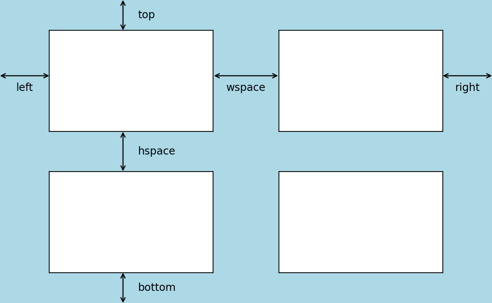{ width="50%" align="center"}

```Python title="GridSpec布局" linenums="1"
gs = fig.add_gridspec(nrows=2, ncols=2,

                      left=0.01, right=0.05,      # (1)!
                      bottom=0.2, top=0.6,        # (2)!

                      wspace=0.5,                 # (3)!
                      hspace=0.5,                 # (4)!
                      width_ratios=[0.4, 0.6],    # (5)!
                      height_ratios=[0.6, 0.4]    # (6)!
                      )
ax = fig.add_subplot(gs[0, 0:2],

                     # Axes参数
                     title="y=sin(x)",
                     xlabel="x",
                     ylabel="y",
                     facecolor="yellow")
ax1 = fig.add_subplot(gs[1, 0])
ax2 = fig.add_subplot(gs[1, 1])

ax.plot(x, y)
plt.show()
```

1. 子图左右边距占图形宽的比例。Left<=right
2. 子图上下边距占图形高的比例。bottom<=top
3. 列间隔（平均轴宽度百分比）
4. 行间隔（平均轴高度百分比）
5. 每列宽度比例
6. 每行高度比例

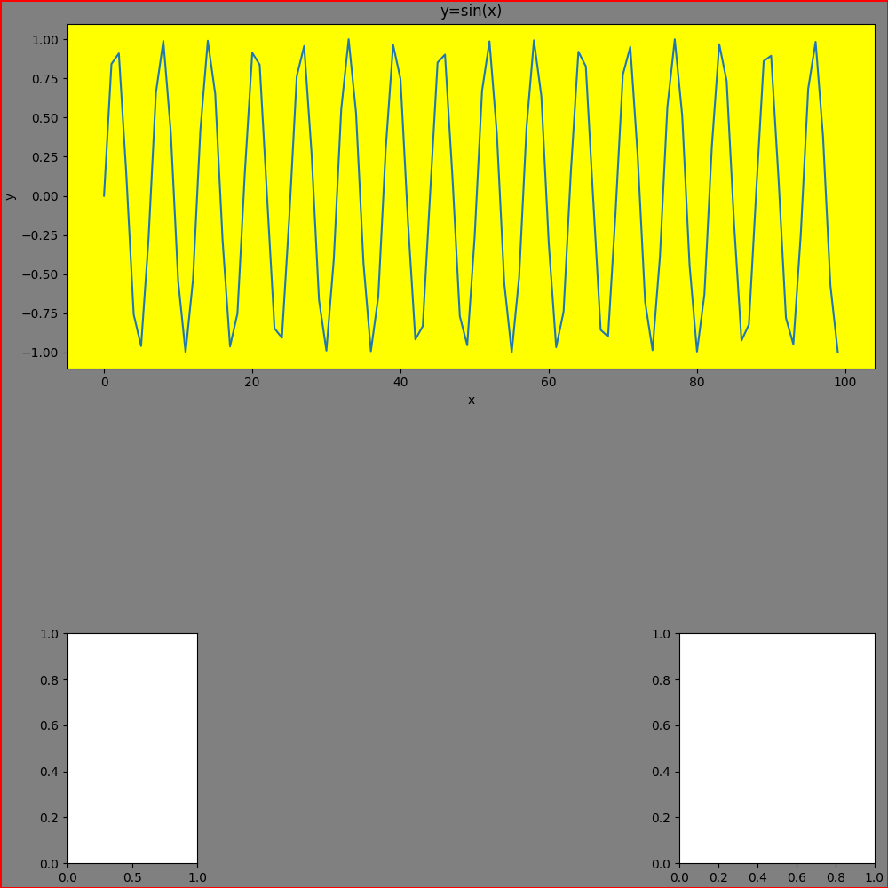{ width="50%" align="center"}

### 一次多个

=== "fig.subplots(nrows, ncols)"

    [matplotlib.figure.Figure.subplots — Matplotlib 3.10.1 documentation](https://matplotlib.org/stable/api/_as_gen/matplotlib.figure.Figure.subplots.html#matplotlib.figure.Figure.subplots)
    
    同时添加多个Axes，返回Axes数组
    
    ```Python title="fig.subplots(nrows, ncols)" linenums="1"
    ax_array = fig.subplots(nrows=2,
                            ncols=2,
                            sharex="col",                       # (1)!
                            sharey="row",                       # (2)!
                            squeeze=True,                       # (3)!
                            width_ratios=[0.4, 0.6],            # (4)!
                            height_ratios=[0.6, 0.4],           # (5)!
                            subplot_kw={"facecolor": "red"},    # (6)!
                            gridspec_kw={"wspace": 0.5}         # (7)!
                            )
    ax = ax_array[0, 0]
    
    ax.plot(x, y)
    plt.show()
    ```

    1.  共享x轴, 可选:
        a.  True/'all': 所有子图共享
        b.  False/'none': 不共享
        c.  'row': 同行共享
        d.  'col': 同列共享

    2.  共享y轴, 可选:
        a.  True/'all': 所有子图共享
        b.  False/'none': 不共享
        c.  'row': 同行共享
        d.  'col': 同列共享

    3.  取消返回的子图数组的多余维度

        若为False，则返回的子图数组始终为二维数组

    4.  每列宽度比例，相当于gridspec_kw={"width_ratios": []}
    5.  每行高度比例，相当于gridspec_kw={"height_ratios": []}
    6.  Axes全局参数
    7.  Gridspec参数

    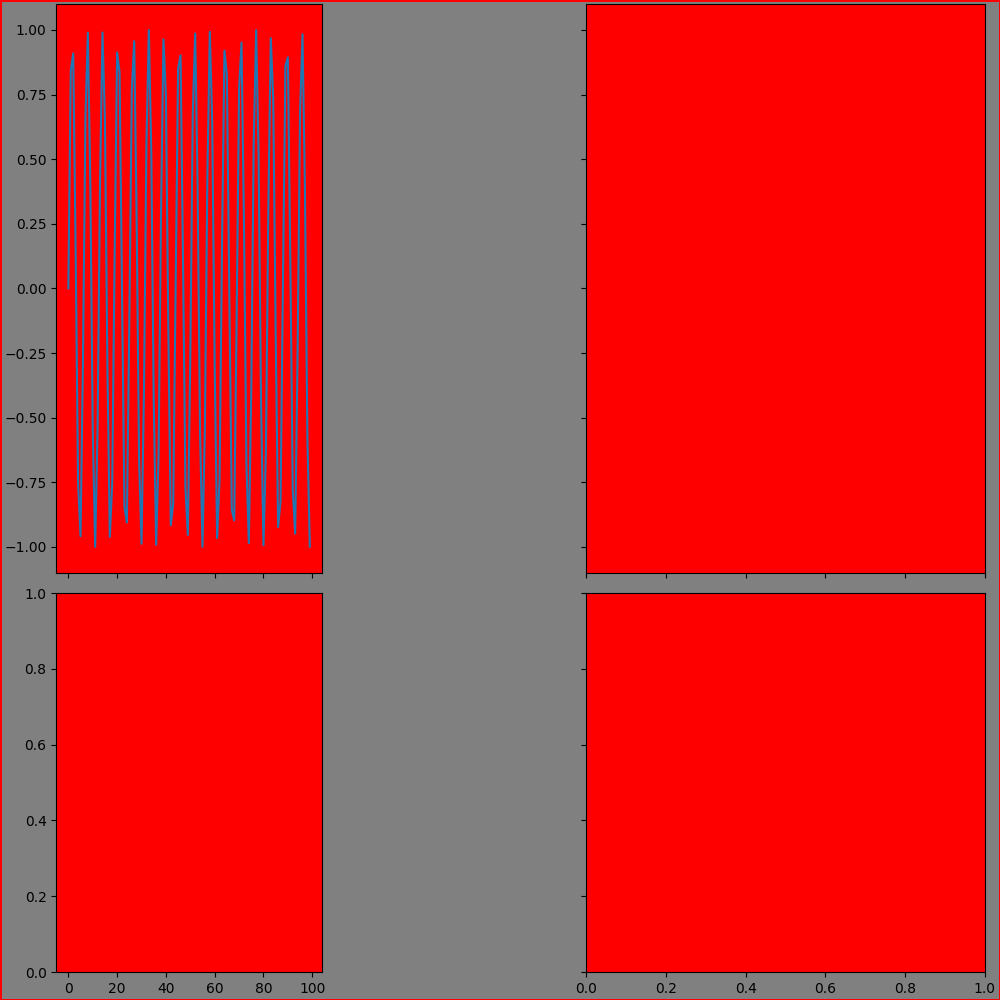{ width="50%" align="center"}

=== "plt.subplots(nrows, ncols)"

    [matplotlib.pyplot.subplots — Matplotlib 3.10.1 documentation](https://matplotlib.org/stable/api/_as_gen/matplotlib.pyplot.subplots.html#matplotlib.pyplot.subplots)
    
    同上，但同时返回并激活一个Figure对象（可设置参数）
    
    ```Python title="plt.subplots(nrows, ncols)" linenums="1"
    fig, ax_array = plt.subplots(nrows=2,
                                 ncols=2,
                                 sharex="col",                       # (1)!
                                 sharey="row",                       # (2)!
                                 squeeze=True,                       # (3)!
                                 width_ratios=[0.4, 0.6],            # (4)!
                                 height_ratios=[0.6, 0.4],           # (5)!
                                 subplot_kw={"facecolor": "red"},    # (6)!
                                 gridspec_kw={"wspace": 0.5},        # (7)!
    
                                 # Figure参数
                                 figsize=(10, 10),      
                                 dpi=100.0,             
                                 frameon=True,          
                                 facecolor='gray',      
                                 edgecolor='red',        
                                 linewidth=2.0         
                                 )
    ax = ax_array[0, 0]
    
    ax.plot(x, y)
    plt.show()
    ```

    1.  共享x轴, 可选:
        a.  True/'all': 所有子图共享
        b.  False/'none': 不共享
        c.  'row': 同行共享
        d.  'col': 同列共享

    2.  共享y轴, 可选:
        a.  True/'all': 所有子图共享
        b.  False/'none': 不共享
        c.  'row': 同行共享
        d.  'col': 同列共享

    3.  取消返回的子图数组的多余维度，若为False，则返回的子图数组始终为二维数组
    4.  每列宽度比例，相当于gridspec_kw={"width_ratios": []}
    5.  每行高度比例，相当于gridspec_kw={"height_ratios": []}
    6.  Axes全局参数
    7.  Gridspec参数
    
    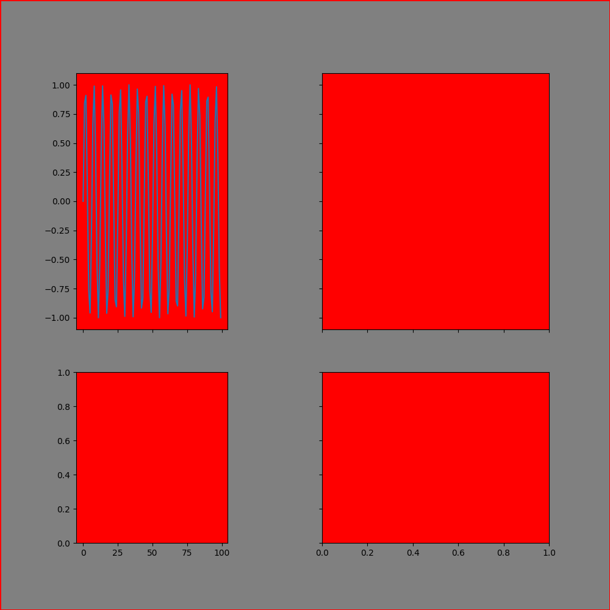{ width="50%" align="center"}

=== "fig.subplot_mosaic(mosaic)"

    [matplotlib.figure.Figure.subplot_mosaic — Matplotlib 3.10.1 documentation](https://matplotlib.org/stable/api/_as_gen/matplotlib.figure.Figure.subplot_mosaic.html#matplotlib.figure.Figure.subplot_mosaic)
    
    根据mosaic布局子图
    
    ```Python title="fig.subplot_mosaic(mosaic)" linenums="1"
    mosaic = """
       AAB
       CDD
       EEE
    """
    # mosaic = "AAB;CDD;EEE"
    # mosaic = [["A", "A", "B"],
    #           ["C", "D", "D"],
    #           ["E", "E", "E"]]
    
    ax_dict = fig.subplot_mosaic(mosaic,
                                 sharex=True,                                      # (1)!
                                 sharey=True,                                      # (2)!
                                 width_ratios=[0.2, 0.5, 0.3],                     # (3)!
                                 height_ratios=[0.4, 0.4, 0.2],                    # (4)!
                                 empty_sentinel="D",                               # (5)!
                                 subplot_kw={"facecolor": "red"},                  # (6)!
                                 per_subplot_kw={"A": {"facecolor": "yellow"}},    # (7)!
                                 gridspec_kw={"wspace": 0.1}                       # (8)!
                                 )
    ax = ax_dict['A']
    
    ax.plot(x, y)
    plt.show()
    ```
    
    1. 所有子图共享x轴
    2. 所有子图共享y轴
    3. 每列宽度比例，相当于gridspec_kw={"width_ratios": []}
    4. 每行高度比例，相当于gridspec_kw={"height_ratios": []}
    5. 留空标签，默认"."
    6. Axes全局参数
    7. Axes特定参数，优先级高于subplot_kw参数
    8. Gridspec参数
    
    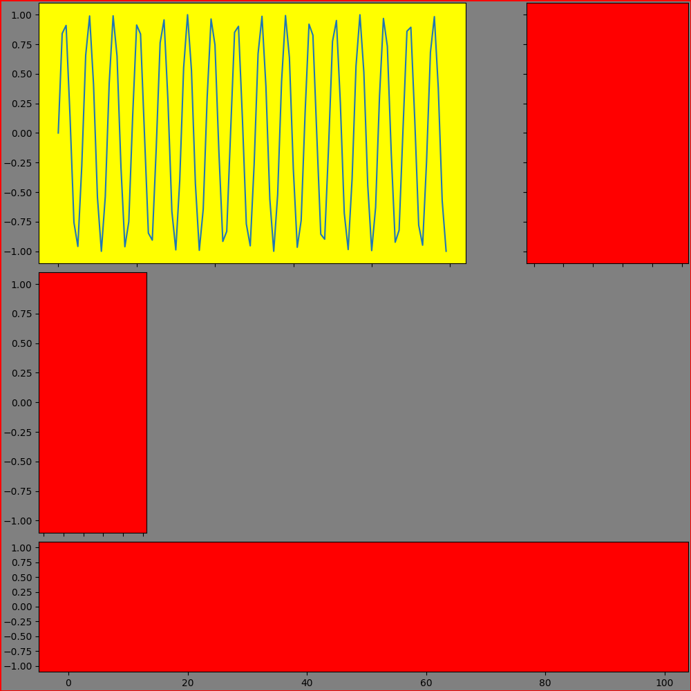{ width="50%" align="center"}

=== "plt.subplot_mosaic(mosaic)"

    [matplotlib.pyplot.subplot_mosaic — Matplotlib 3.10.1 documentation](https://matplotlib.org/stable/api/_as_gen/matplotlib.pyplot.subplot_mosaic.html#matplotlib.pyplot.subplot_mosaic)
    
    同上，但同时返回并激活一个Figure对象（可设置参数）
    
    ```Python title="plt.subplot_mosaic(mosaic)" linenums="1"
    mosaic = """
       AAB
       CDD
       EEE
    """
    # mosaic = "AAB;CDD;EEE"
    # mosaic = [["A", "A", "B"],
    #           ["C", "D", "D"],
    #           ["E", "E", "E"]]
    
    fig, ax_dict = plt.subplot_mosaic(mosaic,
                                      sharex=True,                                      # (1)!
                                      sharey=True,                                      # (2)!
                                      width_ratios=[0.2, 0.5, 0.3],                     # (3)!
                                      height_ratios=[0.4, 0.4, 0.2],                    # (4)!
                                      empty_sentinel="D",                               # (5)!
                                      subplot_kw={"facecolor": "red"},                  # (6)!
                                      per_subplot_kw={"A": {"facecolor": "yellow"}},    # (7)!
                                      gridspec_kw={"wspace": 0.1},                      # (8)!
    
                                      # Figure参数
                                      figsize=(10, 10),       
                                      dpi=100.0,             
                                      frameon=True,         
                                      facecolor='gray',       
                                      edgecolor='red',        
                                      linewidth=2.0          
                                      )
    ax = ax_dict['A']
    
    ax.plot(x, y)
    plt.show()
    ```

    1. 所有子图共享x轴
    2. 所有子图共享y轴
    3. 每列宽度比例，相当于gridspec_kw={"width_ratios": []}
    4. 每行高度比例，相当于gridspec_kw={"height_ratios": []}
    5. 留空标签，默认"."
    6. Axes全局参数
    7. Axes特定参数，优先级高于subplot_kw参数
    8. Gridspec参数
    
    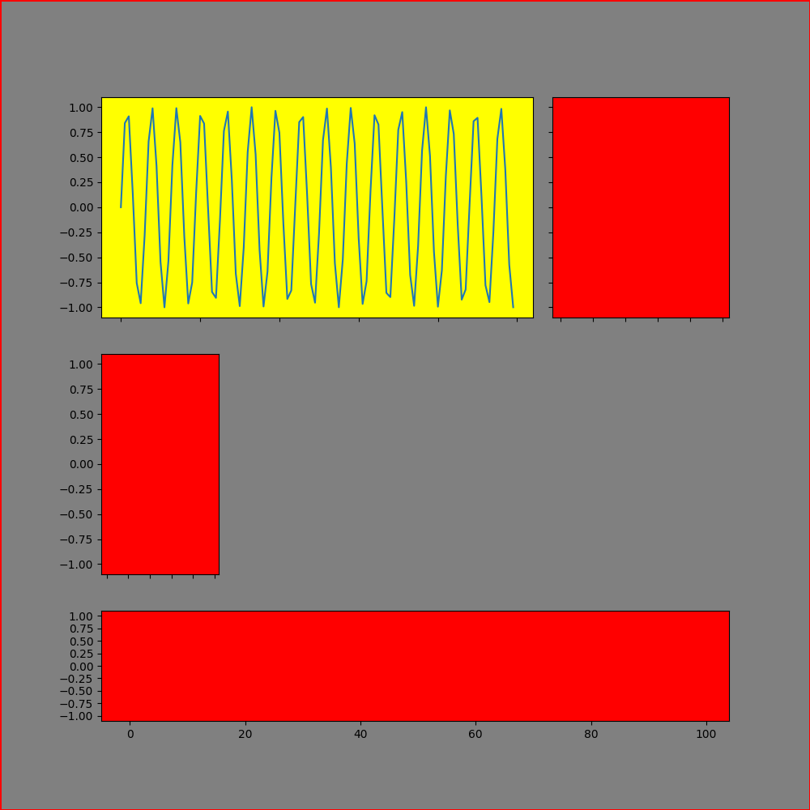{ width="50%" align="center"}

### 副子图添加

=== "axes_divider"

    [mpl_toolkits.axes_grid1.axes_divider.AxesDivider — Matplotlib 3.10.3 documentation](https://matplotlib.org/stable/api/_as_gen/mpl_toolkits.axes_grid1.axes_divider.AxesDivider.html)

    在原始Axes的给定侧（"top"、"right"、"bottom" 或 "left"）上创建一个新的 Axes，其高度或宽度与原始Axes相同。

    1.  **position**：新Axes相对于主Axes的位置。可选`"left"`, `"right"`, `"bottom"`, `"top"`。

    2.  **size**：新Axes的宽度或高度。

    3.  **pad**：Axes之间的填充。默认为主Axes宽度（对于左或右Axes）的`rcParams["figure.subplot.wspace"]`（默认：`0.2`）倍或主Axes高度（对于底或顶Axes）的`rcParams["figure.subplot.hspace"]`（默认：`0.2`）倍。

    `**kwargs`所有额外的关键字参数都会传递给创建的Axes。

    ```Python title="axes_divider" linenums="1"
    from mpl_toolkits.axes_grid1.axes_divider import make_axes_locatable
    
    fig = plt.figure(figsize=(8, 8), dpi=100, layout="constrained")
    ax = fig.add_subplot(1, 1, 1)
    
    ax_divider = make_axes_locatable(ax)
    ax1 = ax_divider.append_axes(position="right", size=2, pad=0.5)
    ax2 = ax_divider.append_axes(position="top", size=2, pad=0.5)
    
    plt.show()
    ```

    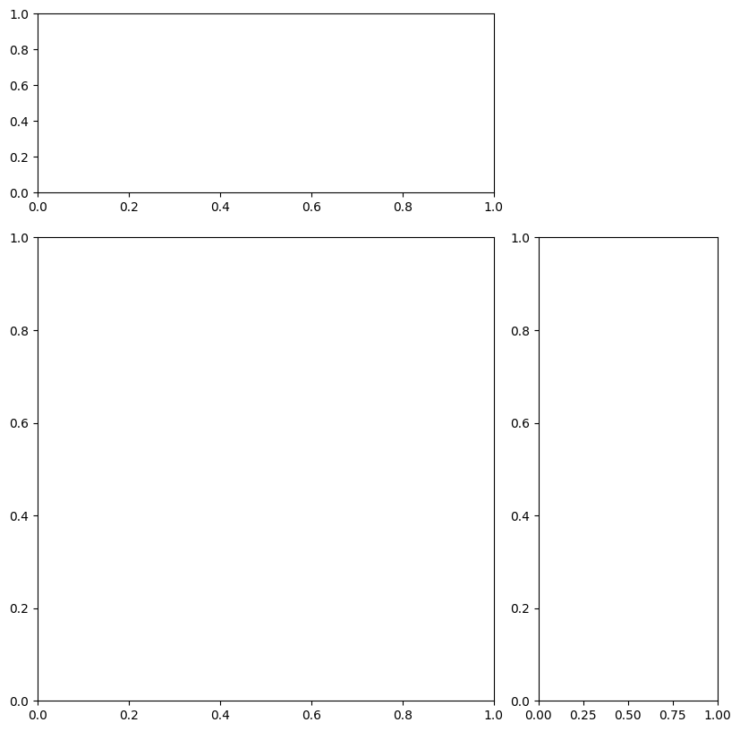{ width="50%" align="center"}

=== "inset_axes"

    [matplotlib.axes.Axes.inset_axes — Matplotlib 3.10.3 documentation](https://matplotlib.org/stable/api/_as_gen/matplotlib.axes.Axes.inset_axes.html)

    在原始Axes上创建一个新的 Axes。

    1.  **bounds**：[x0, y0, width, height]，新子图的左下角坐标及宽高。

    2.  **transform**：相对坐标系统。默认`ax.transAxes`。

    `**kwargs`所有额外的关键字参数都会传递给创建的Axes。
    
    ```Python title="inset_axes" linenums="1"
    fig = plt.figure(figsize=(8, 8), dpi=100, layout="constrained")
    ax = fig.add_subplot(1, 1, 1)
    
    ax1 = ax.inset_axes(bounds=(1.1, 0, 0.3, 1), transform=ax.transAxes)
    ax2 = ax.inset_axes(bounds=(0, 1.1, 1, 0.3), transform=ax.transAxes)
    
    plt.show()
    ```
    
    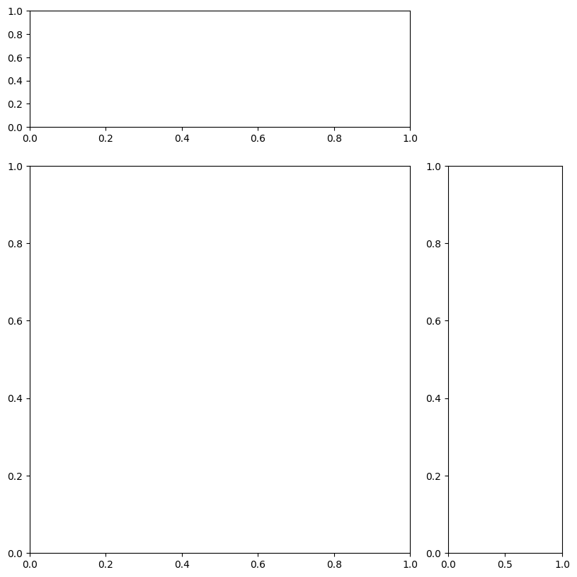{ width="50%" align="center"}

## Axes布局调整

[matplotlib.figure.Figure.subplots_adjust — Matplotlib 3.10.1 documentation](https://matplotlib.org/stable/api/_as_gen/matplotlib.figure.Figure.subplots_adjust.html)

[matplotlib.pyplot.subplots_adjust — Matplotlib 3.10.1 documentation](https://matplotlib.org/stable/api/_as_gen/matplotlib.pyplot.subplots_adjust.html)

```Python title="Axes布局调整" linenums="1"
fig.subplots_adjust(left=None, 
                    bottom=None, 
                    right=None, 
                    top=None, 
                    wspace=None, 
                    hspace=None)
```

## subfigure的设置

[matplotlib.figure.Figure.subfigures — Matplotlib 3.10.1 documentation](https://matplotlib.org/stable/api/_as_gen/matplotlib.figure.Figure.subfigures.html)

子图组的添加

```Python title="subfigure的设置" linenums="1"
subfigs = fig.subfigures(nrows=2,
                         ncols=2,
                         squeeze=True,                # (1)!
                         wspace=0.4,                  # (2)!
                         hspace=0.4,                  # (3)!
                         width_ratios=[0.4, 0.6],     # (4)!
                         height_ratios=[0.6, 0.4],    # (5)!

                         # Figure参数
                         facecolor='red',    
                         edgecolor='green',  
                         linewidth=2.0     
                         )
subfig0 = subfigs[0][0]
axes_array = subfig0.subplots(2, 2)
ax = axes_array[0][0]

ax.plot(x, y)
plt.show()
```

1. 取消返回的子图组数组的多余维度，若为False，则返回的子图组数组始终为二维数组
2. 列间隔（平均轴宽度百分比）
3. 行间隔（平均轴宽度百分比）
4. 每列宽度比例
5. 每行高度比例

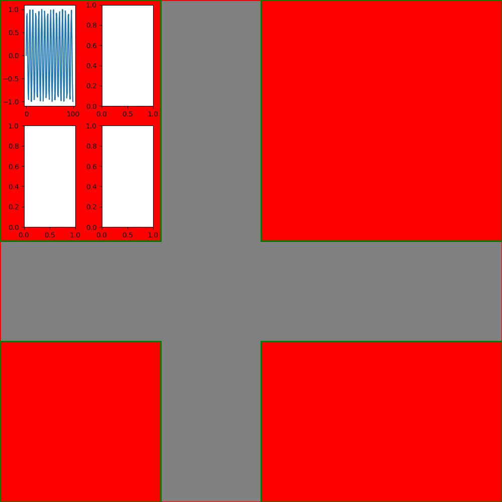{ width="50%" align="center"}