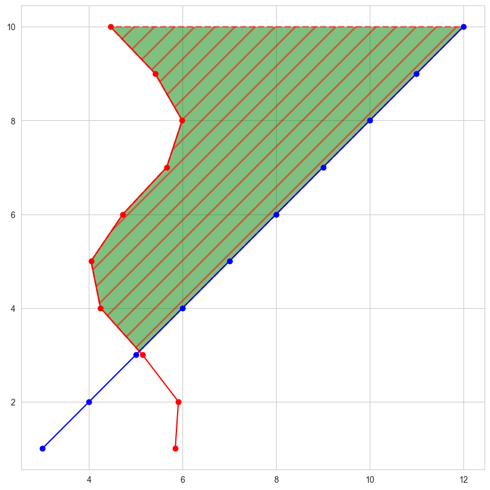

# 填充（Fill）

```Python title="导入模块与数据准备" linenums="1"
import matplotlib as mpl
import matplotlib.pyplot as plt
import seaborn as sns
import numpy as np

x = np.arange(1, 11, 1)
"""
[  1   2   3   4   5   6   7   8   9  10]
"""

y1 = np.sin(x) + 5
"""
[5.84147098 5.90929743 5.14112001 4.2431975 4.04107573 4.7205845 5.6569866 5.98935825 5.41211849 4.45597889]
"""

y2 = x+2
"""
[  3   4   5   6   7   8   9  10  11  12]
"""

y1<=y2
"""
[False False False True True True True True True True]
"""
```

## fill_between

[matplotlib.axes.Axes.fill_between — Matplotlib 3.10.1 documentation](https://matplotlib.org/stable/api/_as_gen/matplotlib.axes.Axes.fill_between.html)

`fill_between(x, y1, y2=0, where=None, interpolate=False, step=None, *, data=None, **kwargs)`

填充两个水平曲线之间的区域。曲线由点(x, y1)和(x, y2)定义。这会创建一个或多个多边形来描述填充区域。可以使用 `where`参数排除一些水平部分不进行填充。默认情况下，边缘将直接连接给定的点。

1. **x**：曲线节点的 x 坐标。

2. **y1**：第一条曲线节点的 y 坐标。

3. **y2**：第二条曲线节点的 y 坐标。默认为0。

4. **where**：定义要排除填充的一些水平区域的条件。填充区域由坐标`x[where]`定义。更确切地说，如果`where[i] and where[i+1]`，则填充`x[i]`和`x[i+1]`之间。请注意，此定义意味着在`where`中两个 False 值之间的孤立 True 值不会导致填充。由于相邻的 False 值，True 位置的两边保持未填充。

5. **interpolate**：此选项仅在`where`参数被使用且两条曲线相交时相关。从语义上讲，`where`参数通常用于 y1 > y2 或类似的情况。默认情况下，定义填充区域的多边形的节点将仅放置在 x 数组中的位置。这样的多边形无法在交点附近很好地描述上述语义。包含交点的 `x` 部分将简单地被裁剪。将`interpolate` 参数设置为 True 将计算实际的交点，并将填充区域扩展到这一点。

6. **step**：如果填充应该是阶梯函数，则定义`step`，即在 x 之间保持恒定。该值确定阶梯将发生的位置。

7. **data**：如果提供，以下参数也接受一个字符串`s` ，如果`s`是`data`中的键，则解释为`data[s]`：*x*, *y1*, *y2*, *where*

=== "不包括交点"

    ```Python title="不包括交点" linenums="1"
    fig = plt.figure(figsize=(8, 8), dpi=100, layout="constrained")
    ax = fig.add_subplot(1, 1, 1)
    
    ax.plot(x, y1, c='r', marker='o')
    ax.plot(x, y2, c='b', marker='o')
    
    ax.fill_between(x, y1, y2,
                    where=y1<=y2,
    
                    facecolor='g',
                    linestyle='--',
                    linewidth=2,
                    hatch='/',
                    hatch_linewidth=2,
                    edgecolor='r', 
                    alpha=0.5
                    )
    
    plt.show()
    ```
    
    { width="50%" align="center"}

=== "包括交点"

    ```Python title="包括交点" linenums="1"
    fig = plt.figure(figsize=(8, 8), dpi=100, layout="constrained")
    ax = fig.add_subplot(1, 1, 1)
    
    ax.plot(x, y1, c='r', marker='o')
    ax.plot(x, y2, c='b', marker='o')
    
    ax.fill_between(x, y1, y2,
                    where=y1<=y2,
                    interpolate=True,
    
                    facecolor='g',
                    linestyle='--',
                    linewidth=2,
                    hatch='/',
                    hatch_linewidth=2,
                    edgecolor='r', 
                    alpha=0.5
                    )
    
    plt.show()
    ```
    
    { width="50%" align="center"}

=== "step样式"

    ```Python title="step样式" linenums="1"
    fig = plt.figure(figsize=(8, 8), dpi=100, layout="constrained")
    ax = fig.add_subplot(1, 1, 1)
    
    ax.plot(x, y1, c='r', marker='o', ds='steps-pre')
    ax.plot(x, y2, c='b', marker='o', ds='steps-pre')
    
    ax.fill_between(x, y1, y2,
                    where=y1<=y2,
                    interpolate=True,
                    step='pre',
    
                    facecolor='g',
                    linestyle='--',
                    linewidth=2,
                    hatch='/',
                    hatch_linewidth=2,
                    edgecolor='r', 
                    alpha=0.5
                    )
    
    plt.show()
    ```
    
    { width="50%" align="center"}

## fill_betweenx

[matplotlib.axes.Axes.fill_betweenx — Matplotlib 3.10.1 documentation](https://matplotlib.org/stable/api/_as_gen/matplotlib.axes.Axes.fill_betweenx.html)

`fill_betweenx(y, x1, x2=0, where=None, step=None, interpolate=False, *, data=None, **kwargs)`

填充两条垂直曲线之间的区域。曲线由点 (y, x1)和 (y, x2)定义。这会创建一个或多个多边形来描述填充区域。其余同上。

```Python title="fill_betweenx" linenums="1"
fig = plt.figure(figsize=(8, 8), dpi=100, layout="constrained")
ax = fig.add_subplot(1, 1, 1)

ax.plot(y1, x, c='r', marker='o')
ax.plot(y2, x, c='b', marker='o')

ax.fill_betweenx(x, y1, y2,
                 where=y1<=y2,
                 interpolate=True,

                 facecolor='g',
                 linestyle='--',
                 linewidth=2,
                 hatch='/',
                 hatch_linewidth=2,
                 edgecolor='r', 
                 alpha=0.5
                 )

plt.show()
```

{ width="50%" align="center"}

## fill

[matplotlib.axes.Axes.fill — Matplotlib 3.10.1 documentation](https://matplotlib.org/stable/api/_as_gen/matplotlib.axes.Axes.fill.html)

`fill(*args, data=None, **kwargs)`

绘制填充多边形。每个多边形由其节点的 x 和 y 位置列表定义，可选地后跟颜色指定符。对于没有颜色指定符的多边形，使用标准颜色循环。可以通过提供多个 x, y, [颜色]组来绘制多个多边形。`**kwargs`其它参数传递给`Polygon`类。

```Python title="fill" linenums="1"
ax.fill(x, y)                    # a polygon with default color
ax.fill(x, y, "b")               # a blue polygon
ax.fill(x, y, x2, y2)            # two polygons
ax.fill(x, y, "b", x2, y2, "r")  # a blue and a red polygon
```

```Python title="fill" linenums="1"
fig = plt.figure(figsize=(8, 8), dpi=100, layout="constrained")
ax = fig.add_subplot(1, 1, 1)

ax.plot(x, y1, c='r', marker='o')

ax.fill(x, y1, closed=True,    # (1)!

        facecolor="g",
        linestyle="--",
        linewidth=2,
        hatch="/",
        hatch_linewidth=2,
        edgecolor="r",
        alpha=0.5
        )
ax.fill([2, 4, 4, 2], [4, 4, 4.25, 4.25])

plt.show()
```

1. 是否绘制封闭线

{ width="50%" align="center"}