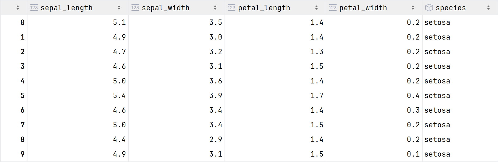
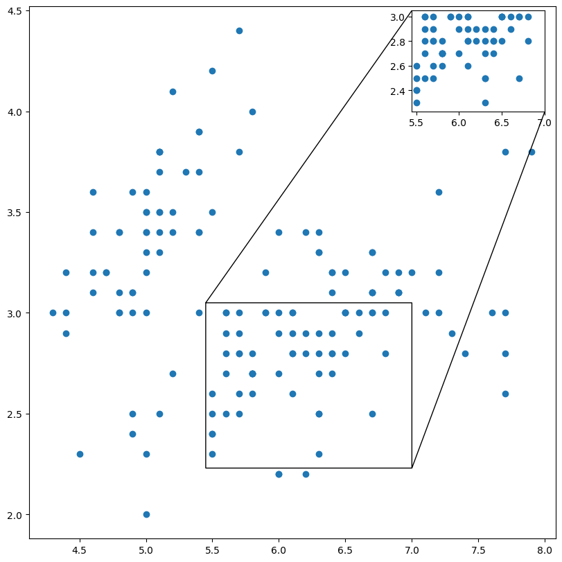

# 局部放大（indicate_inset_zoom）

[Zoom region inset Axes — Matplotlib 3.10.3 documentation](https://matplotlib.org/stable/gallery/subplots_axes_and_figures/zoom_inset_axes.html#sphx-glr-gallery-subplots-axes-and-figures-zoom-inset-axes-py)

[matplotlib.axes.Axes.indicate_inset_zoom — Matplotlib 3.10.3 documentation](https://matplotlib.org/stable/api/_as_gen/matplotlib.axes.Axes.indicate_inset_zoom.html)

[matplotlib.axes.Axes.indicate_inset — Matplotlib 3.10.3 documentation](https://matplotlib.org/stable/api/_as_gen/matplotlib.axes.Axes.indicate_inset.html)

[iris.csv](../../../Data/iris.csv)

{ width="50%" align="center"}

```Python title="导入模块和数据准备" linenums="1"
import matplotlib as mpl
import matplotlib.pyplot as plt
import seaborn as sns
import numpy as np
import pandas as pd

iris = pd.read_csv('../Data/iris.csv')
```

```Python title="局部放大" linenums="1" hl_lines="12"
fig = plt.figure(figsize=(8, 8), dpi=100, layout="constrained")

ax = fig.add_subplot(1, 1, 1)
ax.scatter(data=iris, x='sepal_length', y='sepal_width')

ax_zoom = ax.inset_axes(bounds=(7, 4, 1, 0.5), transform=ax.transData)
ax_zoom.scatter(data=iris, x='sepal_length', y='sepal_width')
ax_zoom.set_xlim(5.45, 7)
ax_zoom.set_ylim(2.23, 3.05)

# **kwargs其他关键字参数将传递给Rectangle类
ax.indicate_inset_zoom(inset_ax=ax_zoom, edgecolor="black", alpha=1)

plt.show()
```

{ width="50%" align="center"}