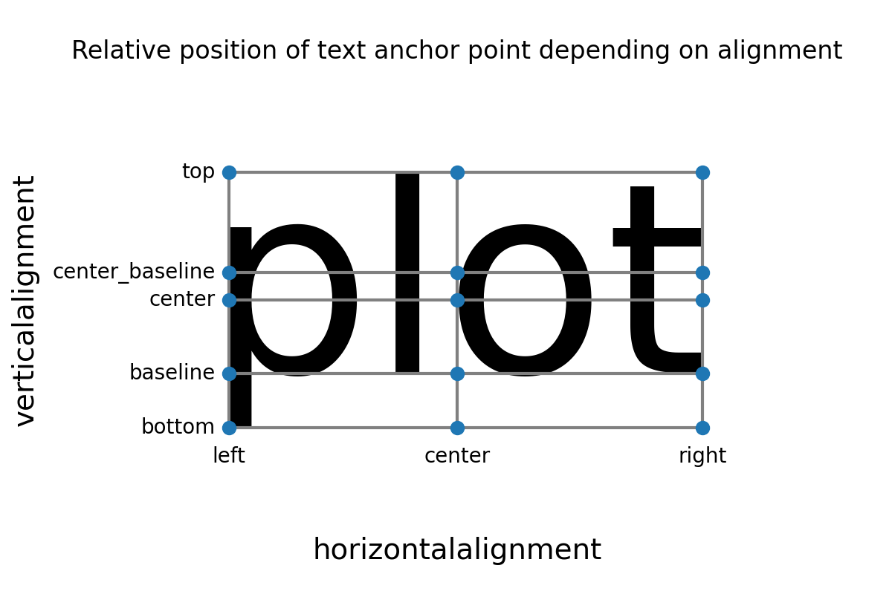

# 文本（Text）、注释（Annotate）、标题（Title）

[Text, labels and annotations — Matplotlib 3.10.1 documentation](https://matplotlib.org/stable/gallery/text_labels_and_annotations/index.html)

[Properties of Mark objects — seaborn 0.13.2 documentation](https://seaborn.pydata.org/tutorial/properties.html#text-properties)

```Python title="导入模块" linenums="1"
import matplotlib as mpl
import matplotlib.pyplot as plt
import numpy as np
```

## 属性

{ width="50%" align="center"}

{ width="50%" align="center"}

{ width="50%" align="center"}

{ width="50%" align="center"}

## 文本（Text）

[matplotlib.text — Matplotlib 3.10.1 documentation](https://matplotlib.org/stable/api/text_api.html#matplotlib.text.Text)

[matplotlib.axes.Axes.text — Matplotlib 3.10.1 documentation](https://matplotlib.org/stable/api/_as_gen/matplotlib.axes.Axes.text.html)

[matplotlib.figure.Figure.text — Matplotlib 3.10.1 documentation](https://matplotlib.org/stable/api/_as_gen/matplotlib.figure.Figure.text.html)

[matplotlib.pyplot.text — Matplotlib 3.10.1 documentation](https://matplotlib.org/stable/api/_as_gen/matplotlib.pyplot.text.html)

[Text — Matplotlib 3.10.1 documentation](https://matplotlib.org/stable/users/explain/text/index.html)

```Python title="文本（Text）" linenums="1"
fig = plt.figure(figsize=(8, 8), dpi=100, layout="constrained")
ax = fig.add_subplot(1, 1, 1)

ax.text(s="www.baidu.com\nwww.google.com$123\\bigotimes$",

        # 锚点位置
        x=0.4, y=0.6,
        transform=ax.transAxes,        # 坐标系统，可选Axes.transAxes, Axes.transData(Axes调用下默认), Figure.transFigure(Figure调用下默认)
        transform_rotates_text=False,  #？？？ transform的旋转是否影响文本方向

        # 对齐方式
        ha="left",                     # 相对于锚点的水平对齐方式(horizontalalignment/ha)： 可选"left"(默认), "right", "center"
        va="baseline",                 # 相对于锚点的垂直对齐方式(verticalalignment/va)：可选"baseline"(默认), 'bottom', 'center', 'center_baseline', 'top'
        ma="center",                   # 多行文本间对齐方式(multialignment/ma)： 可选'left'(默认), 'right', 'center'

        # 绕锚点旋转
        rotation_mode="anchor",        # 旋转模式： 可选None/'default'(先旋转后对齐), 'anchor'(先对齐后旋转)
        rotation=45,                   # 逆时针旋转度数（°）： 可选浮点数, 'horizontal'(0°), 'vertical'(90°)

        # 行间距
        linespacing=1,                 # 行间距（字体大小的倍数），默认1.2

        # 字体
        fontname="monospace",          # 字体名称(fontfamily/family/fontname)： 可选'serif', 'sans-serif', 'cursive', 'fantasy', 'monospace'
        fontsize=25,                   # 字体大小(fontsize/size)： 可选绝对大小(浮点数)或相对大小('xx-small', 'x-small', 'small', 'medium', 'large', 'x-large', 'xx-large')
        fontstretch="normal",          # 字体拉伸与压缩(fontstretch/stretch)： 可选0-1000, 'ultra-condensed', 'extra-condensed', 'condensed', 'semi-condensed', 'normal', 'semi-expanded', 'expanded', 'extra-expanded', 'ultra-expanded'
        fontstyle="italic",            # 字体样式(fontstyle/style)： 可选'normal', 'italic', 'oblique'
        fontvariant="normal",          # 字体变体(fontvariant/variant)： 可选'normal', 'small-caps'
        fontweight="bold",             # 字体粗细(fontweight/weight)： 可选0-1000, 'ultralight', 'light', 'normal', 'regular', 'book', 'medium', 'roman', 'semibold', 'demibold', 'demi', 'bold', 'heavy', 'extra bold', 'black'
        color="blue",                  # 字体颜色(color/c)
        backgroundcolor="yellow",      # 文本背景色，被bbox覆盖
        parse_math=True,               # 是否将$$中的文本解析为LabTex数学文本
        math_fontfamily="cm",          # LabTex数学文本字体： 可选'dejavusans'(默认), 'dejavuserif', 'cm', 'stix', 'stixsans', 'custom'
        alpha=1,                       # 透明度

        # 文本框(FancyBboxPatch)
        bbox={"boxstyle": "round, pad=0, rounding_size=0.5",
              
              "facecolor": "yellow",
              "linestyle": "--",
              "linewidth": 2,
              "hatch": "+",
              "hatch_linewidth": 2,
              "edgecolor": "red",
              "alpha": 0.5},

        # 其它参数
        wrap=False,                    #？？？ 是否自动换行以确保文本内容在图形内
        antialiased=False,             # 是否反锯齿渲染
        label=None,                    # 标签文本（用于图例绘制）
        gid=None,                      #？？？ group id
        visible=True,                  # 是否可见
        in_layout=True,                # 是否加入布局计算
        rasterized=False,              #？？？ 是否强制栅格化（bitmap）绘制以进行矢量图形输出
        zorder=None                    # 绘制优先级，值越低越优先，越在图层底
        )
ax.grid()

plt.show()
```

{ width="50%" align="center"}

## 注释（Annotate）

[matplotlib.text — Matplotlib 3.10.1 documentation](https://matplotlib.org/stable/api/text_api.html#matplotlib.text.Annotation)

[matplotlib.axes.Axes.annotate — Matplotlib 3.10.1 documentation](https://matplotlib.org/stable/api/_as_gen/matplotlib.axes.Axes.annotate.html)

[matplotlib.pyplot.annotate — Matplotlib 3.10.1 documentation](https://matplotlib.org/stable/api/_as_gen/matplotlib.pyplot.annotate.html)

[Annotations — Matplotlib 3.10.1 documentation](https://matplotlib.org/stable/users/explain/text/annotations.html#annotations)

[Annotation arrow style reference — Matplotlib 3.10.1 documentation](https://matplotlib.org/stable/gallery/text_labels_and_annotations/fancyarrow_demo.html)

=== "坐标系统字符串"

    | **坐标系统字符串**                |**含义**|
    |----------------------------|-|
    | `#!python 'figure points'` |从Figure左下角开始的点数|
    | `#!python 'figure pixels'`          |从Figure左下角开始的像素数|
    | `#!python 'figure fraction'`        |从Figure左下角开始的比例|
    | `#!python 'subfigure points'`       |从subFigure左下角开始的点数|
    | `#!python 'subfigure pixels'`       |从subFigure左下角开始的像素数|
    | `#!python 'subfigure fraction'`     |从subFigure左下角开始的比例|
    | `#!python 'axes points'`            |从Axes左下角开始的点数|
    | `#!python 'axes pixels'`            |从Axes左下角开始的像素数|
    | `#!python 'axes fraction'`          |从Axes左下角开始的比例|
    | `#!python 'data'`                   |使用数据坐标系统|
    | `#!python 'polar'`                  |使用极坐标系统|
    | `#!python 'offset points'`          |从xy参数偏移的点数（仅用于textcoords参数）|
    | `#!python 'offset pixels'`          |从xy参数偏移的像素数（仅用于textcoords参数）|
    | `#!python 'offset fontsize'`        |相对于字体大小，从xy参数偏移的量（仅用于textcoords参数）|

=== "Simple arrow"

    |**Simple arrow**|**含义**|
    |-|-|
    |`width`|箭身宽|
    |`headwidth`|箭头宽（以点为单位）|
    |`headlength`|箭头长（以点为单位）|
    |`shrink`|箭两端收缩的总长度比例|
    |?|其它任何 `FancyArrowPatch`属性|

=== "Fancy arrow"

    |**Fancy arrow**|**含义**|
    |-|-|
    |`relpos`|确切起始位置（相对于文本框的坐标元组），默认(0.5, 0.5)，即文本框中心|
    |`arrowstyle`|箭样式|
    |`connectionstyle`|连接样式|
    |`shrinkA`|起始收缩点数（默认2）|
    |`shrinkB`|末尾收缩点数（默认2）|
    |`patchA`|默认text的bounding box|
    |`patchB`|默认None|
    |`mutation_scale`|/|
    |`mutation_aspect`|/|
    |？|其它任何 `FancyArrowPatch`属性|

```Python title="注释（Annotate）" linenums="1"
fig = plt.figure(figsize=(8, 8), dpi=100, layout="constrained")
ax = fig.add_subplot(1, 1, 1)

ax.annotate(# 要注释的点
            xy=(1.2, 1.2),                 # 坐标
            xycoords="axes fraction",      # 参考坐标系： 默认'data',可选单个或二元元组形式(分别指定x和y)的字符串、Artist对象、Transform对象、可调用对象

            # 注释文本及位置
            text="www.baidu.com",
            xytext=(0.2, 0.2),             # 坐标： 默认等于xy参数
            textcoords="axes fraction",    # 参考坐标系： 默认同xycoords参数，可选单个或二元元组形式(分别指定x和y)的字符串、Artist对象、Transform对象、可调用对象

            # 文本Text参数
            fontsize=25,
            bbox={"boxstyle": "round, pad=0, rounding_size=0.5",
                  
                  "facecolor": "yellow",
                  "linestyle": "--",
                  "linewidth": 2,
                  "hatch": "+",
                  "hatch_linewidth": 2,
                  "edgecolor": "red",
                  "alpha": 0.5}, 

            # 箭与连接(FancyArrowPatch)： Simple arrow模式和Fancy arrow模式
            arrowprops={"relpos": (0.5, 1),
                        
                        "arrowstyle": "<|-|>, head_length=2, head_width=2",
                        "connectionstyle": "arc3, rad=0",
                        "shrinkA": 0,
                        "shrinkB": 0,
                        
                        "facecolor": "red",
                        "linestyle": "--",
                        "linewidth": 2,
                        "hatch": "/",
                        "hatch_linewidth": 2,
                        "edgecolor": "green",
                        "alpha": 0.5},
            annotation_clip=False           # 当要注释的点xy在Axes外时是否选择不绘制
            )
ax.grid()

plt.show()
```

{ width="50%" align="center"}

## 标题（Title）

### Figure标题（suptitle、supxlabel、supylabel）

[matplotlib.figure.Figure.suptitle — Matplotlib 3.10.1 documentation](https://matplotlib.org/stable/api/_as_gen/matplotlib.figure.Figure.suptitle.html)

[matplotlib.pyplot.suptitle — Matplotlib 3.10.1 documentation](https://matplotlib.org/stable/api/_as_gen/matplotlib.pyplot.suptitle.html)

[matplotlib.figure.Figure.supxlabel — Matplotlib 3.10.1 documentation](https://matplotlib.org/stable/api/_as_gen/matplotlib.figure.Figure.supxlabel.html)

[matplotlib.figure.Figure.supylabel — Matplotlib 3.10.1 documentation](https://matplotlib.org/stable/api/_as_gen/matplotlib.figure.Figure.supylabel.html)

```Python title="Figure标题（suptitle、supxlabel、supylabel）" linenums="1"
fig = plt.figure(figsize=(8, 8), dpi=100)
ax = fig.subplots(2, 2)

fig.suptitle(t="Suptitle", x=0.5, y=0.98,     # 标题文本及锚定点在Figure中的坐标

             # Text参数
             ha="center",                     # 相对于锚定点水平对齐方式(horizontalalignment/ha)： 可选'center'(默认), 'left', 'right'
             va="center",                     # 相对于锚定点垂直对齐方式(verticalalignment/va)： 可选'top'(默认), 'center', 'bottom', 'baseline'
             fontsize=20,                     # 字体大小rcParams["figure.titlesize"]：默认'large'
             fontweight="bold"                # 字体粗细rcParams["figure.titleweight"]：默认'normal'
             )
fig.supxlabel(t="Supxlabel", x=0.5, y=0.03,   # x轴标题文本及锚定点在Figure中的坐标

              # Text参数
              ha="center",                    # 相对于锚定点水平对齐方式(horizontalalignment/ha)： 可选'center'(默认), 'left', 'right'
              va="center",                    # 相对于锚定点垂直对齐方式(verticalalignment/va)： 可选'top', 'center', 'bottom'(默认), 'baseline'
              fontsize=20,                    # 字体大小rcParams["figure.labelsize"]：默认'large'
              fontweight="bold"               # 字体粗细rcParams["figure.labelweight"]：默认'normal'
              )
fig.supylabel(t="Supylabel", x=0.02, y=0.5,   # y轴标题文本及锚定点在Figure中的坐标

              # Text参数
              ha="center",                    # 相对于锚定点水平对齐方式(horizontalalignment/ha)： 可选'center', 'left'(默认), 'right'
              va="center",                    # 相对于锚定点垂直对齐方式(verticalalignment/va)： 可选'top', 'center'(默认), 'bottom', 'baseline'
              fontsize=20,                    # 字体大小rcParams["figure.labelsize"]：默认'large'
              fontweight="bold"               # 字体粗细rcParams["figure.labelweight"]：默认'normal'
              )

plt.show()
```

{ width="50%" align="center"}

### Axes标题（set_title、set_xlabel、set_ylabel）

[matplotlib.axes.Axes.set_title — Matplotlib 3.10.1 documentation](https://matplotlib.org/stable/api/_as_gen/matplotlib.axes.Axes.set_title.html)

[matplotlib.pyplot.title — Matplotlib 3.10.1 documentation](https://matplotlib.org/stable/api/_as_gen/matplotlib.pyplot.title.html)

[matplotlib.axes.Axes.set_xlabel — Matplotlib 3.10.1 documentation](https://matplotlib.org/stable/api/_as_gen/matplotlib.axes.Axes.set_xlabel.html)

[matplotlib.pyplot.xlabel — Matplotlib 3.10.1 documentation](https://matplotlib.org/stable/api/_as_gen/matplotlib.pyplot.xlabel.html)

[matplotlib.axes.Axes.set_ylabel — Matplotlib 3.10.1 documentation](https://matplotlib.org/stable/api/_as_gen/matplotlib.axes.Axes.set_ylabel.html)

[matplotlib.pyplot.ylabel — Matplotlib 3.10.1 documentation](https://matplotlib.org/stable/api/_as_gen/matplotlib.pyplot.ylabel.html)

```Python title="Axes标题（set_title、set_xlabel、set_ylabel）" linenums="1"
fig = plt.figure(figsize=(8, 8), dpi=100)
ax = fig.subplots(2, 2)

ax[0, 0].set_title(label="Title",       # 标题文本
                   loc="center",        # 相对于Axes的水平位置（优先于设置Text的x和ha参数）rcParams["axes.titlelocation"]： 可选'center'(默认), 'left', 'right'
                   y=None,              # 标题的垂直Axes位置rcParams["axes.titley"]
                   pad=6,               # 相对于Axes顶部的垂直偏移点数 rcParams["axes.titlepad"]： 默认6

                   # Text参数
                   fontsize=15,
                   fontweight="bold"
                   )
ax[0, 0].set_xlabel(xlabel="X",         # x轴文本
                    loc="center",       # 相对于Axes的水平位置（优先于设置Text的x和ha参数）rcParams["xaxis.labellocation"]： 可选'center'(默认), 'left', 'right'
                    labelpad=4,         # 相对于x轴（包括刻度和刻度标签）的垂直偏移点数rcParams["axes.labelpad"]： 默认4

                    # Text参数
                    fontsize=15,
                    fontweight="bold"
                    )
ax[0, 0].set_ylabel(ylabel="Y",         # y轴文本
                    loc="center",       # 相对于Axes的垂直位置（优先于设置Text的y和ha参数）rcParams["yaxis.labellocation"]： 可选'center'(默认), 'bottom', 'top'
                    labelpad=4,         # 相对于y轴（包括刻度和刻度标签）的水平偏移点数rcParams["axes.labelpad"]： 默认4

                    # Text参数
                    fontsize=15,
                    fontweight="bold"
                    )

plt.show()
```

{ width="50%" align="center"}

## 自动文本调整（adjustText）

[Welcome to the documentation for adjustText! — adjustText  documentation](https://adjusttext.readthedocs.io/en/latest/)

