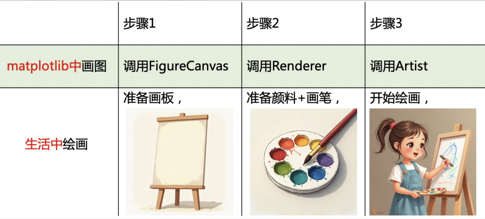
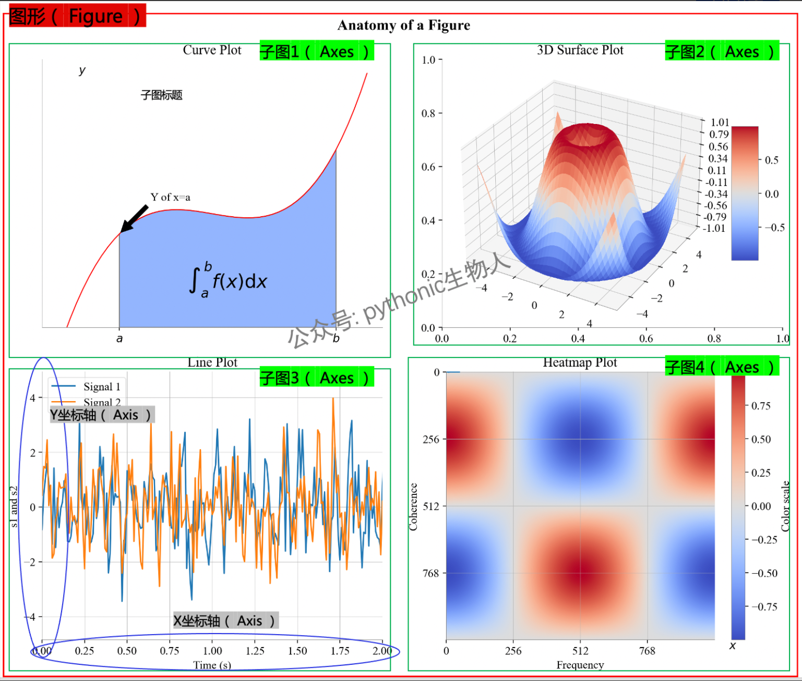
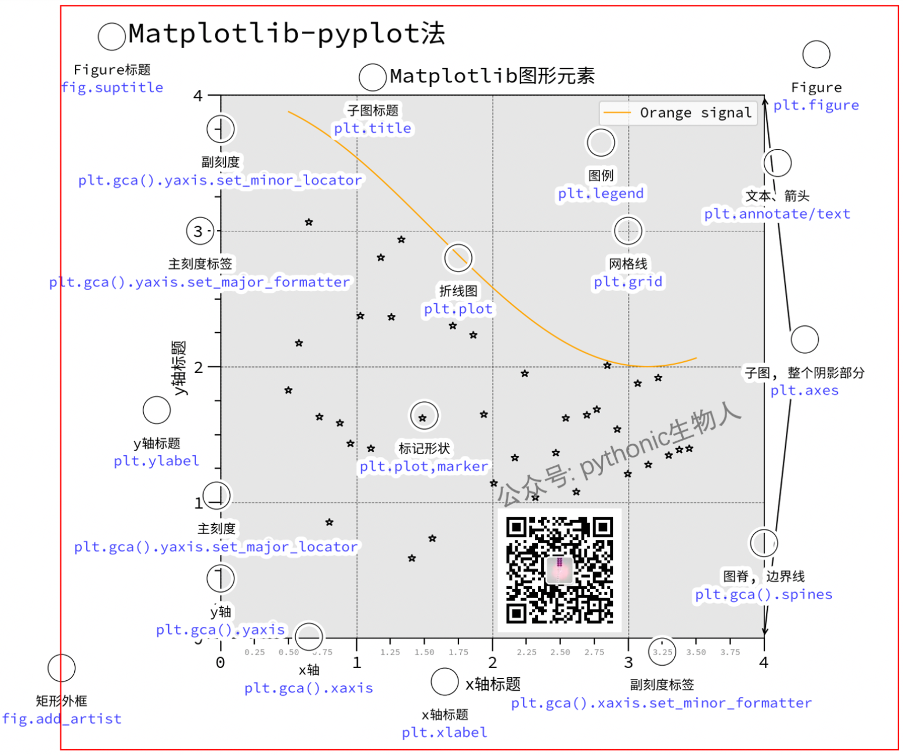
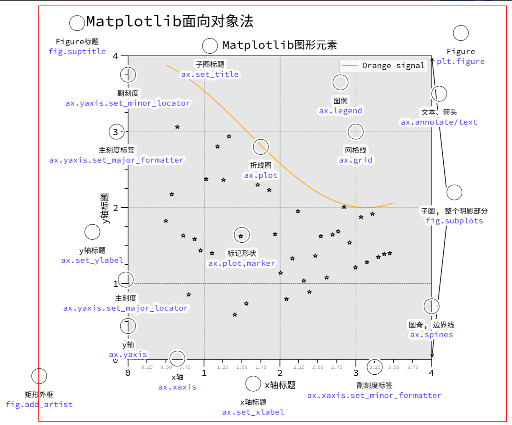
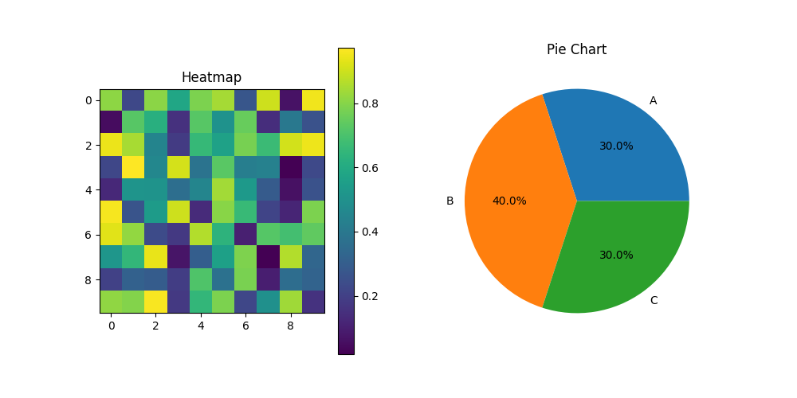
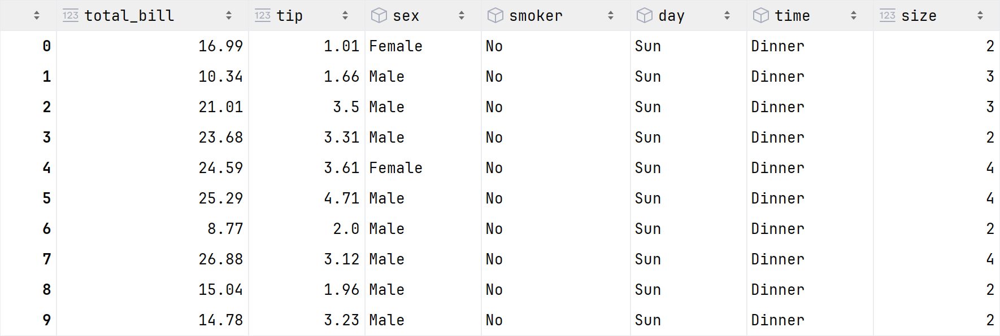
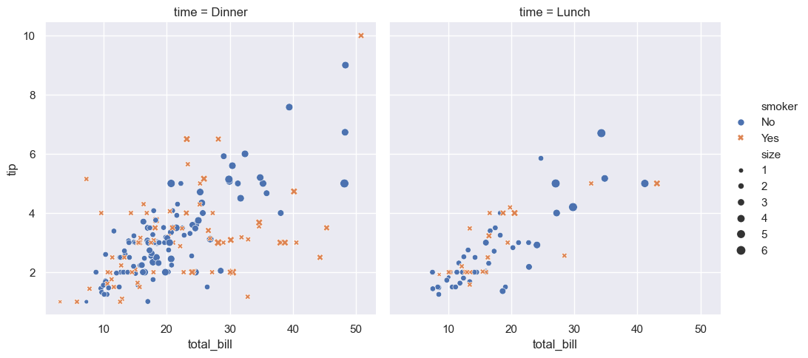
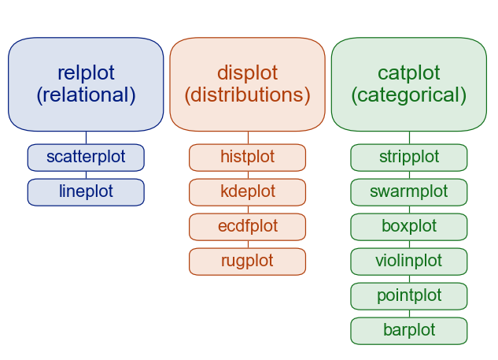

# 简介

## Matplotlib

### 绘图逻辑

{ width="80%" }

### 绘图元素（Artist）

#### 基础类（Primitive Artist）

用来构成图形的基础元素，比如线条、图例、标题、标签、文本注释等。

#### 容器类（Container Artist）

用来管理和组织多个基础类绘图元素，例如图形（Figure）、子图（Axes）和坐标轴（Axis）等。一般用法是：创建一个图形（Figure），使用该图形（Figure）创建一个或多个子图（Axes），并使用子图（Axes）的方法来创建基础类绘图元素。

{ width="80%" }

1.  **图形（Figure）**

    图形（Figure）指整张图，即上图红色框部分，可设置整张图的分辨率（dpi），长宽（figsize）、标题（title）等特征。Figure可包含多个子图（Axes），上面的Figure中包含4个子图（Axes）。

2.  **子图（Axes）**

    子图（Axes）可能是matplotlib中最重要的元素，即上图绿色框部分，以上图中子图3为例，该Axes包含绿框中用于绘制数据的区域、图形Line plot、两个坐标轴（Axis）、标题（x、y轴标题、子图标题）等。

3.  **坐标轴（Axis）**

    坐标轴（Axis）用于设置数据的比例和范围，并生成刻度和刻度标签（标注刻度的字符串），即上图中子图3的蓝色框部分。

### 绘图方法

<div style="overflow-x:auto;">
<table class="data-table">
  <caption>隐式 vs 显式</caption>
  <thead>
    <tr>
      <th data-sort-method='none' colspan="2"></th>
      <th data-sort-method='none'>隐式</th>
      <th data-sort-method='none'>显式</th>
    </tr>
  </thead>
  <tbody>
    <tr>
      <td rowspan=4>优点</td>
      <td>控制和灵活性</td>
      <td>代码简洁，适合快速绘图</td>
      <td>提供精确的控制和灵活性，适用于复杂布局和定制</td>
    </tr>
    <tr>
      <td>代码结构</td>
      <td>易于上手，初学者友好</td>
      <td>代码结构清晰，易于维护和扩展</td>
    </tr>
    <tr>
      <td>兼容性</td>
      <td>适用于简单情境</td>
      <td>更好地与其他库（如seaborn、pandas)兼容</td>
    </tr>
    <tr>
      <td>支持复杂布局</td>
      <td></td>
      <td>支持复杂的图形布局，如gridspec和subplots</td>
    </tr>
    <tr>
      <td rowspan=3>缺点</td>
      <td>代码复杂度</td>
      <td>控制和灵活性较差，难以进行复杂自定义</td>
      <td>代码较为繁琐，尤其是在简单图形中</td>
    </tr>
    <tr>
      <td>学习曲线</td>
      <td></td>
      <td>学习曲线较陡，需要理解和掌握Axes对象的使用</td>
    </tr>
    <tr>
      <td>多图形管理</td>
      <td>难以管理多个图形和子图对象</td>
      <td>对于复杂图形和多个图形的管理较为复杂</td>
    </tr>
  </tbody>
</table>
</div>

=== "隐式"
    #### 隐式（implicit，function-based）
    
    基于函数的隐式方法：使用`matplotlib.pyplot`。使用隐式时，只需要简单
    地调用一个函数，其他的设置或管理是自动完成的，程序隐
    藏了复杂的操作细节，简单快捷。
    
    该方法中，通过`plt.figure`和`plt.subplot`自动隐式的创建Figure和Axes，绘图函数直接作用于当前激活的Figure和Axes，持续跟踪当前的Figure和Axes，具有实效性。
    
    适用于快速绘制简单图形，代码简洁易懂，但在需要精细控制和复杂布局时可能不够灵活。
    
    { width="80%" }
    
    ```Python title="隐式（implicit，function-based）" linenums="1"
    import matplotlib.pyplot as plt
    import numpy as np
    
    """
    隐式创建并激活一个Figure
    在隐式接口中，虽然没有返回具体的Figure对象，但pyplot会自动管理当前Figure
    """
    plt.figure(figsize=(10, 5))
    
    """
    隐式创建并激活第1个子图（Axes），准备在此子图上绘制heatmap图
    此处heatmap图所在的Axes被激活只能修改heatmap图的坐标轴、标题、标签等
    """
    plt.subplot(1, 2, 1)                 # (1)!
    data = np.random.random((10, 10))    # (2)!
    plt.imshow(data, cmap='viridis')
    plt.colorbar()
    plt.title("Heatmap")
    
    
    """
    隐式创建并激活第2个子图（Axes），准备在此新子图上绘制Pie图
    此处pie图所在的Axes被激活只能修改pie图的坐标轴、标题、标签等，不能再修改上面heatmap图的坐标轴、标题、标签等。
    """
    plt.subplot(1, 2, 2)                 # (3)!
    plt.pie([30, 40, 30], labels=["A", "B", "C"], autopct='%1.1f%%')
    plt.title("Pie Chart")
    
    """
    展示Figure
    """
    plt.show()
    ```

    1. 该子图在Figure的1行2列中的第1列
    2. 随机生成10 x 10的二维数组
    3. 该子图在Figure的1行2列中的第2列

=== "显式"
    #### 显式（explicit，object-based）
    
    面向对象的显式方法：主要使用`matplotlib.figure.Figure`和`matplotlib.axes.Axes`。使用显式时，需要明
    确地指定每一步操作，需要手动编写每一步操作的代码，设
    置所有的参数，控制全面但麻烦。
    
    该方法中，画图函数不再受到当前活动的Figure和Axes的限制，而变成了显式的Figure和Axes的方法，可以直接随处对它们进行操作，Figure和Axes不具有实效性。
    
    适用于需要精确控制和复杂布局图形的场景，提供更高的灵活性和可维护性。
    
    { width="80%" }
    
    ```Python title="显式（explicit，object-based）" linenums="1"
    import matplotlib.pyplot as plt
    import numpy as np
    
    """
    显式创建并激活一个Figure对象fig
    显式创建并激活两个Axes对象，ax1和ax2
    """
    fig, (ax1, ax2) = plt.subplots(1,2, figsize=(10, 5))
    
    """
    在ax1上创建Heatmap图
    """
    data = np.random.random((10, 10))
    im = ax1.imshow(data, cmap='viridis')
    fig.colorbar(im, ax=ax1)
    ax1.set_title("Heatmap")
    
    """
    在ax2上绘制Pie图
    """
    ax2.pie([30, 40, 30], labels=["A", "B", "C"], autopct='%1.1f%%')
    ax2.set_title("Pie Chart")
    
    """
    展示Figure
    """
    plt.show()
    ```

{ width="80%" }

## Seaborn

[An introduction to seaborn — seaborn 0.12.2 documentation](https://seaborn.pydata.org/tutorial/introduction.html)


Seaborn 是一个用于在 Python 中制作统计图形的库。它建立在 matplotlib 之上，并与 pandas 数据结构紧密集成。

Seaborn 帮助探索和理解数据。其绘图函数作用于包含整个数据集的数据框和数组，并在内部执行必要的语义映射和统计聚合，以生成信息丰富的图表。其面向数据集的声明性 API 让用户专注于图表的不同元素代表什么，而不是如何绘制它们的细节。

[tips.csv](../../../Data/tips.csv)

{ width="80%" }

```Python title="示例" linenums="1"
# 导入模块
import seaborn as sns
import pandas as pd

# 应用默认主题
sns.set_theme()

# 加载数据集
tips = pd.read_csv("../Data/tips.csv")

# 可视化
sns.relplot(
    data=tips,
    x="total_bill", y="tip", col="time",
    hue="smoker", style="smoker", size="size",
)

# 展示
plt.show()
```


{ width="80%" }

### 绘图函数

#### 架构层面

{ width="80%" }

大部分情况下，figure-levelz和axes-level函数功能非常相似，但也存在一些差异，例如，figure-level中图例被放置在图形之外，axes-level中则将图例被放置在图形之内

1.  **图级别绘图函数(figure-level)**

    figure-level绘图函数将数据绘制在`seaborn.axisgrid.FacetGrid`对象上，此类函数拥有区别于matplotlib rcParams中的参数，每个figure-level绘图函数都提供了统一的axes-level接口，kind参数设置。

    figure-level多子图绘制很便捷，但是，如果想单独设置某个子图就不够灵活。

    figure-level拥有很多区别于matplotlib rcParamst中的有用参数，这些参数seaborn独有，从全局设置图形，全局个性化是在`seaborn.axisgrid.FacetGrid`对象上设置。

2.  **轴级别绘图函数（axes-level)**

    axes-level绘图函数是将数据绘制在`matplotlib.pyplot.Axes`对象上，此类函数可以直接使用matplotlib rcParams中的参数。

    axes-level也可以绘制多子图，需要通过参数ax指定子图，seaborn内部调用`matplotlib.pyplot.gca()`激活当前子图为需要绘图的对象。效果类似figure-level绘制多子图，但是，axes-level代码量大大增加。相比于figure-level,axes-level更擅长每个子图的个性化。

#### 功能层面

1.  **美化函数(aesthetics)**

    美化图形比例尺度(the scaling of plot elements)、图形风格(the general style of the plots)、图形配色(the color palette/colormap)。

2.  **单个图函数**

    绘制相关关系图(Relational plots)、分布关系图(Distribution plots)、分类关系图(Categorical plots)、回归关系图(Regression plots)、矩阵关系图(Matrix plots)、统计估计和误差棒(Statistical estimation and error bars)。

3.  **组合图函数**

    同时展示多个子图表或图形，以便进行比较或展示相关信息。包含分面图(Facet grids)、配对关系图(Pair grids)、组合关系图(Joint grids)。


