# 线（Line）与标记（Marker）

[matplotlib.lines.Line2D — Matplotlib 3.10.1 documentation](https://matplotlib.org/stable/api/_as_gen/matplotlib.lines.Line2D.html)

```Python title="导入模块与数据准备" linenums="1"
import matplotlib as mpl
import matplotlib.pyplot as plt
import numpy as np

x = np.arange(1, 51, 1)
"""
[ 1  2  3  4  5  6  7  8  9 10 11 12 13 14 15 16 17 18 19 20 21 22 23 24 25 26 27 28 29 30 31 32 33 34 35 36 37 38 39 40 41 42 43 44 45 46 47 48 49 50]
"""

y = np.sin(x)
"""
[ 0.84147098  0.90929743  0.14112001 -0.7568025  -0.95892427 -0.2794155  0.6569866   0.98935825  0.41211849 -0.54402111 -0.99999021 -0.53657292  0.42016704  0.99060736  0.65028784 -0.28790332 -0.96139749 -0.75098725  0.14987721  0.91294525  0.83665564 -0.00885131 -0.8462204  -0.90557836 -0.13235175  0.76255845  0.95637593  0.27090579 -0.66363388 -0.98803162 -0.40403765  0.55142668  0.99991186  0.52908269 -0.42818267 -0.99177885 -0.64353813  0.29636858  0.96379539  0.74511316 -0.15862267 -0.91652155 -0.83177474  0.01770193  0.85090352  0.90178835  0.12357312 -0.76825466 -0.95375265 -0.26237485]
"""
```

## 线型（Line Style）

[Linestyles — Matplotlib 3.10.1 documentation](https://matplotlib.org/stable/gallery/lines_bars_and_markers/linestyles.html)

### 字符串型

`#!python linestyle=""`

```Python title="字符串型" linenums="1"
from matplotlib.lines import Line2D
Line2D.lineStyles
"""
{'-': '_draw_solid', '--': '_draw_dashed', '-.': '_draw_dash_dot', ':': '_draw_dotted', 
 'None': '_draw_nothing', ' ': '_draw_nothing', '': '_draw_nothing'}
"""
```

|**字符串**|**含义**||
|-|-|-|
|**"solid" / "-"**|实线(——)||
|**"dotted" / ":"**|点线(·········)|`rcParams["lines.dotted_pattern"]=[1.0, 1.65]`|
|**"dashed" / "--"**|虚线(-----)|`rcParams["lines.dashed_pattern"]=[3.7, 1.6]`|
|**"dashdot" / "-."**|点划线(·-·-·-·)|`rcParams["lines.dashdot_pattern"]=[6.4, 1.6, 1.0, 1.6]`|

=== "linestyle"

    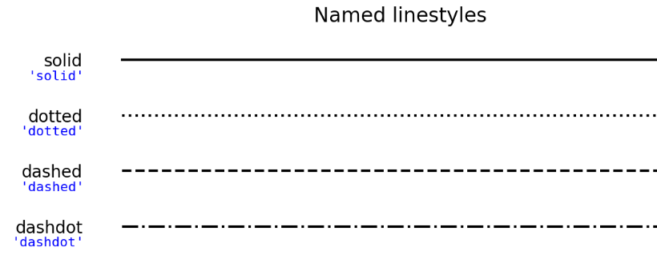{ width="50%" align="center"}

=== "capstyle"

    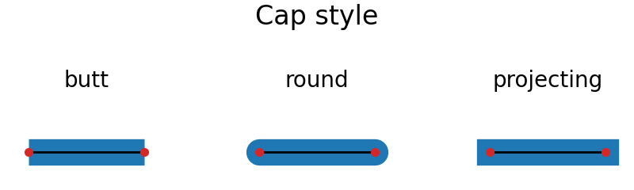{ width="50%" align="center"}

=== "joinstyle"
    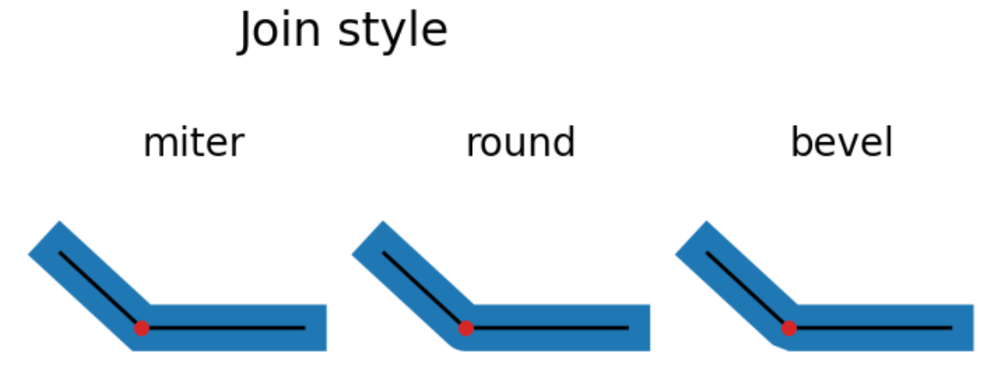{ width="50%" align="center"}

---

=== "常规"

    ```Python title="常规" linenums="1"
    fig = plt.figure(figsize=(8, 8), dpi=100, layout="constrained")
    ax = fig.add_subplot(1, 1, 1)
   
    ax.plot(x, y,
            linestyle="dashdot",  # (1)!
            linewidth=4,          # (2)!
            color="green",        # (3)!
            gapcolor="red",       # (4)!
            alpha=0.5             # (5)!
            )
   
    plt.show()
    ```

    1. 线型(linestyle/ls)
    2. 线宽(linewidth/lw)
    3. 可见线段填充色(color/c)
    4. 不可见线段填充色
    5. 透明度
   
    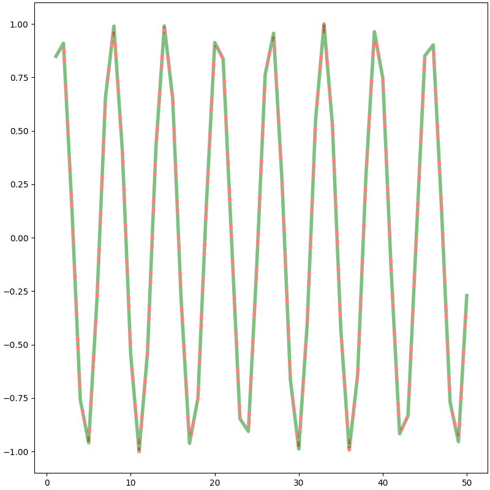{ width="50%" align="center"}

=== "linestyle='solid'"

    ```Python title="linestyle='solid'" linenums="1" hl_lines="9-10"
    fig = plt.figure(figsize=(8, 8), dpi=100, layout="constrained")
    ax = fig.add_subplot(1, 1, 1)
   
    ax.plot(x, y,
            linestyle="solid",
            linewidth=10,
            color="green",
            gapcolor="red",
            solid_capstyle="butt",      # (1)!
            solid_joinstyle="miter",    # (2)!
            alpha=0.5
            )
   
    plt.show()
    ```

    1. 当linestyle="solid"时，两个端点的样式
    2. 当linestyle="solid"时，连接点（转折点）的样式
   
    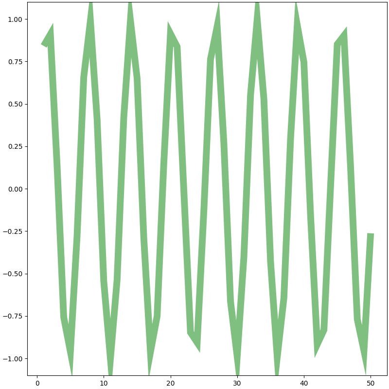{ width="50%" align="center"}

=== "linestyle≠'solid'"

    ```Python title="linestyle≠'solid'" linenums="1" hl_lines="9-10"
    fig = plt.figure(figsize=(8, 8), dpi=100, layout="constrained")
    ax = fig.add_subplot(1, 1, 1)

    ax.plot(x, y,
            linestyle="dashdot",
            linewidth=10,
            color="green",
            gapcolor="red",
            dash_capstyle="round",      # (1)!
            dash_joinstyle="miter",     # (2)!
            alpha=0.5
            )

    plt.show()
    ```

    1. 当linestyle≠"solid"时，每个线段端点的样式
    2. 当linestyle≠"solid"时，每个线段连接点（转折点）的样式

    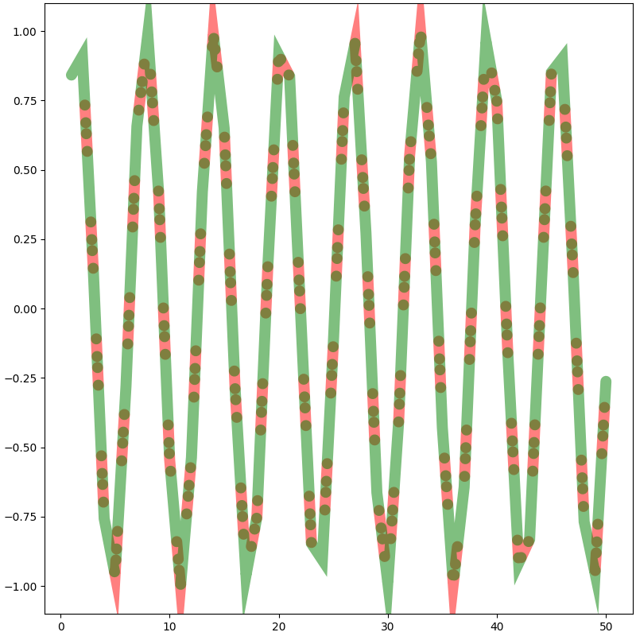{ width="50%" align="center"}

### 元组型

=== "linestyle=(offset, on_off_seq)"

    `#!python linestyle=(offset, on_off_seq)`

    1. **offset**：在构建的线型上开始的偏移量（以点为单位）

    2. **on_off_seq**：通过序列构建线型。若序列长度为偶数，则偶数位(0开始)代表可见线段长度（以点为单位），奇数位表示不可见线段的长度（以点为单位）；若序列长度为奇数，则序列扩增为2倍【即(3, 1, 1) 相当于 (3, 1, 1, 3, 1, 1)】

    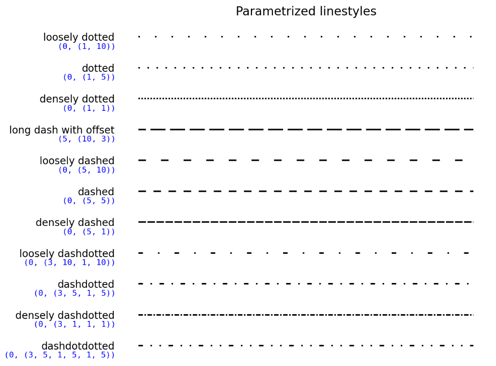{ width="50%" align="center"}

    ```Python title="linestyle=(offset, on_off_seq)" linenums="1" hl_lines="6"
    fig = plt.figure(figsize=(8, 8), dpi=100, layout="constrained")
    ax = fig.add_subplot(1, 1, 1)
   
    # 构建5可见1不可见的线型，第一段偏移量为4，所以第一段仅为1可见1不可见
    ax.plot(x, y,
            linestyle=(4, (5, 1)),
            linewidth=4,
            color="green",
            gapcolor="red",
            alpha=0.5
            )
   
    plt.show()
    ```
   
    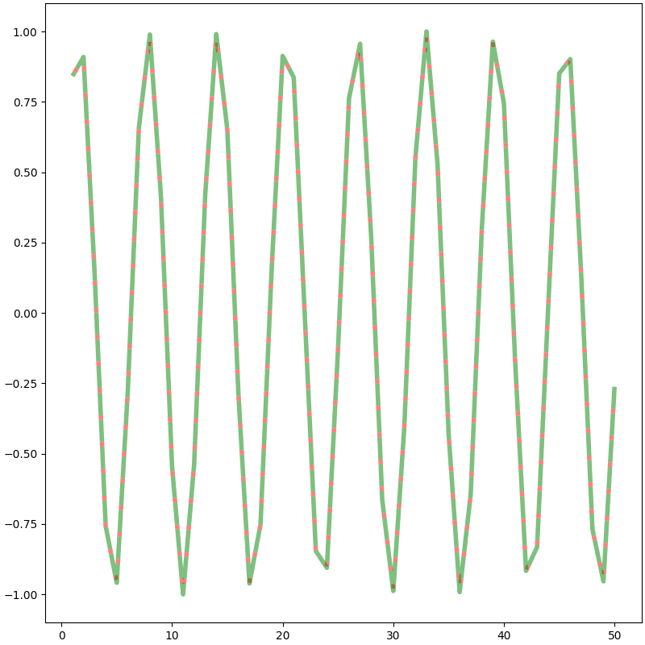{ width="50%" align="center"}

=== "dashes=(on_off_seq)"

    `#!python dashes=(on_off_seq)`

    ```Python title="dashes=(on_off_seq)" linenums="1" hl_lines="6"
    fig = plt.figure(figsize=(8, 8), dpi=100, layout="constrained")
    ax = fig.add_subplot(1, 1, 1)

    # 构建5可见1不可见的线型
    ax.plot(x, y,
            dashes=(5, 1), 
            linewidth=4,
            color="green",
            gapcolor="red",
            alpha=0.5
            )

    plt.show()
    ```

    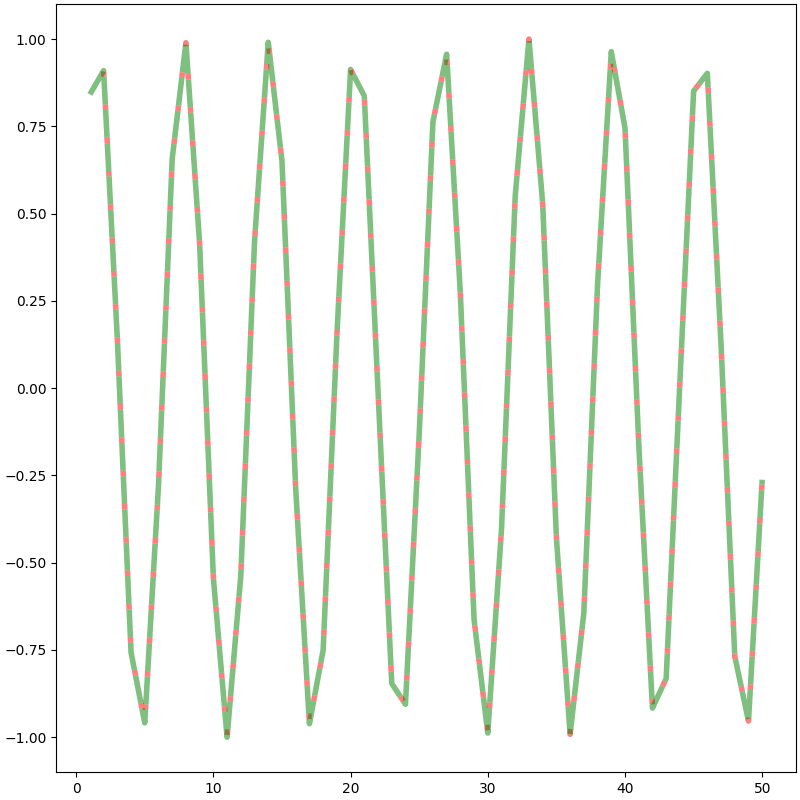{ width="50%" align="center"}

## 标记（Marker）

[matplotlib.markers — Matplotlib 3.7.1 documentation](https://matplotlib.org/stable/api/markers_api.html#module-matplotlib.markers)

[Marker examples — Matplotlib 3.10.1 documentation](https://matplotlib.org/stable/gallery/lines_bars_and_markers/scatter_star_poly.html)

[Mapping marker properties to multivariate data — Matplotlib 3.10.1 documentation](https://matplotlib.org/stable/gallery/lines_bars_and_markers/multivariate_marker_plot.html)

```Python title="标记（Marker）" linenums="1"
from matplotlib.lines import Line2D
Line2D.markers
"""
{'.': 'point', ',': 'pixel', 'o': 'circle', 'v': 'triangle_down', '^': 'triangle_up', 
 '<': 'triangle_left', '>': 'triangle_right', '1': 'tri_down', '2': 'tri_up', '3': 'tri_left', 
 '4': 'tri_right', '8': 'octagon', 's': 'square', 'p': 'pentagon', '*': 'star', 
 'h': 'hexagon1', 'H': 'hexagon2', '+': 'plus', 'x': 'x', 'D': 'diamond', 
 'd': 'thin_diamond', '|': 'vline', '_': 'hline', 'P': 'plus_filled', 'X': 'x_filled', 
 0: 'tickleft', 1: 'tickright', 2: 'tickup', 3: 'tickdown', 4: 'caretleft', 
 5: 'caretright', 6: 'caretup', 7: 'caretdown', 8: 'caretleftbase', 9: 'caretrightbase', 
 10: 'caretupbase', 11: 'caretdownbase', 'None': 'nothing', 'none': 'nothing', ' ': 'nothing', '': 'nothing'}
"""
```

### 未填充型（Unfilled markers）

[Marker reference — Matplotlib 3.10.1 documentation](https://matplotlib.org/stable/gallery/lines_bars_and_markers/marker_reference.html#unfilled-markers)

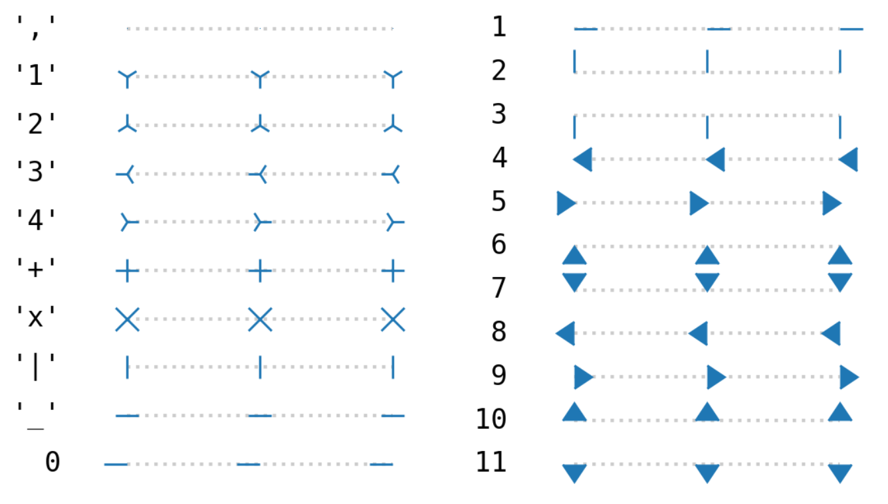{ width="50%" align="center"}

```Python title="未填充型（Unfilled markers）" linenums="1"
fig = plt.figure(figsize=(8, 8), dpi=100, layout="constrained")
ax = fig.add_subplot(1, 1, 1)

ax.plot(x, y,
        marker=4,                   # (1)!
        markersize=25,              # (2)!
        markerfacecolor="red",      # (3)!
        markeredgecolor="green",    # (4)!
        markeredgewidth=2,          # (5)!
        markevery=None,             # (6)!
        alpha=1
        )

plt.show()
```

1. 标记类型
2. 标记大小(markersize/ms)
3. 标记填充色(markerfacecolor/mfc)
4. 标记边缘色(markeredgecolor/mec)
5. 标记边缘宽度(markeredgewidth/mew)
6. 决定每隔几个绘制一个标记点，默认所有

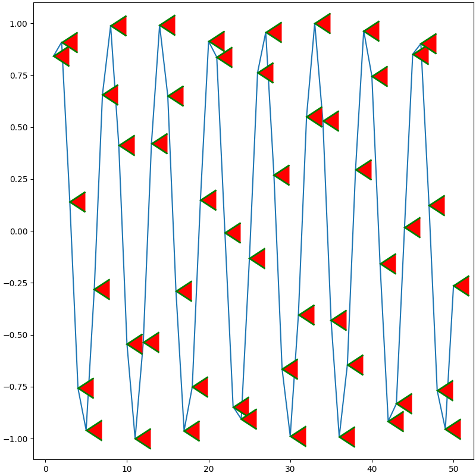{ width="50%" align="center"}

### 填充型（Filled markers）与填充样式（Fill Style）

[Marker reference — Matplotlib 3.10.1 documentation](https://matplotlib.org/stable/gallery/lines_bars_and_markers/marker_reference.html#filled-markers)

[Marker reference — Matplotlib 3.10.1 documentation](https://matplotlib.org/stable/gallery/lines_bars_and_markers/marker_reference.html#marker-fill-styles)

=== "填充型（Filled markers）"
    ```Python title="填充型（Filled markers）" linenums="1"
    from matplotlib.lines import Line2D
    Line2D.filled_markers
    """
    ('.', 'o', 'v', '^', '<', '>', '8', 's', 'p', '*', 'h', 'H', 'D', 'd', 'P', 'X')
    """
    ```
   
    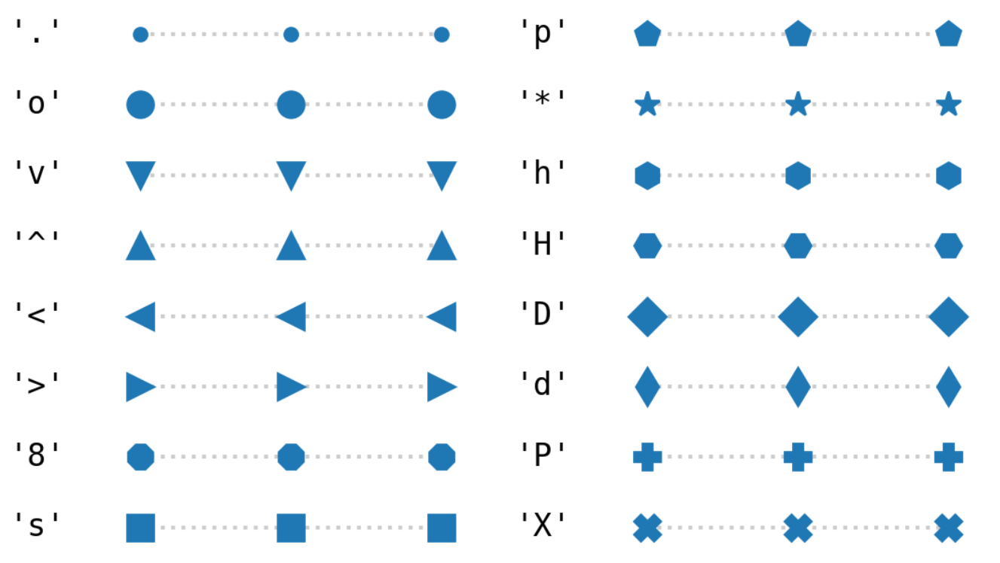{ width="50%" align="center"}

=== "填充样式（Fill Style）"

    ```Python title="填充样式（Fill Style）" linenums="1"
    from matplotlib.lines import Line2D
    Line2D.fillStyles
    """
    ('full', 'left', 'right', 'bottom', 'top', 'none')
    """
    ```
   
    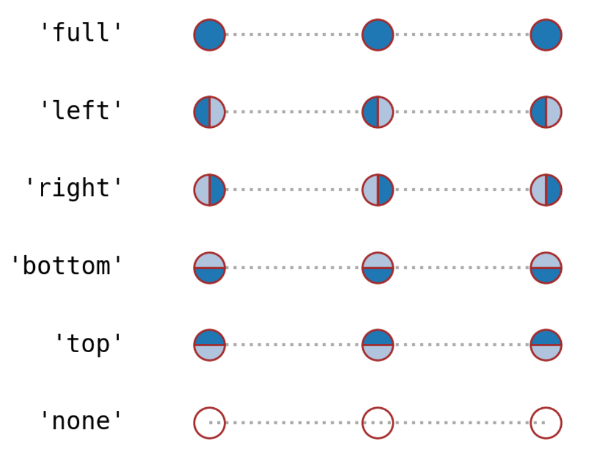{ width="50%" align="center"}

```Python title="填充型（Filled markers）与填充样式（Fill Style）" linenums="1" hl_lines="7-9"
fig = plt.figure(figsize=(8, 8), dpi=100, layout="constrained")
ax = fig.add_subplot(1, 1, 1)

ax.plot(x, y,
        marker="*",
        markersize=25,
        fillstyle="left",           # (1)!
        markerfacecolor="red",      # (2)!
        markerfacecoloralt="black", # (3)!
        markeredgecolor="green",
        markeredgewidth=2,
        markevery=None,
        alpha=1
        )

plt.show()
```

1. 指定markerfacecolor填充侧
2. fillstyle指定侧标记填充色(markerfacecolor/mfc)
3. 非fillstyle指定侧标记填充色(markerfacecoloralt/mfcalt)

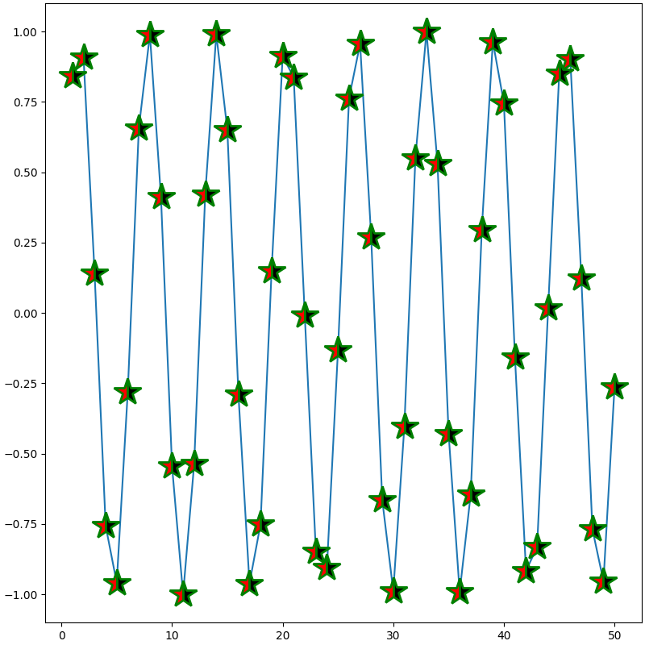{ width="50%" align="center"}

### TeX符号创建(Markers created from TeX symbols)

[Marker reference — Matplotlib 3.10.1 documentation](https://matplotlib.org/stable/gallery/lines_bars_and_markers/marker_reference.html#markers-created-from-tex-symbols)

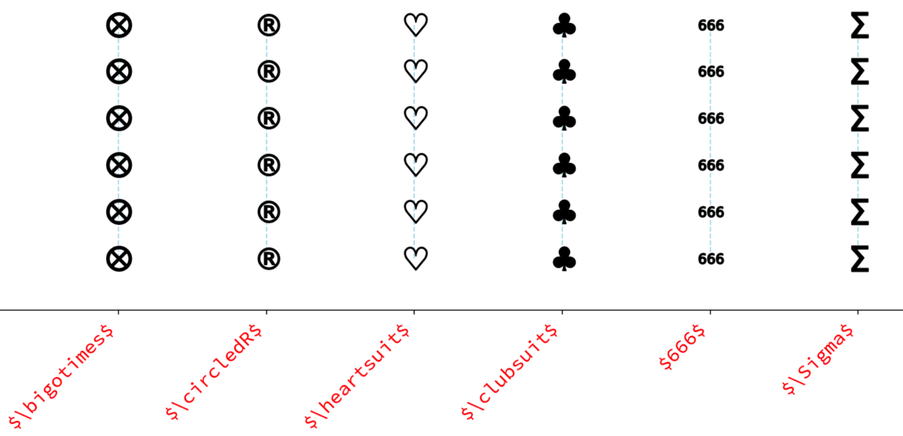{ width="50%" align="center"}

```Python title="TeX符号创建(Markers created from TeX symbols)" linenums="1" hl_lines="5"
fig = plt.figure(figsize=(8, 8), dpi=100, layout="constrained")
ax = fig.add_subplot(1, 1, 1)

ax.plot(x, y,
        marker=r"$\bigotimes$",
        markersize=25,
        markerfacecolor="red",
        markeredgecolor="green",
        markeredgewidth=2,
        markevery=None,
        alpha=1
        )

plt.show()
```

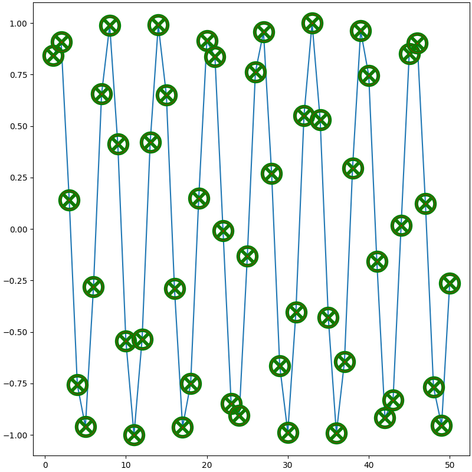{ width="50%" align="center"}

### 元组型

=== "(numsides, 0, angle)"

    **(numsides, 0, angle)**：逆时针旋转angle°的正numsides边形

    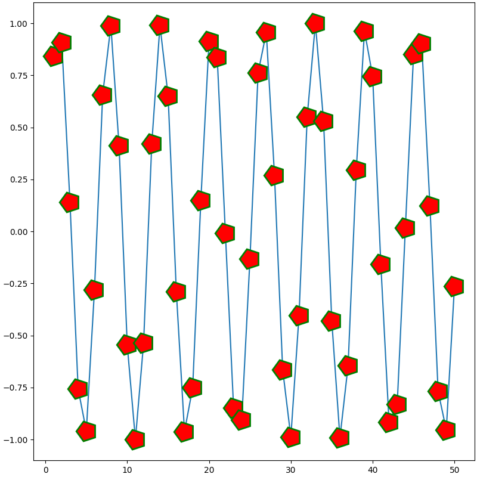{ width="50%" align="center"}

=== "(numsides, 1, angle)"

    **(numsides, 1, angle)**：逆时针旋转angle°的正numsides角形

    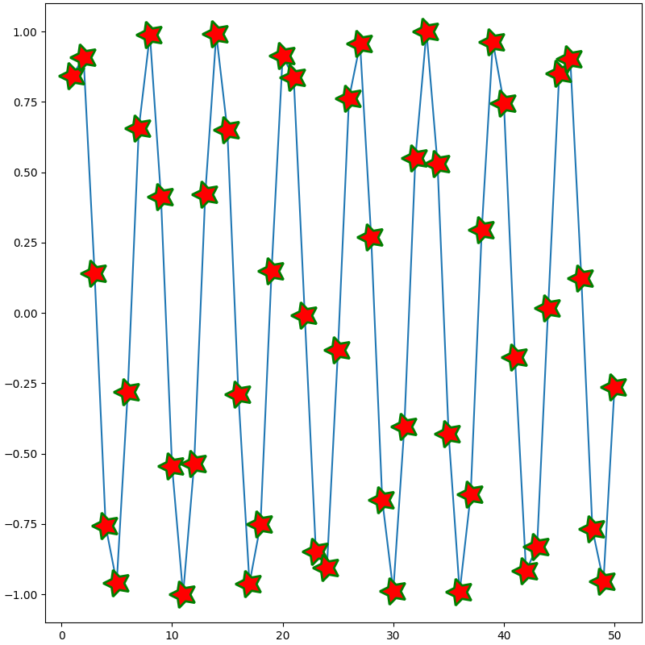{ width="50%" align="center"}

=== "(numsides, 2, angle)"

    **(numsides, 2, angle)**：逆时针旋转angle°的正numsides边星

    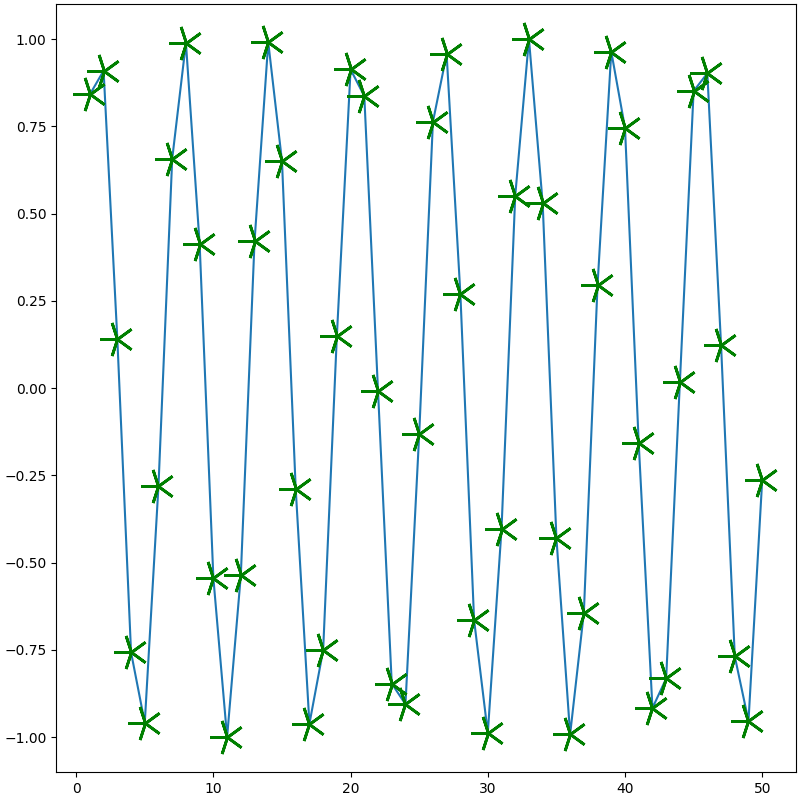{ width="50%" align="center"}

```Python title="元组型" linenums="1" hl_lines="5"
fig = plt.figure(figsize=(8, 8), dpi=100, layout="constrained")
ax = fig.add_subplot(1, 1, 1)

ax.plot(x, y,
        marker=(5, 0, 90),
        markersize=25,
        markerfacecolor="red",
        markeredgecolor="green",
        markeredgewidth=2,
        markevery=None,
        alpha=1
        )

plt.show()
```

### Path创建(Markers created from Paths)

[Marker reference — Matplotlib 3.10.1 documentation](https://matplotlib.org/stable/gallery/lines_bars_and_markers/marker_reference.html#markers-created-from-paths)

**绘制坐标以原始标记点为原点(0, 0)**

1.  `mpath.Path(vertices, codes=None, closed=False)`

    a.  **vertices**：绘制的点坐标序列（如[(x1, y1), (x2, y2), ...]）或者形状(N, 2)的数组（如[[x1 y1] [x2 y2] ...]）。

    b.  **codes**：与vertices每个坐标一一对应，表示到该坐标的动作，可选：

        I.  `mpath.Path.STOP` = `np.uint8(0)` = **0**：不绘制该坐标且结束绘制

        II.  `mpath.Path.MOVETO` = `np.uint8(1)` = **1**：不绘制，仅移动到该坐标。**第一个必须是该值**。

        III.  `mpath.Path.LINETO` = `np.uint8(2)` = **2**：以线段绘制到该坐标

        IV.  `mpath.Path.CURVE3` = `np.uint8(3)` = **3**：绘制曲线到该坐标后一个坐标

        V.  `mpath.Path.CURVE4` = `np.uint8(4)` = **4**：绘制曲线到该坐标后两个坐标

        VI.  `mpath.Path.CLOSEPOLY` = `np.uint8(79)` = **79**：不绘制该坐标，直接前一个坐标绘制线段到第一个坐标以封闭图形

    c.  **closed**：是否封闭图形。当codes=None且closed=True时，相当于codes=[1, 2, 2, ..., 79]。

7.  `mpath.Path.arc(theta1, theta2, n=None, is_wedge=False)`：绘制从 **theta1**°到 **theta2**°（>360°时将减去360°）的单位圆弧。**n**，略。 **is_wedge** 指是否绘制弧形半径。

8.  `mpath.Path.wedge(theta1, theta2, n=None)`：相当于`mpath.Path.arc`中 **is_wedge=True**

9.  `mpath.Path.circle(center=(0.0, 0.0), radius=1.0, readonly=False)`：绘制圆心坐标为 **center**，半径为 **radius** 的圆。**readonly**，略。

10.  `mpath.Path.unit_circle()`：绘制单位圆

11.  `mpath.Path.unit_circle_righthalf()`：绘制单位圆右侧半

12.  `mpath.Path.unit_rectangle()`：绘制单位矩形（正方形）

13.  `mpath.Path.unit_regular_asterisk(numVertices)`：绘制单位正 **numVertices** 边星

14.  `mpath.Path.unit_regular_polygon(numVertices)`：绘制单位正 **numVertices** 边形

15.  `mpath.Path.unit_regular_star(numVertices, innerCircle=0.5)`：绘制单位正 **numVertices** 角星。**innerCircle**，略

=== "基类"

    ```Python title="基类" linenums="1" hl_lines="10"
    import matplotlib.path as mpath

    fig = plt.figure(figsize=(8, 8), dpi=100, layout="constrained")
    ax = fig.add_subplot(1, 1, 1)

    vertices = [(-2, 0), (0, 4), (2, 0), (0, -4)]
    codes= [1, 2, 2, 79]

    ax.plot(x, y,
            marker=mpath.Path(vertices, codes=codes, closed=False),
            markersize=25,
            markerfacecolor="red",
            markeredgecolor="green",
            markeredgewidth=2,
            markevery=None,
            alpha=1
            )

    plt.show()
    ```

    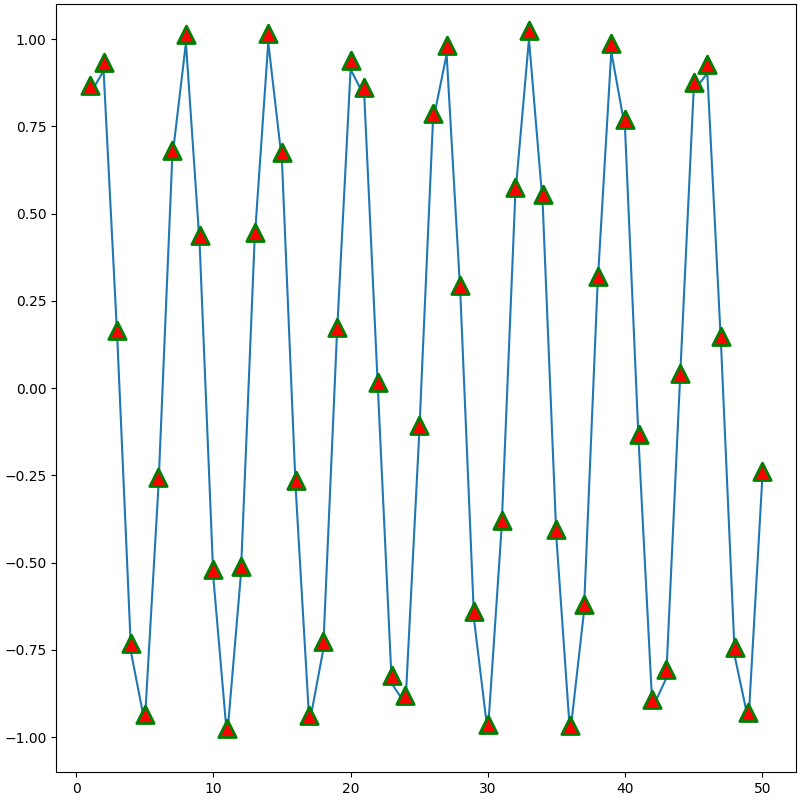{ width="50%" align="center"}

=== "子类"

    ```Python title="子类" linenums="1" hl_lines="7"
    import matplotlib.path as mpath

    fig = plt.figure(figsize=(8, 8), dpi=100, layout="constrained")
    ax = fig.add_subplot(1, 1, 1)

    ax.plot(x, y,
            marker=mpath.Path.unit_circle(),
            markersize=25,
            markerfacecolor="red",
            markeredgecolor="green",
            markeredgewidth=2,
            markevery=None,
            alpha=1
            )

    plt.show()
    ```

    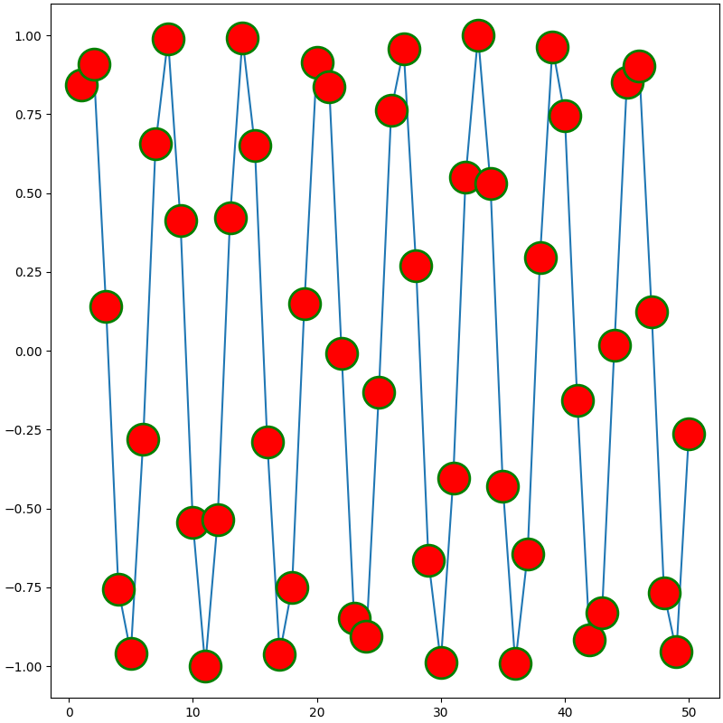{ width="50%" align="center"}

### MarkerStyle创建

[Marker reference — Matplotlib 3.10.1 documentation](https://matplotlib.org/stable/gallery/lines_bars_and_markers/marker_reference.html#advanced-marker-modifications-with-transform)

[Marker reference — Matplotlib 3.10.1 documentation](https://matplotlib.org/stable/gallery/lines_bars_and_markers/marker_reference.html#setting-marker-cap-style-and-join-style)

=== "marker capstyle"

    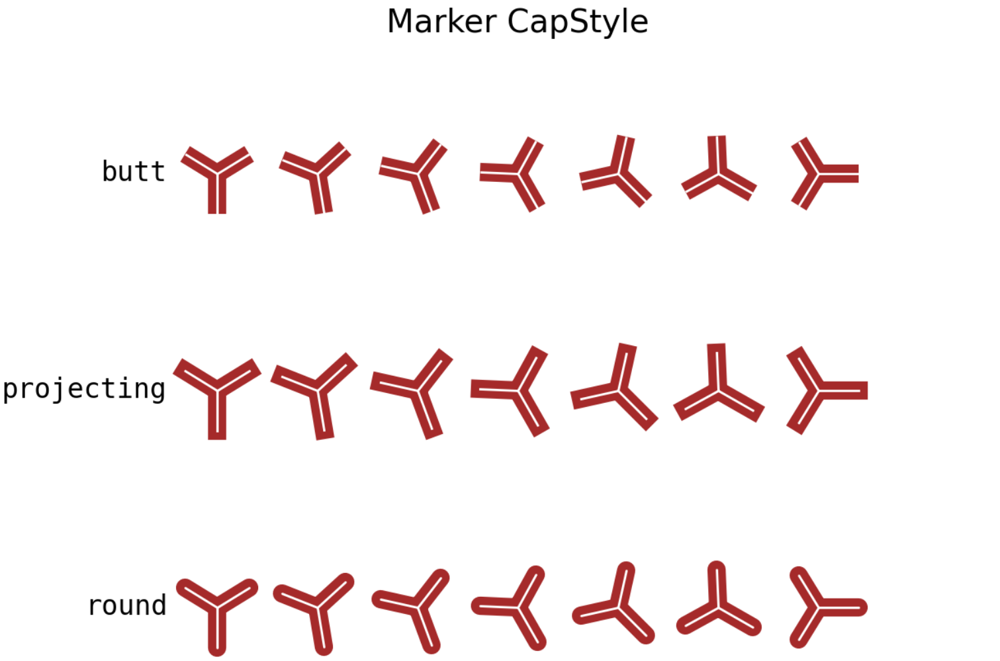{ width="50%" align="center"}

=== "marker joinstyle"

    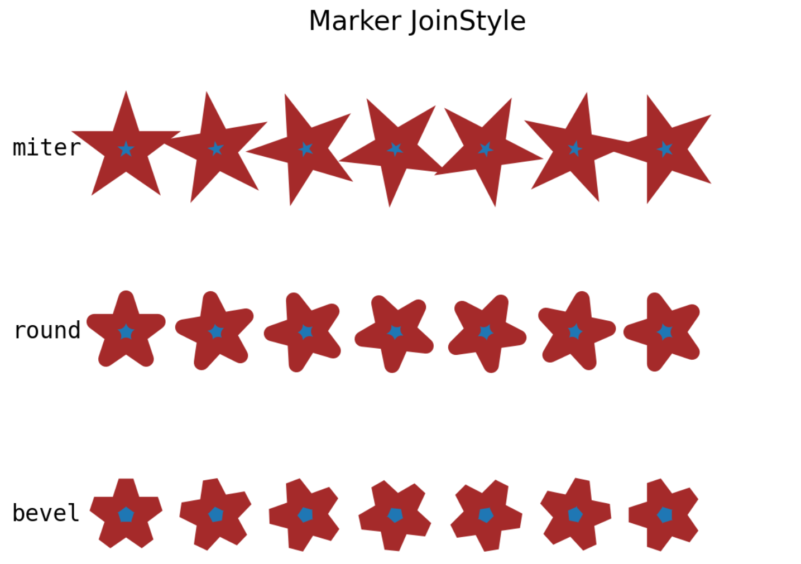{ width="50%" align="center"}

```Python title="MarkerStyle创建" linenums="1" hl_lines="6-13"
from matplotlib.markers import MarkerStyle

fig = plt.figure(figsize=(8, 8), dpi=100, layout="constrained")
ax = fig.add_subplot(1, 1, 1)

marker = MarkerStyle(marker="1",
                     fillstyle='none',
                     capstyle='round',
                     joinstyle='miter')
marker = marker.rotated(deg=90,      # (1)!
                        rad=None)    # (2)!
marker = marker.scaled(sx=2,         # (3)!
                       sy=4)         # (4)!

ax.plot(x, y,
        marker=marker,
        markersize=25,
        markerfacecolor="red",
        markeredgecolor="green",
        markeredgewidth=2,
        markevery=None,
        alpha=1
        )

plt.show()
```

1. 逆时针旋转（度数）
2. 逆时针旋转（弧度）
3. x轴上的缩放。必须指定
4. y轴上的缩放。若未指定，x轴和y轴均按sx缩放

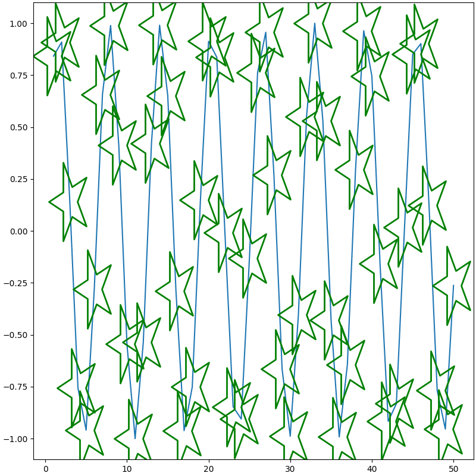{ width="50%" align="center"}

## 绘制样式（Draw Style）

[Step Demo — Matplotlib 3.10.1 documentation](https://matplotlib.org/stable/gallery/lines_bars_and_markers/step_demo.html)

[matplotlib.pyplot.step — Matplotlib 3.10.1 documentation](https://matplotlib.org/stable/api/_as_gen/matplotlib.pyplot.step.html)

[matplotlib.axes.Axes.step — Matplotlib 3.10.1 documentation](https://matplotlib.org/stable/api/_as_gen/matplotlib.axes.Axes.step.html)

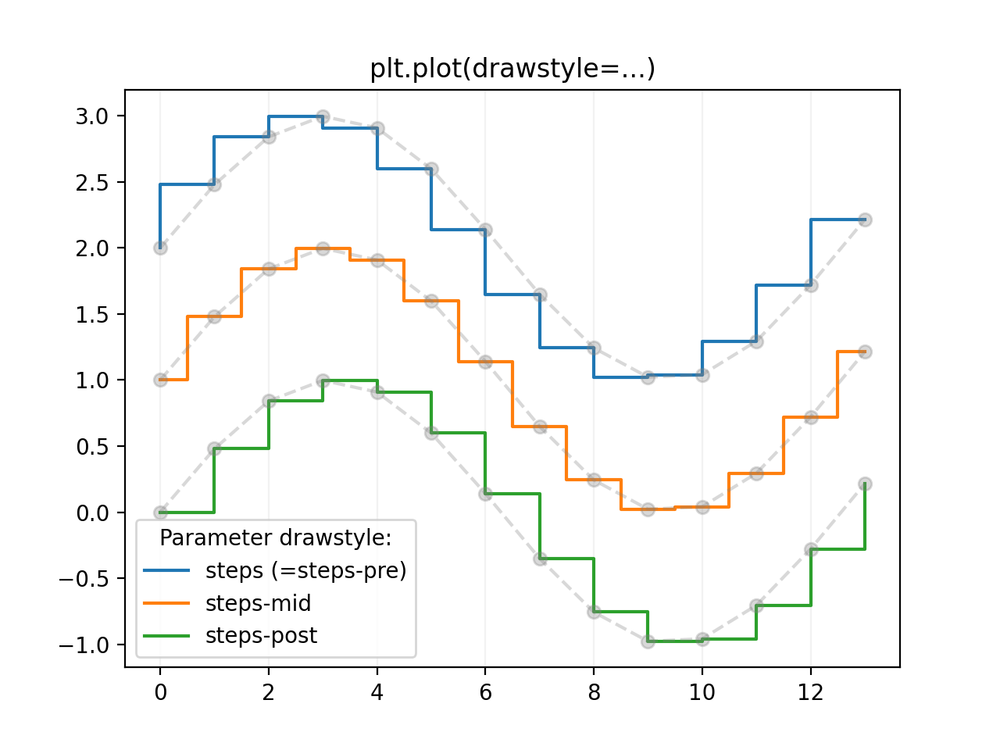{ width="50%" align="center"}

step函数是对`plot(drawstyle=...)`的封装，通过where参数来指定'pre'、'mid'、'post'

```Python title="绘制样式（Draw Style）" linenums="1" hl_lines="7 9 10 11 12 13"
fig = plt.figure(figsize=(8, 8), dpi=100, layout="constrained")
ax = fig.add_subplot(1, 1, 1)

ax.plot(x, y,
        linestyle="-",
        marker="*",
        drawstyle="steps-mid"    # (1)!
        )
# ax.step(x, y,
#         linestyle="-",
#         marker="*",
#         where="mid"
#         )

ax.grid()
plt.show()
```

1. drawstyle/ds

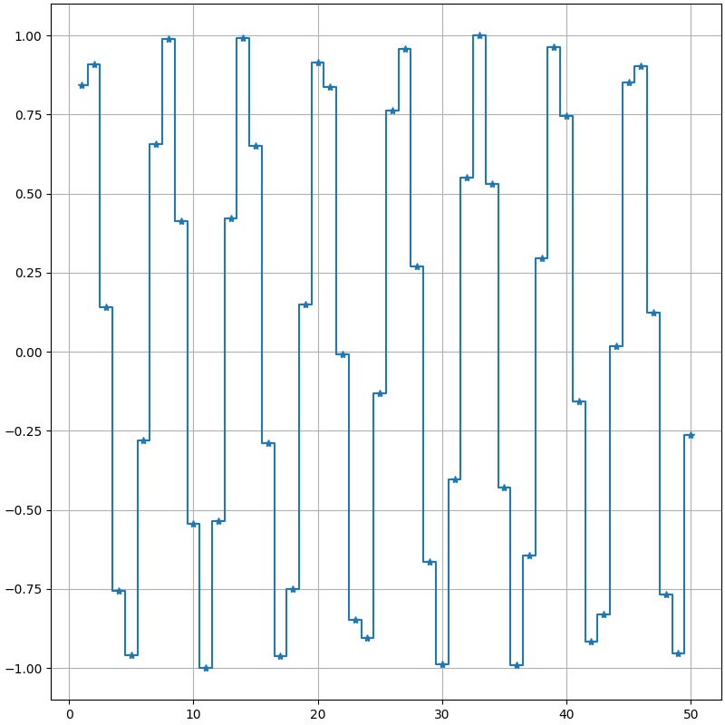{ width="50%" align="center"}

## 网格线（Grid）

[matplotlib.axes.Axes.grid — Matplotlib 3.10.1 documentation](https://matplotlib.org/stable/api/_as_gen/matplotlib.axes.Axes.grid.html#matplotlib.axes.Axes.grid)

[matplotlib.pyplot.grid — Matplotlib 3.10.1 documentation](https://matplotlib.org/stable/api/_as_gen/matplotlib.pyplot.grid.html#matplotlib.pyplot.grid)

```Python title="网格线（Grid）" linenums="1" hl_lines="4-6"
fig = plt.figure(figsize=(8, 8), dpi=100, layout="constrained")
ax = fig.add_subplot(1, 1, 1)

ax.grid(visible=True,    # (1)!
        which="both",    # (2)!
        axis="both",     # (3)!
        
        linestyle="--",
        linewidth=2,
        color="red",
        gapcolor="black",
        alpha=0.5,
        )

plt.show()
```

1.  网格线是否可见
2.  绘制在主刻度还是副刻度, 可选: 
    a.  'major'
    b.  'minor'
    c.  'both'
3.  绘制哪个轴的, 可选: 
    a.  'both'
    b.  'x'
    c.  'y'

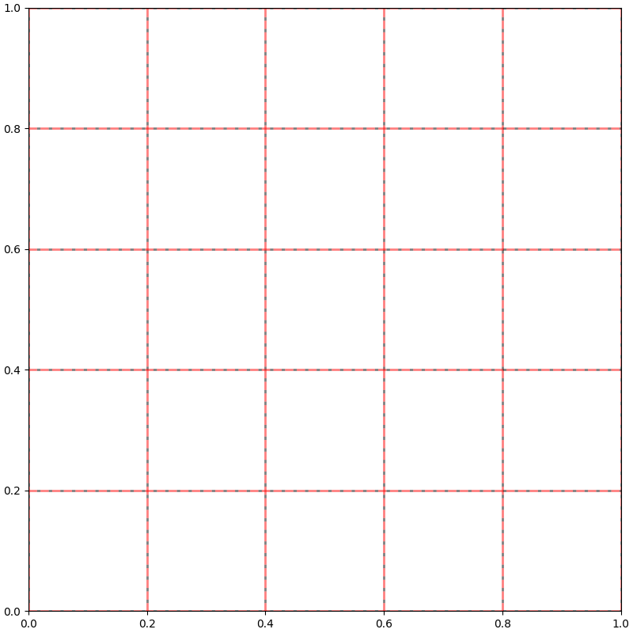{ width="50%" align="center"}

## 参考线（Line）

=== "axhline与axvline"

    [matplotlib.axes.Axes.axhline — Matplotlib 3.10.1 documentation](https://matplotlib.org/stable/api/_as_gen/matplotlib.axes.Axes.axhline.html#matplotlib.axes.Axes.axhline)

    [matplotlib.pyplot.axhline — Matplotlib 3.10.1 documentation](https://matplotlib.org/stable/api/_as_gen/matplotlib.pyplot.axhline.html#matplotlib.pyplot.axhline)

    [matplotlib.axes.Axes.axvline — Matplotlib 3.10.1 documentation](https://matplotlib.org/stable/api/_as_gen/matplotlib.axes.Axes.axvline.html#matplotlib.axes.Axes.axvline)

    [matplotlib.pyplot.axvline — Matplotlib 3.10.1 documentation](https://matplotlib.org/stable/api/_as_gen/matplotlib.pyplot.axvline.html#matplotlib.pyplot.axvline)

    ```Python title="axhline与axvline" linenums="1" hl_lines="5-7 16-18"
    fig = plt.figure(figsize=(8, 8), dpi=100, layout="constrained")
    ax = fig.add_subplot(1, 1, 1)
    ax.plot(x, y)

    ax.axhline(y=0.5,       # (1)!
               xmin=0.2,    # (2)!
               xmax=0.8,    # (3)!
    
               linestyle="--",
               linewidth=2,
               color="red",
               gapcolor="black",
               alpha=0.5,
               )

    ax.axvline(x=25,        # (4)!
               ymin=0.2,    # (5)!
               ymax=0.8,    # (6)!

               linestyle="--",
               linewidth=2,
               color="red",
               gapcolor="black",
               alpha=0.5,
               )

    plt.show()
    ```

    1. 数据坐标系统
    2. Axes坐标系统
    3. Axes坐标系统
    4. 数据坐标系统
    5. Axes坐标系统
    6. Axes坐标系统

    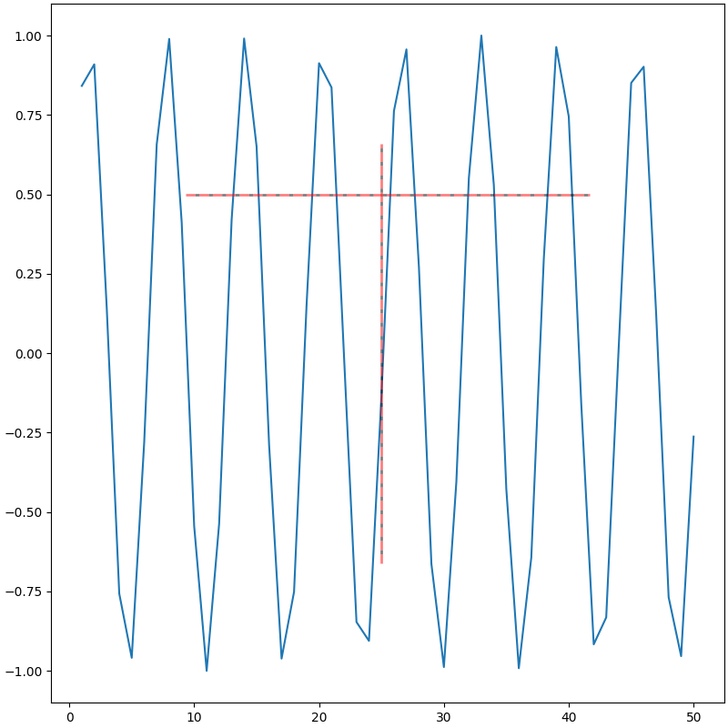{ width="50%" align="center"}

=== "hlines与vlines"

    [matplotlib.axes.Axes.hlines — Matplotlib 3.10.1 documentation](https://matplotlib.org/stable/api/_as_gen/matplotlib.axes.Axes.hlines.html#matplotlib.axes.Axes.hlines)

    [matplotlib.pyplot.hlines — Matplotlib 3.10.1 documentation](https://matplotlib.org/stable/api/_as_gen/matplotlib.pyplot.hlines.html#matplotlib.pyplot.hlines)

    [matplotlib.axes.Axes.vlines — Matplotlib 3.10.1 documentation](https://matplotlib.org/stable/api/_as_gen/matplotlib.axes.Axes.vlines.html#matplotlib.axes.Axes.vlines)

    [matplotlib.pyplot.vlines — Matplotlib 3.10.1 documentation](https://matplotlib.org/stable/api/_as_gen/matplotlib.pyplot.vlines.html)

    ```Python title="hlines与vlines" linenums="1" hl_lines="5-7 16-18"
    fig = plt.figure(figsize=(8, 8), dpi=100, layout="constrained")
    ax = fig.add_subplot(1, 1, 1)
    ax.plot(x, y)

    ax.hlines(y=[0.5, 0.6, 0.7, 0.8],    # (1)!
              xmin=[10, 15, 20, 25],     # (2)!
              xmax=[15, 20, 25, 30],     # (3)!

              linestyles="--",
              linewidths=[2, 3, 4, 5],
              colors=["r", "g", "b", "y"],
              gapcolor="b",
              alpha=0.5,
              )

    ax.vlines(x=[12.5, 17.5, 22.5, 27.5],    # (4)!
              ymin=[0.4, 0.5, 0.6, 0.7],     # (5)!
              ymax=[0.6, 0.7, 0.8, 0.9],     # (6)!

              linestyles="--",
              linewidths=[2, 3, 4, 5],
              colors=["r", "g", "b", "y"],
              gapcolor="b",
              alpha=0.5,
              )

    plt.show()
    ```

    1. 数据坐标系统
    2. 数据坐标系统
    3. 数据坐标系统
    4. 数据坐标系统
    5. 数据坐标系统
    6. 数据坐标系统

    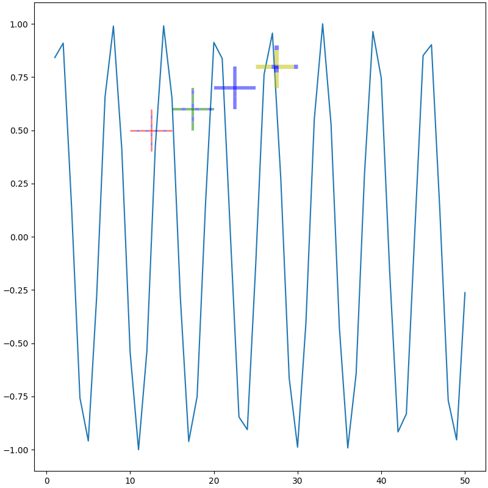{ width="50%" align="center"}