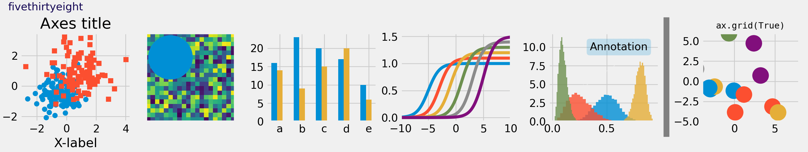

# 绘图配置（runtime configuration）

```Python title="导入模块" linenums="1"
import matplotlib as mpl
import matplotlib.pyplot as plt
import seaborn as sns
import numpy as np
```

## Matplotlib

### matplotlibrc文件

[Customizing Matplotlib with style sheets and rcParams — Matplotlib 3.10.1 documentation](https://matplotlib.org/stable/users/explain/customizing.html#the-matplotlibrc-file)


[matplotlib — Matplotlib 3.10.1 documentation](https://matplotlib.org/stable/api/matplotlib_configuration_api.html#matplotlib.matplotlib_fname)

[matplotlibrc](../../../Data/matplotlibrc)

```Python title="文件路径查看" linenums="1"
mpl.matplotlib_fname()
"""
'D:\\SoftWare\\python\\python3_12_8\\Lib\\site-packages\\matplotlib\\mpl-data\\matplotlibrc'
"""
```

Matplotlib 使用 `matplotlibrc` 配置文件来自定义所有类型的属性，称为'rc 设置'或'rc 参数'。几乎可以控制 Matplotlib 中几乎每个属性的默认值：图形大小和 DPI、线宽、颜色和样式、坐标轴和网格属性、文本和字体属性等等。 `matplotlibrc` 在启动时读取以配置 Matplotlib。

matplotlib通过以下优先级顺序搜索对应目录下的matplotlibrc文件并读取，找到后不再搜索其它目录：

1. **【！推荐】当前工作目录**：仅用于当前工作目录下的配置

2. **【！推荐】环境变量`MATPLOTLIBRC`指向的目录**

3. **`C:/Users/用户名/.config/matplotlib/`目录**

4. **`python安装目录/Lib/site-packages/matplotlib/mpl-data/`目录（如上）**：该目录下的matplotlibrc文件在每次更新或安装matplotlib时都会被覆盖。该处文件不建议修改。

可以通过复制并修改该文件实现永久修改配置 **（静态修改）**，以获得属于自己的配置文件。（修改时注意删除开头注释符号）

```Text title="matplotlibrc" linenums="1"
#### MATPLOTLIBRC FORMAT

## NOTE FOR END USERS: DO NOT EDIT THIS FILE!
##
## This is a sample Matplotlib configuration file - you can find a copy
## of it on your system in site-packages/matplotlib/mpl-data/matplotlibrc
## (relative to your Python installation location).
## DO NOT EDIT IT!
##
## If you wish to change your default style, copy this file to one of the
## following locations:
##     Unix/Linux:
##         $HOME/.config/matplotlib/matplotlibrc OR
##         $XDG_CONFIG_HOME/matplotlib/matplotlibrc (if $XDG_CONFIG_HOME is set)
##     Other platforms:
##         $HOME/.matplotlib/matplotlibrc
## and edit that copy.
##
## See https://matplotlib.org/stable/users/explain/customizing.html#customizing-with-matplotlibrc-files
## for more details on the paths which are checked for the configuration file.
##
## Blank lines, or lines starting with a comment symbol, are ignored, as are
## trailing comments.  Other lines must have the format:
##     key: val  # optional comment
##
## Formatting: Use PEP8-like style (as enforced in the rest of the codebase).
## All lines start with an additional '#', so that removing all leading '#'s
## yields a valid style file.
##
## Colors: for the color values below, you can either use
##     - a Matplotlib color string, such as r, k, or b
##     - an RGB tuple, such as (1.0, 0.5, 0.0)
##     - a double-quoted hex string, such as "#ff00ff".
##       The unquoted string ff00ff is also supported for backward
##       compatibility, but is discouraged.
##     - a scalar grayscale intensity such as 0.75
##     - a legal html color name, e.g., red, blue, darkslategray
##
## String values may optionally be enclosed in double quotes, which allows
## using the comment character # in the string.
##
## This file (and other style files) must be encoded as utf-8.
##
## Matplotlib configuration are currently divided into following parts:
##     - BACKENDS
##     - LINES
##     - PATCHES
##     - HATCHES
##     - BOXPLOT
##     - FONT
##     - TEXT
##     - LaTeX
##     - AXES
##     - DATES
##     - TICKS
##     - GRIDS
##     - LEGEND
##     - FIGURE
##     - IMAGES
##     - CONTOUR PLOTS
##     - ERRORBAR PLOTS
##     - HISTOGRAM PLOTS
##     - SCATTER PLOTS
##     - AGG RENDERING
##     - PATHS
##     - SAVING FIGURES
##     - INTERACTIVE KEYMAPS
##     - ANIMATION

##### CONFIGURATION BEGINS HERE


## ***************************************************************************
## * BACKENDS                                                                *
## ***************************************************************************
## The default backend.  If you omit this parameter, the first working
## backend from the following list is used:
##     MacOSX QtAgg Gtk4Agg Gtk3Agg TkAgg WxAgg Agg
## Other choices include:
##     QtCairo GTK4Cairo GTK3Cairo TkCairo WxCairo Cairo
##     Qt5Agg Qt5Cairo Wx  # deprecated.
##     PS PDF SVG Template
## You can also deploy your own backend outside of Matplotlib by referring to
## the module name (which must be in the PYTHONPATH) as 'module://my_backend'.
##backend: Agg

## The port to use for the web server in the WebAgg backend.
#webagg.port: 8988

## The address on which the WebAgg web server should be reachable
#webagg.address: 127.0.0.1

## If webagg.port is unavailable, a number of other random ports will
## be tried until one that is available is found.
#webagg.port_retries: 50

## When True, open the web browser to the plot that is shown
#webagg.open_in_browser: True

## If you are running pyplot inside a GUI and your backend choice
## conflicts, we will automatically try to find a compatible one for
## you if backend_fallback is True
#backend_fallback: True

#interactive: False
#figure.hooks:          # list of dotted.module.name:dotted.callable.name
#toolbar:     toolbar2  # {None, toolbar2, toolmanager}
#timezone:    UTC       # a pytz timezone string, e.g., US/Central or Europe/Paris


## ***************************************************************************
## * LINES                                                                   *
## ***************************************************************************
## See https://matplotlib.org/stable/api/artist_api.html#module-matplotlib.lines
## for more information on line properties.
#lines.linewidth: 1.5               # line width in points
#lines.linestyle: -                 # solid line
#lines.color:     C0                # has no affect on plot(); see axes.prop_cycle
#lines.marker:          None        # the default marker
#lines.markerfacecolor: auto        # the default marker face color
#lines.markeredgecolor: auto        # the default marker edge color
#lines.markeredgewidth: 1.0         # the line width around the marker symbol
#lines.markersize:      6           # marker size, in points
#lines.dash_joinstyle:  round       # {miter, round, bevel}
#lines.dash_capstyle:   butt        # {butt, round, projecting}
#lines.solid_joinstyle: round       # {miter, round, bevel}
#lines.solid_capstyle:  projecting  # {butt, round, projecting}
#lines.antialiased: True            # render lines in antialiased (no jaggies)

## The three standard dash patterns.  These are scaled by the linewidth.
#lines.dashed_pattern: 3.7, 1.6
#lines.dashdot_pattern: 6.4, 1.6, 1, 1.6
#lines.dotted_pattern: 1, 1.65
#lines.scale_dashes: True

#markers.fillstyle: full  # {full, left, right, bottom, top, none}

#pcolor.shading: auto
#pcolormesh.snap: True  # Whether to snap the mesh to pixel boundaries. This is
                        # provided solely to allow old test images to remain
                        # unchanged. Set to False to obtain the previous behavior.

## ***************************************************************************
## * PATCHES                                                                 *
## ***************************************************************************
## Patches are graphical objects that fill 2D space, like polygons or circles.
## See https://matplotlib.org/stable/api/artist_api.html#module-matplotlib.patches
## for more information on patch properties.
#patch.linewidth:       1.0    # edge width in points.
#patch.facecolor:       C0
#patch.edgecolor:       black  # By default, Patches and Collections do not draw edges.
                               # This value is only used if facecolor is "none"
                               # (an Artist without facecolor and edgecolor would be
                               # invisible)  or if patch.force_edgecolor is True.
#patch.force_edgecolor: False  # By default, Patches and Collections do not draw edges.
                               # Set this to True to draw edges with patch.edgedcolor
                               # as the default edgecolor.
                               # This is mainly relevant for styles.
#patch.antialiased:     True   # render patches in antialiased (no jaggies)


## ***************************************************************************
## * HATCHES                                                                 *
## ***************************************************************************
#hatch.color:     black
#hatch.linewidth: 1.0


## ***************************************************************************
## * BOXPLOT                                                                 *
## ***************************************************************************
#boxplot.notch:       False
#boxplot.vertical:    True
#boxplot.whiskers:    1.5
#boxplot.bootstrap:   None
#boxplot.patchartist: False
#boxplot.showmeans:   False
#boxplot.showcaps:    True
#boxplot.showbox:     True
#boxplot.showfliers:  True
#boxplot.meanline:    False

#boxplot.flierprops.color:           black
#boxplot.flierprops.marker:          o
#boxplot.flierprops.markerfacecolor: none
#boxplot.flierprops.markeredgecolor: black
#boxplot.flierprops.markeredgewidth: 1.0
#boxplot.flierprops.markersize:      6
#boxplot.flierprops.linestyle:       none
#boxplot.flierprops.linewidth:       1.0

#boxplot.boxprops.color:     black
#boxplot.boxprops.linewidth: 1.0
#boxplot.boxprops.linestyle: -

#boxplot.whiskerprops.color:     black
#boxplot.whiskerprops.linewidth: 1.0
#boxplot.whiskerprops.linestyle: -

#boxplot.capprops.color:     black
#boxplot.capprops.linewidth: 1.0
#boxplot.capprops.linestyle: -

#boxplot.medianprops.color:     C1
#boxplot.medianprops.linewidth: 1.0
#boxplot.medianprops.linestyle: -

#boxplot.meanprops.color:           C2
#boxplot.meanprops.marker:          ^
#boxplot.meanprops.markerfacecolor: C2
#boxplot.meanprops.markeredgecolor: C2
#boxplot.meanprops.markersize:       6
#boxplot.meanprops.linestyle:       --
#boxplot.meanprops.linewidth:       1.0


## ***************************************************************************
## * FONT                                                                    *
## ***************************************************************************
## The font properties used by `text.Text`.
## See https://matplotlib.org/stable/api/font_manager_api.html for more information
## on font properties.  The 6 font properties used for font matching are
## given below with their default values.
##
## The font.family property can take either a single or multiple entries of any
## combination of concrete font names (not supported when rendering text with
## usetex) or the following five generic values:
##     - 'serif' (e.g., Times),
##     - 'sans-serif' (e.g., Helvetica),
##     - 'cursive' (e.g., Zapf-Chancery),
##     - 'fantasy' (e.g., Western), and
##     - 'monospace' (e.g., Courier).
## Each of these values has a corresponding default list of font names
## (font.serif, etc.); the first available font in the list is used.  Note that
## for font.serif, font.sans-serif, and font.monospace, the first element of
## the list (a DejaVu font) will always be used because DejaVu is shipped with
## Matplotlib and is thus guaranteed to be available; the other entries are
## left as examples of other possible values.
##
## The font.style property has three values: normal (or roman), italic
## or oblique.  The oblique style will be used for italic, if it is not
## present.
##
## The font.variant property has two values: normal or small-caps.  For
## TrueType fonts, which are scalable fonts, small-caps is equivalent
## to using a font size of 'smaller', or about 83 % of the current font
## size.
##
## The font.weight property has effectively 13 values: normal, bold,
## bolder, lighter, 100, 200, 300, ..., 900.  Normal is the same as
## 400, and bold is 700.  bolder and lighter are relative values with
## respect to the current weight.
##
## The font.stretch property has 11 values: ultra-condensed,
## extra-condensed, condensed, semi-condensed, normal, semi-expanded,
## expanded, extra-expanded, ultra-expanded, wider, and narrower.  This
## property is not currently implemented.
##
## The font.size property is the default font size for text, given in points.
## 10 pt is the standard value.
##
## Note that font.size controls default text sizes.  To configure
## special text sizes tick labels, axes, labels, title, etc., see the rc
## settings for axes and ticks.  Special text sizes can be defined
## relative to font.size, using the following values: xx-small, x-small,
## small, medium, large, x-large, xx-large, larger, or smaller

#font.family:  sans-serif
#font.style:   normal
#font.variant: normal
#font.weight:  normal
#font.stretch: normal
#font.size:    10.0

#font.serif:      DejaVu Serif, Bitstream Vera Serif, Computer Modern Roman, New Century Schoolbook, Century Schoolbook L, Utopia, ITC Bookman, Bookman, Nimbus Roman No9 L, Times New Roman, Times, Palatino, Charter, serif
#font.sans-serif: DejaVu Sans, Bitstream Vera Sans, Computer Modern Sans Serif, Lucida Grande, Verdana, Geneva, Lucid, Arial, Helvetica, Avant Garde, sans-serif
#font.cursive:    Apple Chancery, Textile, Zapf Chancery, Sand, Script MT, Felipa, Comic Neue, Comic Sans MS, cursive
#font.fantasy:    Chicago, Charcoal, Impact, Western, xkcd script, fantasy
#font.monospace:  DejaVu Sans Mono, Bitstream Vera Sans Mono, Computer Modern Typewriter, Andale Mono, Nimbus Mono L, Courier New, Courier, Fixed, Terminal, monospace


## ***************************************************************************
## * TEXT                                                                    *
## ***************************************************************************
## The text properties used by `text.Text`.
## See https://matplotlib.org/stable/api/artist_api.html#module-matplotlib.text
## for more information on text properties
#text.color: black

## FreeType hinting flag ("foo" corresponds to FT_LOAD_FOO); may be one of the
## following (Proprietary Matplotlib-specific synonyms are given in parentheses,
## but their use is discouraged):
## - default: Use the font's native hinter if possible, else FreeType's auto-hinter.
##            ("either" is a synonym).
## - no_autohint: Use the font's native hinter if possible, else don't hint.
##                ("native" is a synonym.)
## - force_autohint: Use FreeType's auto-hinter.  ("auto" is a synonym.)
## - no_hinting: Disable hinting.  ("none" is a synonym.)
#text.hinting: force_autohint

#text.hinting_factor: 8  # Specifies the amount of softness for hinting in the
                         # horizontal direction.  A value of 1 will hint to full
                         # pixels.  A value of 2 will hint to half pixels etc.
#text.kerning_factor: 0  # Specifies the scaling factor for kerning values.  This
                         # is provided solely to allow old test images to remain
                         # unchanged.  Set to 6 to obtain previous behavior.
                         # Values  other than 0 or 6 have no defined meaning.
#text.antialiased: True  # If True (default), the text will be antialiased.
                         # This only affects raster outputs.
#text.parse_math: True  # Use mathtext if there is an even number of unescaped
                        # dollar signs.


## ***************************************************************************
## * LaTeX                                                                   *
## ***************************************************************************
## For more information on LaTeX properties, see
## https://matplotlib.org/stable/users/explain/text/usetex.html
#text.usetex: False  # use latex for all text handling. The following fonts
                     # are supported through the usual rc parameter settings:
                     # new century schoolbook, bookman, times, palatino,
                     # zapf chancery, charter, serif, sans-serif, helvetica,
                     # avant garde, courier, monospace, computer modern roman,
                     # computer modern sans serif, computer modern typewriter
#text.latex.preamble:   # IMPROPER USE OF THIS FEATURE WILL LEAD TO LATEX FAILURES
                        # AND IS THEREFORE UNSUPPORTED. PLEASE DO NOT ASK FOR HELP
                        # IF THIS FEATURE DOES NOT DO WHAT YOU EXPECT IT TO.
                        # text.latex.preamble is a single line of LaTeX code that
                        # will be passed on to the LaTeX system. It may contain
                        # any code that is valid for the LaTeX "preamble", i.e.
                        # between the "\documentclass" and "\begin{document}"
                        # statements.
                        # Note that it has to be put on a single line, which may
                        # become quite long.
                        # The following packages are always loaded with usetex,
                        # so beware of package collisions:
                        #   geometry, inputenc, type1cm.
                        # PostScript (PSNFSS) font packages may also be
                        # loaded, depending on your font settings.

## The following settings allow you to select the fonts in math mode.
#mathtext.fontset: dejavusans  # Should be 'dejavusans' (default),
                               # 'dejavuserif', 'cm' (Computer Modern), 'stix',
                               # 'stixsans' or 'custom'
## "mathtext.fontset: custom" is defined by the mathtext.bf, .cal, .it, ...
## settings which map a TeX font name to a fontconfig font pattern.  (These
## settings are not used for other font sets.)
#mathtext.bf:  sans:bold
#mathtext.bfit: sans:italic:bold
#mathtext.cal: cursive
#mathtext.it:  sans:italic
#mathtext.rm:  sans
#mathtext.sf:  sans
#mathtext.tt:  monospace
#mathtext.fallback: cm  # Select fallback font from ['cm' (Computer Modern), 'stix'
                        # 'stixsans'] when a symbol cannot be found in one of the
                        # custom math fonts. Select 'None' to not perform fallback
                        # and replace the missing character by a dummy symbol.
#mathtext.default: it  # The default font to use for math.
                       # Can be any of the LaTeX font names, including
                       # the special name "regular" for the same font
                       # used in regular text.


## ***************************************************************************
## * AXES                                                                    *
## ***************************************************************************
## Following are default face and edge colors, default tick sizes,
## default font sizes for tick labels, and so on.  See
## https://matplotlib.org/stable/api/axes_api.html#module-matplotlib.axes
#axes.facecolor:     white   # axes background color
#axes.edgecolor:     black   # axes edge color
#axes.linewidth:     0.8     # edge line width
#axes.grid:          False   # display grid or not
#axes.grid.axis:     both    # which axis the grid should apply to
#axes.grid.which:    major   # grid lines at {major, minor, both} ticks
#axes.titlelocation: center  # alignment of the title: {left, right, center}
#axes.titlesize:     large   # font size of the axes title
#axes.titleweight:   normal  # font weight of title
#axes.titlecolor:    auto    # color of the axes title, auto falls back to
                             # text.color as default value
#axes.titley:        None    # position title (axes relative units).  None implies auto
#axes.titlepad:      6.0     # pad between axes and title in points
#axes.labelsize:     medium  # font size of the x and y labels
#axes.labelpad:      4.0     # space between label and axis
#axes.labelweight:   normal  # weight of the x and y labels
#axes.labelcolor:    black
#axes.axisbelow:     line    # draw axis gridlines and ticks:
                             #     - below patches (True)
                             #     - above patches but below lines ('line')
                             #     - above all (False)

#axes.formatter.limits: -5, 6  # use scientific notation if log10
                               # of the axis range is smaller than the
                               # first or larger than the second
#axes.formatter.use_locale: False  # When True, format tick labels
                                   # according to the user's locale.
                                   # For example, use ',' as a decimal
                                   # separator in the fr_FR locale.
#axes.formatter.use_mathtext: False  # When True, use mathtext for scientific
                                     # notation.
#axes.formatter.min_exponent: 0  # minimum exponent to format in scientific notation
#axes.formatter.useoffset: True  # If True, the tick label formatter
                                 # will default to labeling ticks relative
                                 # to an offset when the data range is
                                 # small compared to the minimum absolute
                                 # value of the data.
#axes.formatter.offset_threshold: 4  # When useoffset is True, the offset
                                     # will be used when it can remove
                                     # at least this number of significant
                                     # digits from tick labels.

#axes.spines.left:   True  # display axis spines
#axes.spines.bottom: True
#axes.spines.top:    True
#axes.spines.right:  True

#axes.unicode_minus: True  # use Unicode for the minus symbol rather than hyphen.  See
                           # https://en.wikipedia.org/wiki/Plus_and_minus_signs#Character_codes
#axes.prop_cycle: cycler('color', ['1f77b4', 'ff7f0e', '2ca02c', 'd62728', '9467bd', '8c564b', 'e377c2', '7f7f7f', 'bcbd22', '17becf'])
                  # color cycle for plot lines as list of string color specs:
                  # single letter, long name, or web-style hex
                  # As opposed to all other parameters in this file, the color
                  # values must be enclosed in quotes for this parameter,
                  # e.g. '1f77b4', instead of 1f77b4.
                  # See also https://matplotlib.org/stable/users/explain/artists/color_cycle.html
                  # for more details on prop_cycle usage.
#axes.xmargin:   .05  # x margin.  See `axes.Axes.margins`
#axes.ymargin:   .05  # y margin.  See `axes.Axes.margins`
#axes.zmargin:   .05  # z margin.  See `axes.Axes.margins`
#axes.autolimit_mode: data  # If "data", use axes.xmargin and axes.ymargin as is.
                            # If "round_numbers", after application of margins, axis
                            # limits are further expanded to the nearest "round" number.
#polaraxes.grid:    True   # display grid on polar axes
#axes3d.grid:       True   # display grid on 3D axes
#axes3d.automargin: False  # automatically add margin when manually setting 3D axis limits

#axes3d.xaxis.panecolor:    (0.95, 0.95, 0.95, 0.5)  # background pane on 3D axes
#axes3d.yaxis.panecolor:    (0.90, 0.90, 0.90, 0.5)  # background pane on 3D axes
#axes3d.zaxis.panecolor:    (0.925, 0.925, 0.925, 0.5)  # background pane on 3D axes

#axes3d.mouserotationstyle: arcball  # {azel, trackball, sphere, arcball}
                            # See also https://matplotlib.org/stable/api/toolkits/mplot3d/view_angles.html#rotation-with-mouse
#axes3d.trackballsize: 0.667  # trackball diameter, in units of the Axes bbox
#axes3d.trackballborder: 0.2  # trackball border width, in units of the Axes bbox (only for 'sphere' and 'arcball' style)

## ***************************************************************************
## * AXIS                                                                    *
## ***************************************************************************
#xaxis.labellocation: center  # alignment of the xaxis label: {left, right, center}
#yaxis.labellocation: center  # alignment of the yaxis label: {bottom, top, center}


## ***************************************************************************
## * DATES                                                                   *
## ***************************************************************************
## These control the default format strings used in AutoDateFormatter.
## Any valid format datetime format string can be used (see the python
## `datetime` for details).  For example, by using:
##     - '%x' will use the locale date representation
##     - '%X' will use the locale time representation
##     - '%c' will use the full locale datetime representation
## These values map to the scales:
##     {'year': 365, 'month': 30, 'day': 1, 'hour': 1/24, 'minute': 1 / (24 * 60)}

#date.autoformatter.year:        %Y
#date.autoformatter.month:       %Y-%m
#date.autoformatter.day:         %Y-%m-%d
#date.autoformatter.hour:        %m-%d %H
#date.autoformatter.minute:      %d %H:%M
#date.autoformatter.second:      %H:%M:%S
#date.autoformatter.microsecond: %M:%S.%f
## The reference date for Matplotlib's internal date representation
## See https://matplotlib.org/stable/gallery/ticks/date_precision_and_epochs.html
#date.epoch: 1970-01-01T00:00:00
## 'auto', 'concise':
#date.converter:                  auto
## For auto converter whether to use interval_multiples:
#date.interval_multiples:         True

## ***************************************************************************
## * TICKS                                                                   *
## ***************************************************************************
## See https://matplotlib.org/stable/api/axis_api.html#matplotlib.axis.Tick
#xtick.top:           False   # draw ticks on the top side
#xtick.bottom:        True    # draw ticks on the bottom side
#xtick.labeltop:      False   # draw label on the top
#xtick.labelbottom:   True    # draw label on the bottom
#xtick.major.size:    3.5     # major tick size in points
#xtick.minor.size:    2       # minor tick size in points
#xtick.major.width:   0.8     # major tick width in points
#xtick.minor.width:   0.6     # minor tick width in points
#xtick.major.pad:     3.5     # distance to major tick label in points
#xtick.minor.pad:     3.4     # distance to the minor tick label in points
#xtick.color:         black   # color of the ticks
#xtick.labelcolor:    inherit # color of the tick labels or inherit from xtick.color
#xtick.labelsize:     medium  # font size of the tick labels
#xtick.direction:     out     # direction: {in, out, inout}
#xtick.minor.visible: False   # visibility of minor ticks on x-axis
#xtick.major.top:     True    # draw x axis top major ticks
#xtick.major.bottom:  True    # draw x axis bottom major ticks
#xtick.minor.top:     True    # draw x axis top minor ticks
#xtick.minor.bottom:  True    # draw x axis bottom minor ticks
#xtick.minor.ndivs:   auto    # number of minor ticks between the major ticks on x-axis
#xtick.alignment:     center  # alignment of xticks

#ytick.left:          True    # draw ticks on the left side
#ytick.right:         False   # draw ticks on the right side
#ytick.labelleft:     True    # draw tick labels on the left side
#ytick.labelright:    False   # draw tick labels on the right side
#ytick.major.size:    3.5     # major tick size in points
#ytick.minor.size:    2       # minor tick size in points
#ytick.major.width:   0.8     # major tick width in points
#ytick.minor.width:   0.6     # minor tick width in points
#ytick.major.pad:     3.5     # distance to major tick label in points
#ytick.minor.pad:     3.4     # distance to the minor tick label in points
#ytick.color:         black   # color of the ticks
#ytick.labelcolor:    inherit # color of the tick labels or inherit from ytick.color
#ytick.labelsize:     medium  # font size of the tick labels
#ytick.direction:     out     # direction: {in, out, inout}
#ytick.minor.visible: False   # visibility of minor ticks on y-axis
#ytick.major.left:    True    # draw y axis left major ticks
#ytick.major.right:   True    # draw y axis right major ticks
#ytick.minor.left:    True    # draw y axis left minor ticks
#ytick.minor.right:   True    # draw y axis right minor ticks
#ytick.minor.ndivs:   auto    # number of minor ticks between the major ticks on y-axis
#ytick.alignment:     center_baseline  # alignment of yticks


## ***************************************************************************
## * GRIDS                                                                   *
## ***************************************************************************
#grid.color:     "#b0b0b0"  # grid color
#grid.linestyle: -          # solid
#grid.linewidth: 0.8        # in points
#grid.alpha:     1.0        # transparency, between 0.0 and 1.0


## ***************************************************************************
## * LEGEND                                                                  *
## ***************************************************************************
#legend.loc:           best
#legend.frameon:       True     # if True, draw the legend on a background patch
#legend.framealpha:    0.8      # legend patch transparency
#legend.facecolor:     inherit  # inherit from axes.facecolor; or color spec
#legend.edgecolor:     0.8      # background patch boundary color
#legend.fancybox:      True     # if True, use a rounded box for the
                                # legend background, else a rectangle
#legend.shadow:        False    # if True, give background a shadow effect
#legend.numpoints:     1        # the number of marker points in the legend line
#legend.scatterpoints: 1        # number of scatter points
#legend.markerscale:   1.0      # the relative size of legend markers vs. original
#legend.fontsize:      medium
#legend.labelcolor:    None
#legend.title_fontsize: None    # None sets to the same as the default axes.

## Dimensions as fraction of font size:
#legend.borderpad:     0.4  # border whitespace
#legend.labelspacing:  0.5  # the vertical space between the legend entries
#legend.handlelength:  2.0  # the length of the legend lines
#legend.handleheight:  0.7  # the height of the legend handle
#legend.handletextpad: 0.8  # the space between the legend line and legend text
#legend.borderaxespad: 0.5  # the border between the axes and legend edge
#legend.columnspacing: 2.0  # column separation


## ***************************************************************************
## * FIGURE                                                                  *
## ***************************************************************************
## See https://matplotlib.org/stable/api/figure_api.html#matplotlib.figure.Figure
#figure.titlesize:   large     # size of the figure title (``Figure.suptitle()``)
#figure.titleweight: normal    # weight of the figure title
#figure.labelsize:   large     # size of the figure label (``Figure.sup[x|y]label()``)
#figure.labelweight: normal    # weight of the figure label
#figure.figsize:     6.4, 4.8  # figure size in inches
#figure.dpi:         100       # figure dots per inch
#figure.facecolor:   white     # figure face color
#figure.edgecolor:   white     # figure edge color
#figure.frameon:     True      # enable figure frame
#figure.max_open_warning: 20   # The maximum number of figures to open through
                               # the pyplot interface before emitting a warning.
                               # If less than one this feature is disabled.
#figure.raise_window : True    # Raise the GUI window to front when show() is called.

## The figure subplot parameters.  All dimensions are a fraction of the figure width and height.
#figure.subplot.left:   0.125  # the left side of the subplots of the figure
#figure.subplot.right:  0.9    # the right side of the subplots of the figure
#figure.subplot.bottom: 0.11   # the bottom of the subplots of the figure
#figure.subplot.top:    0.88   # the top of the subplots of the figure
#figure.subplot.wspace: 0.2    # the amount of width reserved for space between subplots,
                               # expressed as a fraction of the average axis width
#figure.subplot.hspace: 0.2    # the amount of height reserved for space between subplots,
                               # expressed as a fraction of the average axis height

## Figure layout
#figure.autolayout: False  # When True, automatically adjust subplot
                           # parameters to make the plot fit the figure
                           # using `tight_layout`
#figure.constrained_layout.use: False  # When True, automatically make plot
                                       # elements fit on the figure. (Not
                                       # compatible with `autolayout`, above).
## Padding (in inches) around axes; defaults to 3/72 inches, i.e. 3 points.
#figure.constrained_layout.h_pad:  0.04167
#figure.constrained_layout.w_pad:  0.04167
## Spacing between subplots, relative to the subplot sizes.  Much smaller than for
## tight_layout (figure.subplot.hspace, figure.subplot.wspace) as constrained_layout
## already takes surrounding texts (titles, labels, # ticklabels) into account.
#figure.constrained_layout.hspace: 0.02
#figure.constrained_layout.wspace: 0.02


## ***************************************************************************
## * IMAGES                                                                  *
## ***************************************************************************
#image.aspect:          equal        # {equal, auto} or a number
#image.interpolation:   auto         # see help(imshow) for options
#image.interpolation_stage: auto     # see help(imshow) for options
#image.cmap:            viridis      # A colormap name (plasma, magma, etc.)
#image.lut:             256          # the size of the colormap lookup table
#image.origin:          upper        # {lower, upper}
#image.resample:        True
#image.composite_image: True  # When True, all the images on a set of axes are
                              # combined into a single composite image before
                              # saving a figure as a vector graphics file,
                              # such as a PDF.


## ***************************************************************************
## * CONTOUR PLOTS                                                           *
## ***************************************************************************
#contour.negative_linestyle: dashed  # string or on-off ink sequence
#contour.corner_mask:        True    # {True, False}
#contour.linewidth:          None    # {float, None} Size of the contour line
                                     # widths. If set to None, it falls back to
                                     # `line.linewidth`.
#contour.algorithm:          mpl2014 # {mpl2005, mpl2014, serial, threaded}


## ***************************************************************************
## * ERRORBAR PLOTS                                                          *
## ***************************************************************************
#errorbar.capsize: 0  # length of end cap on error bars in pixels


## ***************************************************************************
## * HISTOGRAM PLOTS                                                         *
## ***************************************************************************
#hist.bins: 10  # The default number of histogram bins or 'auto'.


## ***************************************************************************
## * SCATTER PLOTS                                                           *
## ***************************************************************************
#scatter.marker: o         # The default marker type for scatter plots.
#scatter.edgecolors: face  # The default edge colors for scatter plots.


## ***************************************************************************
## * AGG RENDERING                                                           *
## ***************************************************************************
## Warning: experimental, 2008/10/10
#agg.path.chunksize: 0  # 0 to disable; values in the range
                        # 10000 to 100000 can improve speed slightly
                        # and prevent an Agg rendering failure
                        # when plotting very large data sets,
                        # especially if they are very gappy.
                        # It may cause minor artifacts, though.
                        # A value of 20000 is probably a good
                        # starting point.


## ***************************************************************************
## * PATHS                                                                   *
## ***************************************************************************
#path.simplify: True  # When True, simplify paths by removing "invisible"
                      # points to reduce file size and increase rendering
                      # speed
#path.simplify_threshold: 0.111111111111  # The threshold of similarity below
                                          # which vertices will be removed in
                                          # the simplification process.
#path.snap: True  # When True, rectilinear axis-aligned paths will be snapped
                  # to the nearest pixel when certain criteria are met.
                  # When False, paths will never be snapped.
#path.sketch: None  # May be None, or a tuple of the form:
                    #  path.sketch: (scale, length, randomness)
                    # - *scale* is the amplitude of the wiggle
                    #    perpendicular to the line (in pixels).
                    # - *length* is the length of the wiggle along the
                    #    line (in pixels).
                    # - *randomness* is the factor by which the length is
                    #    randomly scaled.
#path.effects:


## ***************************************************************************
## * SAVING FIGURES                                                          *
## ***************************************************************************
## The default savefig parameters can be different from the display parameters
## e.g., you may want a higher resolution, or to make the figure
## background white
#savefig.dpi:       figure      # figure dots per inch or 'figure'
#savefig.facecolor: auto        # figure face color when saving
#savefig.edgecolor: auto        # figure edge color when saving
#savefig.format:    png         # {png, ps, pdf, svg}
#savefig.bbox:      standard    # {tight, standard}
                                # 'tight' is incompatible with generating frames
                                # for animation
#savefig.pad_inches:  0.1       # padding to be used, when bbox is set to 'tight'
#savefig.directory:   ~         # default directory in savefig dialog, gets updated after
                                # interactive saves, unless set to the empty string (i.e.
                                # the current directory); use '.' to start at the current
                                # directory but update after interactive saves
#savefig.transparent: False     # whether figures are saved with a transparent
                                # background by default
#savefig.orientation: portrait  # orientation of saved figure, for PostScript output only

### macosx backend params
#macosx.window_mode : system   # How to open new figures (system, tab, window)
                               # system uses the MacOS system preferences

### tk backend params
#tk.window_focus:   False  # Maintain shell focus for TkAgg

### ps backend params
#ps.papersize:      letter  # {figure, letter, legal, ledger, A0-A10, B0-B10}
#ps.useafm:         False   # use AFM fonts, results in small files
#ps.usedistiller:   False   # {ghostscript, xpdf, None}
                            # Experimental: may produce smaller files.
                            # xpdf intended for production of publication quality files,
                            # but requires ghostscript, xpdf and ps2eps
#ps.distiller.res:  6000    # dpi
#ps.fonttype:       3       # Output Type 3 (Type3) or Type 42 (TrueType)

### PDF backend params
#pdf.compression:    6  # integer from 0 to 9
                        # 0 disables compression (good for debugging)
#pdf.fonttype:       3  # Output Type 3 (Type3) or Type 42 (TrueType)
#pdf.use14corefonts: False
#pdf.inheritcolor:   False

### SVG backend params
#svg.image_inline: True  # Write raster image data directly into the SVG file
#svg.fonttype: path      # How to handle SVG fonts:
                         #     path: Embed characters as paths -- supported
                         #           by most SVG renderers
                         #     None: Assume fonts are installed on the
                         #           machine where the SVG will be viewed.
#svg.hashsalt: None      # If not None, use this string as hash salt instead of uuid4
#svg.id: None            # If not None, use this string as the value for the `id`
                         # attribute in the top <svg> tag

### pgf parameter
## See https://matplotlib.org/stable/tutorials/text/pgf.html for more information.
#pgf.rcfonts: True
#pgf.preamble:  # See text.latex.preamble for documentation
#pgf.texsystem: xelatex

### docstring params
#docstring.hardcopy: False  # set this when you want to generate hardcopy docstring


## ***************************************************************************
## * INTERACTIVE KEYMAPS                                                     *
## ***************************************************************************
## Event keys to interact with figures/plots via keyboard.
## See https://matplotlib.org/stable/users/explain/interactive.html for more
## details on interactive navigation.  Customize these settings according to
## your needs. Leave the field(s) empty if you don't need a key-map. (i.e.,
## fullscreen : '')
#keymap.fullscreen: f, ctrl+f   # toggling
#keymap.home: h, r, home        # home or reset mnemonic
#keymap.back: left, c, backspace, MouseButton.BACK  # forward / backward keys
#keymap.forward: right, v, MouseButton.FORWARD      # for quick navigation
#keymap.pan: p                  # pan mnemonic
#keymap.zoom: o                 # zoom mnemonic
#keymap.save: s, ctrl+s         # saving current figure
#keymap.help: f1                # display help about active tools
#keymap.quit: ctrl+w, cmd+w, q  # close the current figure
#keymap.quit_all:               # close all figures
#keymap.grid: g                 # switching on/off major grids in current axes
#keymap.grid_minor: G           # switching on/off minor grids in current axes
#keymap.yscale: l               # toggle scaling of y-axes ('log'/'linear')
#keymap.xscale: k, L            # toggle scaling of x-axes ('log'/'linear')
#keymap.copy: ctrl+c, cmd+c     # copy figure to clipboard


## ***************************************************************************
## * ANIMATION                                                               *
## ***************************************************************************
#animation.html: none  # How to display the animation as HTML in
                       # the IPython notebook:
                       #     - 'html5' uses HTML5 video tag
                       #     - 'jshtml' creates a JavaScript animation
#animation.writer:  ffmpeg        # MovieWriter 'backend' to use
#animation.codec:   h264          # Codec to use for writing movie
#animation.bitrate: -1            # Controls size/quality trade-off for movie.
                                  # -1 implies let utility auto-determine
#animation.frame_format: png      # Controls frame format used by temp files

## Path to ffmpeg binary.  Unqualified paths are resolved by subprocess.Popen.
#animation.ffmpeg_path:  ffmpeg
## Additional arguments to pass to ffmpeg.
#animation.ffmpeg_args:

## Path to ImageMagick's convert binary.  Unqualified paths are resolved by
## subprocess.Popen, except that on Windows, we look up an install of
## ImageMagick in the registry (as convert is also the name of a system tool).
#animation.convert_path: convert
## Additional arguments to pass to convert.
#animation.convert_args: -layers, OptimizePlus
#
#animation.embed_limit:  20.0     # Limit, in MB, of size of base64 encoded
                                  # animation in HTML (i.e. IPython notebook)

```

{ width="50%" align="center"}

```Python title="例" linenums="1"
fig = plt.figure(figsize=(8, 8), dpi=100, layout="constrained")
ax = fig.add_subplot(1, 1, 1)

ax.plot(range(0, 8))

plt.show()
```

=== "默认"

    { width="50%" align="center"}

=== "修改"

    { width="50%" align="center"}

### rc设置

[Customizing Matplotlib with style sheets and rcParams — Matplotlib 3.10.1 documentation](https://matplotlib.org/stable/users/explain/customizing.html#runtime-rc-settings)


#### rcParams字典

[matplotlib — Matplotlib 3.8.0 documentation](https://matplotlib.org/stable/api/matplotlib_configuration_api.html#matplotlib.rcParams)


[matplotlib — Matplotlib 3.10.1 documentation](https://matplotlib.org/stable/api/matplotlib_configuration_api.html#matplotlib.RcParams)


`mpl.rcParams`将从matplotlibrc文件读取的的元素属性储存在一个字典中，通过对字典键值对的修改，实现在当前代码项目中修改全局配置（**动态修改**），不会对matplotlibrc文件产生修改。

```Python title="rcParams字典" linenums="1"
mpl.rcParams
"""
RcParams({'_internal.classic_mode': False,
          'agg.path.chunksize': 0,
          'animation.bitrate': -1,
          'animation.codec': 'h264',
          'animation.convert_args': ['-layers', 'OptimizePlus'],
          'animation.convert_path': 'convert',
          'animation.embed_limit': 20.0,
          'animation.ffmpeg_args': [],
          'animation.ffmpeg_path': 'ffmpeg',
          'animation.frame_format': 'png',
          'animation.html': 'none',
          'animation.writer': 'ffmpeg',
          'axes.autolimit_mode': 'data',
          'axes.axisbelow': 'line',
          'axes.edgecolor': 'black',
          'axes.facecolor': 'white',
          'axes.formatter.limits': [-5, 6],
          'axes.formatter.min_exponent': 0,
          'axes.formatter.offset_threshold': 4,
          'axes.formatter.use_locale': False,
          'axes.formatter.use_mathtext': False,
          'axes.formatter.useoffset': True,
          'axes.grid': False,
          'axes.grid.axis': 'both',
          'axes.grid.which': 'major',
          'axes.labelcolor': 'black',
          'axes.labelpad': 4.0,
          'axes.labelsize': 'medium',
          'axes.labelweight': 'normal',
          'axes.linewidth': 0.8,
          'axes.prop_cycle': cycler('color', ['#1f77b4', '#ff7f0e', '#2ca02c', '#d62728', '#9467bd', '#8c564b', '#e377c2', '#7f7f7f', '#bcbd22', '#17becf']),
          'axes.spines.bottom': True,
          'axes.spines.left': True,
          'axes.spines.right': True,
          'axes.spines.top': True,
          'axes.titlecolor': 'auto',
          'axes.titlelocation': 'center',
          'axes.titlepad': 6.0,
          'axes.titlesize': 'large',
          'axes.titleweight': 'normal',
          'axes.titley': None,
          'axes.unicode_minus': True,
          'axes.xmargin': 0.05,
          'axes.ymargin': 0.05,
          'axes.zmargin': 0.05,
          'axes3d.automargin': False,
          'axes3d.grid': True,
          'axes3d.mouserotationstyle': 'arcball',
          'axes3d.trackballborder': 0.2,
          'axes3d.trackballsize': 0.667,
          'axes3d.xaxis.panecolor': (0.95, 0.95, 0.95, 0.5),
          'axes3d.yaxis.panecolor': (0.9, 0.9, 0.9, 0.5),
          'axes3d.zaxis.panecolor': (0.925, 0.925, 0.925, 0.5),
          'backend': 'module://matplotlib_inline.backend_inline',
          'backend_fallback': True,
          'boxplot.bootstrap': None,
          'boxplot.boxprops.color': 'black',
          'boxplot.boxprops.linestyle': '-',
          'boxplot.boxprops.linewidth': 1.0,
          'boxplot.capprops.color': 'black',
          'boxplot.capprops.linestyle': '-',
          'boxplot.capprops.linewidth': 1.0,
          'boxplot.flierprops.color': 'black',
          'boxplot.flierprops.linestyle': 'none',
          'boxplot.flierprops.linewidth': 1.0,
          'boxplot.flierprops.marker': 'o',
          'boxplot.flierprops.markeredgecolor': 'black',
          'boxplot.flierprops.markeredgewidth': 1.0,
          'boxplot.flierprops.markerfacecolor': 'none',
          'boxplot.flierprops.markersize': 6.0,
          'boxplot.meanline': False,
          'boxplot.meanprops.color': 'C2',
          'boxplot.meanprops.linestyle': '--',
          'boxplot.meanprops.linewidth': 1.0,
          'boxplot.meanprops.marker': '^',
          'boxplot.meanprops.markeredgecolor': 'C2',
          'boxplot.meanprops.markerfacecolor': 'C2',
          'boxplot.meanprops.markersize': 6.0,
          'boxplot.medianprops.color': 'C1',
          'boxplot.medianprops.linestyle': '-',
          'boxplot.medianprops.linewidth': 1.0,
          'boxplot.notch': False,
          'boxplot.patchartist': False,
          'boxplot.showbox': True,
          'boxplot.showcaps': True,
          'boxplot.showfliers': True,
          'boxplot.showmeans': False,
          'boxplot.vertical': True,
          'boxplot.whiskerprops.color': 'black',
          'boxplot.whiskerprops.linestyle': '-',
          'boxplot.whiskerprops.linewidth': 1.0,
          'boxplot.whiskers': 1.5,
          'contour.algorithm': 'mpl2014',
          'contour.corner_mask': True,
          'contour.linewidth': None,
          'contour.negative_linestyle': 'dashed',
          'date.autoformatter.day': '%Y-%m-%d',
          'date.autoformatter.hour': '%m-%d %H',
          'date.autoformatter.microsecond': '%M:%S.%f',
          'date.autoformatter.minute': '%d %H:%M',
          'date.autoformatter.month': '%Y-%m',
          'date.autoformatter.second': '%H:%M:%S',
          'date.autoformatter.year': '%Y',
          'date.converter': 'auto',
          'date.epoch': '1970-01-01T00:00:00',
          'date.interval_multiples': True,
          'docstring.hardcopy': False,
          'errorbar.capsize': 0.0,
          'figure.autolayout': False,
          'figure.constrained_layout.h_pad': 0.04167,
          'figure.constrained_layout.hspace': 0.02,
          'figure.constrained_layout.use': False,
          'figure.constrained_layout.w_pad': 0.04167,
          'figure.constrained_layout.wspace': 0.02,
          'figure.dpi': 100.0,
          'figure.edgecolor': 'white',
          'figure.facecolor': 'white',
          'figure.figsize': [6.4, 4.8],
          'figure.frameon': True,
          'figure.hooks': [],
          'figure.labelsize': 'large',
          'figure.labelweight': 'normal',
          'figure.max_open_warning': 20,
          'figure.raise_window': True,
          'figure.subplot.bottom': 0.11,
          'figure.subplot.hspace': 0.2,
          'figure.subplot.left': 0.125,
          'figure.subplot.right': 0.9,
          'figure.subplot.top': 0.88,
          'figure.subplot.wspace': 0.2,
          'figure.titlesize': 'large',
          'figure.titleweight': 'normal',
          'font.cursive': ['Apple Chancery',
                           'Textile',
                           'Zapf Chancery',
                           'Sand',
                           'Script MT',
                           'Felipa',
                           'Comic Neue',
                           'Comic Sans MS',
                           'cursive'],
          'font.family': ['sans-serif'],
          'font.fantasy': ['Chicago',
                           'Charcoal',
                           'Impact',
                           'Western',
                           'xkcd script',
                           'fantasy'],
          'font.monospace': ['DejaVu Sans Mono',
                             'Bitstream Vera Sans Mono',
                             'Computer Modern Typewriter',
                             'Andale Mono',
                             'Nimbus Mono L',
                             'Courier New',
                             'Courier',
                             'Fixed',
                             'Terminal',
                             'monospace'],
          'font.sans-serif': ['DejaVu Sans',
                              'Bitstream Vera Sans',
                              'Computer Modern Sans Serif',
                              'Lucida Grande',
                              'Verdana',
                              'Geneva',
                              'Lucid',
                              'Arial',
                              'Helvetica',
                              'Avant Garde',
                              'sans-serif'],
          'font.serif': ['DejaVu Serif',
                         'Bitstream Vera Serif',
                         'Computer Modern Roman',
                         'New Century Schoolbook',
                         'Century Schoolbook L',
                         'Utopia',
                         'ITC Bookman',
                         'Bookman',
                         'Nimbus Roman No9 L',
                         'Times New Roman',
                         'Times',
                         'Palatino',
                         'Charter',
                         'serif'],
          'font.size': 10.0,
          'font.stretch': 'normal',
          'font.style': 'normal',
          'font.variant': 'normal',
          'font.weight': 'normal',
          'grid.alpha': 1.0,
          'grid.color': '#b0b0b0',
          'grid.linestyle': '-',
          'grid.linewidth': 0.8,
          'hatch.color': 'black',
          'hatch.linewidth': 1.0,
          'hist.bins': 10,
          'image.aspect': 'equal',
          'image.cmap': 'viridis',
          'image.composite_image': True,
          'image.interpolation': 'auto',
          'image.interpolation_stage': 'auto',
          'image.lut': 256,
          'image.origin': 'upper',
          'image.resample': True,
          'interactive': False,
          'keymap.back': ['left', 'c', 'backspace', 'MouseButton.BACK'],
          'keymap.copy': ['ctrl+c', 'cmd+c'],
          'keymap.forward': ['right', 'v', 'MouseButton.FORWARD'],
          'keymap.fullscreen': ['f', 'ctrl+f'],
          'keymap.grid': ['g'],
          'keymap.grid_minor': ['G'],
          'keymap.help': ['f1'],
          'keymap.home': ['h', 'r', 'home'],
          'keymap.pan': ['p'],
          'keymap.quit': ['ctrl+w', 'cmd+w', 'q'],
          'keymap.quit_all': [],
          'keymap.save': ['s', 'ctrl+s'],
          'keymap.xscale': ['k', 'L'],
          'keymap.yscale': ['l'],
          'keymap.zoom': ['o'],
          'legend.borderaxespad': 0.5,
          'legend.borderpad': 0.4,
          'legend.columnspacing': 2.0,
          'legend.edgecolor': '0.8',
          'legend.facecolor': 'inherit',
          'legend.fancybox': True,
          'legend.fontsize': 'medium',
          'legend.framealpha': 0.8,
          'legend.frameon': True,
          'legend.handleheight': 0.7,
          'legend.handlelength': 2.0,
          'legend.handletextpad': 0.8,
          'legend.labelcolor': 'None',
          'legend.labelspacing': 0.5,
          'legend.loc': 'best',
          'legend.markerscale': 1.0,
          'legend.numpoints': 1,
          'legend.scatterpoints': 1,
          'legend.shadow': False,
          'legend.title_fontsize': None,
          'lines.antialiased': True,
          'lines.color': 'C0',
          'lines.dash_capstyle': <CapStyle.butt: 'butt'>,
          'lines.dash_joinstyle': <JoinStyle.round: 'round'>,
          'lines.dashdot_pattern': [6.4, 1.6, 1.0, 1.6],
          'lines.dashed_pattern': [3.7, 1.6],
          'lines.dotted_pattern': [1.0, 1.65],
          'lines.linestyle': '-',
          'lines.linewidth': 1.5,
          'lines.marker': 'None',
          'lines.markeredgecolor': 'auto',
          'lines.markeredgewidth': 1.0,
          'lines.markerfacecolor': 'auto',
          'lines.markersize': 6.0,
          'lines.scale_dashes': True,
          'lines.solid_capstyle': <CapStyle.projecting: 'projecting'>,
          'lines.solid_joinstyle': <JoinStyle.round: 'round'>,
          'macosx.window_mode': 'system',
          'markers.fillstyle': 'full',
          'mathtext.bf': 'sans:bold',
          'mathtext.bfit': 'sans:italic:bold',
          'mathtext.cal': 'cursive',
          'mathtext.default': 'it',
          'mathtext.fallback': 'cm',
          'mathtext.fontset': 'dejavusans',
          'mathtext.it': 'sans:italic',
          'mathtext.rm': 'sans',
          'mathtext.sf': 'sans',
          'mathtext.tt': 'monospace',
          'patch.antialiased': True,
          'patch.edgecolor': 'black',
          'patch.facecolor': 'C0',
          'patch.force_edgecolor': False,
          'patch.linewidth': 1.0,
          'path.effects': [],
          'path.simplify': True,
          'path.simplify_threshold': 0.111111111111,
          'path.sketch': None,
          'path.snap': True,
          'pcolor.shading': 'auto',
          'pcolormesh.snap': True,
          'pdf.compression': 6,
          'pdf.fonttype': 3,
          'pdf.inheritcolor': False,
          'pdf.use14corefonts': False,
          'pgf.preamble': '',
          'pgf.rcfonts': True,
          'pgf.texsystem': 'xelatex',
          'polaraxes.grid': True,
          'ps.distiller.res': 6000,
          'ps.fonttype': 3,
          'ps.papersize': 'letter',
          'ps.useafm': False,
          'ps.usedistiller': None,
          'savefig.bbox': None,
          'savefig.directory': '~',
          'savefig.dpi': 'figure',
          'savefig.edgecolor': 'auto',
          'savefig.facecolor': 'auto',
          'savefig.format': 'png',
          'savefig.orientation': 'portrait',
          'savefig.pad_inches': 0.1,
          'savefig.transparent': False,
          'scatter.edgecolors': 'face',
          'scatter.marker': 'o',
          'svg.fonttype': 'path',
          'svg.hashsalt': None,
          'svg.id': None,
          'svg.image_inline': True,
          'text.antialiased': True,
          'text.color': 'black',
          'text.hinting': 'force_autohint',
          'text.hinting_factor': 8,
          'text.kerning_factor': 0,
          'text.latex.preamble': '',
          'text.parse_math': True,
          'text.usetex': False,
          'timezone': 'UTC',
          'tk.window_focus': False,
          'toolbar': 'toolbar2',
          'webagg.address': '127.0.0.1',
          'webagg.open_in_browser': True,
          'webagg.port': 8988,
          'webagg.port_retries': 50,
          'xaxis.labellocation': 'center',
          'xtick.alignment': 'center',
          'xtick.bottom': True,
          'xtick.color': 'black',
          'xtick.direction': 'out',
          'xtick.labelbottom': True,
          'xtick.labelcolor': 'inherit',
          'xtick.labelsize': 'medium',
          'xtick.labeltop': False,
          'xtick.major.bottom': True,
          'xtick.major.pad': 3.5,
          'xtick.major.size': 3.5,
          'xtick.major.top': True,
          'xtick.major.width': 0.8,
          'xtick.minor.bottom': True,
          'xtick.minor.ndivs': 'auto',
          'xtick.minor.pad': 3.4,
          'xtick.minor.size': 2.0,
          'xtick.minor.top': True,
          'xtick.minor.visible': False,
          'xtick.minor.width': 0.6,
          'xtick.top': False,
          'yaxis.labellocation': 'center',
          'ytick.alignment': 'center_baseline',
          'ytick.color': 'black',
          'ytick.direction': 'out',
          'ytick.labelcolor': 'inherit',
          'ytick.labelleft': True,
          'ytick.labelright': False,
          'ytick.labelsize': 'medium',
          'ytick.left': True,
          'ytick.major.left': True,
          'ytick.major.pad': 3.5,
          'ytick.major.right': True,
          'ytick.major.size': 3.5,
          'ytick.major.width': 0.8,
          'ytick.minor.left': True,
          'ytick.minor.ndivs': 'auto',
          'ytick.minor.pad': 3.4,
          'ytick.minor.right': True,
          'ytick.minor.size': 2.0,
          'ytick.minor.visible': False,
          'ytick.minor.width': 0.6,
          'ytick.right': False})
"""
```

```Python title="例" linenums="1"
# 效果同上
mpl.rcParams["lines.linewidth"] = 5
mpl.rcParams["lines.linestyle"] = "--"

# new_params = {"lines.linewidth": 5,
#               "lines.linestyle": "--"}
# mpl.rcParams.update(new_params)

...
```

#### rc函数

[matplotlib — Matplotlib 3.10.1 documentation](https://matplotlib.org/stable/api/matplotlib_configuration_api.html#matplotlib.rc)

通过使用关键字参数可以一次性修改同一组中的多个设置

```Python title="rc函数" linenums="1"
# 效果同上
mpl.rc(group='lines', linewidth=5, linestyle='--')

# new_params = {"linewidth": 5,
#               "linestyle": "--"}
# mpl.rc(group='lines', **new_params)

...
```

#### rc_file函数

[matplotlib — Matplotlib 3.10.1 documentation](https://matplotlib.org/stable/api/matplotlib_configuration_api.html#matplotlib.rc_file)

从一个文件中更新设置

{ width="50%" align="center"}

```Python title="rc_file函数" linenums="1"
mpl.rc_file("E:/matplotlibrc")
  ...
```

#### rc_context上下文管理器

[Customizing Matplotlib with style sheets and rcParams — Matplotlib 3.10.1 documentation](https://matplotlib.org/stable/users/explain/customizing.html#temporary-rc-settings)

[matplotlib — Matplotlib 3.10.1 documentation](https://matplotlib.org/stable/api/matplotlib_configuration_api.html#matplotlib.rc_context)

修改仅在局部有效，也可以用作装饰器来修改函数内的绘图设置。

=== "一般修改"

    ```Python title="一般修改" linenums="1"
    with mpl.rc_context(rc=None, fname=None):
        mpl.rcParams["lines.linewidth"] = 5
        mpl.rcParams["lines.linestyle"] = "--"
        # mpl.rc(group='lines', linewidth=5, linestyle='--')
        # mpl.rc_file("E:/matplotlibrc")
        ...
    ```

=== "字典参数"

    ```Python title="字典参数" linenums="1"
    new_params = {"lines.linewidth": 5,
                  "lines.linestyle": "--"}
    
    with mpl.rc_context(rc=new_params, fname=None):
        ...
    ```

=== "文件参数"

    ```Python title="文件参数" linenums="1"
    with mpl.rc_context(rc=None, fname="E:/matplotlibrc"):
        ...
    ```

=== "函数装饰器"

    ```Python title="函数装饰器" linenums="1"
    new_params = {"lines.linewidth": 5,
                  "lines.linestyle": "--"}
    
    @mpl.rc_context(rc=new_params, fname=None)
    def plotting_function():
      ...
    ```

### 样式表（Style Sheets）

[Customizing Matplotlib with style sheets and rcParams — Matplotlib 3.10.1 documentation](https://matplotlib.org/stable/users/explain/customizing.html#using-style-sheets)

[Style sheets reference — Matplotlib 3.10.1 documentation](https://matplotlib.org/stable/gallery/style_sheets/style_sheets_reference.html)

[matplotlib.style — Matplotlib 3.10.1 documentation](https://matplotlib.org/stable/api/style_api.html)

另一种改变图形视觉外观的方法是将 rcParams 设置在一个所谓的样式表中，并通过 `mpl.style.use`或`plt.style.use` 导入该样式表。这样，可以通过简单地更改导入的样式表来轻松地在不同的样式之间切换。样式表看起来与 matplotlibrc 文件相同，但在样式表中，只能设置与图形实际样式相关的 rcParams。其他 rcParams，如backend，将被忽略，而`matplotlibrc` 文件支持所有 rcParams。这样做的原因是为了在不同的机器之间使样式表具有可移植性，而无需担心可能在另一台机器上安装或没有安装的依赖项。样式表中的设置优先于 `matplotlibrc` 文件中的设置。

内置的样式表文件存放在"python安装目录\Lib\site-packages\matplotlib\mpl-data\stylelib"目录下，以`.mplstyle`为后缀。

{ width="50%" align="center"}

{ width="50%" align="center"}

```Python title="样式表（Style Sheets）" linenums="1"
mpl.style.available
"""
['Solarize_Light2', '_classic_test_patch', '_mpl-gallery', '_mpl-gallery-nogrid', 'bmh',
 'classic', 'dark_background', 'fast', 'fivethirtyeight', 'ggplot',
 'grayscale', 'petroff10', 'seaborn-v0_8', 'seaborn-v0_8-bright', 'seaborn-v0_8-colorblind', 
 'seaborn-v0_8-dark', 'seaborn-v0_8-dark-palette', 'seaborn-v0_8-darkgrid', 'seaborn-v0_8-deep', 
 'seaborn-v0_8-muted', 'seaborn-v0_8-notebook', 'seaborn-v0_8-paper', 'seaborn-v0_8-pastel', 
 'seaborn-v0_8-poster', 'seaborn-v0_8-talk', 'seaborn-v0_8-ticks', 'seaborn-v0_8-white', 
 'seaborn-v0_8-whitegrid','tableau-colorblind10']
"""

mpl.style.library
"""
{'bmh': RcParams({'axes.edgecolor': '#bcbcbc',
           'axes.facecolor': '#eeeeee',
           'axes.grid': True,
           'axes.labelsize': 'large',
           'axes.prop_cycle': cycler('color', ['#348ABD', '#A60628', '#7A68A6', '#467821', '#D55E00', '#CC79A7', '#56B4E9', '#009E73', '#F0E442', '#0072B2']),
           'axes.titlesize': 'x-large',
           'grid.color': '#b2b2b2',
           'grid.linestyle': '--',
           'grid.linewidth': 0.5,
           'legend.fancybox': True,
           'lines.linewidth': 2.0,
           'mathtext.fontset': 'cm',
           'patch.antialiased': True,
           'patch.edgecolor': '#eeeeee',
           'patch.facecolor': 'blue',
           'patch.linewidth': 0.5,
           'text.hinting_factor': 8,
           'xtick.direction': 'in',
           'ytick.direction': 'in'}),
 'classic': RcParams({'_internal.classic_mode': True,
           'agg.path.chunksize': 0,
           'animation.bitrate': -1,
           'animation.codec': 'mpeg4',
           'animation.convert_args': [],
           'animation.convert_path': 'convert',
           'animation.ffmpeg_args': [],
           'animation.ffmpeg_path': 'ffmpeg',
           'animation.frame_format': 'png',
           'animation.html': 'none',
           'animation.writer': 'ffmpeg',
           'axes.autolimit_mode': 'round_numbers',
           'axes.axisbelow': False,
           'axes.edgecolor': 'k',
           'axes.facecolor': 'w',
           'axes.formatter.limits': [-7, 7],
           'axes.formatter.offset_threshold': 2,
           'axes.formatter.use_locale': False,
           'axes.formatter.use_mathtext': False,
           'axes.formatter.useoffset': True,
           'axes.grid': False,
           'axes.grid.axis': 'both',
           'axes.grid.which': 'major',
           'axes.labelcolor': 'k',
           'axes.labelpad': 5.0,
           'axes.labelsize': 'medium',
           'axes.labelweight': 'normal',
           'axes.linewidth': 1.0,
           'axes.prop_cycle': cycler('color', ['b', 'g', 'r', 'c', 'm', 'y', 'k']),
           'axes.spines.bottom': True,
           'axes.spines.left': True,
           'axes.spines.right': True,
           'axes.spines.top': True,
           'axes.titlepad': 5.0,
           'axes.titlesize': 'large',
           'axes.titleweight': 'normal',
           'axes.titley': 1.0,
           'axes.unicode_minus': True,
           'axes.xmargin': 0.0,
           'axes.ymargin': 0.0,
           'axes3d.automargin': False,
           'axes3d.grid': True,
           'boxplot.bootstrap': None,
           'boxplot.boxprops.color': 'b',
           'boxplot.boxprops.linestyle': '-',
           'boxplot.boxprops.linewidth': 1.0,
           'boxplot.capprops.color': 'k',
           'boxplot.capprops.linestyle': '-',
           'boxplot.capprops.linewidth': 1.0,
           'boxplot.flierprops.color': 'b',
           'boxplot.flierprops.linestyle': 'none',
           'boxplot.flierprops.linewidth': 1.0,
           'boxplot.flierprops.marker': '+',
           'boxplot.flierprops.markeredgecolor': 'k',
           'boxplot.flierprops.markerfacecolor': 'auto',
           'boxplot.flierprops.markersize': 6.0,
           'boxplot.meanline': False,
           'boxplot.meanprops.color': 'r',
           'boxplot.meanprops.linestyle': '-',
           'boxplot.meanprops.linewidth': 1.0,
           'boxplot.meanprops.marker': 's',
           'boxplot.meanprops.markeredgecolor': 'k',
           'boxplot.meanprops.markerfacecolor': 'r',
           'boxplot.meanprops.markersize': 6.0,
           'boxplot.medianprops.color': 'r',
           'boxplot.medianprops.linestyle': '-',
           'boxplot.medianprops.linewidth': 1.0,
           'boxplot.notch': False,
           'boxplot.patchartist': False,
           'boxplot.showbox': True,
           'boxplot.showcaps': True,
           'boxplot.showfliers': True,
           'boxplot.showmeans': False,
           'boxplot.whiskerprops.color': 'b',
           'boxplot.whiskerprops.linestyle': '--',
           'boxplot.whiskerprops.linewidth': 1.0,
           'boxplot.whiskers': 1.5,
           'contour.corner_mask': True,
           'contour.negative_linestyle': 'dashed',
           'date.autoformatter.day': '%b %d %Y',
           'date.autoformatter.hour': '%H:%M:%S',
           'date.autoformatter.microsecond': '%H:%M:%S.%f',
           'date.autoformatter.minute': '%H:%M:%S.%f',
           'date.autoformatter.month': '%b %Y',
           'date.autoformatter.second': '%H:%M:%S.%f',
           'date.autoformatter.year': '%Y',
           'date.converter': 'auto',
           'errorbar.capsize': 3.0,
           'figure.autolayout': False,
           'figure.dpi': 80.0,
           'figure.edgecolor': 'w',
           'figure.facecolor': '0.75',
           'figure.figsize': [8.0, 6.0],
           'figure.frameon': True,
           'figure.labelsize': 'medium',
           'figure.labelweight': 'normal',
           'figure.subplot.bottom': 0.1,
           'figure.subplot.hspace': 0.2,
           'figure.subplot.left': 0.125,
           'figure.subplot.right': 0.9,
           'figure.subplot.top': 0.9,
           'figure.subplot.wspace': 0.2,
           'figure.titlesize': 'medium',
           'figure.titleweight': 'normal',
           'font.cursive': ['Apple Chancery',
                            'Textile',
                            'Zapf Chancery',
                            'Sand',
                            'Script MT',
                            'Felipa',
                            'cursive'],
           'font.family': ['sans-serif'],
           'font.fantasy': ['Comic Sans MS',
                            'Chicago',
                            'Charcoal',
                            'ImpactWestern',
                            'xkcd script',
                            'fantasy'],
           'font.monospace': ['DejaVu Sans Mono',
                              'Andale Mono',
                              'Nimbus Mono L',
                              'Courier New',
                              'Courier',
                              'Fixed',
                              'Terminal',
                              'monospace'],
           'font.sans-serif': ['DejaVu Sans',
                               'Lucida Grande',
                               'Verdana',
                               'Geneva',
                               'Lucid',
                               'Arial',
                               'Helvetica',
                               'Avant Garde',
                               'sans-serif'],
           'font.serif': ['DejaVu Serif',
                          'New Century Schoolbook',
                          'Century Schoolbook L',
                          'Utopia',
                          'ITC Bookman',
                          'Bookman',
                          'Nimbus Roman No9 L',
                          'Times New Roman',
                          'Times',
                          'Palatino',
                          'Charter',
                          'serif'],
           'font.size': 12.0,
           'font.stretch': 'normal',
           'font.style': 'normal',
           'font.variant': 'normal',
           'font.weight': 'normal',
           'grid.alpha': 1.0,
           'grid.color': 'k',
           'grid.linestyle': ':',
           'grid.linewidth': 0.5,
           'hatch.color': 'k',
           'hatch.linewidth': 1.0,
           'hist.bins': 10,
           'image.aspect': 'equal',
           'image.cmap': 'jet',
           'image.composite_image': True,
           'image.interpolation': 'bilinear',
           'image.lut': 256,
           'image.origin': 'upper',
           'image.resample': False,
           'keymap.back': ['left', 'c', 'backspace'],
           'keymap.forward': ['right', 'v'],
           'keymap.fullscreen': ['f', 'ctrl+f'],
           'keymap.grid': ['g'],
           'keymap.home': ['h', 'r', 'home'],
           'keymap.pan': ['p'],
           'keymap.quit': ['ctrl+w', 'cmd+w'],
           'keymap.save': ['s', 'ctrl+s'],
           'keymap.xscale': ['k', 'L'],
           'keymap.yscale': ['l'],
           'keymap.zoom': ['o'],
           'legend.borderaxespad': 0.5,
           'legend.borderpad': 0.4,
           'legend.columnspacing': 2.0,
           'legend.edgecolor': 'inherit',
           'legend.facecolor': 'inherit',
           'legend.fancybox': False,
           'legend.fontsize': 'large',
           'legend.framealpha': None,
           'legend.frameon': True,
           'legend.handleheight': 0.7,
           'legend.handlelength': 2.0,
           'legend.handletextpad': 0.8,
           'legend.labelspacing': 0.5,
           'legend.loc': 'upper right',
           'legend.markerscale': 1.0,
           'legend.numpoints': 2,
           'legend.scatterpoints': 3,
           'legend.shadow': False,
           'lines.antialiased': True,
           'lines.color': 'b',
           'lines.dash_capstyle': <CapStyle.butt: 'butt'>,
           'lines.dash_joinstyle': <JoinStyle.round: 'round'>,
           'lines.dashdot_pattern': [3.0, 5.0, 1.0, 5.0],
           'lines.dashed_pattern': [6.0, 6.0],
           'lines.dotted_pattern': [1.0, 3.0],
           'lines.linestyle': '-',
           'lines.linewidth': 1.0,
           'lines.marker': 'None',
           'lines.markeredgecolor': 'auto',
           'lines.markeredgewidth': 0.5,
           'lines.markerfacecolor': 'auto',
           'lines.markersize': 6.0,
           'lines.scale_dashes': False,
           'lines.solid_capstyle': <CapStyle.projecting: 'projecting'>,
           'lines.solid_joinstyle': <JoinStyle.round: 'round'>,
           'markers.fillstyle': 'full',
           'mathtext.bf': 'serif:bold',
           'mathtext.cal': 'cursive',
           'mathtext.default': 'it',
           'mathtext.fallback': 'cm',
           'mathtext.fontset': 'cm',
           'mathtext.it': 'serif:italic',
           'mathtext.rm': 'serif',
           'mathtext.sf': 'sans\\-serif',
           'mathtext.tt': 'monospace',
           'patch.antialiased': True,
           'patch.edgecolor': 'k',
           'patch.facecolor': 'b',
           'patch.force_edgecolor': True,
           'patch.linewidth': 1.0,
           'path.simplify': True,
           'path.simplify_threshold': 0.1111111111111111,
           'path.sketch': None,
           'path.snap': True,
           'pdf.compression': 6,
           'pdf.fonttype': 3,
           'pdf.inheritcolor': False,
           'pdf.use14corefonts': False,
           'pgf.preamble': '',
           'pgf.rcfonts': True,
           'pgf.texsystem': 'xelatex',
           'polaraxes.grid': True,
           'ps.distiller.res': 6000,
           'ps.fonttype': 3,
           'ps.papersize': 'letter',
           'ps.useafm': False,
           'ps.usedistiller': None,
           'savefig.bbox': None,
           'savefig.dpi': 100.0,
           'savefig.edgecolor': 'w',
           'savefig.facecolor': 'w',
           'savefig.format': 'png',
           'savefig.orientation': 'portrait',
           'savefig.pad_inches': 0.1,
           'savefig.transparent': False,
           'scatter.marker': 'o',
           'svg.fonttype': 'path',
           'svg.image_inline': True,
           'text.antialiased': True,
           'text.color': 'k',
           'text.hinting': 'auto',
           'text.hinting_factor': 8,
           'text.latex.preamble': '',
           'text.usetex': False,
           'xtick.alignment': 'center',
           'xtick.bottom': True,
           'xtick.color': 'k',
           'xtick.direction': 'in',
           'xtick.labelsize': 'medium',
           'xtick.major.bottom': True,
           'xtick.major.pad': 4.0,
           'xtick.major.size': 4.0,
           'xtick.major.top': True,
           'xtick.major.width': 0.5,
           'xtick.minor.bottom': True,
           'xtick.minor.pad': 4.0,
           'xtick.minor.size': 2.0,
           'xtick.minor.top': True,
           'xtick.minor.visible': False,
           'xtick.minor.width': 0.5,
           'xtick.top': True,
           'ytick.alignment': 'center',
           'ytick.color': 'k',
           'ytick.direction': 'in',
           'ytick.labelsize': 'medium',
           'ytick.left': True,
           'ytick.major.left': True,
           'ytick.major.pad': 4.0,
           'ytick.major.right': True,
           'ytick.major.size': 4.0,
           'ytick.major.width': 0.5,
           'ytick.minor.left': True,
           'ytick.minor.pad': 4.0,
           'ytick.minor.right': True,
           'ytick.minor.size': 2.0,
           'ytick.minor.visible': False,
           'ytick.minor.width': 0.5,
           'ytick.right': True}),
 'dark_background': RcParams({'axes.edgecolor': 'white',
           'axes.facecolor': 'black',
           'axes.labelcolor': 'white',
           'axes.prop_cycle': cycler('color', ['#8dd3c7', '#feffb3', '#bfbbd9', '#fa8174', '#81b1d2', '#fdb462', '#b3de69', '#bc82bd', '#ccebc4', '#ffed6f']),
           'boxplot.boxprops.color': 'white',
           'boxplot.capprops.color': 'white',
           'boxplot.flierprops.color': 'white',
           'boxplot.flierprops.markeredgecolor': 'white',
           'boxplot.whiskerprops.color': 'white',
           'figure.edgecolor': 'black',
           'figure.facecolor': 'black',
           'grid.color': 'white',
           'lines.color': 'white',
           'patch.edgecolor': 'white',
           'text.color': 'white',
           'xtick.color': 'white',
           'ytick.color': 'white'}),
 'fast': RcParams({'agg.path.chunksize': 10000,
           'path.simplify': True,
           'path.simplify_threshold': 1.0}),
 'fivethirtyeight': RcParams({'axes.axisbelow': True,
           'axes.edgecolor': '#f0f0f0',
           'axes.facecolor': '#f0f0f0',
           'axes.grid': True,
           'axes.labelsize': 'large',
           'axes.linewidth': 3.0,
           'axes.prop_cycle': cycler('color', ['#008fd5', '#fc4f30', '#e5ae38', '#6d904f', '#8b8b8b', '#810f7c']),
           'axes.titlesize': 'x-large',
           'figure.facecolor': '#f0f0f0',
           'figure.subplot.bottom': 0.07,
           'figure.subplot.left': 0.08,
           'figure.subplot.right': 0.95,
           'font.size': 14.0,
           'grid.color': '#cbcbcb',
           'grid.linestyle': '-',
           'grid.linewidth': 1.0,
           'legend.fancybox': True,
           'lines.linewidth': 4.0,
           'lines.solid_capstyle': <CapStyle.butt: 'butt'>,
           'patch.edgecolor': '#f0f0f0',
           'patch.linewidth': 0.5,
           'svg.fonttype': 'path',
           'xtick.major.size': 0.0,
           'xtick.minor.size': 0.0,
           'ytick.major.size': 0.0,
           'ytick.minor.size': 0.0}),
 'ggplot': RcParams({'axes.axisbelow': True,
           'axes.edgecolor': 'white',
           'axes.facecolor': '#E5E5E5',
           'axes.grid': True,
           'axes.labelcolor': '#555555',
           'axes.labelsize': 'large',
           'axes.linewidth': 1.0,
           'axes.prop_cycle': cycler('color', ['#E24A33', '#348ABD', '#988ED5', '#777777', '#FBC15E', '#8EBA42', '#FFB5B8']),
           'axes.titlesize': 'x-large',
           'figure.edgecolor': '0.50',
           'figure.facecolor': 'white',
           'font.size': 10.0,
           'grid.color': 'white',
           'grid.linestyle': '-',
           'patch.antialiased': True,
           'patch.edgecolor': '#EEEEEE',
           'patch.facecolor': '#348ABD',
           'patch.linewidth': 0.5,
           'xtick.color': '#555555',
           'xtick.direction': 'out',
           'ytick.color': '#555555',
           'ytick.direction': 'out'}),
 'grayscale': RcParams({'axes.edgecolor': 'black',
           'axes.facecolor': 'white',
           'axes.labelcolor': 'black',
           'axes.prop_cycle': cycler('color', ['0.00', '0.40', '0.60', '0.70']),
           'figure.edgecolor': 'white',
           'figure.facecolor': '0.75',
           'grid.color': 'black',
           'image.cmap': 'gray',
           'lines.color': 'black',
           'patch.edgecolor': 'black',
           'patch.facecolor': 'gray',
           'savefig.edgecolor': 'white',
           'savefig.facecolor': 'white',
           'text.color': 'black',
           'xtick.color': 'black',
           'ytick.color': 'black'}),
 'petroff10': RcParams({'axes.prop_cycle': cycler('color', ['#3f90da', '#ffa90e', '#bd1f01', '#94a4a2', '#832db6', '#a96b59', '#e76300', '#b9ac70', '#717581', '#92dadd']),
           'patch.facecolor': '#3f90da'}),
 'seaborn-v0_8-bright': RcParams({'axes.prop_cycle': cycler('color', ['#003FFF', '#03ED3A', '#E8000B', '#8A2BE2', '#FFC400', '#00D7FF']),
           'patch.facecolor': '#003FFF'}),
 'seaborn-v0_8-colorblind': RcParams({'axes.prop_cycle': cycler('color', ['#0072B2', '#009E73', '#D55E00', '#CC79A7', '#F0E442', '#56B4E9']),
           'patch.facecolor': '#0072B2'}),
 'seaborn-v0_8-dark-palette': RcParams({'axes.prop_cycle': cycler('color', ['#001C7F', '#017517', '#8C0900', '#7600A1', '#B8860B', '#006374']),
           'patch.facecolor': '#001C7F'}),
 'seaborn-v0_8-dark': RcParams({'axes.axisbelow': True,
           'axes.edgecolor': 'white',
           'axes.facecolor': '#EAEAF2',
           'axes.grid': False,
           'axes.labelcolor': '.15',
           'axes.linewidth': 0.0,
           'figure.facecolor': 'white',
           'font.family': ['sans-serif'],
           'font.sans-serif': ['Arial',
                               'Liberation Sans',
                               'DejaVu Sans',
                               'Bitstream Vera Sans',
                               'sans-serif'],
           'grid.color': 'white',
           'grid.linestyle': '-',
           'image.cmap': 'Greys',
           'legend.frameon': False,
           'legend.numpoints': 1,
           'legend.scatterpoints': 1,
           'lines.solid_capstyle': <CapStyle.round: 'round'>,
           'text.color': '.15',
           'xtick.color': '.15',
           'xtick.direction': 'out',
           'xtick.major.size': 0.0,
           'xtick.minor.size': 0.0,
           'ytick.color': '.15',
           'ytick.direction': 'out',
           'ytick.major.size': 0.0,
           'ytick.minor.size': 0.0}),
 'seaborn-v0_8-darkgrid': RcParams({'axes.axisbelow': True,
           'axes.edgecolor': 'white',
           'axes.facecolor': '#EAEAF2',
           'axes.grid': True,
           'axes.labelcolor': '.15',
           'axes.linewidth': 0.0,
           'figure.facecolor': 'white',
           'font.family': ['sans-serif'],
           'font.sans-serif': ['Arial',
                               'Liberation Sans',
                               'DejaVu Sans',
                               'Bitstream Vera Sans',
                               'sans-serif'],
           'grid.color': 'white',
           'grid.linestyle': '-',
           'image.cmap': 'Greys',
           'legend.frameon': False,
           'legend.numpoints': 1,
           'legend.scatterpoints': 1,
           'lines.solid_capstyle': <CapStyle.round: 'round'>,
           'text.color': '.15',
           'xtick.color': '.15',
           'xtick.direction': 'out',
           'xtick.major.size': 0.0,
           'xtick.minor.size': 0.0,
           'ytick.color': '.15',
           'ytick.direction': 'out',
           'ytick.major.size': 0.0,
           'ytick.minor.size': 0.0}),
 'seaborn-v0_8-deep': RcParams({'axes.prop_cycle': cycler('color', ['#4C72B0', '#55A868', '#C44E52', '#8172B2', '#CCB974', '#64B5CD']),
           'patch.facecolor': '#4C72B0'}),
 'seaborn-v0_8-muted': RcParams({'axes.prop_cycle': cycler('color', ['#4878CF', '#6ACC65', '#D65F5F', '#B47CC7', '#C4AD66', '#77BEDB']),
           'patch.facecolor': '#4878CF'}),
 'seaborn-v0_8-notebook': RcParams({'axes.labelsize': 11.0,
           'axes.titlesize': 12.0,
           'figure.figsize': [8.0, 5.5],
           'grid.linewidth': 1.0,
           'legend.fontsize': 10.0,
           'lines.linewidth': 1.75,
           'lines.markeredgewidth': 0.0,
           'lines.markersize': 7.0,
           'patch.linewidth': 0.3,
           'xtick.labelsize': 10.0,
           'xtick.major.pad': 7.0,
           'xtick.major.width': 1.0,
           'xtick.minor.width': 0.5,
           'ytick.labelsize': 10.0,
           'ytick.major.pad': 7.0,
           'ytick.major.width': 1.0,
           'ytick.minor.width': 0.5}),
 'seaborn-v0_8-paper': RcParams({'axes.labelsize': 8.8,
           'axes.titlesize': 9.6,
           'figure.figsize': [6.4, 4.4],
           'grid.linewidth': 0.8,
           'legend.fontsize': 8.0,
           'lines.linewidth': 1.4,
           'lines.markeredgewidth': 0.0,
           'lines.markersize': 5.6,
           'patch.linewidth': 0.24,
           'xtick.labelsize': 8.0,
           'xtick.major.pad': 5.6,
           'xtick.major.width': 0.8,
           'xtick.minor.width': 0.4,
           'ytick.labelsize': 8.0,
           'ytick.major.pad': 5.6,
           'ytick.major.width': 0.8,
           'ytick.minor.width': 0.4}),
 'seaborn-v0_8-pastel': RcParams({'axes.prop_cycle': cycler('color', ['#92C6FF', '#97F0AA', '#FF9F9A', '#D0BBFF', '#FFFEA3', '#B0E0E6']),
           'patch.facecolor': '#92C6FF'}),
 'seaborn-v0_8-poster': RcParams({'axes.labelsize': 17.6,
           'axes.titlesize': 19.2,
           'figure.figsize': [12.8, 8.8],
           'grid.linewidth': 1.6,
           'legend.fontsize': 16.0,
           'lines.linewidth': 2.8,
           'lines.markeredgewidth': 0.0,
           'lines.markersize': 11.2,
           'patch.linewidth': 0.48,
           'xtick.labelsize': 16.0,
           'xtick.major.pad': 11.2,
           'xtick.major.width': 1.6,
           'xtick.minor.width': 0.8,
           'ytick.labelsize': 16.0,
           'ytick.major.pad': 11.2,
           'ytick.major.width': 1.6,
           'ytick.minor.width': 0.8}),
 'seaborn-v0_8-talk': RcParams({'axes.labelsize': 14.3,
           'axes.titlesize': 15.6,
           'figure.figsize': [10.4, 7.15],
           'grid.linewidth': 1.3,
           'legend.fontsize': 13.0,
           'lines.linewidth': 2.275,
           'lines.markeredgewidth': 0.0,
           'lines.markersize': 9.1,
           'patch.linewidth': 0.39,
           'xtick.labelsize': 13.0,
           'xtick.major.pad': 9.1,
           'xtick.major.width': 1.3,
           'xtick.minor.width': 0.65,
           'ytick.labelsize': 13.0,
           'ytick.major.pad': 9.1,
           'ytick.major.width': 1.3,
           'ytick.minor.width': 0.65}),
 'seaborn-v0_8-ticks': RcParams({'axes.axisbelow': True,
           'axes.edgecolor': '.15',
           'axes.facecolor': 'white',
           'axes.grid': False,
           'axes.labelcolor': '.15',
           'axes.linewidth': 1.25,
           'figure.facecolor': 'white',
           'font.family': ['sans-serif'],
           'font.sans-serif': ['Arial',
                               'Liberation Sans',
                               'DejaVu Sans',
                               'Bitstream Vera Sans',
                               'sans-serif'],
           'grid.color': '.8',
           'grid.linestyle': '-',
           'image.cmap': 'Greys',
           'legend.frameon': False,
           'legend.numpoints': 1,
           'legend.scatterpoints': 1,
           'lines.solid_capstyle': <CapStyle.round: 'round'>,
           'text.color': '.15',
           'xtick.color': '.15',
           'xtick.direction': 'out',
           'xtick.major.size': 6.0,
           'xtick.minor.size': 3.0,
           'ytick.color': '.15',
           'ytick.direction': 'out',
           'ytick.major.size': 6.0,
           'ytick.minor.size': 3.0}),
 'seaborn-v0_8-white': RcParams({'axes.axisbelow': True,
           'axes.edgecolor': '.15',
           'axes.facecolor': 'white',
           'axes.grid': False,
           'axes.labelcolor': '.15',
           'axes.linewidth': 1.25,
           'figure.facecolor': 'white',
           'font.family': ['sans-serif'],
           'font.sans-serif': ['Arial',
                               'Liberation Sans',
                               'DejaVu Sans',
                               'Bitstream Vera Sans',
                               'sans-serif'],
           'grid.color': '.8',
           'grid.linestyle': '-',
           'image.cmap': 'Greys',
           'legend.frameon': False,
           'legend.numpoints': 1,
           'legend.scatterpoints': 1,
           'lines.solid_capstyle': <CapStyle.round: 'round'>,
           'text.color': '.15',
           'xtick.color': '.15',
           'xtick.direction': 'out',
           'xtick.major.size': 0.0,
           'xtick.minor.size': 0.0,
           'ytick.color': '.15',
           'ytick.direction': 'out',
           'ytick.major.size': 0.0,
           'ytick.minor.size': 0.0}),
 'seaborn-v0_8-whitegrid': RcParams({'axes.axisbelow': True,
           'axes.edgecolor': '.8',
           'axes.facecolor': 'white',
           'axes.grid': True,
           'axes.labelcolor': '.15',
           'axes.linewidth': 1.0,
           'figure.facecolor': 'white',
           'font.family': ['sans-serif'],
           'font.sans-serif': ['Arial',
                               'Liberation Sans',
                               'DejaVu Sans',
                               'Bitstream Vera Sans',
                               'sans-serif'],
           'grid.color': '.8',
           'grid.linestyle': '-',
           'image.cmap': 'Greys',
           'legend.frameon': False,
           'legend.numpoints': 1,
           'legend.scatterpoints': 1,
           'lines.solid_capstyle': <CapStyle.round: 'round'>,
           'text.color': '.15',
           'xtick.color': '.15',
           'xtick.direction': 'out',
           'xtick.major.size': 0.0,
           'xtick.minor.size': 0.0,
           'ytick.color': '.15',
           'ytick.direction': 'out',
           'ytick.major.size': 0.0,
           'ytick.minor.size': 0.0}),
 'seaborn-v0_8': RcParams({'axes.axisbelow': True,
           'axes.edgecolor': 'white',
           'axes.facecolor': '#EAEAF2',
           'axes.grid': True,
           'axes.labelcolor': '.15',
           'axes.labelsize': 11.0,
           'axes.linewidth': 0.0,
           'axes.prop_cycle': cycler('color', ['#4C72B0', '#55A868', '#C44E52', '#8172B2', '#CCB974', '#64B5CD']),
           'axes.titlesize': 12.0,
           'figure.facecolor': 'white',
           'figure.figsize': [8.0, 5.5],
           'font.family': ['sans-serif'],
           'font.sans-serif': ['Arial',
                               'Liberation Sans',
                               'DejaVu Sans',
                               'Bitstream Vera Sans',
                               'sans-serif'],
           'grid.color': 'white',
           'grid.linestyle': '-',
           'grid.linewidth': 1.0,
           'image.cmap': 'Greys',
           'legend.fontsize': 10.0,
           'legend.frameon': False,
           'legend.numpoints': 1,
           'legend.scatterpoints': 1,
           'lines.linewidth': 1.75,
           'lines.markeredgewidth': 0.0,
           'lines.markersize': 7.0,
           'lines.solid_capstyle': <CapStyle.round: 'round'>,
           'patch.facecolor': '#4C72B0',
           'patch.linewidth': 0.3,
           'text.color': '.15',
           'xtick.color': '.15',
           'xtick.direction': 'out',
           'xtick.labelsize': 10.0,
           'xtick.major.pad': 7.0,
           'xtick.major.size': 0.0,
           'xtick.major.width': 1.0,
           'xtick.minor.size': 0.0,
           'xtick.minor.width': 0.5,
           'ytick.color': '.15',
           'ytick.direction': 'out',
           'ytick.labelsize': 10.0,
           'ytick.major.pad': 7.0,
           'ytick.major.size': 0.0,
           'ytick.major.width': 1.0,
           'ytick.minor.size': 0.0,
           'ytick.minor.width': 0.5}),
 'Solarize_Light2': RcParams({'axes.axisbelow': True,
           'axes.edgecolor': '#eee8d5',
           'axes.facecolor': '#eee8d5',
           'axes.grid': True,
           'axes.labelcolor': '#657b83',
           'axes.labelsize': 12.0,
           'axes.prop_cycle': cycler('color', ['#268BD2', '#2AA198', '#859900', '#B58900', '#CB4B16', '#DC322F', '#D33682', '#6C71C4']),
           'axes.titlesize': 16.0,
           'figure.facecolor': '#FDF6E3',
           'grid.color': '#fdf6e3',
           'grid.linestyle': '-',
           'grid.linewidth': 1.0,
           'lines.linewidth': 2.0,
           'lines.solid_capstyle': <CapStyle.butt: 'butt'>,
           'patch.antialiased': True,
           'xtick.color': '#657b83',
           'xtick.direction': 'out',
           'ytick.color': '#657b83',
           'ytick.direction': 'out'}),
 'tableau-colorblind10': RcParams({'axes.prop_cycle': cycler('color', ['#006BA4', '#FF800E', '#ABABAB', '#595959', '#5F9ED1', '#C85200', '#898989', '#A2C8EC', '#FFBC79', '#CFCFCF']),
           'patch.facecolor': '#006BA4'}),
 '_classic_test_patch': RcParams({'text.kerning_factor': 6, 'ytick.alignment': 'center_baseline'}),
 '_mpl-gallery-nogrid': RcParams({'axes.axisbelow': True,
           'axes.grid': False,
           'axes.prop_cycle': cycler('color', ['#1f77b4', '#82bbdb', '#ccdff1']),
           'figure.figsize': [2.0, 2.0],
           'figure.subplot.bottom': 0.01,
           'figure.subplot.left': 0.01,
           'figure.subplot.right': 0.99,
           'figure.subplot.top': 0.99,
           'image.cmap': 'Blues',
           'xtick.major.size': 0.0,
           'ytick.major.size': 0.0}),
 '_mpl-gallery': RcParams({'axes.axisbelow': True,
           'axes.grid': True,
           'axes.prop_cycle': cycler('color', ['#1f77b4', '#58a1cf', '#abd0e6']),
           'figure.figsize': [2.0, 2.0],
           'figure.subplot.bottom': 0.01,
           'figure.subplot.left': 0.01,
           'figure.subplot.right': 0.99,
           'figure.subplot.top': 0.99,
           'image.cmap': 'Blues',
           'xtick.major.size': 0.0,
           'ytick.major.size': 0.0})}
"""

# 可通过环境变量MPLCONFIGDIR更改
mpl.get_configdir()
"""
'D:\\SoftWare\\python\\python3_12_8\\Lib\\site-packages\\matplotlib\\mpl-data'
"""
```

{ width="50%" align="center"}

{ width="50%" align="center"}

{ width="50%" align="center"}

{ width="50%" align="center"}

{ width="50%" align="center"}

{ width="50%" align="center"}

{ width="50%" align="center"}

{ width="50%" align="center"}

{ width="50%" align="center"}

{ width="50%" align="center"}

{ width="50%" align="center"}

{ width="50%" align="center"}

{ width="50%" align="center"}

{ width="50%" align="center"}

{ width="50%" align="center"}

{ width="50%" align="center"}

{ width="50%" align="center"}

{ width="50%" align="center"}

{ width="50%" align="center"}

{ width="50%" align="center"}

{ width="50%" align="center"}

{ width="50%" align="center"}

{ width="50%" align="center"}

{ width="50%" align="center"}

{ width="50%" align="center"}

{ width="50%" align="center"}

{ width="50%" align="center"}

可以通过`mpl.style.use`或`plt.style.use`导入一个或多个样式（以列表形式传入多个样式表时，后一个样式表的样式将会覆盖前一个样式表中已经定义的样式）。内置的样式表可以通过名称直接导入。自定义的的样式表可以通过文件路径导入。当把自定义样式表放入`mpl.get_configdir()/stylelib`目录下时，也可以通过名称进行导入。注意名称尽量不要与内置样式表名称相同，这会覆盖内置样式表。同样，通过`mpl.style.context`或`plt.style.context`上下文管理器实现局部修改样式。导入样式表后将会更新`mpl.rcParams`字典，所以此时再更改`mpl.rcParams`将是在该样式表的基础上的更改。

```Python title="样式表应用" linenums="1"
mpl.style.use('ggplot')
...

with mpl.style.context('ggplot', after_reset=False):
  ...
```

### 恢复默认设置

1.  `mpl.rc_file_defaults()`

    [matplotlib — Matplotlib 3.10.1 documentation](https://matplotlib.org/stable/api/matplotlib_configuration_api.html#matplotlib.rc_file_defaults)

    恢复由 Matplotlib 加载的原始 rc 文件中的设置

2.  `mpl.rcdefaults()`

    [matplotlib — Matplotlib 3.10.1 documentation](https://matplotlib.org/stable/api/matplotlib_configuration_api.html#matplotlib.rcdefaults)

    恢复 Matplotlib 内部默认样式中的设置

3. `mpl.style.use('default')`

### 常用设置

```Python title="常用设置" linenums="1"
mpl.rcParams['font.sans-serif']=['SimHei']  # 设置中文字体
mpl.rcParams['axes.unicode_minus']=False    # 正常显示负号
```

!!! note
    1.  SimHei中易黑体
    2.  Kaiti中文楷体
    3.  Lisu中文隶书
    4.  FangSong中文仿宋
    5.  YouYuan中文幼圆
    6.  STSong华文宋体

### 属性循环的应用

[cycler.cycler — cycler 0.12.1 documentation](https://matplotlib.org/cycler/generated/cycler.cycler.html)

[Styling with cycler — Matplotlib 3.10.1 documentation](https://matplotlib.org/stable/users/explain/artists/color_cycle.html)

自定义属性循环设置可以控制在一个Axes中多组绘图的颜色和其他样式属性。

1.  `mpl.rcParams["axes.prop_cycle"]=cycle`：所有Axes

2.  `Axes.set_prop_cycle(cycle)`：指定Axes

```Python linenums="1"
from cycler import cycler

x = np.linspace(1, 100, 100)

fig = plt.figure(figsize=(8, 8), dpi=100, layout="constrained")
ax = fig.add_subplot(1, 1, 1)
ax.set_prop_cycle(cycle)

ax.plot(x, x)
ax.plot(x, 2*x)
ax.plot(x, 3*x)
ax.plot(x, 4*x)

plt.show()
```

=== "默认属性循环"

    ```Python title="默认属性循环" linenums="1"
    cycle = mpl.rcParams["axes.prop_cycle"]
    """
    cycler('color', ['#1f77b4', '#ff7f0e', '#2ca02c', '#d62728', '#9467bd', '#8c564b', '#e377c2', '#7f7f7f', '#bcbd22', '#17becf'])
    """
    for i in cycle:
      print(i)
    """
    {'color': '#1f77b4'}
    {'color': '#ff7f0e'}
    {'color': '#2ca02c'}
    {'color': '#d62728'}
    {'color': '#9467bd'}
    {'color': '#8c564b'}
    {'color': '#e377c2'}
    {'color': '#7f7f7f'}
    {'color': '#bcbd22'}
    {'color': '#17becf'}
    """
    ```

    { width="50%" align="center"}

=== "自定义属性循环1"

    ```Python title="自定义属性循环1" linenums="1"
    cycle = cycler(color=['b', 'g', 'r', 'c'], linestyle=['-', '--', '-.', ':'])
    """
    (cycler('color', ['b', 'g', 'r', 'c']) + cycler('linestyle', ['-', '--', '-.', ':']))
    """
    for i in cycle:
        print(i)
    """
    {'color': 'b', 'linestyle': '-'}
    {'color': 'g', 'linestyle': '--'}
    {'color': 'r', 'linestyle': '-.'}
    {'color': 'c', 'linestyle': ':'}
    """
    ```

    { width="50%" align="center"}

=== "自定义属性循环2"

    ```Python title="自定义属性循环2" linenums="1"
    cycle = cycler(color=['b', 'g', 'r', 'c']) + cycler(linestyle=['-', '--', '-.', ':'])
    """
    (cycler('color', ['b', 'g', 'r', 'c']) + cycler('linestyle', ['-', '--', '-.', ':']))
    """
    for i in cycle:
        print(i)
    """
    {'color': 'b', 'linestyle': '-'}
    {'color': 'g', 'linestyle': '--'}
    {'color': 'r', 'linestyle': '-.'}
    {'color': 'c', 'linestyle': ':'}
    """
    ```

    { width="50%" align="center"}

=== "自定义属性循环3"

    ```Python title="自定义属性循环3" linenums="1"
    cycle = cycler(color=['b', 'g', 'r', 'c']) * cycler(linestyle=['-', '--', '-.', ':'])
    """
    (cycler('color', ['b', 'g', 'r', 'c']) * cycler('linestyle', ['-', '--', '-.', ':']))
    """
    for i in cycle:
        print(i)
    """
    {'color': 'b', 'linestyle': '-'}
    {'color': 'b', 'linestyle': '--'}
    {'color': 'b', 'linestyle': '-.'}
    {'color': 'b', 'linestyle': ':'}
    {'color': 'g', 'linestyle': '-'}
    {'color': 'g', 'linestyle': '--'}
    {'color': 'g', 'linestyle': '-.'}
    {'color': 'g', 'linestyle': ':'}
    {'color': 'r', 'linestyle': '-'}
    {'color': 'r', 'linestyle': '--'}
    {'color': 'r', 'linestyle': '-.'}
    {'color': 'r', 'linestyle': ':'}
    {'color': 'c', 'linestyle': '-'}
    {'color': 'c', 'linestyle': '--'}
    {'color': 'c', 'linestyle': '-.'}
    {'color': 'c', 'linestyle': ':'}
    """
    ```

    { width="50%" align="center"}

## Seaborn

### 比例尺度（Context）

[Controlling figure aesthetics — seaborn 0.13.2 documentation](https://seaborn.pydata.org/tutorial/aesthetics.html#scaling-plot-elements)

seanborn内置了四套context设置，分别为 **paper, notebook(默认), talk, poster**。

{ width="50%" align="center"}

#### plotting_context

[seaborn.plotting_context — seaborn 0.13.2 documentation](https://seaborn.pydata.org/generated/seaborn.plotting_context.html#seaborn.plotting_context)

`sns.plotting_context(context=None, font_scale=1, rc=None)`

获取context参数或上下文管理context参数。

1.  **context**：自定义参数字典或预设配置集的名称。默认'notebook'。

2.  **font_scale**：独立设置预设字体参数缩放。

3.  **rc**：自定义参数字典，覆盖对应预设参数。

=== "参数获取"

    ```Python title="参数获取" linenums="1"
    sns.plotting_context(context=None, font_scale=1, rc=None)
    """
    {'font.size': 12.0,
     'axes.labelsize': 12.0,
     'axes.titlesize': 12.0,
     'xtick.labelsize': 11.0,
     'ytick.labelsize': 11.0,
     'legend.fontsize': 11.0,
     'legend.title_fontsize': 12.0,
     'axes.linewidth': 1.25,
     'grid.linewidth': 1.0,
     'lines.linewidth': 1.5,
     'lines.markersize': 6.0,
     'patch.linewidth': 1.0,
     'xtick.major.width': 1.25,
     'ytick.major.width': 1.25,
     'xtick.minor.width': 1.0,
     'ytick.minor.width': 1.0,
     'xtick.major.size': 6.0,
     'ytick.major.size': 6.0,
     'xtick.minor.size': 4.0,
     'ytick.minor.size': 4.0}
    """
    
    sns.plotting_context(context="notebook", font_scale=1, rc=None)
    """
    {'axes.linewidth': 1.25,
     'grid.linewidth': 1,
     'lines.linewidth': 1.5,
     'lines.markersize': 6,
     'patch.linewidth': 1,
     'xtick.major.width': 1.25,
     'ytick.major.width': 1.25,
     'xtick.minor.width': 1,
     'ytick.minor.width': 1,
     'xtick.major.size': 6,
     'ytick.major.size': 6,
     'xtick.minor.size': 4,
     'ytick.minor.size': 4,
     'font.size': 12,
     'axes.labelsize': 12,
     'axes.titlesize': 12,
     'xtick.labelsize': 11,
     'ytick.labelsize': 11,
     'legend.fontsize': 11,
     'legend.title_fontsize': 12}
    """
    
    sns.plotting_context(context="notebook", font_scale=2, rc=None)
    """
    {'axes.linewidth': 1.25,
     'grid.linewidth': 1,
     'lines.linewidth': 1.5,
     'lines.markersize': 6,
     'patch.linewidth': 1,
     'xtick.major.width': 1.25,
     'ytick.major.width': 1.25,
     'xtick.minor.width': 1,
     'ytick.minor.width': 1,
     'xtick.major.size': 6,
     'ytick.major.size': 6,
     'xtick.minor.size': 4,
     'ytick.minor.size': 4,
     'font.size': 24,
     'axes.labelsize': 24,
     'axes.titlesize': 24,
     'xtick.labelsize': 22,
     'ytick.labelsize': 22,
     'legend.fontsize': 22,
     'legend.title_fontsize': 24}
    """
    
    sns.plotting_context(context="notebook", font_scale=1, rc={"axes.linewidth": 2})
    """
    {'axes.linewidth': 2,
     'grid.linewidth': 1,
     'lines.linewidth': 1.5,
     'lines.markersize': 6,
     'patch.linewidth': 1,
     'xtick.major.width': 1.25,
     'ytick.major.width': 1.25,
     'xtick.minor.width': 1,
     'ytick.minor.width': 1,
     'xtick.major.size': 6,
     'ytick.major.size': 6,
     'xtick.minor.size': 4,
     'ytick.minor.size': 4,
     'font.size': 12,
     'axes.labelsize': 12,
     'axes.titlesize': 12,
     'xtick.labelsize': 11,
     'ytick.labelsize': 11,
     'legend.fontsize': 11,
     'legend.title_fontsize': 12}
    """
    
    sns.plotting_context(context={"axes.linewidth": 2})
    """
    {'axes.linewidth': 2}
    """
    ```
=== "上下文管理"

    ```Python title="上下文管理" linenums="1"
    with sns.plotting_context(context=None, font_scale=1, rc=None):
      ...
    ```

#### set_context

[seaborn.set_context — seaborn 0.13.2 documentation](https://seaborn.pydata.org/generated/seaborn.set_context.html#seaborn.set_context)

`sns.set_context(context=None, font_scale=1, rc=None)`

全局设置context。参数同上。

```Python title="set_context" linenums="1"
sns.set_context(context=None, font_scale=1, rc=None)
...
```

### 风格（Style）

[Controlling figure aesthetics — seaborn 0.13.2 documentation](https://seaborn.pydata.org/tutorial/aesthetics.html#overriding-elements-of-the-seaborn-styles)

seanborn内置了五套style设置，分别为 **darkgrid(默认), whitegrid, dark, white, ticks**。

{ width="50%" align="center"}

#### axes_style

[seaborn.axes_style — seaborn 0.13.2 documentation](https://seaborn.pydata.org/generated/seaborn.axes_style.html)

[Controlling figure aesthetics — seaborn 0.13.2 documentation](https://seaborn.pydata.org/tutorial/aesthetics.html#temporarily-setting-figure-style)

`sns.axes_style(style=None, rc=None)`

获取style参数或上下文管理style参数。

1.  **style**：自定义参数字典或预设配置集的名称。默认'darkgrid'。

2.  **rc**：自定义参数字典，覆盖对应预设参数。

=== "参数获取"

    ```Python title="参数获取" linenums="1"
    sns.axes_style(style=None, rc=None)
    """
    {'axes.facecolor': '#EAEAF2',
     'axes.edgecolor': 'white',
     'axes.grid': True,
     'axes.axisbelow': True,
     'axes.labelcolor': '.15',
     'figure.facecolor': 'white',
     'grid.color': 'white',
     'grid.linestyle': '-',
     'text.color': '.15',
     'xtick.color': '.15',
     'ytick.color': '.15',
     'xtick.direction': 'out',
     'ytick.direction': 'out',
     'lines.solid_capstyle': <CapStyle.round: 'round'>,
     'patch.edgecolor': 'w',
     'patch.force_edgecolor': True,
     'image.cmap': 'rocket',
     'font.family': ['sans-serif'],
     'font.sans-serif': ['Arial',
      'DejaVu Sans',
      'Liberation Sans',
      'Bitstream Vera Sans',
      'sans-serif'],
     'xtick.bottom': False,
     'xtick.top': False,
     'ytick.left': False,
     'ytick.right': False,
     'axes.spines.left': True,
     'axes.spines.bottom': True,
     'axes.spines.right': True,
     'axes.spines.top': True}
    """
    
    sns.axes_style(style="darkgrid", rc=None)
    """
    {'figure.facecolor': 'white',
     'axes.labelcolor': '.15',
     'xtick.direction': 'out',
     'ytick.direction': 'out',
     'xtick.color': '.15',
     'ytick.color': '.15',
     'axes.axisbelow': True,
     'grid.linestyle': '-',
     'text.color': '.15',
     'font.family': ['sans-serif'],
     'font.sans-serif': ['Arial',
      'DejaVu Sans',
      'Liberation Sans',
      'Bitstream Vera Sans',
      'sans-serif'],
     'lines.solid_capstyle': 'round',
     'patch.edgecolor': 'w',
     'patch.force_edgecolor': True,
     'image.cmap': 'rocket',
     'xtick.top': False,
     'ytick.right': False,
     'axes.grid': True,
     'axes.facecolor': '#EAEAF2',
     'axes.edgecolor': 'white',
     'grid.color': 'white',
     'axes.spines.left': True,
     'axes.spines.bottom': True,
     'axes.spines.right': True,
     'axes.spines.top': True,
     'xtick.bottom': False,
     'ytick.left': False}
    """
    
    sns.axes_style(style="darkgrid", rc={"figure.facecolor": "b"})
    """
    {'figure.facecolor': 'b',
     'axes.labelcolor': '.15',
     'xtick.direction': 'out',
     'ytick.direction': 'out',
     'xtick.color': '.15',
     'ytick.color': '.15',
     'axes.axisbelow': True,
     'grid.linestyle': '-',
     'text.color': '.15',
     'font.family': ['sans-serif'],
     'font.sans-serif': ['Arial',
      'DejaVu Sans',
      'Liberation Sans',
      'Bitstream Vera Sans',
      'sans-serif'],
     'lines.solid_capstyle': 'round',
     'patch.edgecolor': 'w',
     'patch.force_edgecolor': True,
     'image.cmap': 'rocket',
     'xtick.top': False,
     'ytick.right': False,
     'axes.grid': True,
     'axes.facecolor': '#EAEAF2',
     'axes.edgecolor': 'white',
     'grid.color': 'white',
     'axes.spines.left': True,
     'axes.spines.bottom': True,
     'axes.spines.right': True,
     'axes.spines.top': True,
     'xtick.bottom': False,
     'ytick.left': False}
    """
    
    sns.axes_style(style={"figure.facecolor": "b"})
    """
    {'figure.facecolor': 'b'}
    """
    ```

=== "上下文管理"

    ```Python title="上下文管理" linenums="1"
    with sns.axes_style(style=None, rc=None):
      ...
    ```

#### set_style

[seaborn.set_style — seaborn 0.13.2 documentation](https://seaborn.pydata.org/generated/seaborn.set_style.html#seaborn.set_style)

[Controlling figure aesthetics — seaborn 0.13.2 documentation](https://seaborn.pydata.org/tutorial/aesthetics.html#seaborn-figure-styles)

`sns.set_style(style=None, rc=None)`

全局设置style。参数同上。

```Python title="set_style" linenums="1"
sns.set_style(style=None, rc=None)
...
```

### 配色（Palettes）

[Choosing color palettes — seaborn 0.13.2 documentation](https://seaborn.pydata.org/tutorial/color_palettes.html#tools-for-choosing-color-palettes)

#### color_palette

[seaborn.color_palette — seaborn 0.13.2 documentation](https://seaborn.pydata.org/generated/seaborn.color_palette.html)

`sns.color_palette(palette=None, n_colors=None, desat=None, as_cmap=False)`

查看或构建调色板，返回一个颜色列表或Colormap对象。同样可进行上下文管理，针对默认颜色循环。**该函数被任何具有 `palette` 参数的函数内部使用。**

1.  **palette**：

    a.  **seaborn内置palette**：

        'deep', 'muted', 'bright', 'pastel', dark', 'colorblind', "rocket" , "mako" , "flare", "crest", "vlag",  "icefire"

    b.  **matplotlib内置colormap**

    c.  **'husl'** 或 **'hls'**：

        当有任意数量的类别时，找到独特色调的最简单方法是在圆形色空间中绘制均匀分布的颜色（在这种色空间中，色调变化，同时保持亮度和饱和度不变）

    d.  **'ch: <cubehelix arguments\> [_r]'**

    e.  **'light:<color\>[_r]'**,  **'dark:<color\>[_r]'**,  **'blend:<color\>,<color\>,...'**

    f.  **颜色序列**

    g.  **None**：返回当前的 matplotlib 颜色循环

2.  **n_colors**：颜色数。默认为6。大于调色板自身颜色数量时将产生循环。as_cmap为 True时将被忽略。

3.  **desat**：每种颜色的去饱和比例

4.  **as_cmap**：True返回Colormap对象；False返回RGB元组列表

=== "查看或构建调色板"

    ```Python title=""查看或构建调色板"" linenums="1"
    sns.color_palette(palette=None, n_colors=None, desat=None, as_cmap=True)
    """
    ['#1f77b4', '#ff7f0e', '#2ca02c', '#d62728', '#9467bd', '#8c564b', '#e377c2', '#7f7f7f', '#bcbd22', '#17becf']
    """
    
    sns.color_palette(palette="colorblind", n_colors=None, desat=None, as_cmap=True)
    """
    ['#0173B2', '#DE8F05', '#029E73', '#D55E00', '#CC78BC', '#CA9161', '#FBAFE4', '#949494', '#ECE133', '#56B4E9']
    """
    
    sns.color_palette(palette="viridis", n_colors=None, desat=None, as_cmap=True)
    sns.color_palette(palette="husl", n_colors=None, desat=None, as_cmap=True)
    sns.color_palette(palette="hls", n_colors=None, desat=None, as_cmap=True)
    sns.color_palette(palette="ch: r=0.5", n_colors=None, desat=None, as_cmap=True)
    sns.color_palette(palette="dark:red", n_colors=None, desat=None, as_cmap=True)
    sns.color_palette(palette="light:red", n_colors=None, desat=None, as_cmap=True)
    sns.color_palette(palette="blend:red,blue,yellow", n_colors=None, desat=None, as_cmap=True)
    sns.color_palette(palette=["red", "b", "g"], n_colors=None, desat=None, as_cmap=True)
    ```

=== "上下文管理"

    ```Python title="上下文管理" linenums="1"
    with sns.color_palette(palette=None, n_colors=None, desat=None, as_cmap=False):
      ...
    ```

#### set_palette

[seaborn.set_palette — seaborn 0.13.2 documentation](https://seaborn.pydata.org/generated/seaborn.set_palette.html)

全局设置默认颜色循环

`sns.set_palette(palette, n_colors=None, desat=None, color_codes=False)`

1.  **palette、n_colors、desat**：同上

2.  **color_codes**：如果为`True` 且palette 是 seaborn内置palette，则将简写颜色代码（例如'b'，'g'，'r'等）重新映射到此调色板中的颜色。如下。

#### set_color_codes

[seaborn.set_color_codes — seaborn 0.13.2 documentation](https://seaborn.pydata.org/generated/seaborn.set_color_codes.html#seaborn.set_color_codes)

更改matplotlib颜色缩写的解释方式。调用此方法将改变后续图表中对简写代码（如'b'或'g'等）的解析方式。

`sns.set_color_codes(palette='deep')`

palette参数可选seaborn内置palette（如下图）。

{ width="50%" align="center"}

### 主题（theme）

[seaborn.set_theme — seaborn 0.13.2 documentation](https://seaborn.pydata.org/generated/seaborn.set_theme.html)

综合设置绘图参数。将影响所有 matplotlib 图表，包括那些未使用 seaborn 制作的图表。

```Python title="set_theme" linenums="1"
sns.set_theme(context='notebook',
              font_scale=1,
              
              style='darkgrid',
              
              palette='deep',
              color_codes=True,
              
              font='sans-serif',

              rc=None    # 可修改任何matplotlib rc参数
              )
```

### 恢复设置

[seaborn.reset_defaults — seaborn 0.13.2 documentation](https://seaborn.pydata.org/generated/seaborn.reset_defaults.html)

[seaborn.reset_orig — seaborn 0.13.2 documentation](https://seaborn.pydata.org/generated/seaborn.reset_orig.html)


1.  `sns.reset_defaults()`

2.  `sns.reset_orig()`


