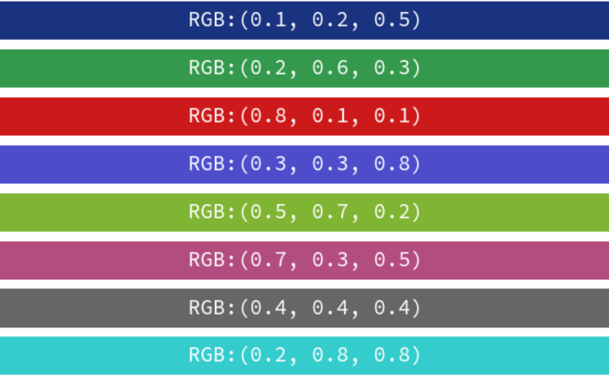
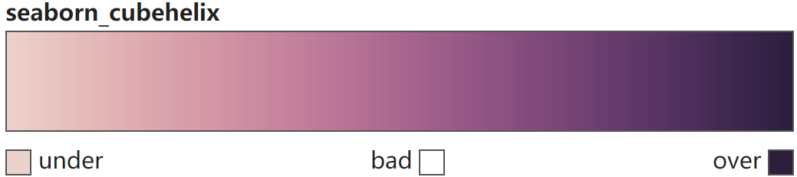
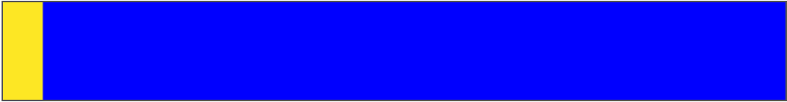

# 配色（Color、Colormap、Palette）与颜色条（Colorbar）

[colorkit.co](https://colorkit.co/)

{ width="50%" align="center"}

[Choosing color palettes — seaborn 0.13.2 documentation](https://seaborn.pydata.org/tutorial/color_palettes.html#general-principles-for-using-color-in-plots)


```Python title="导入模块" linenums="1"
import matplotlib as mpl
import matplotlib.pyplot as plt
import seaborn as sns
import numpy as np
```

## 基本概念

基于人眼工作方式，可以使用三个组分来定义特定的颜色。通常通过指定它们的 **RGB值** 来在计算机中编程颜色，这些值设置显示中红色、绿色和蓝色通道的强度。但为了分析颜色的感知属性，最好从色调(h)、饱和度(s)和亮度(l)通道的角度来考虑。

### 色调（Hue）

色调是区分“不同颜色”的非技术性组成部分。它是导致“红色”和“蓝色”等一级名称的颜色属性。**一般使用色调变化来表示不同类别，但色调变化不适合表示数值数据**。

{ width="50%" align="center"}

### 饱和度（Saturation）或色度（chroma）

饱和度（或色度）是色彩的鲜艳度。两种不同色调的颜色在饱和度更高时看起来会更加明显。

{ width="50%" align="center"}

### 亮度（Lightness）

亮度和发出的（或反射的，对于印刷颜色）光量相对应，范围从黑色到白色。调整亮度有助于在数据中看到结构，**亮度变化更直观地被视为重要性变化，细微的色调变化增加了两个值之间的感知距离**。

{ width="50%" align="center"}

## 单颜色（color）

[Specifying colors — Matplotlib 3.10.0 documentation](https://matplotlib.org/stable/users/explain/colors/colors.html#color-formats)

### 通用源格式

#### (R, G, B)格式

元组中浮点型数值位于[0, 1]之间（相对于[0, 255]），括号中数值依次表示Red, Green 和 Blue。

{ width="50%" align="center"}

#### (R, G, B, A)格式

元组中浮点型数值位于[0, 1]之间（相对于[0, 255]），括号中数值依次表示Red, Green, Blue 和 Alpha。

{ width="50%" align="center"}

#### RGB十六进制字符串格式

以#开头的六位十六进制字符串，每两个字符分别代表Red, Green 和 Blue（范围[00, FF]）。（#aabbcc可简写为#abc，适合快速定义简单的颜色，但颜色精确度较低。）

{ width="50%" align="center"}

{ width="50%" align="center"}

#### RGBA十六进制字符串格式

以#开头的八位十六进制字符串，每两个字符分别代表Red, Green, Blue 和 Alpha（范围[00, FF]）。（#aabbccdd可简写为#abcd，适合快速定义简单的颜色，但颜色精确度较低。）

{ width="50%" align="center"}
{ width="50%" align="center"}
#### 灰度浮点数

浮点型数值位于[0, 1]之间，其中0为纯黑色，1为白色。数值越大颜色越浅，适合需要不同深浅灰色的情境。

{ width="50%" align="center"}

### 单字母缩写格式

[List of named colors — Matplotlib 3.10.0 documentation](https://matplotlib.org/stable/gallery/color/named_colors.html#base-colors)

```Python title="单字母缩写格式" linenums="1"
mpl.colors.BASE_COLORS
"""
{'b': (0, 0, 1), 
 'g': (0, 0.5, 0), 
 'r': (1, 0, 0), 
 'c': (0, 0.75, 0.75), 
 'm': (0.75, 0, 0.75), 
 'y': (0.75, 0.75, 0), 
 'k': (0, 0, 0), 
 'w': (1, 1, 1)}
"""
```

{ width="50%" align="center"}

### CN格式与TABLEAU格式

[Colors in the default property cycle — Matplotlib 3.10.0 documentation](https://matplotlib.org/stable/gallery/color/color_cycle_default.html#colors-in-the-default-property-cycle)

[Specifying colors — Matplotlib 3.10.0 documentation](https://matplotlib.org/stable/users/explain/colors/colors.html#cn-color-selection)

[List of named colors — Matplotlib 3.10.0 documentation](https://matplotlib.org/stable/gallery/color/named_colors.html#tableau-palette)

"CN"颜色表示法是用来从默认的颜色循环(`#!python matplotlib.rcParams['axes.prop_cycle']`)中自动选择颜色。'C'后跟一个数字，该数字作为默认属性循环(default property cycle)中的索引。

=== "CN格式"

    ```Python title="CN格式" linenums="1"
    mpl.rcParams['axes.prop_cycle']
    """
    cycler('color', ['#1f77b4', '#ff7f0e', 
                     '#2ca02c', '#d62728', 
                     '#9467bd', '#8c564b', 
                     '#e377c2', '#7f7f7f', 
                     '#bcbd22', '#17becf'])
    """
    ```

=== "Tableau格式"

    ```Python title="Tableau格式" linenums="1"
    mpl.colors.TABLEAU_COLORS
    """
    {'tab:blue': '#1f77b4', 'tab:orange': '#ff7f0e', 
     'tab:green': '#2ca02c', 'tab:red': '#d62728', 
     'tab:purple': '#9467bd', 'tab:brown': '#8c564b', 
     'tab:pink': '#e377c2', 'tab:gray': '#7f7f7f', 
     'tab:olive': '#bcbd22', 'tab:cyan': '#17becf'}
    """
    ```

{ width="50%" align="center"}

### X11/CSS4格式

[List of named colors — Matplotlib 3.10.0 documentation](https://matplotlib.org/stable/gallery/color/named_colors.html#css-colors)

```Python title="X11/CSS4格式" linenums="1"
mpl.colors.CSS4_COLORS
"""
{'aliceblue': '#F0F8FF', 'antiquewhite': '#FAEBD7', 'aqua': '#00FFFF', 'aquamarine': '#7FFFD4', 'azure': '#F0FFFF', 'beige': '#F5F5DC', 'bisque': '#FFE4C4', 'black': '#000000', 'blanchedalmond': '#FFEBCD', 'blue': '#0000FF', 'blueviolet': '#8A2BE2', 'brown': '#A52A2A', 'burlywood': '#DEB887', 'cadetblue': '#5F9EA0', 'chartreuse': '#7FFF00', 'chocolate': '#D2691E', 'coral': '#FF7F50', 'cornflowerblue': '#6495ED', 'cornsilk': '#FFF8DC', 
 'crimson': '#DC143C', 'cyan': '#00FFFF', 'darkblue': '#00008B', 'darkcyan': '#008B8B', 'darkgoldenrod': '#B8860B', 'darkgray': '#A9A9A9', 'darkgreen': '#006400', 'darkgrey': '#A9A9A9', 'darkkhaki': '#BDB76B', 'darkmagenta': '#8B008B', 'darkolivegreen': '#556B2F', 'darkorange': '#FF8C00', 'darkorchid': '#9932CC', 'darkred': '#8B0000', 'darksalmon': '#E9967A', 'darkseagreen': '#8FBC8F', 'darkslateblue': '#483D8B', 'darkslategray': '#2F4F4F', 'darkslategrey': '#2F4F4F', 'darkturquoise': '#00CED1', 
 'darkviolet': '#9400D3', 'deeppink': '#FF1493', 'deepskyblue': '#00BFFF', 'dimgray': '#696969', 'dimgrey': '#696969', 'dodgerblue': '#1E90FF', 'firebrick': '#B22222', 'floralwhite': '#FFFAF0', 'forestgreen': '#228B22', 'fuchsia': '#FF00FF', 'gainsboro': '#DCDCDC', 'ghostwhite': '#F8F8FF', 'gold': '#FFD700', 'goldenrod': '#DAA520', 'gray': '#808080', 'green': '#008000', 'greenyellow': '#ADFF2F', 'grey': '#808080', 'honeydew': '#F0FFF0', 'hotpink': '#FF69B4', 
 'indianred': '#CD5C5C', 'indigo': '#4B0082', 'ivory': '#FFFFF0', 'khaki': '#F0E68C', 'lavender': '#E6E6FA', 'lavenderblush': '#FFF0F5', 'lawngreen': '#7CFC00', 'lemonchiffon': '#FFFACD', 'lightblue': '#ADD8E6', 'lightcoral': '#F08080', 'lightcyan': '#E0FFFF', 'lightgoldenrodyellow': '#FAFAD2', 'lightgray': '#D3D3D3', 'lightgreen': '#90EE90', 'lightgrey': '#D3D3D3', 'lightpink': '#FFB6C1', 'lightsalmon': '#FFA07A', 'lightseagreen': '#20B2AA', 'lightskyblue': '#87CEFA', 'lightslategray': '#778899', 
 'lightslategrey': '#778899', 'lightsteelblue': '#B0C4DE', 'lightyellow': '#FFFFE0', 'lime': '#00FF00', 'limegreen': '#32CD32', 'linen': '#FAF0E6', 'magenta': '#FF00FF', 'maroon': '#800000', 'mediumaquamarine': '#66CDAA', 'mediumblue': '#0000CD', 'mediumorchid': '#BA55D3', 'mediumpurple': '#9370DB', 'mediumseagreen': '#3CB371', 'mediumslateblue': '#7B68EE', 'mediumspringgreen': '#00FA9A', 'mediumturquoise': '#48D1CC', 'mediumvioletred': '#C71585', 'midnightblue': '#191970', 'mintcream': '#F5FFFA', 'mistyrose': '#FFE4E1', 
 'moccasin': '#FFE4B5', 'navajowhite': '#FFDEAD', 'navy': '#000080', 'oldlace': '#FDF5E6', 'olive': '#808000', 'olivedrab': '#6B8E23', 'orange': '#FFA500', 'orangered': '#FF4500', 'orchid': '#DA70D6', 'palegoldenrod': '#EEE8AA', 'palegreen': '#98FB98', 'paleturquoise': '#AFEEEE', 'palevioletred': '#DB7093', 'papayawhip': '#FFEFD5', 'peachpuff': '#FFDAB9', 'peru': '#CD853F', 'pink': '#FFC0CB', 'plum': '#DDA0DD', 'powderblue': '#B0E0E6', 'purple': '#800080', 
 'rebeccapurple': '#663399', 'red': '#FF0000', 'rosybrown': '#BC8F8F', 'royalblue': '#4169E1', 'saddlebrown': '#8B4513', 'salmon': '#FA8072', 'sandybrown': '#F4A460', 'seagreen': '#2E8B57', 'seashell': '#FFF5EE', 'sienna': '#A0522D', 'silver': '#C0C0C0', 'skyblue': '#87CEEB', 'slateblue': '#6A5ACD', 'slategray': '#708090', 'slategrey': '#708090', 'snow': '#FFFAFA', 'springgreen': '#00FF7F', 'steelblue': '#4682B4', 'tan': '#D2B48C', 
 'teal': '#008080', 'thistle': '#D8BFD8', 'tomato': '#FF6347', 'turquoise': '#40E0D0', 'violet': '#EE82EE', 'wheat': '#F5DEB3', 'white': '#FFFFFF', 'whitesmoke': '#F5F5F5', 'yellow': '#FFFF00', 'yellowgreen': '#9ACD32'}
"""
```

{ width="50%" align="center"}

### XKCD格式

[List of named colors — Matplotlib 3.10.0 documentation](https://matplotlib.org/stable/gallery/color/named_colors.html#xkcd-colors)

[xkcd.com](https://xkcd.com/color/rgb/)

[Specifying colors — Matplotlib 3.10.0 documentation](https://matplotlib.org/stable/users/explain/colors/colors.html#comparison-between-x11-css4-and-xkcd-colors)

```Python title="XKCD格式" linenums="1"
mpl.colors.XKCD_COLORS
"""
{'xkcd:cloudy blue': '#acc2d9', 'xkcd:dark pastel green': '#56ae57', 'xkcd:dust': '#b2996e', 'xkcd:electric lime': '#a8ff04', 'xkcd:fresh green': '#69d84f', 'xkcd:light eggplant': '#894585', 'xkcd:nasty green': '#70b23f', 'xkcd:really light blue': '#d4ffff', 'xkcd:tea': '#65ab7c', 'xkcd:warm purple': '#952e8f', 'xkcd:yellowish tan': '#fcfc81', 'xkcd:cement': '#a5a391', 
 'xkcd:dark grass green': '#388004', 'xkcd:dusty teal': '#4c9085', 'xkcd:grey teal': '#5e9b8a', 'xkcd:macaroni and cheese': '#efb435', 'xkcd:pinkish tan': '#d99b82', 'xkcd:spruce': '#0a5f38', 'xkcd:strong blue': '#0c06f7', 'xkcd:toxic green': '#61de2a', 'xkcd:windows blue': '#3778bf', 'xkcd:blue blue': '#2242c7', 'xkcd:blue with a hint of purple': '#533cc6', 'xkcd:booger': '#9bb53c', 'xkcd:bright sea green': '#05ffa6', 'xkcd:dark green blue': '#1f6357', 'xkcd:deep turquoise': '#017374', 'xkcd:green teal': '#0cb577', 'xkcd:strong pink': '#ff0789', 'xkcd:bland': '#afa88b', 'xkcd:deep aqua': '#08787f', 'xkcd:lavender pink': '#dd85d7', 'xkcd:light moss green': '#a6c875', 'xkcd:light seafoam green': '#a7ffb5', 'xkcd:olive yellow': '#c2b709', 'xkcd:pig pink': '#e78ea5', 'xkcd:deep lilac': '#966ebd', 'xkcd:desert': '#ccad60', 'xkcd:dusty lavender': '#ac86a8', 
 'xkcd:purpley grey': '#947e94', 'xkcd:purply': '#983fb2', 'xkcd:candy pink': '#ff63e9', 'xkcd:light pastel green': '#b2fba5', 'xkcd:boring green': '#63b365', 'xkcd:kiwi green': '#8ee53f', 'xkcd:light grey green': '#b7e1a1', 'xkcd:orange pink': '#ff6f52', 'xkcd:tea green': '#bdf8a3', 'xkcd:very light brown': '#d3b683', 'xkcd:egg shell': '#fffcc4', 'xkcd:eggplant purple': '#430541', 'xkcd:powder pink': '#ffb2d0', 'xkcd:reddish grey': '#997570', 'xkcd:baby shit brown': '#ad900d', 'xkcd:liliac': '#c48efd', 'xkcd:stormy blue': '#507b9c', 'xkcd:ugly brown': '#7d7103', 'xkcd:custard': '#fffd78', 'xkcd:darkish pink': '#da467d', 'xkcd:deep brown': '#410200', 'xkcd:greenish beige': '#c9d179', 'xkcd:manilla': '#fffa86', 
 'xkcd:off blue': '#5684ae', 'xkcd:battleship grey': '#6b7c85', 'xkcd:browny green': '#6f6c0a', 'xkcd:bruise': '#7e4071', 'xkcd:kelley green': '#009337', 'xkcd:sickly yellow': '#d0e429', 'xkcd:sunny yellow': '#fff917', 'xkcd:azul': '#1d5dec', 'xkcd:darkgreen': '#054907', 'xkcd:green/yellow': '#b5ce08', 'xkcd:lichen': '#8fb67b', 'xkcd:light light green': '#c8ffb0', 'xkcd:pale gold': '#fdde6c', 'xkcd:sun yellow': '#ffdf22', 'xkcd:tan green': '#a9be70', 'xkcd:burple': '#6832e3', 'xkcd:butterscotch': '#fdb147', 'xkcd:toupe': '#c7ac7d', 'xkcd:dark cream': '#fff39a', 'xkcd:indian red': '#850e04', 'xkcd:light lavendar': '#efc0fe', 'xkcd:poison green': '#40fd14', 'xkcd:baby puke green': '#b6c406', 'xkcd:bright yellow green': '#9dff00', 'xkcd:charcoal grey': '#3c4142', 'xkcd:squash': '#f2ab15', 'xkcd:cinnamon': '#ac4f06', 'xkcd:light pea green': '#c4fe82', 'xkcd:radioactive green': '#2cfa1f', 'xkcd:raw sienna': '#9a6200', 'xkcd:baby purple': '#ca9bf7', 'xkcd:cocoa': '#875f42', 'xkcd:light royal blue': '#3a2efe', 
 'xkcd:orangeish': '#fd8d49', 'xkcd:rust brown': '#8b3103', 'xkcd:sand brown': '#cba560', 'xkcd:swamp': '#698339', 'xkcd:tealish green': '#0cdc73', 'xkcd:burnt siena': '#b75203', 'xkcd:camo': '#7f8f4e', 'xkcd:dusk blue': '#26538d', 'xkcd:fern': '#63a950', 'xkcd:old rose': '#c87f89', 'xkcd:pale light green': '#b1fc99', 'xkcd:peachy pink': '#ff9a8a', 'xkcd:rosy pink': '#f6688e', 'xkcd:light bluish green': '#76fda8', 'xkcd:light bright green': '#53fe5c', 'xkcd:light neon green': '#4efd54', 'xkcd:light seafoam': '#a0febf', 'xkcd:tiffany blue': '#7bf2da', 'xkcd:washed out green': '#bcf5a6', 'xkcd:browny orange': '#ca6b02', 'xkcd:nice blue': '#107ab0', 'xkcd:sapphire': '#2138ab', 'xkcd:greyish teal': '#719f91', 'xkcd:orangey yellow': '#fdb915', 'xkcd:parchment': '#fefcaf', 'xkcd:straw': '#fcf679', 'xkcd:very dark brown': '#1d0200', 'xkcd:terracota': '#cb6843', 'xkcd:ugly blue': '#31668a', 'xkcd:clear blue': '#247afd', 'xkcd:creme': '#ffffb6', 'xkcd:foam green': '#90fda9', 'xkcd:grey/green': '#86a17d', 'xkcd:light gold': '#fddc5c', 'xkcd:seafoam blue': '#78d1b6', 'xkcd:topaz': '#13bbaf', 'xkcd:violet pink': '#fb5ffc', 'xkcd:wintergreen': '#20f986', 'xkcd:yellow tan': '#ffe36e', 
 'xkcd:dark fuchsia': '#9d0759', 'xkcd:indigo blue': '#3a18b1', 'xkcd:light yellowish green': '#c2ff89', 'xkcd:pale magenta': '#d767ad', 'xkcd:rich purple': '#720058', 'xkcd:sunflower yellow': '#ffda03', 'xkcd:green/blue': '#01c08d', 'xkcd:leather': '#ac7434', 'xkcd:racing green': '#014600', 'xkcd:vivid purple': '#9900fa', 'xkcd:dark royal blue': '#02066f', 'xkcd:hazel': '#8e7618', 'xkcd:muted pink': '#d1768f', 'xkcd:booger green': '#96b403', 'xkcd:canary': '#fdff63', 'xkcd:cool grey': '#95a3a6', 'xkcd:dark taupe': '#7f684e', 'xkcd:darkish purple': '#751973', 'xkcd:true green': '#089404', 'xkcd:coral pink': '#ff6163', 'xkcd:dark sage': '#598556', 'xkcd:dark slate blue': '#214761', 'xkcd:flat blue': '#3c73a8', 'xkcd:mushroom': '#ba9e88', 'xkcd:rich blue': '#021bf9', 'xkcd:dirty purple': '#734a65', 'xkcd:greenblue': '#23c48b', 'xkcd:icky green': '#8fae22', 'xkcd:light khaki': '#e6f2a2', 'xkcd:warm blue': '#4b57db', 'xkcd:dark hot pink': '#d90166', 'xkcd:deep sea blue': '#015482', 'xkcd:carmine': '#9d0216', 'xkcd:dark yellow green': '#728f02', 'xkcd:pale peach': '#ffe5ad', 'xkcd:plum purple': '#4e0550', 'xkcd:golden rod': '#f9bc08', 'xkcd:neon red': '#ff073a', 'xkcd:old pink': '#c77986', 'xkcd:very pale blue': '#d6fffe', 'xkcd:blood orange': '#fe4b03', 'xkcd:grapefruit': '#fd5956', 'xkcd:sand yellow': '#fce166', 'xkcd:clay brown': '#b2713d', 'xkcd:dark blue grey': '#1f3b4d', 'xkcd:flat green': '#699d4c', 'xkcd:light green blue': '#56fca2', 'xkcd:warm pink': '#fb5581', 'xkcd:dodger blue': '#3e82fc', 'xkcd:gross green': '#a0bf16', 'xkcd:ice': '#d6fffa', 
 'xkcd:metallic blue': '#4f738e', 'xkcd:pale salmon': '#ffb19a', 'xkcd:sap green': '#5c8b15', 'xkcd:algae': '#54ac68', 'xkcd:bluey grey': '#89a0b0', 'xkcd:greeny grey': '#7ea07a', 'xkcd:highlighter green': '#1bfc06', 'xkcd:light light blue': '#cafffb', 'xkcd:light mint': '#b6ffbb', 'xkcd:raw umber': '#a75e09', 'xkcd:vivid blue': '#152eff', 'xkcd:deep lavender': '#8d5eb7', 'xkcd:dull teal': '#5f9e8f', 'xkcd:light greenish blue': '#63f7b4', 'xkcd:mud green': '#606602', 'xkcd:pinky': '#fc86aa', 'xkcd:red wine': '#8c0034', 'xkcd:shit green': '#758000', 'xkcd:tan brown': '#ab7e4c', 'xkcd:darkblue': '#030764', 'xkcd:rosa': '#fe86a4', 'xkcd:lipstick': '#d5174e', 'xkcd:pale mauve': '#fed0fc', 'xkcd:claret': '#680018', 'xkcd:dandelion': '#fedf08', 'xkcd:orangered': '#fe420f', 'xkcd:poop green': '#6f7c00', 'xkcd:ruby': '#ca0147', 'xkcd:dark': '#1b2431', 'xkcd:greenish turquoise': '#00fbb0', 'xkcd:pastel red': '#db5856', 'xkcd:piss yellow': '#ddd618', 'xkcd:bright cyan': '#41fdfe', 'xkcd:dark coral': '#cf524e', 'xkcd:algae green': '#21c36f', 'xkcd:darkish red': '#a90308', 'xkcd:reddy brown': '#6e1005', 'xkcd:blush pink': '#fe828c', 'xkcd:camouflage green': '#4b6113', 'xkcd:lawn green': '#4da409', 'xkcd:putty': '#beae8a', 'xkcd:vibrant blue': '#0339f8', 'xkcd:dark sand': '#a88f59', 'xkcd:purple/blue': '#5d21d0', 'xkcd:saffron': '#feb209', 'xkcd:twilight': '#4e518b', 'xkcd:warm brown': '#964e02', 'xkcd:bluegrey': '#85a3b2', 'xkcd:bubble gum pink': '#ff69af', 'xkcd:duck egg blue': '#c3fbf4', 'xkcd:greenish cyan': '#2afeb7', 'xkcd:petrol': '#005f6a', 'xkcd:royal': '#0c1793', 'xkcd:butter': '#ffff81', 'xkcd:dusty orange': '#f0833a', 'xkcd:off yellow': '#f1f33f', 'xkcd:pale olive green': '#b1d27b', 'xkcd:orangish': '#fc824a', 'xkcd:leaf': '#71aa34', 'xkcd:light blue grey': '#b7c9e2', 'xkcd:dried blood': '#4b0101', 'xkcd:lightish purple': '#a552e6', 'xkcd:rusty red': '#af2f0d', 'xkcd:lavender blue': '#8b88f8', 'xkcd:light grass green': '#9af764', 'xkcd:light mint green': '#a6fbb2', 
 'xkcd:sunflower': '#ffc512', 'xkcd:velvet': '#750851', 'xkcd:brick orange': '#c14a09', 'xkcd:lightish red': '#fe2f4a', 'xkcd:pure blue': '#0203e2', 'xkcd:twilight blue': '#0a437a', 'xkcd:violet red': '#a50055', 'xkcd:yellowy brown': '#ae8b0c', 'xkcd:carnation': '#fd798f', 'xkcd:muddy yellow': '#bfac05', 'xkcd:dark seafoam green': '#3eaf76', 'xkcd:deep rose': '#c74767', 'xkcd:dusty red': '#b9484e', 'xkcd:grey/blue': '#647d8e', 'xkcd:lemon lime': '#bffe28', 'xkcd:purple/pink': '#d725de', 'xkcd:brown yellow': '#b29705', 'xkcd:purple brown': '#673a3f', 'xkcd:wisteria': '#a87dc2', 'xkcd:banana yellow': '#fafe4b', 'xkcd:lipstick red': '#c0022f', 'xkcd:water blue': '#0e87cc', 'xkcd:brown grey': '#8d8468', 'xkcd:vibrant purple': '#ad03de', 'xkcd:baby green': '#8cff9e', 'xkcd:barf green': '#94ac02', 'xkcd:eggshell blue': '#c4fff7', 'xkcd:sandy yellow': '#fdee73', 'xkcd:cool green': '#33b864', 'xkcd:pale': '#fff9d0', 'xkcd:blue/grey': '#758da3', 'xkcd:hot magenta': '#f504c9', 'xkcd:greyblue': '#77a1b5', 'xkcd:purpley': '#8756e4', 'xkcd:baby shit green': '#889717', 'xkcd:brownish pink': '#c27e79', 'xkcd:dark aquamarine': '#017371', 'xkcd:diarrhea': '#9f8303', 'xkcd:light mustard': '#f7d560', 'xkcd:pale sky blue': '#bdf6fe', 'xkcd:turtle green': '#75b84f', 'xkcd:bright olive': '#9cbb04', 'xkcd:dark grey blue': '#29465b', 'xkcd:greeny brown': '#696006', 'xkcd:lemon green': '#adf802', 'xkcd:light periwinkle': '#c1c6fc', 'xkcd:seaweed green': '#35ad6b', 'xkcd:sunshine yellow': '#fffd37', 'xkcd:ugly purple': '#a442a0', 'xkcd:medium pink': '#f36196', 'xkcd:puke brown': '#947706', 'xkcd:very light pink': '#fff4f2', 'xkcd:viridian': '#1e9167', 'xkcd:bile': '#b5c306', 'xkcd:faded yellow': '#feff7f', 'xkcd:very pale green': '#cffdbc', 'xkcd:vibrant green': '#0add08', 'xkcd:bright lime': '#87fd05', 'xkcd:spearmint': '#1ef876', 'xkcd:light aquamarine': '#7bfdc7', 'xkcd:light sage': '#bcecac', 'xkcd:yellowgreen': '#bbf90f', 'xkcd:baby poo': '#ab9004', 'xkcd:dark seafoam': '#1fb57a', 'xkcd:deep teal': '#00555a', 'xkcd:heather': '#a484ac', 'xkcd:rust orange': '#c45508', 'xkcd:dirty blue': '#3f829d', 'xkcd:fern green': '#548d44', 'xkcd:bright lilac': '#c95efb', 'xkcd:weird green': '#3ae57f', 'xkcd:peacock blue': '#016795', 'xkcd:avocado green': '#87a922', 'xkcd:faded orange': '#f0944d', 
 'xkcd:grape purple': '#5d1451', 'xkcd:hot green': '#25ff29', 'xkcd:lime yellow': '#d0fe1d', 'xkcd:mango': '#ffa62b', 'xkcd:shamrock': '#01b44c', 'xkcd:bubblegum': '#ff6cb5', 'xkcd:purplish brown': '#6b4247', 'xkcd:vomit yellow': '#c7c10c', 'xkcd:pale cyan': '#b7fffa', 'xkcd:key lime': '#aeff6e', 'xkcd:tomato red': '#ec2d01', 'xkcd:lightgreen': '#76ff7b', 'xkcd:merlot': '#730039', 'xkcd:night blue': '#040348', 'xkcd:purpleish pink': '#df4ec8', 'xkcd:apple': '#6ecb3c', 'xkcd:baby poop green': '#8f9805', 'xkcd:green apple': '#5edc1f', 'xkcd:heliotrope': '#d94ff5', 'xkcd:yellow/green': '#c8fd3d', 'xkcd:almost black': '#070d0d', 'xkcd:cool blue': '#4984b8', 'xkcd:leafy green': '#51b73b', 'xkcd:mustard brown': '#ac7e04', 'xkcd:dusk': '#4e5481', 'xkcd:dull brown': '#876e4b', 'xkcd:frog green': '#58bc08', 'xkcd:vivid green': '#2fef10', 'xkcd:bright light green': '#2dfe54', 'xkcd:fluro green': '#0aff02', 'xkcd:kiwi': '#9cef43', 'xkcd:seaweed': '#18d17b', 'xkcd:navy green': '#35530a', 'xkcd:ultramarine blue': '#1805db', 'xkcd:iris': '#6258c4', 'xkcd:pastel orange': '#ff964f', 'xkcd:yellowish orange': '#ffab0f', 'xkcd:perrywinkle': '#8f8ce7', 'xkcd:tealish': '#24bca8', 'xkcd:dark plum': '#3f012c', 'xkcd:pear': '#cbf85f', 'xkcd:pinkish orange': '#ff724c', 'xkcd:midnight purple': '#280137', 'xkcd:light urple': '#b36ff6', 'xkcd:dark mint': '#48c072', 'xkcd:greenish tan': '#bccb7a', 'xkcd:light burgundy': '#a8415b', 'xkcd:turquoise blue': '#06b1c4', 'xkcd:ugly pink': '#cd7584', 'xkcd:sandy': '#f1da7a', 'xkcd:electric pink': '#ff0490', 'xkcd:muted purple': '#805b87', 'xkcd:mid green': '#50a747', 'xkcd:greyish': '#a8a495', 'xkcd:neon yellow': '#cfff04', 'xkcd:banana': '#ffff7e', 'xkcd:carnation pink': '#ff7fa7', 'xkcd:tomato': '#ef4026', 'xkcd:sea': '#3c9992', 'xkcd:muddy brown': '#886806', 'xkcd:turquoise green': '#04f489', 'xkcd:buff': '#fef69e', 'xkcd:fawn': '#cfaf7b', 'xkcd:muted blue': '#3b719f', 'xkcd:pale rose': '#fdc1c5', 'xkcd:dark mint green': '#20c073', 'xkcd:amethyst': '#9b5fc0', 'xkcd:blue/green': '#0f9b8e', 'xkcd:chestnut': '#742802', 'xkcd:sick green': '#9db92c', 'xkcd:pea': '#a4bf20', 'xkcd:rusty orange': '#cd5909', 'xkcd:stone': '#ada587', 'xkcd:rose red': '#be013c', 'xkcd:pale aqua': '#b8ffeb', 'xkcd:deep orange': '#dc4d01', 'xkcd:earth': '#a2653e', 'xkcd:mossy green': '#638b27', 'xkcd:grassy green': '#419c03', 'xkcd:pale lime green': '#b1ff65', 'xkcd:light grey blue': '#9dbcd4', 'xkcd:pale grey': '#fdfdfe', 'xkcd:asparagus': '#77ab56', 'xkcd:blueberry': '#464196', 'xkcd:purple red': '#990147', 'xkcd:pale lime': '#befd73', 'xkcd:greenish teal': '#32bf84', 'xkcd:caramel': '#af6f09', 'xkcd:deep magenta': '#a0025c', 'xkcd:light peach': '#ffd8b1', 'xkcd:milk chocolate': '#7f4e1e', 'xkcd:ocher': '#bf9b0c', 'xkcd:off green': '#6ba353', 'xkcd:purply pink': '#f075e6', 'xkcd:lightblue': '#7bc8f6', 'xkcd:dusky blue': '#475f94', 'xkcd:golden': '#f5bf03', 'xkcd:light beige': '#fffeb6', 'xkcd:butter yellow': '#fffd74', 'xkcd:dusky purple': '#895b7b', 'xkcd:french blue': '#436bad', 'xkcd:ugly yellow': '#d0c101', 'xkcd:greeny yellow': '#c6f808', 'xkcd:orangish red': '#f43605', 'xkcd:shamrock green': '#02c14d', 'xkcd:orangish brown': '#b25f03', 'xkcd:tree green': '#2a7e19', 'xkcd:deep violet': '#490648', 'xkcd:gunmetal': '#536267', 'xkcd:blue/purple': '#5a06ef', 'xkcd:cherry': '#cf0234', 'xkcd:sandy brown': '#c4a661', 'xkcd:warm grey': '#978a84', 'xkcd:dark indigo': '#1f0954', 'xkcd:midnight': '#03012d', 'xkcd:bluey green': '#2bb179', 'xkcd:grey pink': '#c3909b', 'xkcd:soft purple': '#a66fb5', 'xkcd:blood': '#770001', 'xkcd:brown red': '#922b05', 'xkcd:medium grey': '#7d7f7c', 'xkcd:berry': '#990f4b', 'xkcd:poo': '#8f7303', 'xkcd:purpley pink': '#c83cb9', 'xkcd:light salmon': '#fea993', 'xkcd:snot': '#acbb0d', 'xkcd:easter purple': '#c071fe', 'xkcd:light yellow green': '#ccfd7f', 'xkcd:dark navy blue': '#00022e', 'xkcd:drab': '#828344', 'xkcd:light rose': '#ffc5cb', 'xkcd:rouge': '#ab1239', 'xkcd:purplish red': '#b0054b', 'xkcd:slime green': '#99cc04', 'xkcd:baby poop': '#937c00', 'xkcd:irish green': '#019529', 'xkcd:pink/purple': '#ef1de7', 'xkcd:dark navy': '#000435', 'xkcd:greeny blue': '#42b395', 'xkcd:light plum': '#9d5783', 'xkcd:pinkish grey': '#c8aca9', 'xkcd:dirty orange': '#c87606', 'xkcd:rust red': '#aa2704', 'xkcd:pale lilac': '#e4cbff', 'xkcd:orangey red': '#fa4224', 'xkcd:primary blue': '#0804f9', 'xkcd:kermit green': '#5cb200', 'xkcd:brownish purple': '#76424e', 'xkcd:murky green': '#6c7a0e', 'xkcd:wheat': '#fbdd7e', 'xkcd:very dark purple': '#2a0134', 'xkcd:bottle green': '#044a05', 'xkcd:watermelon': '#fd4659', 'xkcd:deep sky blue': '#0d75f8', 'xkcd:fire engine red': '#fe0002', 'xkcd:yellow ochre': '#cb9d06', 'xkcd:pumpkin orange': '#fb7d07', 'xkcd:pale olive': '#b9cc81', 'xkcd:light lilac': '#edc8ff', 'xkcd:lightish green': '#61e160', 'xkcd:carolina blue': '#8ab8fe', 'xkcd:mulberry': '#920a4e', 'xkcd:shocking pink': '#fe02a2', 'xkcd:auburn': '#9a3001', 'xkcd:bright lime green': '#65fe08', 'xkcd:celadon': '#befdb7', 'xkcd:pinkish brown': '#b17261', 'xkcd:poo brown': '#885f01', 'xkcd:bright sky blue': '#02ccfe', 'xkcd:celery': '#c1fd95', 'xkcd:dirt brown': '#836539', 'xkcd:strawberry': '#fb2943', 'xkcd:dark lime': '#84b701', 'xkcd:copper': '#b66325', 'xkcd:medium brown': '#7f5112', 'xkcd:muted green': '#5fa052', "xkcd:robin's egg": '#6dedfd', 'xkcd:bright aqua': '#0bf9ea', 'xkcd:bright lavender': '#c760ff', 'xkcd:ivory': '#ffffcb', 'xkcd:very light purple': '#f6cefc', 'xkcd:light navy': '#155084', 'xkcd:pink red': '#f5054f', 'xkcd:olive brown': '#645403', 'xkcd:poop brown': '#7a5901', 'xkcd:mustard green': '#a8b504', 'xkcd:ocean green': '#3d9973', 'xkcd:very dark blue': '#000133', 'xkcd:dusty green': '#76a973', 'xkcd:light navy blue': '#2e5a88', 'xkcd:minty green': '#0bf77d', 'xkcd:adobe': '#bd6c48', 'xkcd:barney': '#ac1db8', 'xkcd:jade green': '#2baf6a', 'xkcd:bright light blue': '#26f7fd', 'xkcd:light lime': '#aefd6c', 'xkcd:dark khaki': '#9b8f55', 'xkcd:orange yellow': '#ffad01', 'xkcd:ocre': '#c69c04', 'xkcd:maize': '#f4d054', 'xkcd:faded pink': '#de9dac', 'xkcd:british racing green': '#05480d', 'xkcd:sandstone': '#c9ae74', 'xkcd:mud brown': '#60460f', 'xkcd:light sea green': '#98f6b0', 'xkcd:robin egg blue': '#8af1fe', 'xkcd:aqua marine': '#2ee8bb', 'xkcd:dark sea green': '#11875d', 'xkcd:soft pink': '#fdb0c0', 'xkcd:orangey brown': '#b16002', 'xkcd:cherry red': '#f7022a', 'xkcd:burnt yellow': '#d5ab09', 'xkcd:brownish grey': '#86775f', 'xkcd:camel': '#c69f59', 'xkcd:purplish grey': '#7a687f', 'xkcd:marine': '#042e60', 'xkcd:greyish pink': '#c88d94', 'xkcd:pale turquoise': '#a5fbd5', 'xkcd:pastel yellow': '#fffe71', 'xkcd:bluey purple': '#6241c7', 'xkcd:canary yellow': '#fffe40', 'xkcd:faded red': '#d3494e', 'xkcd:sepia': '#985e2b', 'xkcd:coffee': '#a6814c', 'xkcd:bright magenta': '#ff08e8', 'xkcd:mocha': '#9d7651', 'xkcd:ecru': '#feffca', 'xkcd:purpleish': '#98568d', 'xkcd:cranberry': '#9e003a', 'xkcd:darkish green': '#287c37', 'xkcd:brown orange': '#b96902', 'xkcd:dusky rose': '#ba6873', 'xkcd:melon': '#ff7855', 'xkcd:sickly green': '#94b21c', 'xkcd:silver': '#c5c9c7', 'xkcd:purply blue': '#661aee', 'xkcd:purpleish blue': '#6140ef', 'xkcd:hospital green': '#9be5aa', 'xkcd:shit brown': '#7b5804', 'xkcd:mid blue': '#276ab3', 'xkcd:amber': '#feb308', 'xkcd:easter green': '#8cfd7e', 'xkcd:soft blue': '#6488ea', 'xkcd:cerulean blue': '#056eee', 'xkcd:golden brown': '#b27a01', 'xkcd:bright turquoise': '#0ffef9', 'xkcd:red pink': '#fa2a55', 'xkcd:red purple': '#820747', 'xkcd:greyish brown': '#7a6a4f', 'xkcd:vermillion': '#f4320c', 'xkcd:russet': '#a13905', 'xkcd:steel grey': '#6f828a', 'xkcd:lighter purple': '#a55af4', 'xkcd:bright violet': '#ad0afd', 'xkcd:prussian blue': '#004577', 'xkcd:slate green': '#658d6d', 'xkcd:dirty pink': '#ca7b80', 'xkcd:dark blue green': '#005249', 'xkcd:pine': '#2b5d34', 'xkcd:yellowy green': '#bff128', 'xkcd:dark gold': '#b59410', 'xkcd:bluish': '#2976bb', 'xkcd:darkish blue': '#014182', 'xkcd:dull red': '#bb3f3f', 'xkcd:pinky red': '#fc2647', 'xkcd:bronze': '#a87900', 'xkcd:pale teal': '#82cbb2', 'xkcd:military green': '#667c3e', 'xkcd:barbie pink': '#fe46a5', 'xkcd:bubblegum pink': '#fe83cc', 'xkcd:pea soup green': '#94a617', 'xkcd:dark mustard': '#a88905', 'xkcd:shit': '#7f5f00', 'xkcd:medium purple': '#9e43a2', 'xkcd:very dark green': '#062e03', 'xkcd:dirt': '#8a6e45', 'xkcd:dusky pink': '#cc7a8b', 'xkcd:red violet': '#9e0168', 'xkcd:lemon yellow': '#fdff38', 'xkcd:pistachio': '#c0fa8b', 'xkcd:dull yellow': '#eedc5b', 'xkcd:dark lime green': '#7ebd01', 'xkcd:denim blue': '#3b5b92', 'xkcd:teal blue': '#01889f', 'xkcd:lightish blue': '#3d7afd', 'xkcd:purpley blue': '#5f34e7', 'xkcd:light indigo': '#6d5acf', 'xkcd:swamp green': '#748500', 'xkcd:brown green': '#706c11', 'xkcd:dark maroon': '#3c0008', 'xkcd:hot purple': '#cb00f5', 'xkcd:dark forest green': '#002d04', 'xkcd:faded blue': '#658cbb', 'xkcd:drab green': '#749551', 'xkcd:light lime green': '#b9ff66', 'xkcd:snot green': '#9dc100', 'xkcd:yellowish': '#faee66', 'xkcd:light blue green': '#7efbb3', 'xkcd:bordeaux': '#7b002c', 'xkcd:light mauve': '#c292a1', 'xkcd:ocean': '#017b92', 'xkcd:marigold': '#fcc006', 'xkcd:muddy green': '#657432', 'xkcd:dull orange': '#d8863b', 'xkcd:steel': '#738595', 'xkcd:electric purple': '#aa23ff', 'xkcd:fluorescent green': '#08ff08', 'xkcd:yellowish brown': '#9b7a01', 'xkcd:blush': '#f29e8e', 'xkcd:soft green': '#6fc276', 'xkcd:bright orange': '#ff5b00', 'xkcd:lemon': '#fdff52', 'xkcd:purple grey': '#866f85', 'xkcd:acid green': '#8ffe09', 'xkcd:pale lavender': '#eecffe', 'xkcd:violet blue': '#510ac9', 'xkcd:light forest green': '#4f9153', 'xkcd:burnt red': '#9f2305', 'xkcd:khaki green': '#728639', 'xkcd:cerise': '#de0c62', 'xkcd:faded purple': '#916e99', 'xkcd:apricot': '#ffb16d', 'xkcd:dark olive green': '#3c4d03', 'xkcd:grey brown': '#7f7053', 'xkcd:green grey': '#77926f', 'xkcd:true blue': '#010fcc', 'xkcd:pale violet': '#ceaefa', 'xkcd:periwinkle blue': '#8f99fb', 'xkcd:light sky blue': '#c6fcff', 'xkcd:blurple': '#5539cc', 'xkcd:green brown': '#544e03', 'xkcd:bluegreen': '#017a79', 'xkcd:bright teal': '#01f9c6', 'xkcd:brownish yellow': '#c9b003', 'xkcd:pea soup': '#929901', 'xkcd:forest': '#0b5509', 'xkcd:barney purple': '#a00498', 'xkcd:ultramarine': '#2000b1', 'xkcd:purplish': '#94568c', 'xkcd:puke yellow': '#c2be0e', 'xkcd:bluish grey': '#748b97', 'xkcd:dark periwinkle': '#665fd1', 'xkcd:dark lilac': '#9c6da5', 'xkcd:reddish': '#c44240', 'xkcd:light maroon': '#a24857', 'xkcd:dusty purple': '#825f87', 'xkcd:terra cotta': '#c9643b', 'xkcd:avocado': '#90b134', 'xkcd:marine blue': '#01386a', 'xkcd:teal green': '#25a36f', 'xkcd:slate grey': '#59656d', 'xkcd:lighter green': '#75fd63', 'xkcd:electric green': '#21fc0d', 'xkcd:dusty blue': '#5a86ad', 'xkcd:golden yellow': '#fec615', 'xkcd:bright yellow': '#fffd01', 'xkcd:light lavender': '#dfc5fe', 'xkcd:umber': '#b26400', 'xkcd:poop': '#7f5e00', 'xkcd:dark peach': '#de7e5d', 'xkcd:jungle green': '#048243', 'xkcd:eggshell': '#ffffd4', 'xkcd:denim': '#3b638c', 'xkcd:yellow brown': '#b79400', 'xkcd:dull purple': '#84597e', 'xkcd:chocolate brown': '#411900', 'xkcd:wine red': '#7b0323', 'xkcd:neon blue': '#04d9ff', 'xkcd:dirty green': '#667e2c', 'xkcd:light tan': '#fbeeac', 'xkcd:ice blue': '#d7fffe', 'xkcd:cadet blue': '#4e7496', 'xkcd:dark mauve': '#874c62', 'xkcd:very light blue': '#d5ffff', 'xkcd:grey purple': '#826d8c', 'xkcd:pastel pink': '#ffbacd', 'xkcd:very light green': '#d1ffbd', 'xkcd:dark sky blue': '#448ee4', 'xkcd:evergreen': '#05472a', 'xkcd:dull pink': '#d5869d', 'xkcd:aubergine': '#3d0734', 'xkcd:mahogany': '#4a0100', 'xkcd:reddish orange': '#f8481c', 'xkcd:deep green': '#02590f', 'xkcd:vomit green': '#89a203', 'xkcd:purple pink': '#e03fd8', 'xkcd:dusty pink': '#d58a94', 'xkcd:faded green': '#7bb274', 'xkcd:camo green': '#526525', 'xkcd:pinky purple': '#c94cbe', 'xkcd:pink purple': '#db4bda', 'xkcd:brownish red': '#9e3623', 'xkcd:dark rose': '#b5485d', 'xkcd:mud': '#735c12', 'xkcd:brownish': '#9c6d57', 'xkcd:emerald green': '#028f1e', 'xkcd:pale brown': '#b1916e', 'xkcd:dull blue': '#49759c', 'xkcd:burnt umber': '#a0450e', 'xkcd:medium green': '#39ad48', 'xkcd:clay': '#b66a50', 'xkcd:light aqua': '#8cffdb', 'xkcd:light olive green': '#a4be5c', 'xkcd:brownish orange': '#cb7723', 'xkcd:dark aqua': '#05696b', 'xkcd:purplish pink': '#ce5dae', 'xkcd:dark salmon': '#c85a53', 'xkcd:greenish grey': '#96ae8d', 'xkcd:jade': '#1fa774', 'xkcd:ugly green': '#7a9703', 'xkcd:dark beige': '#ac9362', 'xkcd:emerald': '#01a049', 'xkcd:pale red': '#d9544d', 'xkcd:light magenta': '#fa5ff7', 'xkcd:sky': '#82cafc', 'xkcd:light cyan': '#acfffc', 'xkcd:yellow orange': '#fcb001', 'xkcd:reddish purple': '#910951', 'xkcd:reddish pink': '#fe2c54', 'xkcd:orchid': '#c875c4', 'xkcd:dirty yellow': '#cdc50a', 'xkcd:orange red': '#fd411e', 'xkcd:deep red': '#9a0200', 'xkcd:orange brown': '#be6400', 'xkcd:cobalt blue': '#030aa7', 'xkcd:neon pink': '#fe019a', 'xkcd:rose pink': '#f7879a', 'xkcd:greyish purple': '#887191', 'xkcd:raspberry': '#b00149', 'xkcd:aqua green': '#12e193', 'xkcd:salmon pink': '#fe7b7c', 'xkcd:tangerine': '#ff9408', 'xkcd:brownish green': '#6a6e09', 'xkcd:red brown': '#8b2e16', 'xkcd:greenish brown': '#696112', 'xkcd:pumpkin': '#e17701', 'xkcd:pine green': '#0a481e', 'xkcd:charcoal': '#343837', 'xkcd:baby pink': '#ffb7ce', 'xkcd:cornflower': '#6a79f7', 'xkcd:blue violet': '#5d06e9', 'xkcd:chocolate': '#3d1c02', 'xkcd:greyish green': '#82a67d', 'xkcd:scarlet': '#be0119', 'xkcd:green yellow': '#c9ff27', 'xkcd:dark olive': '#373e02', 'xkcd:sienna': '#a9561e', 'xkcd:pastel purple': '#caa0ff', 'xkcd:terracotta': '#ca6641', 'xkcd:aqua blue': '#02d8e9', 'xkcd:sage green': '#88b378', 'xkcd:blood red': '#980002', 'xkcd:deep pink': '#cb0162', 'xkcd:grass': '#5cac2d', 'xkcd:moss': '#769958', 'xkcd:pastel blue': '#a2bffe', 'xkcd:bluish green': '#10a674', 'xkcd:green blue': '#06b48b', 'xkcd:dark tan': '#af884a', 'xkcd:greenish blue': '#0b8b87', 'xkcd:pale orange': '#ffa756', 'xkcd:vomit': '#a2a415', 'xkcd:forrest green': '#154406', 'xkcd:dark lavender': '#856798', 'xkcd:dark violet': '#34013f', 'xkcd:purple blue': '#632de9', 'xkcd:dark cyan': '#0a888a', 'xkcd:olive drab': '#6f7632', 'xkcd:pinkish': '#d46a7e', 'xkcd:cobalt': '#1e488f', 'xkcd:neon purple': '#bc13fe', 'xkcd:light turquoise': '#7ef4cc', 'xkcd:apple green': '#76cd26', 'xkcd:dull green': '#74a662', 'xkcd:wine': '#80013f', 'xkcd:powder blue': '#b1d1fc', 'xkcd:off white': '#ffffe4', 'xkcd:electric blue': '#0652ff', 'xkcd:dark turquoise': '#045c5a', 'xkcd:blue purple': '#5729ce', 'xkcd:azure': '#069af3', 'xkcd:bright red': '#ff000d', 'xkcd:pinkish red': '#f10c45', 'xkcd:cornflower blue': '#5170d7', 'xkcd:light olive': '#acbf69', 'xkcd:grape': '#6c3461', 'xkcd:greyish blue': '#5e819d', 'xkcd:purplish blue': '#601ef9', 'xkcd:yellowish green': '#b0dd16', 'xkcd:greenish yellow': '#cdfd02', 'xkcd:medium blue': '#2c6fbb', 'xkcd:dusty rose': '#c0737a', 'xkcd:light violet': '#d6b4fc', 'xkcd:midnight blue': '#020035', 'xkcd:bluish purple': '#703be7', 'xkcd:red orange': '#fd3c06', 'xkcd:dark magenta': '#960056', 'xkcd:greenish': '#40a368', 'xkcd:ocean blue': '#03719c', 'xkcd:coral': '#fc5a50', 'xkcd:cream': '#ffffc2', 'xkcd:reddish brown': '#7f2b0a', 'xkcd:burnt sienna': '#b04e0f', 'xkcd:brick': '#a03623', 'xkcd:sage': '#87ae73', 'xkcd:grey green': '#789b73', 'xkcd:white': '#ffffff', "xkcd:robin's egg blue": '#98eff9', 'xkcd:moss green': '#658b38', 'xkcd:steel blue': '#5a7d9a', 'xkcd:eggplant': '#380835', 'xkcd:light yellow': '#fffe7a', 'xkcd:leaf green': '#5ca904', 'xkcd:light grey': '#d8dcd6', 'xkcd:puke': '#a5a502', 'xkcd:pinkish purple': '#d648d7', 'xkcd:sea blue': '#047495', 'xkcd:pale purple': '#b790d4', 'xkcd:slate blue': '#5b7c99', 'xkcd:blue grey': '#607c8e', 'xkcd:hunter green': '#0b4008', 'xkcd:fuchsia': '#ed0dd9', 'xkcd:crimson': '#8c000f', 'xkcd:pale yellow': '#ffff84', 'xkcd:ochre': '#bf9005', 'xkcd:mustard yellow': '#d2bd0a', 'xkcd:light red': '#ff474c', 'xkcd:cerulean': '#0485d1', 'xkcd:pale pink': '#ffcfdc', 'xkcd:deep blue': '#040273', 'xkcd:rust': '#a83c09', 'xkcd:light teal': '#90e4c1', 'xkcd:slate': '#516572', 'xkcd:goldenrod': '#fac205', 'xkcd:dark yellow': '#d5b60a', 'xkcd:dark grey': '#363737', 'xkcd:army green': '#4b5d16', 'xkcd:grey blue': '#6b8ba4', 'xkcd:seafoam': '#80f9ad', 'xkcd:puce': '#a57e52', 'xkcd:spring green': '#a9f971', 'xkcd:dark orange': '#c65102', 'xkcd:sand': '#e2ca76', 'xkcd:pastel green': '#b0ff9d', 'xkcd:mint': '#9ffeb0', 'xkcd:light orange': '#fdaa48', 'xkcd:bright pink': '#fe01b1', 'xkcd:chartreuse': '#c1f80a', 'xkcd:deep purple': '#36013f', 'xkcd:dark brown': '#341c02', 'xkcd:taupe': '#b9a281', 'xkcd:pea green': '#8eab12', 'xkcd:puke green': '#9aae07', 'xkcd:kelly green': '#02ab2e', 'xkcd:seafoam green': '#7af9ab', 'xkcd:blue green': '#137e6d', 'xkcd:khaki': '#aaa662', 'xkcd:burgundy': '#610023', 'xkcd:dark teal': '#014d4e', 'xkcd:brick red': '#8f1402', 'xkcd:royal purple': '#4b006e', 'xkcd:plum': '#580f41', 'xkcd:mint green': '#8fff9f', 'xkcd:gold': '#dbb40c', 'xkcd:baby blue': '#a2cffe', 'xkcd:yellow green': '#c0fb2d', 'xkcd:bright purple': '#be03fd', 'xkcd:dark red': '#840000', 'xkcd:pale blue': '#d0fefe', 'xkcd:grass green': '#3f9b0b', 'xkcd:navy': '#01153e', 'xkcd:aquamarine': '#04d8b2', 'xkcd:burnt orange': '#c04e01', 'xkcd:neon green': '#0cff0c', 'xkcd:bright blue': '#0165fc', 'xkcd:rose': '#cf6275', 'xkcd:light pink': '#ffd1df', 'xkcd:mustard': '#ceb301', 'xkcd:indigo': '#380282', 'xkcd:lime': '#aaff32', 'xkcd:sea green': '#53fca1', 'xkcd:periwinkle': '#8e82fe', 'xkcd:dark pink': '#cb416b', 'xkcd:olive green': '#677a04', 'xkcd:peach': '#ffb07c', 'xkcd:pale green': '#c7fdb5', 'xkcd:light brown': '#ad8150', 'xkcd:hot pink': '#ff028d', 'xkcd:black': '#000000', 'xkcd:lilac': '#cea2fd', 'xkcd:navy blue': '#001146', 'xkcd:royal blue': '#0504aa', 'xkcd:beige': '#e6daa6', 'xkcd:salmon': '#ff796c', 'xkcd:olive': '#6e750e', 'xkcd:maroon': '#650021', 'xkcd:bright green': '#01ff07', 'xkcd:dark purple': '#35063e', 'xkcd:mauve': '#ae7181', 'xkcd:forest green': '#06470c', 'xkcd:aqua': '#13eac9', 'xkcd:cyan': '#00ffff', 'xkcd:tan': '#d1b26f', 'xkcd:dark blue': '#00035b', 'xkcd:lavender': '#c79fef', 'xkcd:turquoise': '#06c2ac', 'xkcd:dark green': '#033500', 'xkcd:violet': '#9a0eea', 'xkcd:light purple': '#bf77f6', 'xkcd:lime green': '#89fe05', 'xkcd:grey': '#929591', 'xkcd:sky blue': '#75bbfd', 'xkcd:yellow': '#ffff14', 'xkcd:magenta': '#c20078', 'xkcd:light green': '#96f97b', 'xkcd:orange': '#f97306', 'xkcd:teal': '#029386', 'xkcd:light blue': '#95d0fc', 'xkcd:red': '#e50000', 'xkcd:brown': '#653700', 'xkcd:pink': '#ff81c0', 'xkcd:blue': '#0343df', 'xkcd:green': '#15b01a', 'xkcd:purple': '#7e1e9c'}
"""
```

{ width="50%" align="center"}

{ width="50%" align="center"}

## 颜色值转换与操作

### 颜色转换

```Python title="颜色转换" linenums="1"
mpl.colors.to_hex("gold")
"""
'#ffd700'
"""

mpl.colors.to_hex("gold", keep_alpha=True)
"""
'#ffd700ff'
"""

mpl.colors.to_rgb("gold")
"""
(1.0, 0.8431372549019608, 0.0)
"""

mpl.colors.to_rgba("gold")
"""
(1.0, 0.8431372549019608, 0.0, 1.0)
"""

mpl.colors.to_rgba("gold", alpha=0.5)
"""
(1.0, 0.8431372549019608, 0.0, 0.5)
"""

mpl.colors.to_rgba_array("gold", alpha=[0.5, 0.6, 0.3])
"""
[[1.         0.84313725 0.         0.5       ]
 [1.         0.84313725 0.         0.6       ]
 [1.         0.84313725 0.         0.3       ]]
"""
```

### 独立设置hls（set_hls_values）

[seaborn.set_hls_values — seaborn 0.13.2 documentation](https://seaborn.pydata.org/generated/seaborn.set_hls_values.html)

更新颜色的hls并返回RGB元组

```Python title="独立设置hls（set_hls_values）" linenums="1"
sns.set_hls_values("gold", h=0.2, l=0.5, s=0.5)
"""
(0.6499999999999999, 0.75, 0.25)
"""
```

### 饱和（saturate）与去饱和（desaturate）

[seaborn.saturate — seaborn 0.13.2 documentation](https://seaborn.pydata.org/generated/seaborn.saturate.html)

[seaborn.desaturate — seaborn 0.13.2 documentation](https://seaborn.pydata.org/generated/seaborn.desaturate.html)


1. `sns.saturate(color)`：返回同一色调颜色的满饱和度颜色RGB元组

2. `sns.desaturate(color, prop)`：降低颜色的饱和度(*prop)并返回RGB元组

```Python title="饱和（saturate）与去饱和（desaturate）" linenums="1"
sns.desaturate("gold", 0.5)
"""
(0.75, 0.6715686274509804, 0.25)
"""

sns.saturate((0.75, 0.6715686274509804, 0.25))
"""
(1.0, 0.8431372549019608, 0.0)
"""
```

## 调色板（colormap/Palette）

在matplotlib中，将多种颜色组合成不同的配色方案，每种配色方案称为一个调色板(colormap)。colormap的优势在于它可以通过颜色梯度来展示数据的范围和分布，使数据的高低、趋势或分类一目了然，同时，调用简单，避免一种一种单颜色设置。

!!! note
    在matplotlib中，colormaps一般默认被定义为256个颜色值，即256个RGB或者RGBA的颜色（每种颜色值是一个长度为3或者4的数组，表示RGB值[Red Green Blue]或者RGBA值[Red Green Blue Alpha]）。这是因为在大多数图形系统中，256是常用的分辨率，用来平滑显示数据的颜色渐变效果。这些颜色值通常是通过插值或直接定义的方式构建的。

### 内置调色板

[Colormap reference — Matplotlib 3.10.0 documentation](https://matplotlib.org/stable/gallery/color/colormap_reference.html#colormap-reference)

[matplotlib.cm — Matplotlib 3.10.0 documentation](https://matplotlib.org/stable/api/cm_api.html#module-matplotlib.cm)

调用形式：

1.  **name**：如'viridis'

2.  **Colormap对象**

    a.  `mpl.colormaps[name]`：如`mpl.colormaps['viridis']`

    b.  `mpl.colormaps.get_cmap(name)`：如`mpl.colormaps.get_cmap("viridis")`

        如果name为None，则返回rcParams["image.cmap"]中定义的Colormap对象，默认为'viridis'。

    c.  `plt.get_cmap(name)`：如`plt.get_cmap("viridis")`。同上

    d.  `mpl.cm.name`：如`mpl.cm.viridis`

```Python title="内置调色板" linenums="1"
mpl.colormaps()
"""
[# 顺序调色板（sequential colormaps，39 x 2）
 'magma', 'inferno', 'plasma', 'viridis', 'cividis', 
 'magma_r', 'inferno_r', 'plasma_r', 'viridis_r', 'cividis_r', 
 'Greys', 'Purples', 'Blues', 'Greens', 'Oranges', 'Reds', 'YlOrBr', 'YlOrRd', 'OrRd', 'PuRd', 'RdPu', 'BuPu', 'GnBu', 'PuBu', 'YlGnBu', 'PuBuGn', 'BuGn', 'YlGn', 
 'Greys_r', 'Purples_r', 'Blues_r', 'Greens_r', 'Oranges_r', 'Reds_r', 'YlOrBr_r', 'YlOrRd_r', 'OrRd_r', 'PuRd_r', 'RdPu_r', 'BuPu_r', 'GnBu_r', 'PuBu_r', 'YlGnBu_r', 'PuBuGn_r', 'BuGn_r', 'YlGn_r', 
 'binary', 'gist_yarg', 'gist_gray', 'gray', 'bone', 'pink', 'spring', 'summer', 'autumn', 'winter', 'cool', 'Wistia', 'hot', 'afmhot', 'gist_heat', 'copper', 
 'binary_r', 'gist_yarg_r', 'gist_gray_r', 'gray_r', 'bone_r', 'pink_r', 'spring_r', 'summer_r', 'autumn_r', 'winter_r', 'cool_r', 'Wistia_r', 'hot_r', 'afmhot_r', 'gist_heat_r', 'copper_r', 
 
 # 离散调色板（diverging colormaps，15 x 2）
 'PiYG', 'PRGn', 'BrBG', 'PuOr', 'RdGy', 'RdBu', 'RdYlBu', 'RdYlGn', 'Spectral', 'coolwarm', 'bwr', 'seismic', 'berlin', 'managua', 'vanimo', 
 'PiYG_r', 'PRGn_r', 'BrBG_r', 'PuOr_r', 'RdGy_r', 'RdBu_r', 'RdYlBu_r', 'RdYlGn_r', 'Spectral_r', 'coolwarm_r', 'bwr_r', 'seismic_r', 'berlin_r', 'managua_r', 'vanimo_r', 
 
 # 循环调色板（cyclic colormaps，3 x 2）
 'twilight', 'twilight_shifted', 'hsv', 
 'twilight_r', 'twilight_shifted_r', 'hsv_r', 
 
 # 定性调色板（qualitative colormaps，12 x 2）
 'Pastel1', 'Pastel2', 'Paired', 'Accent', 'Dark2', 'Set1', 'Set2', 'Set3', 'tab10', 'tab20', 'tab20b', 'tab20c', 
 'Pastel1_r', 'Pastel2_r', 'Paired_r', 'Accent_r', 'Dark2_r', 'Set1_r', 'Set2_r', 'Set3_r', 'tab10_r', 'tab20_r', 'tab20b_r', 'tab20c_r', 
 
 # 混杂调色板（miscellaneous colormaps，17 x 2）
 'flag', 'prism', 'ocean', 'gist_earth', 'terrain', 'gist_stern', 'gnuplot', 'gnuplot2', 'CMRmap', 'cubehelix', 'brg', 'gist_rainbow', 'rainbow', 'jet', 'turbo', 'nipy_spectral', 'gist_ncar', 
 'flag_r', 'prism_r', 'ocean_r', 'gist_earth_r', 'terrain_r', 'gist_stern_r', 'gnuplot_r', 'gnuplot2_r', 'CMRmap_r', 'cubehelix_r', 'brg_r', 'gist_rainbow_r', 'rainbow_r', 'jet_r', 'turbo_r', 'nipy_spectral_r', 'gist_ncar_r', 
 
 # 其它（4 x 2）
 'grey', 'gist_grey', 'gist_yerg', 'Grays', 
 'grey_r', 'gist_grey_r', 'gist_yerg_r', 'Grays_r']
"""
```

#### 顺序调色板（sequential colormaps，39 x 2）

[Choosing Colormaps in Matplotlib — Matplotlib 3.10.0 documentation](https://matplotlib.org/stable/users/explain/colors/colormaps.html#sequential)

[Choosing Colormaps in Matplotlib — Matplotlib 3.10.0 documentation](https://matplotlib.org/stable/users/explain/colors/colormaps.html#sequential2)

顺序调色板的特点是色调逐步变化，通常单一色调会随着亮度或饱和度的增加逐渐过渡。这类colormap **适用于有自然顺序的数据，例如数值随大小递增或递减的情况**。常见应用场景包括表示温度、浓度、密度等连续性数据，使观众能直观地感受到数据变化的渐进性。

{ width="50%" align="center"}

{ width="50%" align="center"}

{ width="50%" align="center"}

#### 离散调色板（diverging colormaps，15 x 2）

[Choosing Colormaps in Matplotlib — Matplotlib 3.10.0 documentation](https://matplotlib.org/stable/users/explain/colors/colormaps.html#diverging)

离散调色板的特点是在两种不同颜色之间变化，颜色的亮度和饱和度逐渐变化，且在中间部分通常使用未饱和的颜色。它 **适用于数据中有关键中值的情况**，比如地形图或数据围绕零值波动时，可以清晰地展示数据的正负差异以及中立区域，从而突出数据的对称性或变化的关键点。

{ width="50%" align="center"}

#### 循环调色板（cyclic colormaps，3 x 2）

[Choosing Colormaps in Matplotlib — Matplotlib 3.10.0 documentation](https://matplotlib.org/stable/users/explain/colors/colormaps.html#cyclic)

循环调色板通过两种不同的颜色在中间逐渐过渡，并在两端以一个去饱和的色调连接。这种色图 **适用于具有循环特性的数值，例如相位角、风向或者一天中的时间等，这些数据的值在达到某个极限后会重新回到起点**。通过使用循环型色图，可以直观地展示数据的周期性变化，避免在数据的起始和结束点产生不必要的断裂感。

{ width="50%" align="center"}

#### 定性调色板（qualitative colormaps，12 x 2）

[Choosing Colormaps in Matplotlib — Matplotlib 3.10.0 documentation](https://matplotlib.org/stable/users/explain/colors/colormaps.html#qualitative)

定性调色板通常使用多种不同的颜色，旨在区分没有内在顺序或关系的数据。这类色图非常 **适合用于表示类别性的数据，例如不同的种类、群体或类别，其中各个数据之间没有大小或优先级的关系**。定性型色图通过鲜明的色彩对比，使得每个类别的数据更加容易区分，从而帮助我们清晰地识别数据中的不同分类信息。

{ width="50%" align="center"}

#### 混杂调色板（miscellaneous colormaps，17 x 2）

[Choosing Colormaps in Matplotlib — Matplotlib 3.10.0 documentation](https://matplotlib.org/stable/users/explain/colors/colormaps.html#miscellaneous)

混杂调色板包含一些特殊用途的色图，它们是为了特定的绘图需求而设计的。例如gist_earth、ocean和terrain色图通常用于绘制地形图，其中绿棕色代表地面，蓝色侧则代表水深，适用于地理和海洋相关的可视化。

{ width="50%" align="center"}

### 自定义调色板

#### ListedColormap调色板

[Creating Colormaps in Matplotlib — Matplotlib 3.10.0 documentation](https://matplotlib.org/stable/users/explain/colors/colormap-manipulation.html#creating-listed-colormaps)

[matplotlib.colors.ListedColormap — Matplotlib 3.10.0 documentation](https://matplotlib.org/stable/api/_as_gen/matplotlib.colors.ListedColormap.html#matplotlib.colors.ListedColormap)

ListedColormap调色板通过预定义的一组离散颜色创建，返回一个Colormap对象。它 **适合显示有分类特征的数据** 。内置的 **顺序调色板（'magma', 'inferno', 'plasma', 'viridis', 'cividis'）、离散调色板（'berlin', 'managua', 'vanimo'）、循环调色板（'twilight', 'twilight_shifted'）、定性调色板、混杂调色板（'turbo'）** 即是通过此方式创建。

通过`#!python mpl.colors.ListedColormap(colors, name="from_list", N=None)`实现。

=== "颜色列表"

    ```Python title="颜色列表" linenums="1"
    color_list = ["#de2c00", "#aaed0c", "#ac38ea", "#0ec4c4", "#f194e9"]
    # color_list = [[222/255, 44/255, 0], [170/255, 237/255, 12/255], [172/255, 56/255, 234/255], [14/255, 196/255, 196/255], [241/255, 148/255, 233/255]]
    cmap = mpl.colors.ListedColormap(colors=color_list, name="my_cmap", N=10)
    """
    <matplotlib.colors.ListedColormap object at 0x0000029B253CAA20>
    """
    ```

=== "RGB/RGBA数组"

    ```Python title="RGB/RGBA数组" linenums="1"
    color_array = np.array([[222/255, 44/255, 0],
                            [170/255, 237/255, 12/255],
                            [172/255, 56/255, 234/255],
                            [14/255, 196/255, 196/255],
                            [241/255, 148/255, 233/255]])
    cmap = mpl.colors.ListedColormap(colors=color_array, name="my_cmap", N=10)
    """
    <matplotlib.colors.ListedColormap object at 0x0000020E470AB290>
    """
    ```

{ width="50%" align="center"}


#### LinearSegmentedColormap调色板

[Creating Colormaps in Matplotlib — Matplotlib 3.10.0 documentation](https://matplotlib.org/stable/users/explain/colors/colormap-manipulation.html#creating-linear-segmented-colormaps)

[matplotlib.colors.LinearSegmentedColormap — Matplotlib 3.10.0 documentation](https://matplotlib.org/stable/api/_as_gen/matplotlib.colors.LinearSegmentedColormap.html#matplotlib-colors-linearsegmentedcolormap)

LinearSegmentedColormap调色板通过将给定颜色锚定在锚点，然后在锚点颜色间插入连续的颜色渐变而创建，返回一个Colormap对象。适合表现数据的连续变化。内置的调色板中除上述外均以此方式创建。

通过`#!python mpl.colors.LinearSegmentedColormap.from_list(name, colors, N=256)`实现。

=== "颜色列表"

    ```Python title="颜色列表" linenums="1"
    color_list = ["#de2c00", "#aaed0c", "#ac38ea", "#0ec4c4", "#f194e9"]
    # color_list = [[222/255, 44/255, 0], [170/255, 237/255, 12/255], [172/255, 56/255, 234/255], [14/255, 196/255, 196/255], [241/255, 148/255, 233/255]
    cmap = mpl.colors.LinearSegmentedColormap.from_list(colors=color_list, name="my_cmap", N=10)
    """
    <matplotlib.colors.LinearSegmentedColormap object at 0x000002151B85BF80>
    """
    ```

    { width="50%" align="center"}

=== "RGB/RGBA数组"

    ```Python title="RGB/RGBA数组" linenums="1"
    color_array = np.array([[222/255, 44/255, 0],
                            [170/255, 237/255, 12/255],
                            [172/255, 56/255, 234/255],
                            [14/255, 196/255, 196/255],
                            [241/255, 148/255, 233/255]])
    cmap = mpl.colors.LinearSegmentedColormap.from_list(colors=color_array, name="my_cmap", N=10)
    """
    <matplotlib.colors.LinearSegmentedColormap object at 0x000001B56A06AF60>
    """
    ```

    { width="50%" align="center"}

=== "(value, color)锚点列表"
    ```Python title="(value, color)锚点列表" linenums="1"
    # 注意第一个锚点必须是0，最后一个锚点必须是1
    color_list = [(0, "#de2c00"), (0.5, "#aaed0c"), (0.7, "#ac38ea"), (0.8, "#0ec4c4"), (1, "#f194e9")]
    cmap = mpl.colors.LinearSegmentedColormap.from_list(colors=color_list, name="my_cmap", N=10)
    """
    <matplotlib.colors.LinearSegmentedColormap object at 0x0000021FE8DA6C60>
    """
    ```
    
    { width="50%" align="center"}

#### cubehelix调色板

[seaborn.cubehelix_palette — seaborn 0.13.2 documentation](https://seaborn.pydata.org/generated/seaborn.cubehelix_palette.html#seaborn-cubehelix-palette)

[seaborn.choose_cubehelix_palette — seaborn 0.13.2 documentation](https://seaborn.pydata.org/generated/seaborn.choose_cubehelix_palette.html#seaborn-choose-cubehelix-palette)

基于cubehelix（立方螺旋）系统构建sequential调色板，生成一个 **亮度线性递减（或递增）** 的调色板，使用该颜色生成的图形无论是打印成黑白图像或被色盲者观看时都依然能够清晰展现数据的不同特征。

!!! note
    此外，可以使用以 `#!python 'ch: <cubehelix arguments> [_r]'` 字符串生成 cubehelix调色板：
    `#!python "ch: s=...,r=..., g=..., h=..., l=..., d=... [_r]"`，其中s="start", r="rot", g="gamma", h="hue", l="light", d="dark"，_r表示reverse=True

=== "cubehelix_palette"

    ```Python title="cubehelix_palette" linenums="1"
    cmap = sns.cubehelix_palette(n_colors=6,      # (1)!
                                 start=0,         # (2)!
                                 rot=0.4,         # (3)!
                                 gamma=1.0,       # (4)!
                                 hue=0.8,         # (5)!
                                 light=0.85,      # (6)!
                                 dark=0.15,       # (7)!
                                 reverse=False,   # (8)!
                                 as_cmap=True     # (9)!
                                 )
    """
    <matplotlib.colors.ListedColormap object at 0x000001E6593DD4C0>
    """
    ```

    1. 颜色数
    2. 螺旋起始处色调值[0, 3]
    3. 色轮旋转值[-1, 1]
    4. 非线性突出暗色[0, 1)或亮色(1, +∞)
    5. 色彩饱和度[0, 1]
    6. 最亮色强度[0, 1]
    7. 最暗色强度[0, 1]
    8. True：暗→亮；False：亮→暗
    9. True：返回Colormap对象；False：返回RGB元组列表

    { width="50%" align="center"}

=== "choose_cubehelix_palette"
    ```Python title="choose_cubehelix_palette" linenums="1"
    sns.choose_cubehelix_palette(as_cmap=True)
    ```
    
    { width="50%" align="center"}

#### dark调色板

[seaborn.dark_palette — seaborn 0.13.2 documentation](https://seaborn.pydata.org/generated/seaborn.dark_palette.html#seaborn.dark_palette)


[seaborn.choose_dark_palette — seaborn 0.13.2 documentation](https://seaborn.pydata.org/generated/seaborn.choose_dark_palette.html#seaborn.choose_dark_palette)


混合深色和指定颜色，构建sequential调色板，生成一个 **深色到指定色** 的调色板。**适用于数据的范围在感兴趣的高值数据~不感兴趣的低值数据之间的变化情况**。

`color` 参数可以通过多种方式指定，包括 matplotlib 中定义颜色的所有选项以及 seaborn 处理的一些额外的颜色空间，还可以使用 XKCD 颜色调查的命名颜色数据库。

!!! note
    此外，可以使用以 `#!python 'dark:<color>[_r]'` 字符串生成dark调色板

=== "dark_palette"

    ```Python title="dark_palette" linenums="1"
    cmap = sns.dark_palette("green",          # (1)!
                            input='rgb',      # (2)!
                            n_colors=6,       # (3)!
                            reverse=False,    # (4)!
                            as_cmap=True      # (5)!
                            )
    """
    <matplotlib.colors.LinearSegmentedColormap object at 0x000001E6597A5580>
    """
    ```

    1. 高值颜色(十六进制、RGB元组、html颜色名)
    2. 解释color的颜色空间，可选‘rgb’, ‘hls’, ‘husl’, xkcd’
    3. 颜色数
    4. True：指定色→深色；False：深色→指定色
    5. True：返回Colormap对象；False：返回RGB元组列表

    { width="50%" align="center"}

=== "choose_dark_palette"
    ```Python title="choose_dark_palette" linenums="1"
    sns.choose_dark_palette(input='rgb', as_cmap=False)
    ```
    
    { width="50%" align="center"}

#### light调色板

[seaborn.light_palette — seaborn 0.13.2 documentation](https://seaborn.pydata.org/generated/seaborn.light_palette.html#seaborn.light_palette)

[seaborn.choose_light_palette — seaborn 0.13.2 documentation](https://seaborn.pydata.org/generated/seaborn.choose_light_palette.html#seaborn.choose_light_palette)

混合亮色和指定颜色，构建sequential调色板，生成一个 **浅色到指定色** 的调色板。

!!! note
    此外，可以使用以 `#!python 'light:<color>[_r]'` 字符串生成light调色板

=== "light_palette"

    ```Python title="light_palette" linenums="1"
    cmap = sns.light_palette("green",          # (1)!
                             input='rgb',      # (2)!
                             n_colors=6,       # (3)!
                             reverse=False,    # (4)!
                             as_cmap=True      # (5)!
                             )
    """
    <matplotlib.colors.LinearSegmentedColormap object at 0x000001E659F781A0>
    """
    ```

    1. 高值颜色(十六进制、RGB元组、html颜色名)
    2. 解释color的颜色空间，可选‘rgb’, ‘hls’, ‘husl’, xkcd’
    3. 颜色数
    4. True：指定色→浅色；False：浅色→指定色
    5. True：返回Colormap对象；False：返回RGB元组列表

    { width="50%" align="center"}

=== "choose_light_palette"
    ```Python title="choose_light_palette" linenums="1"
    sns.choose_light_palette(input='rgb', as_cmap=False)
    ```
    
    { width="50%" align="center"}

#### diverging调色板

[seaborn.diverging_palette — seaborn 0.13.2 documentation](https://seaborn.pydata.org/generated/seaborn.diverging_palette.html#seaborn.diverging_palette)

[seaborn.choose_diverging_palette — seaborn 0.13.2 documentation](https://seaborn.pydata.org/generated/seaborn.choose_diverging_palette.html#seaborn.choose_diverging_palette)

创建两个 HUSL 颜色之间的diverging调色板，适用于 **离散型数据** 。适用于 **数据范围在有趣的低值和有趣的高值之间** ， **并且有一个有意义的中间值（例如，相对于某个基线值的变化分数）**。

=== "diverging_palette"

    ```Python title="diverging_palette" linenums="1"
    cmap = sns.diverging_palette(h_neg=120,         # (1)!
                                 h_pos=220,         # (2)!
                                 s=75,              # (3)!
                                 l=50,              # (4)!
                                 sep=1,             # (5)!
                                 n=6,               # (6)!
                                 center='light',    # (7)!
                                 as_cmap=True       # (8)!
                                 )
    """
    <matplotlib.colors.LinearSegmentedColormap object at 0x000001E65CDC9100>
    """
    ```

    1. 负向端色调[0, 359]
    2. 正向端色调[0, 359]
    3. 饱和度[0, 100]
    4. 亮度[0, 100]
    5. 中间区域大小
    6. 颜色数
    7. 调色板中心是浅色(“light”)还是深色(“dark”)
    8. True：返回Colormap对象；False：返回RGB元组列表

    { width="50%" align="center"}

=== "choose_diverging_palette"
    ```Python title="choose_diverging_palette" linenums="1"
    sns.choose_diverging_palette(as_cmap=False)
    ```
    
    { width="50%" align="center"}

#### mpl调色板

[seaborn.mpl_palette — seaborn 0.13.2 documentation](https://seaborn.pydata.org/generated/seaborn.mpl_palette.html#seaborn.mpl_palette)

基于matplotlibl的调色板，构建diverging/sequential 调色板，生成一个离散或者连续的调色板。

当name选择matplotlib中diverging型调色板时，生成也为diverging型；当name选择matplotlib中sequential型调色板时，生成也为sequential型颜色。

```Python title="mpl_palette" linenums="1"
cmap = sns.mpl_palette("viridis",       # (1)!
                       n_colors=6,      # (2)!
                       as_cmap=True     # (3)!
                       )
"""
<matplotlib.colors.ListedColormap object at 0x000001E6597C8FE0>
"""
```

1. matplotlib中注册的调色板名称
2. 颜色数
3. True：返回Colormap对象；False：返回RGB元组列表

{ width="50%" align="center"}

#### hls调色板和husl调色板

[seaborn.hls_palette — seaborn 0.13.2 documentation](https://seaborn.pydata.org/generated/seaborn.hls_palette.html#seaborn.hls_palette)

[seaborn.husl_palette — seaborn 0.13.2 documentation](https://seaborn.pydata.org/generated/seaborn.husl_palette.html#seaborn.husl_palette)

从HLS颜色系统和HUSL颜色系统构建恒定亮度和饱和度的调色板，**适用于分类或循环数据**。 

HSL颜色系统由色调(Hue)、饱和度(Saturation)和亮度(Lightness)三个要素组成。HUSL(Human-friendly HSL)颜色系统是HSL的改进版本，提供更加人类友好的颜色，HUSL考虑了人眼对颜色的感知方式，更好地平衡了色相、饱和度和亮度之间的关系，这使得在图形和数据可视化中使用HUSL配色更吸人。

=== "hls_palette"

    ```Python title="hls_palette" linenums="1"
    cmap = sns.hls_palette(n_colors=6,      # (1)!
                           h=0.01,          # (2)!
                           l=0.6,           # (3)!
                           s=0.65,          # (4)!
                           as_cmap=True     # (5)!
                           )
    """
    <matplotlib.colors.ListedColormap object at 0x000001E659814E30>
    """
    ```

    1. 颜色数
    2. 色调[0, 1]，沿圆形路径均匀采样
    3. 亮度[0, 1]
    4. 饱和度[0, 1]
    5. True：返回Colormap对象；False：返回RGB元组列表

    { width="50%" align="center"}

=== "husl_palette"

    ```Python title="husl_palette" linenums="1"
    cmap = sns.husl_palette(n_colors=6,      # (1)!
                            h=0.01,          # (2)!
                            l=0.65,          # (3)!
                            s=0.9,           # (4)!
                            as_cmap=True     # (5)!
                            )
    """
    <matplotlib.colors.ListedColormap object at 0x000001E659385730>
    """
    ```

    1. 颜色数
    2. 色调[0, 1]，沿圆形路径均匀采样
    3. 亮度[0, 1]
    4. 饱和度[0, 1]
    5. True：返回Colormap对象；False：返回RGB元组列表

    { width="50%" align="center"}

#### blend调色板

[seaborn.blend_palette — seaborn 0.13.2 documentation](https://seaborn.pydata.org/generated/seaborn.blend_palette.html)

创建一个在颜色列表之间混合的调色板。

!!! note
    此外，可以使用以 `#!python 'blend:<color>,<color>,...'` 字符串生成blend调色板

```Python title="blend_palette" linenums="1"
cmap = sns.blend_palette(["red", "blue", "green"],    # (1)!
                         input='rgb',                 # (2)!
                         n_colors=6,                  # (3)!
                         as_cmap=True                 # (4)!
                         )
"""
<matplotlib.colors.LinearSegmentedColormap object at 0x000001E65A10ED80>
"""
```

1. 由 input参数解释的多种格式的颜色序列
2. 解释color的颜色空间，可选‘rgb’, ‘hls’, ‘husl’, xkcd’
3. 颜色数
4. True：返回Colormap对象；False：返回RGB元组列表

{ width="50%" align="center"}

#### colorbrewer调色板

[seaborn.choose_colorbrewer_palette — seaborn 0.13.2 documentation](https://seaborn.pydata.org/generated/seaborn.choose_colorbrewer_palette.html)

选择 [ColorBrewer](https://colorbrewer2.org/) 调色板中的一个。这些调色板内置在 matplotlib 中，可以在许多 seaborn 函数中按名称使用，或者通过传递此函数返回的对象。

```Python title="choose_colorbrewer_palette" linenums="1"
cmap = sns.choose_colorbrewer_palette('sequential',    # (1)!
                                      as_cmap=True     # (2)!
                                      )
"""
<matplotlib.colors.LinearSegmentedColormap object at 0x000001E65CED98B0>
"""
```

1. 数据类型：可选‘sequential’, ‘diverging’, ‘qualitative’
2. True：返回Colormap对象；False：返回RGB元组列表

{ width="50%" align="center"}

#### crayon调色板

[seaborn.crayon_palette — seaborn 0.13.2 documentation](https://seaborn.pydata.org/generated/seaborn.crayon_palette.html)

创建一个使用 Crayola 蜡笔颜色名称的调色板。颜色取自[List_of_Crayola_crayon_colors](https://en.wikipedia.org/wiki/List_of_Crayola_crayon_colors)。

=== "crayons"

    ```Python title="crayons" linenums="1"
    sns.crayons
    """
    {'Almond': '#EFDECD',
     'Antique Brass': '#CD9575',
     'Apricot': '#FDD9B5',
     'Aquamarine': '#78DBE2',
     'Asparagus': '#87A96B',
     ...
     'Wild Watermelon': '#FC6C85',
     'Wisteria': '#CDA4DE',
     'Yellow': '#FCE883',
     'Yellow Green': '#C5E384',
     'Yellow Orange': '#FFAE42'}
    """
    ```

=== "crayon_palette"

    ```Python title="crayon_palette" linenums="1"
    sns.crayon_palette(['Wisteria', 'Yellow', 'Violet (Purple)'])   # (1)!
    """
    [(0.803921568627451, 0.6431372549019608, 0.8705882352941177), 
     (0.9882352941176471, 0.9098039215686274, 0.5137254901960784), 
     (0.5725490196078431, 0.43137254901960786, 0.6823529411764706)]
    """
    ```
    
    1. crayons字典中颜色的列表
    
    { width="50%" align="center"}

#### xkcd调色板

[seaborn.xkcd_palette — seaborn 0.13.2 documentation](https://seaborn.pydata.org/generated/seaborn.xkcd_palette.html)

创建一个包含 xkcd 颜色调查中颜色名称的调色板。

=== "xkcd_rgb"

    ```Python title="xkcd_rgb" linenums="1"
    sns.xkcd_rgb
    """
    {'acid green': '#8ffe09',
     'adobe': '#bd6c48',
     'algae': '#54ac68',
     'algae green': '#21c36f',
     'almost black': '#070d0d',
     ...
     'yellowish green': '#b0dd16',
     'yellowish orange': '#ffab0f',
     'yellowish tan': '#fcfc81',
     'yellowy brown': '#ae8b0c',
     'yellowy green': '#bff128'}
    """
    ```

=== "xkcd_palette"

    ```Python title="xkcd_palette" linenums="1"
    sns.xkcd_palette(['yellowy green', 'yellowy brown', 'algae green'])    # (1)!
    """
    [(0.7490196078431373, 0.9450980392156862, 0.1568627450980392), 
     (0.6823529411764706, 0.5450980392156862, 0.047058823529411764), 
     (0.12941176470588237, 0.7647058823529411, 0.43529411764705883)]
    """
    ```
    
    1. xkcd_rgb字典中颜色的列表
    
    { width="50%" align="center"}

### 注册调色板

[Creating Colormaps in Matplotlib — Matplotlib 3.10.0 documentation](https://matplotlib.org/stable/users/explain/colors/colormap-manipulation.html#registering-a-colormap)

[matplotlib.cm — Matplotlib 3.10.0 documentation](https://matplotlib.org/stable/api/cm_api.html#matplotlib.cm.ColormapRegistry.register)

[matplotlib.cm — Matplotlib 3.10.0 documentation](https://matplotlib.org/stable/api/cm_api.html#matplotlib.cm.ColormapRegistry.unregister)

将自定义的调色板进行注册，加入`mpl.colormaps()`列表中，可以实现像内置调色板的调用方式，如直接使用名称、使用`mpl.colormaps[my_map]`等。通过使用`mpl.colormaps.register`实现，其中name参数设置名称，默认使用自定义调色板自身的名称；force参数设置是否能够重写已有的调色板，默认为False，即只允许添加不允许重写。

通过`mpl.colormaps.unregister`从注册调色板中移除注册的自定义调色板（注意！无法移除模块本身内置的调色板）。

=== "注册为内置调色板"

    ```Python title="注册为内置调色板" linenums="1"
    # 自定义调色板
    color_list = ["#de2c00", "#aaed0c", "#ac38ea", "#0ec4c4", "#f194e9"]
    cmap = mpl.colors.ListedColormap(colors=color_list, name="my_cmap", N=10)
    # 注册
    mpl.colormaps.register(cmap=cmap, name="my_cmap", force=False)
    # 调用
    cmap = mpl.colormaps["my_cmap"]
    """
    <matplotlib.colors.ListedColormap object at 0x000001BE74B8B080>
    """
    ```
    
    { width="50%" align="center"}

=== "取消注册"

    ```Python title="取消注册" linenums="1"
    mpl.colormaps.unregister("my_cmap")
    cmap = mpl.colormaps["my_cmap"]
    """
    KeyError: "'my_cmap' is not a known colormap name"
    """
    ```

### 调色板反转（reversed）

[Creating Colormaps in Matplotlib — Matplotlib 3.10.0 documentation](https://matplotlib.org/stable/users/explain/colors/colormap-manipulation.html#reversing-a-colormap)

[matplotlib.colors.Colormap — Matplotlib 3.10.0 documentation](https://matplotlib.org/stable/api/_as_gen/matplotlib.colors.Colormap.html#matplotlib.colors.Colormap.reversed)

[matplotlib.colors.ListedColormap — Matplotlib 3.10.0 documentation](https://matplotlib.org/stable/api/_as_gen/matplotlib.colors.ListedColormap.html#matplotlib.colors.ListedColormap.reversed)

[matplotlib.colors.LinearSegmentedColormap — Matplotlib 3.10.0 documentation](https://matplotlib.org/stable/api/_as_gen/matplotlib.colors.LinearSegmentedColormap.html#matplotlib.colors.LinearSegmentedColormap.reversed)

内置调色板中名称后加了`#!python "_r"`的即为对应调色板的反转版本。或者通过对已有Colormap对象使用`.reversed(name=None)`，其中name参数为反转的Colormap对象设置名称，默认为原名称+`#!python "_r"`。

```Python title="反转调色板（Reversed colormaps）" linenums="1"
cmap = mpl.cm.viridis.reversed(name="viridis_r")
"""
<matplotlib.colors.ListedColormap object at 0x000002B6EEFDE6C0>
"""
```

{ width="50%" align="center"}

### Colormap对象颜色值获取（索引）

[Creating Colormaps in Matplotlib — Matplotlib 3.10.0 documentation](https://matplotlib.org/stable/users/explain/colors/colormap-manipulation.html#getting-colormaps-and-accessing-their-values)

获取Colormap对象的颜色值，尤其是获得其颜色值的RGBA数组，可以方便的将不同的调色板组合（如数组的拼接等方式），从而更方便地创建调色板。同时，Colormap内部颜色值的索引也是具体数据对应到颜色值的方式。

Colormap索引时超范围索引对应的颜色值由under和over定义，默认情况下为范围内的两端颜色值（如上），可以通过`set_under(color='k', alpha=None)`、`set_over(color='k', alpha=None)`来设置。

索引时被掩码（masked）的值【无效值或缺失值， 如np.nan以及掩码数组中被掩码的值】对应的颜色值则由bad定义，默认为白色（如上），可以通过`set_bad(color='k', alpha=None)`来设置。

以上均可通过`set_extremes(bad=None, under=None, over=None)`来设置。

```Python title="my_cmap" linenums="1"
color_list = ["#de2c00", "#aaed0c", "#ac38ea", "#0ec4c4", "#f194e9"]
cmap = mpl.colors.ListedColormap(colors=color_list, name="my_cmap", N=10)
cmap.set_extremes(under="black", bad='gray', over='blue')
```

{ width="50%" align="center"}

1.  `.colors`

    **仅用于ListedColormap对象**，输出其范围内包含的所有颜色值（字符串或RGBA列表）组成的列表

    ```Python title=".colors" linenums="1"
    cmap.colors
    """
    ['#de2c00', '#aaed0c', '#ac38ea', '#0ec4c4', '#f194e9', '#de2c00', '#aaed0c', '#ac38ea', '#0ec4c4', '#f194e9']
    """
    ```

2.  **整数**

    将Colormap对象视为一个颜色列表，从而可以类似列表通过 **0~N** 的整数实现对其颜色值进行索引（超索引值按under和over取），返回颜色值RGBA数组。

    { width="50%" align="center"}

    === "一般索引"

        ```Python title="一般索引" linenums="1"
        cmap([-1, 0, 2, 2, 9, 10])
        """
        [[0.         0.         0.         1.        ]
         [0.87058824 0.17254902 0.         1.        ]
         [0.6745098  0.21960784 0.91764706 1.        ]
         [0.6745098  0.21960784 0.91764706 1.        ]
         [0.94509804 0.58039216 0.91372549 1.        ]
         [0.         0.         1.         1.        ]]
        """
        ```

        { width="50%" align="center"}

    === "掩码数组"

        ```Python title="掩码数组" linenums="1"
        masked_array = np.ma.masked_array([-1, 0, 2, 2, 9, 10], mask=[False, False, True, True, False, False])
        """
        masked_array(data=[-1, 0, --, --, 9, 10],
                     mask=[False, False,  True,  True, False, False],
                     fill_value=999999)
        """
        
        cmap(masked_array)
        """
        [[0.         0.         0.         1.        ]
         [0.87058824 0.17254902 0.         1.        ]
         [0.50196078 0.50196078 0.50196078 1.        ]
         [0.50196078 0.50196078 0.50196078 1.        ]
         [0.94509804 0.58039216 0.91372549 1.        ]
         [0.         0.         1.         1.        ]]
        """
        ```

        { width="50%" align="center"}

3.  **浮点数**

    将Colormap对象视为一个从 **0.0~1.0** 的颜色尺，每一个浮点数落在哪一个颜色区间内（左闭右开）即索引该颜色值（超索引值按under和over取），返回颜色值RGBA数组。在索引列表中只要有一个浮点数，则均视为浮点数，按浮点数方式索引。（注意np.nan、np.inf这些均是浮点数类型）。

    { width="50%" align="center"}

    === "一般索引"

        ```Python title="一般索引" linenums="1"
        cmap([-1, 0.2, 0.25, 0.4, 1, 2, np.nan])
        """
        [[0.         0.         0.         1.        ]
         [0.6745098  0.21960784 0.91764706 1.        ]
         [0.6745098  0.21960784 0.91764706 1.        ]
         [0.94509804 0.58039216 0.91372549 1.        ]
         [0.94509804 0.58039216 0.91372549 1.        ]
         [0.         0.         1.         1.        ]
         [0.50196078 0.50196078 0.50196078 1.        ]]
        """
        ```

        { width="50%" align="center"}

    === "掩码数组"

        ```Python title="掩码数组" linenums="1"
        masked_array = np.ma.masked_array([-1, 0.2, 0.25, 0.4, 1, 2, np.nan], mask=[False, False, True, True, False, False, True])
        """
        masked_array(data=[-1.0, 0.2, --, --, 1.0, 2.0, --],
                     mask=[False, False,  True,  True, False, False,  True],
                     fill_value=1e+20)
        """

        cmap(masked_array)
        """
        [[0.         0.         0.         1.        ]
         [0.6745098  0.21960784 0.91764706 1.        ]
         [0.50196078 0.50196078 0.50196078 1.        ]
         [0.50196078 0.50196078 0.50196078 1.        ]
         [0.94509804 0.58039216 0.91372549 1.        ]
         [0.         0.         1.         1.        ]
         [0.50196078 0.50196078 0.50196078 1.        ]]
        """
        ```

        { width="50%" align="center"}

### 调色板重采样（resampled）

[Creating Colormaps in Matplotlib — Matplotlib 3.10.0 documentation](https://matplotlib.org/stable/users/explain/colors/colormap-manipulation.html#getting-colormaps-and-accessing-their-values)

[matplotlib.colors.Colormap — Matplotlib 3.10.0 documentation](https://matplotlib.org/stable/api/_as_gen/matplotlib.colors.Colormap.html#matplotlib.colors.Colormap.resampled)

[matplotlib.colors.ListedColormap — Matplotlib 3.10.0 documentation](https://matplotlib.org/stable/api/_as_gen/matplotlib.colors.ListedColormap.html#matplotlib.colors.ListedColormap.resampled)

[matplotlib.colors.LinearSegmentedColormap — Matplotlib 3.10.0 documentation](https://matplotlib.org/stable/api/_as_gen/matplotlib.colors.LinearSegmentedColormap.html#matplotlib.colors.LinearSegmentedColormap.resampled)

通过`.resampled(lutsize)`从Colormap对象中等间隔索引取lutsize个颜色组成一个新的Colormap对象。

```Python title="重采样（resampled）" linenums="1"
cmap = mpl.cm.viridis.resampled(8)
"""
<matplotlib.colors.ListedColormap object at 0x000001E353B86630>
"""

cmap = mpl.cm.YlOrRd.resampled(8)
"""
<matplotlib.colors.LinearSegmentedColormap object at 0x000001FFAA21AA80>
"""

color_list = ["#de2c00", "#aaed0c", "#ac38ea", "#0ec4c4", "#f194e9"]
cmap = mpl.colors.ListedColormap(colors=color_list, name="my_cmap", N=10)
cmap = cmap.resampled(8)
"""
<matplotlib.colors.ListedColormap object at 0x0000021814E3ADB0>
"""

color_list = ["#de2c00", "#aaed0c", "#ac38ea", "#0ec4c4", "#f194e9"]
cmap = mpl.colors.LinearSegmentedColormap.from_list(colors=color_list, name="my_cmap", N=10)
cmap = cmap.resampled(8)
"""
<matplotlib.colors.LinearSegmentedColormap object at 0x0000015021E0F620>
"""
```

{ width="50%" align="center"}

{ width="50%" align="center"}

{ width="50%" align="center"}

{ width="50%" align="center"}

### 归一化映射

[Colormap normalization — Matplotlib 3.10.0 documentation](https://matplotlib.org/stable/users/explain/colors/colormapnorms.html)

[Colormap normalizations — Matplotlib 3.10.1 documentation](https://matplotlib.org/stable/gallery/images_contours_and_fields/colormap_normalizations.html#sphx-glr-gallery-images-contours-and-fields-colormap-normalizations-py)

如前，[0, 1]的数据可以直接通过colormap索引映射到对应的颜色，但大多数时候使用的数据并不都在[0, 1]内，若直接索引将会出现大量的under或over色值，无法区分数据，这时就需要将数据进行归一化。该过程首先将输入数据归一化到[0, 1]，然后再映射到颜色图中的索引。

#### 不归一化（NoNorm）

[matplotlib.colors.NoNorm — Matplotlib 3.10.1 documentation](https://matplotlib.org/stable/api/_as_gen/matplotlib.colors.NoNorm.html#matplotlib.colors.NoNorm)

`mpl.colors.NoNorm()`

```Python title="不归一化（NoNorm）" linenums="1"
data = np.linspace(1, 20, 20)
"""
array([ 1.,  2.,  3.,  4.,  5.,  6.,  7.,  8.,  9., 10., 11., 12., 13., 14., 15., 16., 17., 18., 19., 20.])
"""

norm = mpl.colors.NoNorm()
norm(data)
"""
masked_array(data=[ 1.,  2.,  3.,  4.,  5.,  6.,  7.,  8.,  9., 10., 11.,
                   12., 13., 14., 15., 16., 17., 18., 19., 20.],
             mask=False,
             fill_value=1e+20)
"""
```

{ width="50%" align="center"}

#### 线性归一化

适用于 **线性均匀分布的数据** 。

=== "Normalize"

    [matplotlib.colors.Normalize — Matplotlib 3.10.0 documentation](https://matplotlib.org/stable/api/_as_gen/matplotlib.colors.Normalize.html#matplotlib.colors.Normalize)
    
    `#mpl.colors.Normalize(vmin=None, vmax=None, clip=False)`
    
    将数据从[vmin, vmax]线性归一化到[0, 1]。
    
    $Norm(x) = {x - v_{min} \over {v_{max}-v_{min}}}$
    
    clip参数决定映射时[vmin, vmax]外数据的映射方式，默认False，则按超范围索引进行映射（under或over）。若为True，则直接按0或1进行映射。
    
    ```Python title="线性归一化（Normalize）" linenums="1"
    data = np.linspace(1, 20, 20)
    """
    array([ 1.,  2.,  3.,  4.,  5.,  6.,  7.,  8.,  9., 10., 11., 12., 13., 14., 15., 16., 17., 18., 19., 20.])
    """
    
    norm = mpl.colors.Normalize(vmin=5, vmax=15, clip=False)
    norm(data)
    """
    masked_array(data=[-0.4, -0.3, -0.2, -0.1,  0. ,  0.1,  0.2,  0.3,  0.4,
                        0.5,  0.6,  0.7,  0.8,  0.9,  1. ,  1.1,  1.2,  1.3,
                        1.4,  1.5],
                 mask=False,
                 fill_value=1e+20)
    """
    
    norm = mpl.colors.Normalize(vmin=5, vmax=15, clip=True)
    norm(data)
    """
    masked_array(data=[0. , 0. , 0. , 0. , 0. , 0.1, 0.2, 0.3, 0.4, 0.5, 0.6,
                       0.7, 0.8, 0.9, 1. , 1. , 1. , 1. , 1. , 1. ],
                 mask=False,
                 fill_value=1e+20)
    """
    ```

    { width="50%" align="center"}

    { width="50%" align="center"}

=== "CenteredNorm"

    [matplotlib.colors.CenteredNorm — Matplotlib 3.10.1 documentation](https://matplotlib.org/stable/api/_as_gen/matplotlib.colors.CenteredNorm.html#matplotlib.colors.CenteredNorm)

    `mpl.colors.CenteredNorm(vcenter=0, halfrange=None, clip=False)`
    
    将数据从[vcenter-halfrange, vcenter+halfrange]线性归一化到[0, 1]，以vcenter为中心，两侧变化率相同。
    
    $Norm(x) = {x - (vcenter-halfrange) \over {2 \times halfrange}}$
    
    ```Python title="中心归一化（CenteredNorm）" linenums="1"
    data = np.linspace(1, 20, 20)
    """
    array([ 1.,  2.,  3.,  4.,  5.,  6.,  7.,  8.,  9., 10., 11., 12., 13., 14., 15., 16., 17., 18., 19., 20.])
    """
    
    norm = mpl.colors.CenteredNorm(vcenter=10, halfrange=5, clip=False)
    norm(data)
    """
    masked_array(data=[-0.4, -0.3, -0.2, -0.1,  0. ,  0.1,  0.2,  0.3,  0.4,
                        0.5,  0.6,  0.7,  0.8,  0.9,  1. ,  1.1,  1.2,  1.3,
                        1.4,  1.5],
                 mask=False,
                 fill_value=1e+20)
    """
    
    norm = mpl.colors.CenteredNorm(vcenter=10, halfrange=5, clip=True)
    norm(data)
    """
    masked_array(data=[0. , 0. , 0. , 0. , 0. , 0.1, 0.2, 0.3, 0.4, 0.5, 0.6,
                       0.7, 0.8, 0.9, 1. , 1. , 1. , 1. , 1. , 1. ],
                 mask=False,
                 fill_value=1e+20)
    """
    ```

    { width="50%" align="center"}

=== "TwoSlopeNorm"

    [matplotlib.colors.TwoSlopeNorm — Matplotlib 3.10.1 documentation](https://matplotlib.org/stable/api/_as_gen/matplotlib.colors.TwoSlopeNorm.html#matplotlib.colors.TwoSlopeNorm)
    
    `mpl.colors.TwoSlopeNorm(vmin=None, vcenter=None, vmax=None)`
    
    将数据从[vmin, vcenter]线性归一化到[0, 0.5]，从[vcenter, vmax]线性归一化到[0.5, 1]，以vcenter为中心，两侧变化率不同。
    
    $Norm(x) = \begin{cases} {x-v_{min} \over 2(v_{center}-v_{min})} & x \in [vmin, vcenter] \\{x-(v_{max}-v_{center}) \over 2(v_{max}-v_{center})} & x \in [vcenter, vmax]\end{cases}$
    
    ```Python title="双斜率归一化（TwoSlopeNorm）" linenums="1"
    data = np.linspace(1, 20, 20)
    """
    array([ 1.,  2.,  3.,  4.,  5.,  6.,  7.,  8.,  9., 10., 11., 12., 13., 14., 15., 16., 17., 18., 19., 20.])
    """
    
    norm = mpl.colors.TwoSlopeNorm(vmin=5, vcenter=12, vmax=18)
    norm(data)
    """
    masked_array(data=[      -inf,       -inf,       -inf,       -inf,
                       0.        , 0.07142857, 0.14285714, 0.21428571,
                       0.28571429, 0.35714286, 0.42857143, 0.5       ,
                       0.58333333, 0.66666667, 0.75      , 0.83333333,
                       0.91666667, 1.        ,        inf,        inf],
                 mask=False,
                 fill_value=1e+20)
    """
    ```

#### 幂律归一化（PowerNorm）

[matplotlib.colors.PowerNorm — Matplotlib 3.10.1 documentation](https://matplotlib.org/stable/api/_as_gen/matplotlib.colors.PowerNorm.html#matplotlib.colors.PowerNorm)

`mpl.colors.PowerNorm(gamma, vmin=None, vmax=None, clip=False)`

将数据从[vmin, vmax]线性归一化到[0, 1]后再应用幂律γ（对于＜vmin的值γ=1），适用于 **符合幂律分布（长尾分布） 的数据**

$Norm(x) = ({x - v_{min} \over {v_{max}-v_{min}}})^{\gamma}$

```Python title="幂律归一化（PowerNorm）" linenums="1"
data = np.linspace(1, 20, 20)
"""
array([ 1.,  2.,  3.,  4.,  5.,  6.,  7.,  8.,  9., 10., 11., 12., 13., 14., 15., 16., 17., 18., 19., 20.])
"""

norm = mpl.colors.PowerNorm(gamma=2, vmin=5, vmax=15, clip=False)
norm(data)
"""
masked_array(data=[-0.4 , -0.3 , -0.2 , -0.1 ,  0.  ,  0.01,  0.04,  0.09,
                    0.16,  0.25,  0.36,  0.49,  0.64,  0.81,  1.  ,  1.21,
                    1.44,  1.69,  1.96,  2.25],
             mask=False,
             fill_value=1e+20)
"""

norm = mpl.colors.PowerNorm(gamma=2, vmin=5, vmax=15, clip=Tr ue)
norm(data)
"""
masked_array(data=[0.  , 0.  , 0.  , 0.  , 0.  , 0.01, 0.04, 0.09, 0.16,
                   0.25, 0.36, 0.49, 0.64, 0.81, 1.  , 1.  , 1.  , 1.  ,
                   1.  , 1.  ],
             mask=False,
             fill_value=1e+20)
"""
```

{ width="50%" align="center"}

#### 对数归一化（LogNorm）

[matplotlib.colors.LogNorm — Matplotlib 3.10.1 documentation](https://matplotlib.org/stable/api/_as_gen/matplotlib.colors.LogNorm.html#matplotlib.colors.LogNorm)

`mpl.colors.LogNorm(vmin=None, vmax=None, clip=False)`

将数据从[vmin, vmax]按对数尺度归一化到[0, 1]，适用于 **跨越多个（正数）数量级（指数变化）的数据**

$Norm(x) = {{\log_{}{x} - \log_{}{v_{min}}} \over {\log_{}{v_{max}} - \log_{}{v_{min}}}}$

```Python title="对数归一化（LogNorm）" linenums="1"
data = np.logspace(1, 10, 10, base=10)
"""
array([1.e+01, 1.e+02, 1.e+03, 1.e+04, 1.e+05, 1.e+06, 1.e+07, 1.e+08, 1.e+09, 1.e+10])
"""

norm = mpl.colors.LogNorm(vmin=1e3, vmax=1e9, clip=False)
norm(data)
"""
masked_array(data=[-0.3333333333333333, -0.16666666666666666, 0.0,
                   0.16666666666666666, 0.3333333333333333, 0.5,
                   0.6666666666666666, 0.8333333333333334, 1.0,
                   1.1666666666666667],
             mask=[False, False, False, False, False, False, False, False,
                   False, False],
             fill_value=1e+20)
"""

norm = mpl.colors.LogNorm(vmin=1e3, vmax=1e9, clip=True)
norm(data)
"""
masked_array(data=[0.0, 0.0, 0.0, 0.16666666666666666, 0.3333333333333333,
                   0.5, 0.6666666666666666, 0.8333333333333334, 1.0, 1.0],
             mask=[False, False, False, False, False, False, False, False,
                   False, False],
             fill_value=1e+20)
"""
```

{ width="50%" align="center"}

#### 对称对数归一化（SymLogNorm）

[matplotlib.colors.SymLogNorm — Matplotlib 3.10.1 documentation](https://matplotlib.org/stable/api/_as_gen/matplotlib.colors.SymLogNorm.html#matplotlib.colors.SymLogNorm)

`mpl.colors.SymLogNorm(linthresh, linscale=1.0, vmin=None, vmax=None, clip=False, base=10)`

将数据从[vmin, vmax]按对称对数尺度归一化到[0, 1]。该方法使得在正负方向上都是对数尺度。由于接近零的值趋向于无穷大，因此需要有一个围绕零的线性映射范围（-`linthresh`, `linthresh`）。`linscale`允许线性范围相对于对数范围进行拉伸，它的值是线性范围的每一半（1）占对数范围（base）的比例。适用于 **包含正负值且跨度大（双向指数变化）的数据**

{ width="50%" align="center"}

#### 区间归一化（BoundaryNorm）

[matplotlib.colors.BoundaryNorm — Matplotlib 3.10.1 documentation](https://matplotlib.org/stable/api/_as_gen/matplotlib.colors.BoundaryNorm.html#matplotlib.colors.BoundaryNorm)

`mpl.colors.BoundaryNorm(boundaries, ncolors, clip=False, *, extend='neither')`

根据离散区间生成colormap索引。不同于 `Normalize` 或 `LogNorm` ， `BoundaryNorm` 将值映射到整数，而不是映射到[0, 1]的区间。它将数据分为多个区间（左闭右开），根据ncolors为每个区间分配相对均匀分布的整数值，落在该区间的数据将映射到colormap的整数值索引对应的颜色。

```Python title="区间归一化（BoundaryNorm）" linenums="1"
data = np.linspace(1, 20, 20)
"""
array([ 1.,  2.,  3.,  4.,  5.,  6.,  7.,  8.,  9., 10., 11., 12., 13., 14., 15., 16., 17., 18., 19., 20.])
"""

norm = mpl.colors.BoundaryNorm(boundaries=[1, 5, 9, 13, 17], ncolors=4, clip=False, extend='neither')
norm(data)
"""
masked_array(data=[0, 0, 0, 0, 1, 1, 1, 1, 2, 2, 2, 2, 3, 3, 3, 3, 4, 4, 4, 4],
             mask=[False, False, False, False, False, False, False, False,
                   False, False, False, False, False, False, False, False,
                   False, False, False, False],
             fill_value=np.int64(999999),
             dtype=int16)
"""

norm = mpl.colors.BoundaryNorm(boundaries=[1, 5, 9, 13, 17], ncolors=4, clip=True, extend='neither')
norm(data)
"""
masked_array(data=[0, 0, 0, 0, 1, 1, 1, 1, 2, 2, 2, 2, 3, 3, 3, 3, 3, 3, 3, 3],
             mask=[False, False, False, False, False, False, False, False,
                   False, False, False, False, False, False, False, False,
                   False, False, False, False],
            fill_value=np.int64(999999),
            dtype=int16)
"""
```

{ width="50%" align="center"}

### 第三方调色板

#### Palettable

[Palettable](https://jiffyclub.github.io/palettable)

```PowerShell title="安装" linenums="1"
pip install palettable
```

```Python title="示例" linenums="1"
from palettable.colorbrewer.qualitative import Dark2_7
"""
<palettable.colorbrewer.colorbrewer.BrewerMap at 0x15b63254170>
"""

# 名称
Dark2_7.name
"""
'Dark2'
"""

# 类型
Dark2_7.type
"""
'qualitative'
"""

# 包含颜色数
Dark2_7.number
"""
7
"""

# 颜色RGB值（0~255）
Dark2_7.colors
"""
[[27, 158, 119], [217, 95, 2], [117, 112, 179], [231, 41, 138], [102, 166, 30], [230, 171, 2], [166, 118, 29]]
"""

# ！颜色十六进制字符串
Dark2_7.hex_colors
"""
['#1B9E77', '#D95F02', '#7570B3', '#E7298A', '#66A61E', '#E6AB02', '#A6761D']
"""

# ！适用于matplotlib的颜色RGB值（0~1）
Dark2_7.mpl_colors
"""
[(0.10588235294117647, 0.6196078431372549, 0.4666666666666667), (0.8509803921568627, 0.37254901960784315, 0.00784313725490196), (0.4588235294117647, 0.4392156862745098, 0.7019607843137254), (0.9058823529411765, 0.1607843137254902, 0.5411764705882353), (0.4, 0.6509803921568628, 0.11764705882352941), (0.9019607843137255, 0.6705882352941176, 0.00784313725490196), (0.6509803921568628, 0.4627450980392157, 0.11372549019607843)]
"""

# ！适用于matplotlib的LinearSegmentedColormap对象
Dark2_7.mpl_colormap
Dark2_7.get_mpl_colormap(N=256)
"""
<matplotlib.colors.LinearSegmentedColormap object at 0x00000201AA882C00>
"""
```

{ width="50%" align="center"}

{ width="50%" align="center"}

```Python title="其它方法" linenums="1"
Dark2_7.save_discrete_image("./discrete_image.jpg")

Dark2_7.save_continuous_image("./continuous_image.jpg")
```

{ width="50%" align="center"}

{ width="50%" align="center"}

## 颜色条（colorbar）

[Customized Colorbars Tutorial — Matplotlib 3.10.0 documentation](https://matplotlib.org/stable/users/explain/colors/colorbar_only.html)

[matplotlib.colorbar — Matplotlib 3.10.1 documentation](https://matplotlib.org/stable/api/colorbar_api.html#module-matplotlib.colorbar)

[matplotlib.figure.Figure.colorbar — Matplotlib 3.10.1 documentation](https://matplotlib.org/stable/api/_as_gen/matplotlib.figure.Figure.colorbar.html#matplotlib.figure.Figure.colorbar)

[matplotlib.pyplot.colorbar — Matplotlib 3.10.1 documentation](https://matplotlib.org/stable/api/_as_gen/matplotlib.pyplot.colorbar.html#matplotlib.pyplot.colorbar)

=== "已有Axes"

    ```Python title="已有Axes" linenums="1"
    from mpl_toolkits.axes_grid1.axes_divider import make_axes_locatable
    
    fig = plt.figure(figsize=(6, 6), dpi=100, layout="constrained")
    ax = fig.add_subplot(1, 1, 1)
    
    ax_divider = make_axes_locatable(ax)
    cax = ax_divider.append_axes(position="top", size=0.3, pad=0.5)
    
    cmap = mpl.cm.cool
    cmap.set_extremes(under="b", over="r")
    norm = mpl.colors.Normalize(vmin=5, vmax=10)
    fig.colorbar(mpl.cm.ScalarMappable(norm=norm, cmap=cmap),
    
                 # 位置与方向
                 cax=cax,                        # (1)!
                 orientation='horizontal',       # (2)!
                 location="top",                 # (3)!
    
                 # 延伸
                 extend="both",                  # (4)!
                 extendrect=False,               # (5)!
                 extendfrac=(0.05, 0.1),         # (6)!
    
                 # 标签与刻度
                 label='Some Units',             # (7)!
                 ticklocation="top",             # (8)!
                 ticks=[6, 7, 8, 9],             # (9)!
                 format='{x:.2f}mm',             # (10)!
    
                 # 颜色区间
                 boundaries=[3, 6, 7, 9, 11],    # (11)!
                 # values=[3, 6, 7, 9, 11],      (12)
                 drawedges=True,                 # (13)!
                 spacing="proportional",         # (14)!
    
                 # 其它
                 alpha=1
                 )
    
    plt.show()
    ```

    1.  绘制在哪个Axes上
    2.  方向, 可选: 
        a. 'vertical'(location必须为'left', 'right')
        b. 'horizontal'(location必须为'top', 'bottom')
    3.  位置, 可选: 
        a. 'left'
        b. 'right'【orientation=None/'vertical'时默认】
        c. 'top'
        d. 'bottom'【orientation='horizontal'时默认】
    4.  超范围值延伸：可选'neither'(默认), 'both', 'min', 'max'
    5.  延伸形状：True为矩形，False为三角形(默认)
    6.  延伸比例：默认None(5%)，可选'auto', 比例, (比例， 比例)
    7.  标签
    8.  刻度位置, 可选: 
         a. 'auto'【同location参数】
         b. 'left'
         c. 'right'【仅orientation='vertical'，默认'right'】
         d. 'top'
         e. 'bottom'【仅orientation='horizontal'，默认'bottom'】
    9.  刻度定位器或刻度列表
    10.  刻度标签格式化器或直接接受格式化字符串
    11.  区间
    12.  区间值
    13.  是否绘制颜色区间边界线
    14.  区间空间分配：可选'uniform'(均匀), 'proportional'(数据间隔比例)
    
    { width="50%" align="center"}

=== "新Axes"

    ```Python title="新Axes" linenums="1"
    fig = plt.figure(figsize=(6, 6), dpi=100, layout="constrained")
    ax = fig.subplots(2, 2)
    
    cmap = mpl.cm.cool
    cmap.set_extremes(under="b", over="r")
    norm = mpl.colors.Normalize(vmin=5, vmax=10)
    fig.colorbar(mpl.cm.ScalarMappable(norm=norm, cmap=cmap),
    
                 # 位置与方向
                 ax=[ax[0, 0], ax[0, 1]],        # (1)!
                 orientation='horizontal',       # (2)!
                 location="top",                 # (3)!
                 
                 pad=0.2,                        # (4)!
                 # anchor=(0.5, 0.5),            (5)
                 # panchor=(1, 1),               (6)
    
                 # 大小
                 fraction=0.15,                  # (7)!
                 shrink=1.5,                     # (8)!
                 aspect=30,                      # (9)!
    
                 # 延伸
                 extend="both",                  # (10)!
                 extendrect=False,               # (11)!
                 extendfrac=(0.05, 0.1),         # (12)!
    
                 # 标签与刻度
                 label='Some Units',             # (13)!
                 ticklocation="top",             # (14)!
                 ticks=[6, 7, 8, 9],             # (15)!
                 format='{x:.2f}mm',             # (16)!
    
                 # 颜色区间
                 boundaries=[3, 6, 7, 9, 11],    # (17)!
                 # values=[3, 6, 7, 9, 11],      (18)
                 drawedges=True,                 # (19)!
                 spacing="proportional",         # (20)!
                 
                 # 其它
                 alpha=1
                 )
    
    plt.show()
    ```

    1.  当cax参数未指定时，从哪个或哪些Axes(父Axes)腾出空间创建一个新的Axes(子Axes)来绘制
    2.  方向, 可选: 
        a. 'vertical'(location必须为'left', 'right')
        b. 'horizontal'(location必须为'top', 'bottom')
    3.  位置, 可选: 
        a. 'left'
        b. 'right'【orientation=None/'vertical'时默认】
        c. 'top'
        d. 'bottom'【orientation='horizontal'时默认】
    4.  与ax间距比例：默认0.05【orientation='vertical'】,或0.15【orientation='horizontal'】
    5.  子Axes锚点：默认(0.0, 0.5)【orientation='vertical'】，或(0.5, 1.0)【orientation='horizontal'】
    6.  父Axes锚点：默认(1.0, 0.5)【orientation='vertical'】，或(0.5, 0.0)【orientation='horizontal'】
    7.  占Axes比例
    8.  缩放比例：默认1.0
    9.  长宽比：默认20
    10.  超范围值延伸：可选'neither'(默认), 'both', 'min', 'max'
    11.  延伸形状：True为矩形，False为三角形(默认)
    12.  延伸比例：默认None(5%)，可选'auto', 比例, (比例， 比例)
    13.  标签
    14.  刻度位置, 可选: 
         a. 'auto'【同location参数】
         b. 'left'
         c. 'right'【仅orientation='vertical'，默认'right'】
         d. 'top'
         e. 'bottom'【仅orientation='horizontal'，默认'bottom'】
    15.  刻度定位器或刻度列表
    16.  刻度标签格式化器或直接接受格式化字符串
    17.  区间
    18.  区间值
    19.  是否绘制颜色区间边界线
    20.  区间空间分配：可选'uniform'(均匀), 'proportional'(数据间隔比例)

    { width="50%" align="center"}